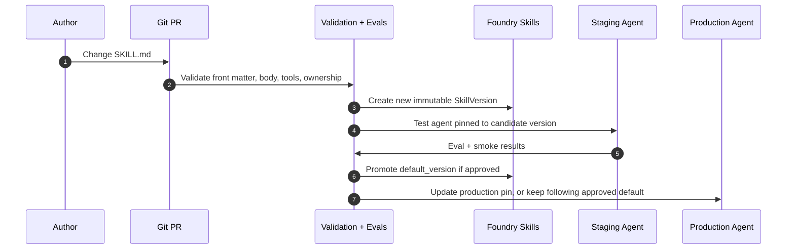

# SKILL Lifecycle, Management, and Governance 🧭

> Opinionated Microsoft Foundry-first model for moving `SKILL.md` files from authoring to governed agent use.

## Short answer ✅

Use **Git as the authoring source** and **Foundry Skills as the runtime registry** for Foundry-connected agents.

This is simpler than treating every catalog, package manager, plugin system, and local file path as equal. The core model is:

```text
Git repo with SKILL.md
  -> PR review + validation + evals
  -> create immutable Foundry SkillVersion
  -> test an agent pinned to that version
  -> promote default_version or update the agent pin
  -> observe skill usage in the hosted runtime
```

Foundry Skills should not replace Git. Git remains where humans author, review, diff, and govern source changes. Foundry Skills becomes the **versioned distribution point** that agents can safely consume without hard-coding public GitHub paths.

> Preview caveat: Foundry Skills are currently preview. For strict production/SLA requirements, keep a fallback path that vendors a pinned skill version into the agent deployment artifact until the feature is generally available.

---

## Should we store SKILLs in Foundry? 🏗️

**Yes, for Foundry-heavy agent architectures.** Treat Foundry Skills as the runtime registry, not as an arbitrary intermediary.

| Use Foundry Skills when... | Avoid making Foundry Skills the only source when... |
|---|---|
| Multiple agents need the same behavioral guidance. | You still need human review, diffs, branching, and contribution workflow. |
| Agents should consume a versioned skill without knowing a GitHub path. | You need cross-cloud/non-Foundry runtime portability as the primary goal. |
| You want immutable versions plus `default_version` / `latest_version`. | You require GA/SLA-backed production behavior today and cannot accept preview risk. |
| You want Toolbox/MCP discovery for clients such as MAF, Copilot, Claude Code, or custom agents. | A one-off prototype can simply read a local `SKILL.md`. |

Our recommendation:

- **Author in Git.**
- **Publish approved versions to Foundry Skills.**
- **Pin production agents to exact versions.**
- **Use `default_version` for dev/test convenience or controlled promotion.**
- **Use API Center only as an enterprise inventory/search layer if needed.**
- **Use APM/Copilot plugins for local developer distribution, not as the production runtime registry.**

---

## Foundry consumption patterns 📦

Foundry Skills supports two practical ways to deliver skills to agents.

| Pattern | How it works | Recommended use |
|---|---|---|
| **Toolbox / MCP discovery** | Attach a skill reference to a Foundry Toolbox version. MCP clients discover skill summaries with `resources/list` and load full content with `resources/read`. | Preferred for Foundry-hosted or Foundry-connected agents that support MCP/progressive disclosure. |
| **Direct download** | Download a skill ZIP from Foundry by default version or exact version, then include it in the hosted/local agent project. | Preferred when the agent deployment must be fully deterministic and self-contained. |

For hosted agents, default to:

1. **Toolbox/MCP** when the runtime can load skills dynamically and you want central updates.
2. **Direct download pinned to a version** when the deployment must be immutable or the runtime does not yet support toolbox skill loading.

Do not let each agent clone arbitrary public repositories at runtime.

---

## Versioning and updates 🔁

Foundry Skills has the right primitive: each update creates an immutable `SkillVersion`; the parent skill tracks `latest_version` and `default_version`.

### Safe update flow



### Practical rules

| Environment | Version rule |
|---|---|
| **Local prototype** | Read local files or use APM/Copilot plugin install. Fast iteration is fine. |
| **Dev/test** | May follow Foundry `default_version` to pick up approved changes quickly. |
| **Stage** | Pin the candidate `SkillVersion` and run smoke/eval tests. |
| **Prod** | Pin exact `SkillVersion` unless the agent owner explicitly accepts following `default_version`. |

### How to update Foundry Skills

1. Create a new `SkillVersion` from the updated `SKILL.md` or ZIP package.
2. Test that exact version in staging.
3. Promote by updating the skill's `default_version`, or update the agent/toolbox reference to pin the new version.
4. Roll back by repointing `default_version` or restoring the previous agent/toolbox pin.

Important implementation note from the preview docs:

- `azd ai skill update` creates a new version and auto-promotes it to `default_version`.
- `azd ai skill update --set-default-version v2` repoints default without uploading content.
- For governed updates, prefer a flow that separates **create candidate version** from **promote default**. Use REST/SDK where needed.
- Avoid `azd ai skill create --force` for governed updates because the preview CLI behavior deletes the existing skill and all versions before re-uploading.

---

## Local surfaces vs hosted runtimes 🧩

The same `SKILL.md` can serve both, but governance expectations differ.

| Dimension | Local agent surfaces | Hosted Foundry runtimes |
|---|---|---|
| Examples | GitHub Copilot CLI, Claude Code, Cursor, local IDE agents. | Foundry Hosted Agents, MAF/GHCP SDK agents, hosted coding agents. |
| Purpose | Authoring, prototyping, debugging. | Shared, governed runtime execution. |
| Delivery | Local file, Copilot plugin, APM install. | Foundry SkillVersion, Toolbox/MCP, or pinned direct download. |
| Identity | Interactive user/session. | Agent identity, managed identity, or delegated user flow. |
| Updates | Developer pulls/updates files. | Release/promotion operation. |
| Telemetry | Optional/local. | Required for production readiness. |

Rule of thumb: once identity, audit, RBAC, telemetry, evals, or shared users matter, move from local-file consumption to Foundry-managed consumption.

---

## Discovery 🔎

Keep discovery simple:

1. **Foundry Skills list/get** is the runtime inventory inside a Foundry project.
2. **Foundry Toolbox** is the MCP-facing discovery surface for agents and clients.
3. **API Center** is optional enterprise inventory when humans need searchable ownership, lifecycle, and compliance metadata across many projects/repos.
4. **Public GitHub catalogs, APM, and Copilot plugin marketplaces** are useful local/developer distribution channels, but they are not the hosted runtime source of truth.

Minimum metadata to care about:

| Field | Why |
|---|---|
| `name`, `description` | Routing and discovery. |
| `source_repo`, `source_path`, `source_commit` | Provenance. |
| `owner`, `support_contact` | Accountability. |
| `lifecycle_stage` | Draft, candidate, approved, deprecated, retired. |
| `allowed_tools` | Runtime boundary. |
| `data_classification` | Compliance. |
| `foundry_skill_version` | Exact runtime version. |
| `eval_suite`, `last_eval_result` | Promotion evidence. |

---

## Monitoring 📊

A skill is instruction content, so "invocation" is not automatic like a tool call. Define a tiny telemetry contract in the agent harness.

| Event | Meaning |
|---|---|
| `skill.discovered` | Skill summary was available. |
| `skill.loaded` | Full skill body/resources entered context. |
| `skill.activated` | Agent materially followed the skill. |
| `skill.tool_call` | Tool call happened under the skill's allowed-tool policy. |
| `skill.eval_result` | Eval result for a skill/version. |

Minimum dimensions:

- `skill.name`
- `skill.version`
- `skill.source_commit`
- `agent.name`
- `agent.version`
- `environment`
- `surface.kind` = `local` or `hosted`
- `foundry.project`
- `tool.name`
- `outcome`
- `trace_id`

This answers:

- Which hosted agents could use skill X? Check agent/toolbox/version references.
- Which hosted agents actually used skill X? Query `skill.activated` telemetry.
- Which version caused a regression? Group evals/errors by `skill.version`.

---

## Minimal governance gates 🛡️

Before a skill is production eligible:

- ✅ `SKILL.md` front matter is valid.
- ✅ Owner and support contact are set.
- ✅ Source repo/path/commit are recorded.
- ✅ Allowed tools and data classification are reviewed.
- ✅ A candidate Foundry `SkillVersion` exists.
- ✅ Staging agent tested the exact candidate version.
- ✅ Eval/smoke tests passed.
- ✅ Production pin or default-version promotion is intentional.
- ✅ Telemetry emits skill name/version/agent/environment.
- ✅ Rollback path is known.

That is enough for the first operating model. Avoid building a large bespoke registry until this breaks.

---

## What not to over-engineer 🚫

- Do not build a custom skill registry before using Foundry Skills.
- Do not require API Center for every prototype.
- Do not make APM mandatory for every repo; use it when reproducible local setup matters.
- Do not rely on public GitHub paths at runtime for hosted agents.
- Do not auto-upgrade production agents just because `latest_version` exists.
- Do not treat "loaded into context" as equal to "used successfully."

---

## Recommended first implementation 🧪

1. Pick one repo folder structure for source skills:

   ```text
   skills/
     <skill-name>/
       SKILL.md
       resources/
   ```

2. Add CI checks:
   - validate `name` and `description`;
   - confirm source owner/contact metadata;
   - run smoke evals.

3. Publish approved changes to Foundry Skills.
4. Attach approved skills to a Foundry Toolbox for MCP-capable agents.
5. For production hosted agents, pin either:
   - the toolbox version with skill version references; or
   - the direct downloaded `SkillVersion`.
6. Emit the minimal telemetry contract.
7. Add API Center later if discoverability across many teams becomes a real problem.

---

## References 📚

- [Use skills in Foundry](https://learn.microsoft.com/azure/foundry/agents/how-to/tools/skills) - Foundry Skills preview, immutable `SkillVersion`, `default_version`, direct download, and toolbox attachment.
- [Attach skills to a toolbox](https://learn.microsoft.com/azure/foundry/agents/how-to/tools/toolbox#attach-skills-to-a-toolbox) - Toolbox skill references and MCP resource discovery.
- [Monitor agents with the Agent Monitoring Dashboard](https://learn.microsoft.com/azure/foundry/observability/how-to/how-to-monitor-agents-dashboard) - Foundry monitoring with Application Insights.
- [Register and discover skills in API Center](https://learn.microsoft.com/azure/api-center/register-discover-skills) - Optional enterprise inventory and governance metadata.
- [APM - Agent Package Manager](https://github.com/microsoft/apm) - Optional local/CI dependency and lockfile workflow.
