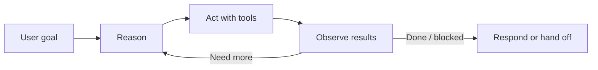
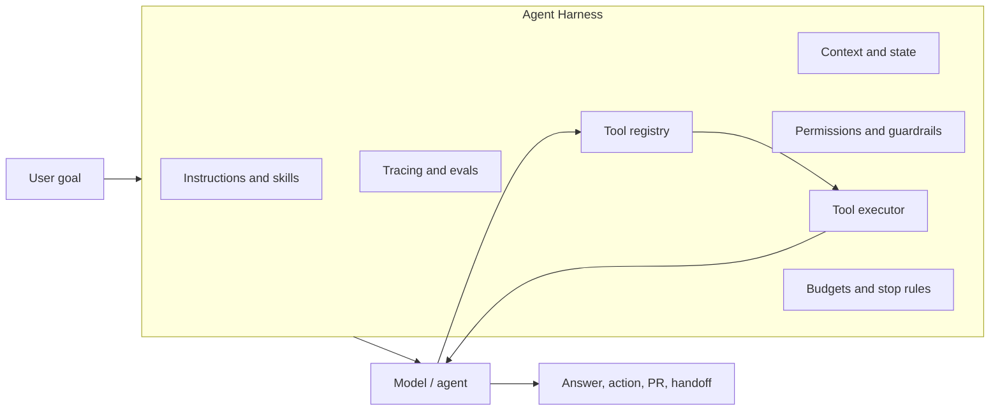

# Agent Harness 🧰

Source page: `/concepts/agent-harness`

An **Agent Harness** is the runtime layer that gives an agent context and tools, executes actions safely, observes results, preserves state, and decides when work is done, blocked, or ready for human review.

## Public sources 📚

"Agent harness" is publicly documented, though it is still an emerging term rather than a universal standard.

| Source | Public wording | What it validates |
| --- | --- | --- |
| [Microsoft Learn: Agent harnesses](https://learn.microsoft.com/en-us/agent-framework/agents/harness) | "An *agent harness* is the scaffolding that turns a language model into an agent that can actually *do* things." Microsoft further says the harness runs the loop, executes model-requested tools, manages history/context, applies approval and safety policies, and keeps the agent progressing toward task completion. | This is the cleanest direct definition for this page. |
| [Anthropic: Claude Managed Agents overview](https://platform.claude.com/docs/en/managed-agents/overview) | Claude Managed Agents is described as a "Pre-built, configurable agent harness that runs in managed infrastructure" and as providing "the harness and infrastructure for running Claude as an autonomous agent." | Confirms the term as a managed runtime/infrastructure layer around autonomous tool use. |
| [OpenAI: Sandbox agents](https://developers.openai.com/api/docs/guides/agents/sandboxes) | OpenAI describes "the boundary between the harness and compute" and says "the harness is the control plane around the model: it owns the agent loop, model calls, tool routing, handoffs, approvals, tracing, recovery, and run state." | Strongly supports the control-plane definition used here. |

## Why the term matters 💡

Most agent descriptions focus on the model deciding what to do next. Production systems need more than that. They need a harness that answers:

- Which model, instructions, skills, and context are available?
- Which tools can the agent call, with what schemas and permissions?
- Where do tool calls execute: locally, in a container, on a hosted platform, or through MCP?
- How is state persisted across turns, sessions, background runs, and handoffs?
- How are actions approved, traced, evaluated, retried, stopped, or escalated?

In short: the **agent** decides, the **loop** iterates, the **tools** act, and the **harness** keeps the whole system controlled.

## Research findings 🔎

| Source | Relevant finding | Harness implication |
| --- | --- | --- |
| [Microsoft Agent Framework](https://learn.microsoft.com/en-us/agent-framework/overview) | Agents process inputs, call tools and MCP servers, and generate responses. Workflows add graph-based routing, checkpointing, state, and human-in-the-loop support. | Agent Framework is a code harness: it wires model clients, sessions, context providers, middleware, MCP clients, workflows, and tool execution. |
| [Microsoft Agent Framework: GitHub Copilot Agents](https://learn.microsoft.com/en-us/agent-framework/agents/providers/github-copilot) | GitHub Copilot agents can use shell commands, file operations, URL fetching, MCP servers, sessions, streaming, function tools, tracing, and permission handlers. | GitHub Copilot can be placed inside a harness as a coding-oriented agent backend, with permissions and MCP configuration controlled by the host app. |
| [Anthropic: Building effective agents](https://www.anthropic.com/engineering/building-effective-agents) | Anthropic distinguishes workflows from agents: workflows follow predefined code paths; agents let LLMs dynamically direct process and tool use. Agents use tools based on environmental feedback in a loop. | A harness should start simple, expose clear tools, provide environmental feedback, sandbox execution, and add guardrails before increasing autonomy. |
| [Anthropic tool use docs](https://platform.claude.com/docs/en/agents-and-tools/tool-use/overview) | Claude decides when to call tools based on the user request and tool descriptions. Client tools run in the application; server tools run on Anthropic infrastructure. | The harness owns client tool execution, tool result formatting, schemas, trigger boundaries, and where each tool runs. |
| [OpenAI Agents guide](https://developers.openai.com/api/docs/guides/agents) | Agents plan, call tools, collaborate across specialists, and keep enough state to complete multi-step work. The Agents SDK is for apps that own orchestration, tool execution, approvals, and state. | OpenAI explicitly places orchestration, approvals, state, and tool execution in the application harness when using the SDK. |
| [OpenAI Sandbox agents](https://developers.openai.com/api/docs/guides/agents/sandboxes) | OpenAI defines the harness as the control plane around the model, separate from sandbox compute. | A harness should keep policy, audit, state, and orchestration in trusted infrastructure while scoped work runs in an isolated execution plane. |
| [OpenAI tools and function calling](https://developers.openai.com/api/docs/guides/function-calling) | Tool calling is a multi-step flow: give tools to the model, receive a tool call, execute application code, send tool output back, and receive an answer or more calls. | The harness is the loop executor: it validates tool calls, executes them, returns observations, and decides whether to continue or stop. |
| [GitHub Copilot cloud agent](https://docs.github.com/en/copilot/concepts/agents/cloud-agent/about-cloud-agent) | Copilot cloud agent can research a repository, create plans, change code on a branch, run tests/linters in an ephemeral GitHub Actions environment, and optionally open a PR. | GitHub Copilot cloud agent is a productized coding harness: it supplies workspace isolation, branch/PR workflow, logs, test execution, and review surfaces around the coding loop. |

## Relationship to the Agentic Loop 🔁

The [Agentic Loop](/concepts/agentic-loop) is the behavioral pattern:

The Agent Harness is the machinery that makes that loop executable:

| Concept | What it is | Example |
| --- | --- | --- |
| Agent | The goal-directed AI actor. | A coding agent that decides which files to inspect and edit. |
| Agentic loop | The repeated reason -> act -> observe cycle. | Read files, edit code, run tests, inspect failures, iterate. |
| Tool | A callable capability. | Shell, file edit, GitHub API, MCP server, web fetch, code execution. |
| Skill | A reusable recipe or capability package. | "How to run a safe code migration." |
| Agent Harness | The runtime and policy envelope around the loop. | Session state, tool permissions, sandbox, tracing, approvals, PR workflow. |

## Where GitHub Copilot fits 🧑‍💻

GitHub Copilot-powered tools are good examples because coding work naturally needs tools, state, iteration, and review.

| GitHub Copilot surface | Harness role |
| --- | --- |
| **Copilot CLI / local agent tools** | The local harness gives the agent workspace context, shell/file tools, permission gates, session state, and user-facing progress. |
| **GitHub Copilot SDK via Microsoft Agent Framework** | Agent Framework can wrap GitHub Copilot as a backend agent with sessions, function tools, permission handlers, MCP servers, tracing, and application-owned orchestration. |
| **Copilot cloud agent** | GitHub provides the harness: ephemeral GitHub Actions environment, repository research, planning, branch changes, test execution, logs, PR creation, custom instructions, and MCP configuration. |

GitHub Copilot is an agent/tool surface that either **comes with its own harness** or can be **embedded inside another harness** such as Microsoft Agent Framework.

## Anatomy of an Agent Harness 🧱

| Harness component | Responsibility |
| --- | --- |
| Model adapter | Calls Azure OpenAI, OpenAI, Anthropic, GitHub Copilot, or another model backend. |
| Instruction layer | Loads system instructions, developer rules, skills, examples, and task constraints. |
| Context providers | Add repository files, search results, memory, user profile, telemetry, or prior session state. |
| Tool registry | Defines available tools, schemas, descriptions, auth requirements, and trigger boundaries. |
| Tool executor | Executes client tools, MCP calls, shell commands, file edits, API calls, or hosted tools. |
| Permission policy | Blocks, approves, scopes, or escalates risky actions before execution. |
| State manager | Persists conversation history, plans, checkpoints, tool observations, and resumable work. |
| Observation parser | Normalizes tool results, errors, diffs, logs, traces, and structured outputs back into context. |
| Stop rules | Enforces iteration limits, token/cost budgets, success criteria, timeouts, and handoff conditions. |
| Observability | Emits traces, metrics, evals, run logs, audit events, and quality signals. |
| Human interface | Streams progress, asks clarifying questions, stages PRs, requests approvals, and reports blockers. |

## Sources 🔗

- [Microsoft Learn: Agent harnesses](https://learn.microsoft.com/en-us/agent-framework/agents/harness)
- [Anthropic: Claude Managed Agents overview](https://platform.claude.com/docs/en/managed-agents/overview)
- [OpenAI: Sandbox agents](https://developers.openai.com/api/docs/guides/agents/sandboxes)
- [Microsoft Agent Framework: GitHub Copilot Agents](https://learn.microsoft.com/en-us/agent-framework/agents/providers/github-copilot)
- [GitHub Docs: About GitHub Copilot cloud agent](https://docs.github.com/en/copilot/concepts/agents/cloud-agent/about-cloud-agent)
