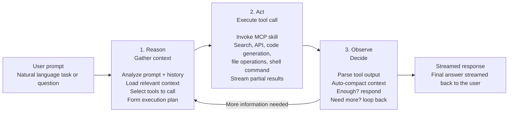

# The Agentic Loop

Powered by GitHub Copilot SDK - the same ReAct engine behind Copilot CLI.

The Agentic Loop describes how an agent turns a natural-language request into a streamed response without requiring manual orchestration. The agent reasons about the request, acts through tools, observes the result, and loops until it has enough information to answer.

## 1. Reason: gather context

The agent first interprets the user's task in context.

- Analyze the prompt and conversation history.
- Load relevant files, state, memory, or external context.
- Decide which tools or skills may be needed.
- Form an execution plan before acting.

## 2. Act: execute tool calls

The agent then performs concrete work through tools.

- Invoke MCP skills and tool adapters.
- Search, call APIs, generate code, edit files, or run shell commands.
- Stream partial progress or intermediate results where useful.

## 3. Observe: decide what comes next

After each action, the agent inspects the output and decides whether the task is complete.

- Parse tool output.
- Compact and update context.
- If there is enough information, produce the final response.
- If more information is needed, loop back to reasoning and continue autonomously.

## Core principle

The loop continues autonomously until the agent has enough information to answer. The user provides intent; the agent handles reasoning, tool execution, observation, and iteration.
