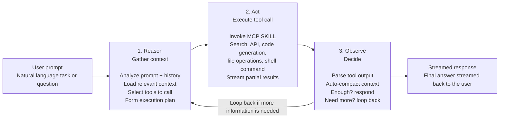

# The Agentic Loop

Powered by GitHub Copilot SDK - the same ReAct engine behind Copilot CLI.

The Agentic Loop describes how an agent turns a natural-language request into a streamed response without requiring manual orchestration. The agent reasons about the request, decides what context it needs, acts through SKILLs and tools, observes the result, and loops until it has enough information to answer.

## 1. Reason: gather context

The agent first interprets the user's task in context. Context is not a one-time input; it is something the agent actively manages across the loop. At each iteration, the agent asks: "Do I have enough context to act or answer safely, or do I need to retrieve more?"

- Analyze the prompt and conversation history.
- Load relevant files, state, memory, or external context.
- Decide which SKILLs and tools may be needed.
- Form an execution plan before acting.

Useful context can come from several places:

- Conversation history and current user intent.
- Workspace files, repository state, terminal output, or application state.
- Long-term memory, prior decisions, or saved plans.
- Knowledge stores, search indexes, documentation, or external APIs.
- Observability signals such as traces, logs, eval failures, and telemetry.

The loop works because the agent can defer judgment until it has gathered the right context. If the first action reveals ambiguity, missing facts, a failed tool call, or a partial result, the agent folds that observation back into context and reasons again.

## Where SKILLs fit

SKILLs are reusable capability bundles the agent can pull into the loop when the task calls for specialized behavior. A SKILL can contribute instructions, prompts, schemas, tool bindings, examples, evals, and guardrails. In the loop, SKILLs sit between reasoning and action:

- During reasoning, the agent decides whether a SKILL is relevant to the user's intent.
- During action, the agent invokes the SKILL's tools, prompts, or workflow.
- During observation, the agent evaluates the SKILL output and decides whether more context or another SKILL is needed.
- Across iterations, the agent can chain SKILLs together while preserving the task context.

This keeps the loop modular. The base agent does not need to know every domain deeply; it needs to know when to retrieve context, when to reuse a SKILL, and when the observed result is good enough to continue or answer.

## 2. Act: execute tool calls

The agent then performs concrete work through SKILLs and tools.

- Invoke MCP SKILLs and tool adapters.
- Search, call APIs, generate code, edit files, or run shell commands.
- Stream partial progress or intermediate results where useful.

## 3. Observe: decide what comes next

After each action, the agent inspects the output and decides whether the task is complete.

- Parse tool output.
- Compact and update context.
- Decide whether the current context is sufficient.
- Pull in more context, invoke another SKILL, or retry with a refined plan if needed.
- If there is enough information, produce the final response.
- If more information is needed, loop back to reasoning and continue autonomously.

## Core principle

The loop continues autonomously until the agent has enough information to answer. The user provides intent; the agent handles context gathering, SKILL selection, tool execution, observation, and iteration.
