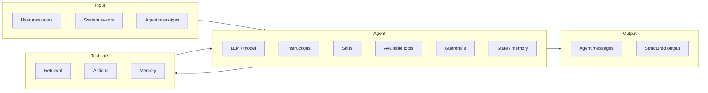

# Agents

Source page: `/concepts/agents`

An AI agent is an AI system that combines a model, instructions, skills, tools, state, and guardrails to complete work on a user's or organization's behalf. The difference from a chatbot is agency: an agent can decide what to do next, call tools, observe results, and continue until it can answer, hand off, or stop safely.

## Concise definition

> An AI agent is a skill- and tool-using AI application that follows instructions, reasons over a goal, keeps enough context, and takes governed actions across one or more steps to produce a response, structured output, handoff, or completed task.

## Visual model

The attached reference shows the agent as the control point between inputs, tool calls, and outputs.



## Source definitions

| Source | Concise takeaway |
| --- | --- |
| [Microsoft Foundry Agent Service](https://learn.microsoft.com/en-us/azure/foundry/agents/overview) | An agent is an AI application that uses a Foundry model to reason about user requests and take autonomous actions. It can call tools, access external data, make multi-step decisions, and even run in the background without a chat interface. Foundry describes the three core components as model, instructions, and tools. |
| [OpenAI Agents guide](https://developers.openai.com/api/docs/guides/agents) | Agents are applications that plan, call tools, collaborate across specialists, and keep enough state to complete multi-step work. |
| [OpenAI Building Agents track](https://developers.openai.com/tracks/building-agents) | An agent is an AI system with instructions, guardrails, and tools that can take action on the user's behalf. If it only answers questions, it is a chatbot; if it connects to systems and takes action, it qualifies as an agent. |
| [Anthropic: Building effective agents](https://www.anthropic.com/engineering/building-effective-agents) | Anthropic distinguishes workflows from agents: workflows follow predefined code paths, while agents let the LLM dynamically direct its own process and tool usage. Agents are typically LLMs using tools based on environmental feedback in a loop. |
| [Claude Agent SDK overview](https://code.claude.com/docs/en/agent-sdk/overview) | Production agents can autonomously read files, run commands, search the web, edit code, and manage context through the same agent loop used by Claude Code. |
| [Claude tool use docs](https://platform.claude.com/docs/en/agents-and-tools/tool-use/overview) | Tool use lets Claude call defined or provider-hosted tools. Claude decides when to call tools based on the request and tool descriptions, and tool execution can happen in the application or on provider infrastructure. |
| [Foundry hosted agents](https://learn.microsoft.com/en-us/azure/foundry/agents/concepts/hosted-agents) | Hosted agents are containerized agentic applications where your code controls orchestration while Foundry provides the managed runtime: endpoint, identity, scaling, session isolation, state persistence, observability, and lifecycle management. |

## What makes it an agent?

| Capability | Why it matters |
| --- | --- |
| Goal-directed reasoning | The agent interprets a goal, decomposes work, and chooses the next step. |
| Instructions | Instructions define role, scope, constraints, tone, tool policy, and stopping rules. |
| [Skills](/concepts/skills) | Skills sit beside tools as reusable capability bundles: instructions, schemas, tool bindings, evals, and guardrails the agent can apply when relevant. |
| [Tools](/concepts/tools) | Tools let the agent retrieve facts, call APIs, run code, update systems, and interact with external environments. |
| State | Threads, memory, checkpoints, and structured outputs let work span multiple turns or background events. |
| Observation loop | Tool results or environment feedback become new context for the next decision. |
| Guardrails | Identity, approvals, schemas, content safety, evals, and tracing constrain autonomy. |
| Collaboration | Complex systems can split work across planners, specialists, critics, and human reviewers. |

## Anatomy

| Component | Required? | Role |
| --- | --- | --- |
| Model | Mandatory | Reasoning and language capability from a frontier or fit-for-purpose model. |
| Instructions | Mandatory | Role, scope, constraints, tone, tool policy, and stopping rules. |
| Skills | Optional | Reusable capability bundles that package instructions, tool bindings, schemas, evals, and guardrails. |
| Tools | Optional | Typed ways to retrieve data or act: APIs, MCP servers, search, code, workflows. |
| State | Optional | Threads, task memory, checkpoints, and resumable run context. |
| Grounding | Optional | External knowledge that ties answers to current, authorized sources. |
| Guardrails | Optional | Schema validation, approvals, content safety, identity, tracing, and evals. |

## Boundary: agent or not?

| System | Agent? | Why |
| --- | --- | --- |
| Single LLM call | No | It can answer, but it does not continue, inspect results, or act. |
| RAG chatbot | Usually no | Retrieval improves answers, but the flow is still mostly fixed. |
| Workflow | Sometimes | It is agentic when the model makes decisions; it is less agentic when code owns every step. |
| Agent | Yes | The model decides steps and tool use, observes outcomes, and continues until done or blocked. |
| Multi-agent system | Yes | Multiple agents coordinate through handoffs, shared state, or specialized roles. |

## Foundry hosted agents as an agent runtime

Foundry hosted agents are the runtime layer for code-based agents. Your team brings the agent logic in a container or preferred framework; Foundry runs it as a managed service with a dedicated endpoint, Microsoft Entra agent identity, per-session isolation, persisted session state, scaling, observability, and lifecycle management.

Conceptually, a hosted agent separates **agent behavior** from **agent operations**:

| Layer | Responsibility |
| --- | --- |
| Agent code | Owns orchestration, tool choices, protocol handling, framework logic, and domain behavior. |
| Foundry runtime | Hosts the container, exposes endpoints, manages sessions, restores state, scales compute, emits traces, and applies enterprise identity boundaries. |
| Agent identity | Gives the running agent a dedicated Microsoft Entra identity for scoped access and auditability. |
| Session boundary | Runs each session in an isolated sandbox so state can persist without leaking across users or tasks. |

Use hosted agents when the agent is more than prompt configuration: custom code, custom protocols, framework-specific orchestration, stateful execution, or integration with enterprise systems. The concept is not "a different kind of intelligence"; it is a production runtime for running an agent safely and repeatably.

## Common topologies

| Pattern | When to use it | Trade-off |
| --- | --- | --- |
| Single agent | Focused tasks with one clear owner. | Simple to reason about; bounded by one context and tool set. |
| Planner / executor | Long-horizon work that benefits from decomposition. | More latency and cost; better control over complex execution. |
| Specialist crew | Tasks that span domains such as research, design, code, and review. | Requires explicit handoffs and shared state. |
| Evaluator loop | High-stakes outputs that need critique and refinement. | Adds cost; improves quality when eval criteria are clear. |
| Human-in-the-loop | Regulated, expensive, or irreversible actions. | Slower, but preserves accountability and approval. |

## Minimal agent contract

For a Foundry Hosted Agent, `agent.yaml` defines the container-backed agent resource: `kind`, protocols, runtime resources, environment variables, and code packaging. Model deployments, connections, toolboxes, and startup command are handled through `azure.yaml` and the active azd environment.

```yaml
# yaml-language-server: $schema=https://raw.githubusercontent.com/microsoft/AgentSchema/refs/heads/main/schemas/v1.0/ContainerAgent.yaml
kind: hosted
name: billing-resolution-agent
protocols:
  - protocol: responses
    version: "1.0.0"
resources:
  cpu: "0.25"
  memory: "0.5Gi"
environment_variables:
  - name: AZURE_AI_MODEL_DEPLOYMENT_NAME
    value: ${AZURE_AI_MODEL_DEPLOYMENT_NAME}
code_configuration:
  runtime: python_3_13
  entry_point: main.py
  dependency_resolution: remote_build
```

Source: [Foundry hosted agents](https://learn.microsoft.com/en-us/azure/foundry/agents/concepts/hosted-agents), [ContainerAgent schema](https://raw.githubusercontent.com/microsoft/AgentSchema/refs/heads/main/schemas/v1.0/ContainerAgent.yaml), and the `azd ai agent` file layout reference.

## Production design rules

- Start with the simplest viable pattern. Use a direct model call or workflow when the path is fixed.
- Add autonomy only when the number or order of steps cannot be predicted upfront.
- Make tools narrow, typed, idempotent, well-described, and explicit about errors.
- Keep guardrails close to action: approvals, scopes, rate limits, schemas, and audit logs.
- Define stopping rules: success criteria, budget limits, iteration limits, and escalation paths.
- Design for handoff: agents should know when to ask the user, transfer to another agent, or pause for human judgment.
- Treat agents like governed services: version them, test them, trace them, and evaluate them continuously.

## Foundry framing

For this site, a production-ready agent should be framed as:

- A model-backed reasoning service.
- A declarative or code-based runtime with instructions, skills, tools, state, and policies.
- A governed actor with identity, permissions, tool schemas, tracing, and evaluations.
- A composable unit that can run alone, call tools, or collaborate with other agents.

Microsoft Foundry supports this through prompt agents, hosted agents, the Responses API, platform tools, observability, identity, publishing, and enterprise controls.
