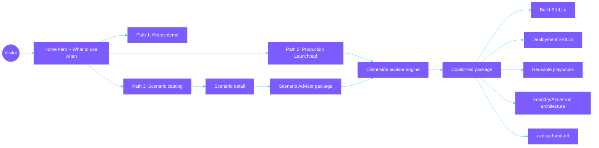
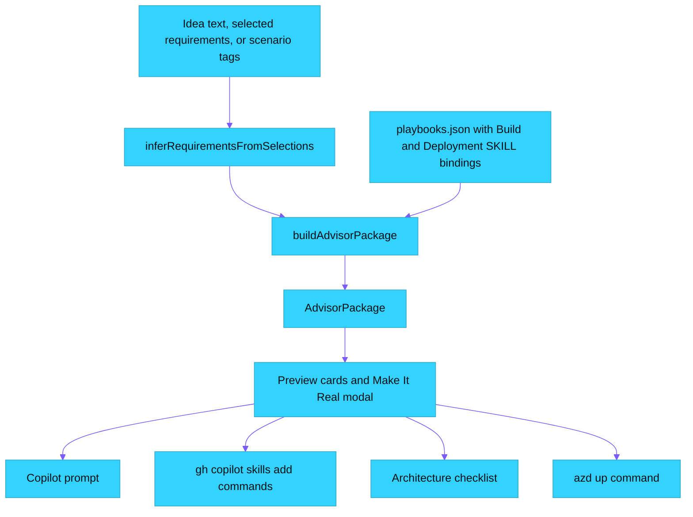

# Implementation: Three-Path Advisor ✨

## What changed

The portal now implements a clear three-path model without replacing the existing static site:

1. **Path 1 · Kratos** — ready-to-use demo with domain personas and task skills.
2. **Path 2 · Production Launchpad** — a concrete idea moves from pilot shape to Copilot-led deployment.
3. **Path 3 · Scenario Advisor** — a predefined scenario becomes the same package shape, pre-seeded by scenario context.

Playbooks are intentionally not a fourth path. They are reusable HOW guidance consumed by Paths 2 and 3, and each playbook now exposes the upstream Build SKILLs and Deployment SKILLs it contributes.

## Runtime architecture

## Data flow

## Key implementation details

- `src/data/advisor.ts` centralizes requirements, requirement-to-SKILL mappings, default Deployment SKILLs, playbook matching, run architecture recommendations, and package generation.
- `src/data/playbooks.json` now carries curated upstream Build SKILLs and Deployment SKILLs from `aiappsgbb/agentic-loop/.github/skills`.
- `GreenfieldBuilder` is now the **Production Launchpad** and produces deterministic package output instead of random skill suggestions.
- `ScenarioPlaybook` now includes a **Build this scenario with Copilot** advisor card that reuses the same package modal.
- `MakeItRealModal` now distinguishes Build SKILLs, Deployment SKILLs, playbooks, architecture checklist, Copilot prompt, and the canonical `azd up` hand-off.
- `WhatToUseWhen` shows exactly three paths and frames Playbooks as supporting implementation guidance.

## Deployment and AZD decision

No Azure scaffold was generated for this portal change. `.azure/deployment-plan.md` records `AZD template: none` because the implemented artifact is a static browser experience that creates a text-only advisory package. The generated package instructs Copilot and the selected Deployment SKILLs to create the deployable app and infrastructure in the target solution repository.

## Deviations from plan

No functional deviation from `docs/plan.md`. The implementation stays additive, client-only, and preserves the existing Home, Kratos, Scenario, Playbooks, and modal surfaces.
