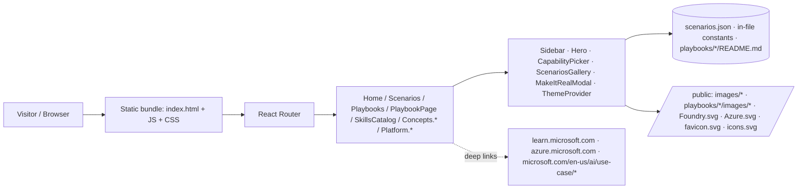

# Agentic Loop — Specification

> **Last updated:** 2026-05-25

## 1. Summary

**Agentic Loop** is a modern, static, single-page marketing and learning site that promotes a unified workflow for building and operating AI agentic applications: composing them with **GitHub Copilot** and running them on **Microsoft Foundry** (a.k.a. Azure AI Foundry) on **Microsoft Azure**. The site targets enterprise architects, AI engineers, and technical decision-makers who want a guided, interactive way to explore agent capabilities, browse industry scenarios, follow step-by-step playbooks, and discover the Foundry/Azure building blocks they would compose for their own solution. It is content-only (no backend, no AI inference) — its job is to inspire, educate, and hand off to GitHub Copilot for the actual build.

## 2. Goals & Non-Goals

**Goals**
- Provide a polished landing experience that lets a visitor pick capabilities, building blocks, and themes, generate a mock prompt for their agent idea, and see a short "Make it real" guided modal that points them to GitHub Copilot.
- Surface a browsable **Scenarios** gallery with industry filtering and search, where each scenario opens a multi-chapter **Playbook** (Build, Run, Scale).
- Document core **Concepts** (Agentic Loop, Agents, Skills, Tools) and the **Platform** primitives (Microsoft Foundry capabilities, Microsoft Azure building blocks) with deep-linkable cards.
- Maintain a **Skills catalog** organized by phase (Build vs. Run).
- Ship a sidebar-driven IA with collapse, light/dark/system theme switching, and a snappy, modern visual design.
- Stay buildable, lintable, and deployable as a single static bundle (`vite build` → `dist/`).

**Non-Goals**
- No real AI inference, no calls to Foundry / OpenAI / any LLM API at runtime.
- No backend service, database, authentication, or persistence (all state is in-memory React state).
- No user accounts, telemetry, payments, or content management system.
- No server-side rendering, no Node runtime in production (static hosting only).
- No production-grade i18n; copy is English only.

## 3. Users & Scenarios

| Persona | Scenario | Success Criteria |
| --- | --- | --- |
| Enterprise Architect | Explores the Concepts and Platform pages to understand how Foundry + Azure compose. | Can deep-link to a specific capability/building block from any picker dropdown and lands on the right card. |
| AI Engineer | Picks capabilities/building blocks/themes, clicks **✨ Craft the prompt**, edits the prompt, then clicks **Make it real**. | Sees a generated mock prompt, a list of suggested Build & Run skills (removable), and a guided modal explaining the Copilot hand-off. |
| Industry Solution Lead | Filters the Scenarios gallery by industry and search, picks a scenario, and reads its playbook. | Lands on a Build / Run / Scale stepper with concrete steps for the chosen scenario. |
| Visitor on any device | Uses the site on a laptop, then collapses the sidebar; flips theme to dark. | Sidebar collapses to an icon rail; theme switch persists across navigation. |

## 4. Functional Requirements

| ID | Requirement | Priority |
| --- | --- | --- |
| FR-001 | The site MUST render a collapsible left sidebar with sections: **Discover** (Home, Scenarios, Playbooks, Skills catalog) and **Learn** (Concepts → Agentic Loop, Agents, Skills, Tools; Platform → Foundry, Azure). | Must |
| FR-002 | The sidebar MUST persist its collapsed state and expose a footer row containing the theme switch (left) and the collapse toggle (right). | Must |
| FR-003 | The Home page MUST present a hero with the title "Ship your ideas with the Agentic Loop" (one line), an infinity icon, and the lede "Build, Run and Scale AI apps & agents with GitHub Copilot + Microsoft Foundry" followed by a right-arrow and "in one continuous loop." on a second line. | Must |
| FR-004 | The hero MUST render three multi-select pickers — **Capabilities**, **Building blocks**, **Themes** — with these options: <br/>• Capabilities: Frontier Models *(default selected)*, Image Generation, Text to Speech, Speech to Text, Real-Time Conversations, Forms Recognition, Knowledge. <br/>• Building blocks: Observability *(default selected)*, Integration, AI Gateway, Identity & Access, Private Networking, Data Persistence, Storage. <br/>• Themes: Workflow Automation, Domain-Specific Agents, Knowledge Grounding. | Must |
| FR-005 | Each option in **Capabilities** and **Building blocks** MUST expose a hover-revealed link icon (separate from the checkbox) that navigates to the corresponding anchor on the Foundry or Azure platform page, without toggling selection. | Must |
| FR-006 | The hero MUST provide a **✨ Craft the prompt** button that replaces the prompt textarea content with a mock prompt synthesized from the current selections. | Must |
| FR-007 | When the prompt textarea is edited, the site MUST show a short processing animation and then render two skill lists: **Skills to build** (Copilot-authored) and **Skills to run** (Foundry-hosted), each with random names appropriate to the prompt. The user MUST be able to remove individual skills. | Must |
| FR-008 | The hero MUST provide a **Make it real** button that opens a modal anchored to the top of the viewport, left-aligned, with a four-step guided experience: (1) **Prerequisites**, (2) **Install suggested skills**, (3) **Hand off to GitHub Copilot** — open the CLI with `copilot` and paste the crafted prompt prefixed with `/lean:implement `, (4) **Deploy** — either `/lean:deploy` inside Copilot or `azd up` directly in the CLI. The final step ends with a success banner ("You're in the loop. Traces will flow back to Copilot as improvement suggestions."). | Must |
| FR-009 | The Scenarios gallery MUST render a carousel of scenario cards (image, name, description, tags) loaded from `src/data/scenarios.json`. Each card MUST be clickable and navigate to `/scenarios/:id`. The page heading MUST be just **"Scenarios"** (not "Scenarios gallery"). Each card MUST also expose a non-propagating **Learn more** link (when the scenario JSON declares a `link` field) that opens the external URL in a new tab without triggering the card's playbook navigation. | Must |
| FR-010 | The Scenarios page MUST provide an **Industry** chip filter and a free-text search box on the same line, both shrinking responsively without overflowing the page. | Must |
| FR-011 | The Scenario Playbook page MUST render the chosen scenario's hero plus a chaptered stepper for **Build**, **Run**, **Scale** with step titles that wrap inside the pill on narrow viewports. When the scenario JSON declares a `link` field, the hero MUST also render a pill-styled **"Learn more about this scenario"** link to the external URL. | Must |
| FR-012 | The Skills catalog page MUST list ~28 skills grouped by **Build** (GitHub Copilot) and **Run** (Microsoft Foundry) phases, with a search box, phase chips, and dynamic category chips. | Must |
| FR-013 | The Concepts pages (Agentic Loop, Agents, Skills, Tools) MUST render long-form explanatory content, feature grids, tables, code samples, and FAQ blocks. | Must |
| FR-014 | The Platform → **Foundry** page MUST briefly introduce Microsoft Foundry (with link to https://azure.microsoft.com/en-us/products/ai-foundry/) and render one full-width card per capability from FR-004, each with an anchor id matching the picker `link` hash. Each card MUST expose three pill links: **Official page**, **Pricing**, **Documentation**. | Must |
| FR-015 | The Platform → **Azure** page MUST briefly introduce Microsoft Azure (with link to https://azure.microsoft.com/en-us/get-started/azure-portal/) and render one full-width card per building block from FR-004, each with an anchor id and the same three pill links (Official page, Pricing, Documentation). | Must |
| FR-016 | Platform cards MUST animate their border with a panning gradient **only** when the card is clicked or opened via a deep-link from the picker — not on hover. | Must |
| FR-017 | The theme switcher MUST support **Light**, **Dark**, and **System** modes, persist the user's preference, and present a compact icon-only control whose active option uses a muted (not gradient) background. | Must |
| FR-018 | The sidebar brand area MUST always render an infinity icon as the brand mark; the "Agentic Loop" wordmark MUST hide when the sidebar is collapsed. | Must |
| FR-019 | The Concepts submenu MUST default to expanded; the Platform submenu MUST default to expanded. Active route MUST keep its parent submenu open. | Must |
| FR-020 | The sidebar footer credit MUST read "Made with ❤️ by AI Apps GBB's - EMEA", centered, and hide when the sidebar is collapsed. | Must |
| FR-021 | All routes MUST be client-rendered via React Router; unknown routes MAY fall back to Home. | Should |
| FR-022 | `npm run build` MUST succeed with TypeScript strict mode and ESLint clean. | Must |
| FR-023 | The Concepts navigation parent item MUST use a distinct icon (Lightbulb) from the Skills sub-item (Sparkles), so the two are visually separable when the submenu is expanded. | Must |
| FR-024 | The Playbooks index page MUST list curated playbooks; entries whose source markdown exists under `./playbooks/<slug>/README.md` MUST link to `/playbooks/:slug` and preserve the row's grid alignment (Starter pill, step count) identically to non-linked rows. | Must |
| FR-025 | The route `/playbooks/:slug` MUST render the matching `./playbooks/<slug>/README.md` as a guided slide deck. The deck MUST: split the markdown on `##` (chapter) and `###` (slide) — ignoring headings inside fenced code blocks; prepend an Intro slide containing the H1 title and lede paragraph; rewrite relative `./images/...` references to absolute `/playbooks/<slug>/images/...` paths; and serve the corresponding image files from `public/playbooks/<slug>/images/`. | Must |
| FR-026 | The Playbook slide deck MUST provide: a top chapter rail (clickable), a progress bar, per-slide focused view (one slide per screen), keyboard navigation (`← / → / Space / PageUp / PageDown / Home / End / Esc`), URL hash-synced slide id (`#slide-id`), copy-on-click buttons on every fenced code block with `react-markdown` + `remark-gfm` + `rehype-highlight` syntax coloring, and Note/Tip/Warning callouts derived from `> Note:` / `> Tip:` / `> Warning:` blockquote prefixes. | Must |
| FR-027 | The Playbook slide deck MUST expose a Table of Contents drawer with a **Pin** toggle. When pinned, the drawer remains visible across slide changes, the preference is persisted to `localStorage` under the key `playbook-toc-pinned`, and on viewports ≥ 1080px the page reserves right padding so the slide content stays readable alongside the docked drawer. The drawer background MUST be solid (not transparent) to remain legible over page content. | Must |
| FR-028 | Code blocks in the Playbook slide deck MUST soft-wrap long lines (`white-space: pre-wrap` + `overflow-wrap: anywhere`) so commands and instructions are visible on multiple lines without horizontal scrolling. | Must |

## 5. Non-Functional Requirements

| Category | Requirement |
| --- | --- |
| Performance | First contentful paint < 1.5s on a modern laptop over broadband; production JS bundle currently ~745 KB raw / ~226 KB gzip (grew from ~360 KB / ~108 KB when `react-markdown` + `remark-gfm` + `rehype-highlight` + `highlight.js` were added for the Playbook slide deck). Code-splitting the playbook view is a follow-up if FCP regresses. |
| Availability | Static hosting only; availability = host SLA (≥ 99.9% on Azure Static Web Apps or equivalent). |
| Security | No secrets in client bundle; all external links open with `rel="noreferrer"` and `target="_blank"`. Content Security Policy compatible (no inline scripts beyond Vite dev preamble workaround which is gated on `import.meta.hot`). |
| Privacy & Compliance | No user data collected; no cookies; no analytics by default. |
| Accessibility | Sidebar nav and pickers use semantic roles (`radiogroup`, `option`, `listbox`); icon-only buttons have `aria-label`. Theme respects `prefers-color-scheme` when in System mode. Target WCAG 2.1 AA contrast in both themes. |
| Scalability | Single static bundle — scales horizontally via CDN edge nodes. |
| Observability | None at runtime (no server). Build/preview logs only. |
| Browser support | Modern evergreen browsers (last 2 versions of Chrome, Edge, Firefox, Safari). |
| Responsiveness | Layout adapts down to 720px width without overflow; filter bar and stepper labels wrap rather than truncate. |

## 6. Architecture Overview

A pure client-side React + Vite SPA. No backend, no APIs. All content is bundled as TypeScript modules and JSON; images are served from `/public/images/` (scenario photos) and `/public/playbooks/<slug>/images/` (playbook screenshots), plus `/public/*.svg` for the brand & platform marks. Playbook markdown lives at `./playbooks/<slug>/README.md` and is bundled at build time via Vite's `import.meta.glob('*?raw')`, then parsed in-browser by the `PlaybookPage` component.



Trust boundary: everything runs in the user's browser. There is no privileged code path.

## 7. Tech Stack

| Layer | Choice | Rationale |
| --- | --- | --- |
| Language | TypeScript 6 (strict) | Strong typing for a content-heavy React app; matches Spec2Cloud defaults. |
| Frontend framework | React 19 + Vite 8 (rolldown) | Snappy dev loop; modern JSX runtime; aligns with Spec2Cloud frontend default. |
| Routing | `react-router-dom` v7 | Declarative client-side routing including hash anchors. |
| Icons | `lucide-react` v1.x | Consistent stroke-based icon set; covers nav, pickers, cards. Aliases used where needed (e.g. `Code as Github`). |
| Markdown | `react-markdown` 10 + `remark-gfm` 4 + `rehype-highlight` 7 + `highlight.js` 11 | Renders playbook markdown into the slide deck with GFM tables/lists and theme-aware syntax highlighting. |
| Styling | Hand-authored CSS in `src/styles/app.css` + CSS variables for theming | No CSS framework dependency; keeps bundle small and the look bespoke. |
| Lint | ESLint v10 + `typescript-eslint` + react-hooks + react-refresh plugins | Project default `npm run lint`. |
| Build | `tsc -b && vite build` | Type-check then bundle. Output in `dist/`. |
| CI/CD | (Not currently configured) — recommended GitHub Actions + `azd` for Azure Static Web Apps when deploying. | Aligns with Spec2Cloud defaults. |

**Notable workaround:** `index.html` injects a manual React Refresh preamble gated on `import.meta.hot` because Vite 8 (rolldown) + `@vitejs/plugin-react` v6.0.2 does not inject it automatically. This is dev-only and a silent no-op in production.

## 8. Azure Services

Recommended for hosting (not yet provisioned in this repo):

| Service | Purpose | SKU/Tier | Notes |
| --- | --- | --- | --- |
| Azure Static Web Apps | Host the Vite `dist/` output globally | Standard or Free | Native GitHub Actions integration; built-in CDN. |
| Azure Front Door (optional) | Custom domain + WAF | Standard | Only if shared with other workloads. |
| Application Insights (optional) | Client-side telemetry | Pay-as-you-go | Off by default; opt-in only if analytics needed. |

No identity, secrets, data, or compute resources are required for the current functional scope.

## 9. AI / Foundry

*Not applicable at runtime.* The site **describes** Foundry capabilities and Azure building blocks as content, but it does not call any model, agent, or AI service. The "Craft the prompt" and "skills suggested" experiences are entirely mocked in-browser using random-pick utilities over hard-coded pools.

If a future iteration adds live AI features (e.g., a real Copilot hand-off or live skill generation), it should follow Spec2Cloud defaults: Microsoft Agent Framework with the responses protocol, hosted as a Foundry agent, fronted by FastAPI on Azure Container Apps, with OpenTelemetry → Application Insights.

## 10. Data Model

No persisted data. Two ephemeral stores only:

- **Selections** (`useState` in `Hero.tsx`): `capabilities: string[]`, `blocks: string[]`, `themes: string[]`, `prompt: string`, `processing: boolean`, `buildSkills: string[]`, `runSkills: string[]`.
- **Theme preference** (`useState` + `localStorage` in `ThemeProvider.tsx`): `'light' | 'dark' | 'system'`.

Reference content shape (`src/data/scenarios.json`):

```ts
type Scenario = {
  id: string;            // slug, used as :id in /scenarios/:id
  name: string;
  description: string;
  industry: string;      // drives the industry chip filter
  image: string;         // relative path resolved to /<image> (typically images/<slug>.jpg under /public)
  tags: string[];        // capability / theme tags
  link?: string;         // optional external URL for the "Learn more" affordance
};
```

Scenario images live under `./public/images/<slug>.jpg` and are referenced from `scenarios.json` as relative paths (`images/<slug>.jpg`); the consumer components normalize to an absolute `/images/...` URL at render time so the same path works from any route.

Playbook source markdown lives at `./playbooks/<slug>/README.md` and is imported as a raw string via Vite's `import.meta.glob('/playbooks/*/README.md', { query: '?raw', eager: true })`. Companion images live at `./public/playbooks/<slug>/images/*.png` so Vite serves them as static assets at `/playbooks/<slug>/images/...`.

## 11. Interfaces

- **Public APIs** — none.
- **External integrations** — outbound hyperlinks only:
  - https://azure.microsoft.com/en-us/products/ai-foundry/
  - https://azure.microsoft.com/en-us/get-started/azure-portal/
  - Per-card Official / Pricing / Docs links under `azure.microsoft.com`, `learn.microsoft.com`, `microsoft.com` for each capability and building block.
  - Per-scenario "Learn more" links to `microsoft.com/en-us/ai/use-case/<slug>` (declared in `scenarios.json` as `link`).
- **Events** — none.
- **Routes** (client-side):
  - `/` — Home (Hero + ScenariosGallery)
  - `/scenarios` — Scenarios index with industry + search filters
  - `/scenarios/:id` — Scenario Playbook (Build/Run/Scale stepper)
  - `/playbooks` — Playbooks index
  - `/playbooks/:slug` — Playbook slide deck (renders `./playbooks/:slug/README.md`)
  - `/skills` — Skills catalog
  - `/concepts` → redirect to `/concepts/agentic-loop`
  - `/concepts/agentic-loop`, `/concepts/agents`, `/concepts/skills`, `/concepts/tools`
  - `/concepts/platform` → redirect to `/concepts/platform/foundry`
  - `/concepts/platform/foundry`, `/concepts/platform/azure` (both support `#anchor` deep links from the pickers)

## 12. Open Questions

| # | Question | Owner | Status |
| --- | --- | --- | --- |
| 1 | ~~Are the AWS-hosted sample images licensed for our use long-term, or should they be replaced/mirrored to Azure Blob Storage?~~ **Resolved** — scenario images are now committed under `./public/images/` and served from the static bundle. | Content | closed |
| 2 | Should the site add a privacy notice / cookie banner if a future deployment enables Application Insights? | Compliance | open |
| 3 | Do we want a real "Make it real" hand-off (e.g., deep link into the GitHub Copilot CLI) instead of the current mock guided modal? The modal already shows the canonical commands (`copilot`, `/lean:implement …`, `/lean:deploy`, `azd up`) — should it also auto-copy them or launch the CLI via a URL handler? | Product | open |
| 4 | Is there a target host (Azure Static Web Apps vs. another CDN), and does it need a custom domain / WAF in front? | Platform | open |
| 5 | Should we adopt `@vitejs/plugin-react-swc` once the React Refresh preamble bug in `plugin-react` v6 is fixed upstream, allowing us to delete the manual preamble in `index.html`? | Engineering | open |
| 6 | The Playbook slide deck currently bundles `highlight.js` + `react-markdown` into the main chunk (~745 KB raw / ~226 KB gzip). Should `PlaybookPage` be lazy-loaded via `React.lazy()` so the rest of the site stays light? | Engineering | open |
| 7 | How do we contribute new playbooks? Today only `./playbooks/getting-started/` exists; the `create-playbook-page` skill describes the markdown contract but there is no scaffolder for new slugs. | Content | open |

> Identity, secrets, and deployment targets live in [.azure/deployment-plan.md](../../../../.azure/deployment-plan.md).
