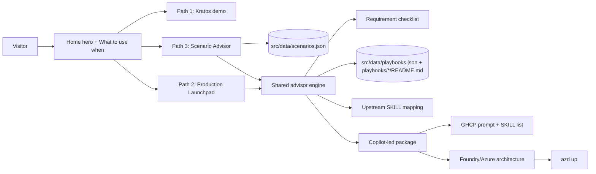

# Agentic Loop Portal — Specification

> **Last updated:** 2026-06-11

## 1. Summary

**Agentic Loop Portal** is a React + Vite advisory web portal that makes the path from agent pilot to production explicit. It presents three distinct ways to build and run agentic solutions: **Kratos** for a ready-to-use demo with domain-specific personas and skills, **Production Launchpad** for users who already have a concrete solution idea, and **Scenario Advisor** for users who want to start from a predefined industry scenario. The advisor paths converge on the same playbook-driven Build + Run flow: collect requirements, recommend SKILLs and tools, select the right Microsoft Foundry/Azure architecture, and produce a GitHub Copilot-led package that can be implemented and deployed with `azd up`.

The portal remains a static client-side experience in this repository unless a later implementation explicitly adds live backend generation. The immediate product goal is to make the decision model, advisor flow, playbook reuse, SKILL source, and deployment hand-off unambiguous.

## 2. Goals & Non-Goals

**Goals**

- Make the three entry paths obvious within seconds: **Try Kratos**, **Build my concrete idea**, or **Start from a scenario**.
- Position Kratos as the ready-to-use demo path with domain-specific personas that resemble agents using SKILLs to complete tasks.
- Position Production Launchpad and Scenario Advisor as two inputs into the same playbook approach, not as competing implementation models.
- Provide an advisor-type flow where users can tick requirements such as evals, voice, private networking, observability, grounding, identity, AI Gateway, storage, or M365 integration.
- Convert advisor selections into a GitHub Copilot-led build package: recommended SKILLs, tools, run architecture, generated implementation prompt, and deployment guidance ending in `azd up`.
- Source build SKILL recommendations from `aiappsgbb/agentic-loop` at `.github/skills` on `main`.
- Keep Foundry and Azure recommendations grounded in the Build / Run / Scale model: GitHub Copilot SDK + SKILLs for build, Microsoft Foundry Hosted Agents + Foundry Models + Azure services for run.
- Preserve the existing Scenarios, Playbooks, Skills catalog, Concepts, Platform, and Kratos surfaces while making their roles clearer.

**Non-Goals**

- No production AI inference is required in the portal itself for this specification iteration.
- No automatic repository creation, GitHub commit, or live `azd up` execution from the browser.
- No user accounts, payments, persistence, or CMS.
- No custom enterprise private networking deployment is created by the portal; private networking is an advisor requirement that changes recommendations and generated package instructions.
- No replacement of existing playbook content; the advisor should reuse and compose playbooks.

## 3. Users & Scenarios

| Persona | Scenario | Success Criteria |
| --- | --- | --- |
| Technical decision-maker | Wants to understand the right on-ramp without reading all docs. | Sees three clear paths and can explain when to use Kratos, Production Launchpad, or Scenario Advisor. |
| Business stakeholder | Wants a live proof point before funding build work. | Starts with Kratos, selects a persona, and sees how domain-specific skills fulfill tasks with no setup. |
| AI engineer | Has a concrete agentic solution idea and wants build guidance. | Uses Production Launchpad, selects requirements, and receives a playbook-backed Copilot package with SKILLs, tools, architecture, and `azd up` deployment path. |
| Industry solution lead | Wants to start from a proven industry pattern. | Uses Scenario Advisor, selects a predefined scenario, customizes requirements, and receives the same package shape as Production Launchpad. |
| Enterprise architect | Needs run architecture recommendations. | Sees why Hosted Agents, Foundry Models, AI Gateway, observability, identity, private networking, storage, and M365/Fabric integrations are recommended. |
| Field seller / GBB | Needs repeatable customer motion. | Can demo Kratos, then pivot to an advisor-generated package that maps to build SKILLs and deployable Azure/Foundry architecture. |

## 4. Experience Model

### 4.1 Three paths

| Path | Name | User intent | Primary surface | Output |
| --- | --- | --- | --- | --- |
| 1 | **Kratos** | "Show me a working agent now." | `/kratos` and the ready-to-use tile on Home | Live-feeling demo with domain-specific personas and task skills. |
| 2 | **Production Launchpad** | "I have a concrete idea; help me move it from pilot to production." | Home advisor / greenfield flow | Copilot package based on requirements, SKILLs, tools, playbooks, and run architecture. |
| 3 | **Scenario Advisor** | "Start from an existing scenario." | `/scenarios` and `/scenarios/:id` | Same Copilot package shape as Path 2, pre-seeded by scenario metadata and scenario playbooks. |

### 4.2 Path 1 — Kratos

Kratos is the ready-to-use demo. It MUST be framed as an experience path, not a build path. Kratos personas represent domain-specific agents with curated skills for tasks such as customer support, sales enablement, knowledge assistance, workflow execution, or technical guidance.

Kratos MUST:

- Let users select a persona.
- Show each persona as a domain-specific agent-like experience.
- Make skills visible as the mechanism that enables task fulfillment.
- Offer a next-step CTA to move from "try it live" to either Production Launchpad or Scenario Advisor.
- Avoid implying that the demo itself deploys production infrastructure.

### 4.3 Path 2 — Production Launchpad

Production Launchpad is for users with a concrete idea who need to move from idea to pilot to production. It MUST collect a short natural-language idea and requirement selections, then recommend:

- Build SKILLs from `aiappsgbb/agentic-loop/.github/skills`.
- Required tools such as MCP servers, function tools, code interpreter, web search, Azure AI Search, storage, or M365 connectors.
- Run architecture such as Foundry Hosted Agents, Foundry Models, AI Gateway, Application Insights / OpenTelemetry, Key Vault, Entra ID, private networking, Azure Container Apps, Azure Storage, or Cosmos DB.
- Playbooks that explain how to implement the selected capabilities.
- A Copilot prompt/package that can drive GHCP implementation and an `azd up` deployment.

### 4.4 Path 3 — Scenario Advisor

Scenario Advisor starts from existing predefined scenarios. It MUST use the same advisor and package model as Production Launchpad, but pre-seed:

- Scenario title, industry, description, tags, and external "Learn more" link.
- Related playbooks derived from scenario tags and `src/data/playbooks.json`.
- Suggested requirements and architecture defaults based on the scenario.

The user MUST be able to adjust requirements before generating the Copilot package.

### 4.5 Shared playbook approach for Paths 2 and 3

Paths 2 and 3 MUST converge after the initial input step. Both produce a package composed from:

1. **Intent** — concrete idea text or selected scenario.
2. **Requirements** — checked capabilities, constraints, and operational needs.
3. **Build plan** — selected SKILLs, tools, and implementation playbooks.
4. **Run plan** — Foundry/Azure architecture recommendations.
5. **Package** — Copilot prompt, file plan, SKILL install list, architecture checklist, and `azd up` guidance.

### 4.6 Scenario vs. playbook contract

Scenarios and playbooks MUST remain distinct:

| Artifact | Meaning | Supports which path? | Role in advisor output |
| --- | --- | --- | --- |
| **Scenario** | A predefined vertical outcome or industry blueprint, such as a customer-support, sales, or operations solution. | Path 3 directly. Can also inspire Path 1 personas. | Pre-seeds intent, industry context, default requirements, related playbooks, and architecture assumptions. |
| **Playbook** | A reusable horizontal implementation technique, such as grounding, evals, voice, governance, or deployment. | Paths 2 and 3. | Explains how to build part of the package and is composed into the generated Copilot prompt. |

A Scenario answers **"what outcome are we building?"** A Playbook answers **"how do we implement a reusable part of it?"** Kratos answers **"can I experience a ready-made version now?"**

Paths 2 and 3 MUST use playbooks in the same way:

- **Production Launchpad** selects playbooks from the user's requirement selections and idea text.
- **Scenario Advisor** starts with playbooks implied by the scenario, then adds or removes playbooks based on adjusted requirement ticks.
- Both advisors MUST show selected playbooks as implementation guidance, not as standalone user paths.

Every playbook selected by the advisor MUST declare the existing upstream SKILLs it expects GitHub Copilot to use for:

- **Build** — authoring agent code, tools, APIs, models, schemas, MCP servers, voice flows, grounding, or Copilot SDK loops.
- **Deployment** — creating or validating `azd`, Bicep, containerization, security, observability, and compliance assets needed to run the solution.

Deployment SKILLs are part of the playbook contract, not an afterthought. The default deployment SKILL set SHOULD include `aigbb-azd-compliance`, `bicep-azd-patterns`, `containerization`, `aigbb-azure-security`, and `aigbb-observability` whenever the generated package includes Azure deployment guidance.

## 5. Functional Requirements

| ID | Requirement | Priority |
| --- | --- | --- |
| FR-001 | The Home page MUST present the pilot-to-production problem statement and immediately route users into the three paths: Kratos, Production Launchpad, and Scenario Advisor. | Must |
| FR-002 | The "What to use when" section MUST describe exactly three user-facing paths and explain when to use each. | Must |
| FR-003 | The Kratos path MUST be labeled as ready-to-use / demo / no setup and MUST not be positioned as a production deployment generator. | Must |
| FR-004 | The Kratos launcher MUST expose domain-specific personas and make the persona's skills visible or discoverable. | Must |
| FR-005 | The Production Launchpad MUST accept freeform idea text before package generation. | Must |
| FR-006 | The Scenario Advisor MUST let users start from a predefined scenario already documented in `src/data/scenarios.json`. | Must |
| FR-007 | Paths 2 and 3 MUST use the same advisor state model, requirement checklist, playbook matching logic, package shape, and deployment hand-off. | Must |
| FR-008 | The advisor checklist MUST include, at minimum: evals, voice, private networking, observability, knowledge grounding, AI Gateway, identity/RBAC, storage, data persistence, M365/Graph integration, MCP tools, web search, and human approval. | Must |
| FR-009 | Requirement selections MUST map to Build SKILL recommendations, Run architecture recommendations, and related playbooks. | Must |
| FR-010 | Build SKILL recommendations MUST be sourced from `https://github.com/aiappsgbb/agentic-loop/tree/main/.github/skills` and represented by the upstream skill names. | Must |
| FR-011 | The advisor MUST distinguish Build SKILLs from Run architecture components. Build SKILLs drive Copilot implementation; Run components describe Foundry/Azure deployment architecture. | Must |
| FR-012 | The generated package MUST include a Copilot-ready prompt that instructs GHCP to build the selected solution using the selected SKILLs and playbooks. | Must |
| FR-013 | The generated package MUST include deployment instructions that end with `azd up` as the canonical local-to-Azure deployment command. | Must |
| FR-014 | The generated package MUST include an architecture recommendation section covering Hosted Agents, Foundry Models, AI Gateway, observability, identity, networking, and storage/data only when selected or implied. | Must |
| FR-015 | Scenario pages MUST preserve the existing Build / Run / Scale playbook view while adding an advisor entry point that pre-fills Path 3. | Must |
| FR-016 | Playbook pages MUST remain reusable technique pages and MUST be linkable from both Production Launchpad and Scenario Advisor outputs. | Must |
| FR-017 | The portal MUST define Scenarios as vertical outcomes and Playbooks as horizontal implementation techniques. Playbooks MUST support Production Launchpad and Scenario Advisor outputs, not appear as a fourth top-level path. | Must |
| FR-018 | Each advisor-selectable playbook MUST declare existing upstream SKILLs for both **Build** and **Deployment** phases. | Must |
| FR-019 | Generated packages MUST list Build SKILLs separately from Deployment SKILLs so users understand which skills create solution code and which skills make it deployable with `azd up`. | Must |
| FR-020 | The Skills catalog MUST identify which entries are upstream build SKILLs, deployment SKILLs, local portal concepts, and run architecture capabilities. | Should |
| FR-021 | The package output MUST be copyable in sections: Copilot prompt, selected SKILLs, selected playbooks, architecture checklist, and deployment command. | Must |
| FR-022 | The advisor MUST be deterministic for the same selections unless the user edits the idea or scenario. | Should |
| FR-023 | All advisor output MUST be generated client-side from curated mappings in this repo unless a future live generation backend is explicitly specified. | Must |
| FR-024 | The Concepts and Platform pages MUST remain the explanatory layer behind advisor recommendations. | Must |
| FR-025 | The sidebar MUST continue to group surfaces by intent: Start here, Build, and Learn. | Must |
| FR-026 | `npm run build` MUST succeed with TypeScript strict mode. | Must |

## 6. Advisor Requirement Mapping

| Requirement tick | Build SKILL candidates from upstream | Run architecture recommendations | Related playbook/theme |
| --- | --- | --- | --- |
| Evals | `azure-ai-projects-py`, `aigbb-observability`, `pydantic-models-py` | Foundry Evals, datasets, regression gates, Application Insights | Evaluation, observability |
| Voice | `azure-ai-voicelive-py`, `agent-framework-azure-ai-py` | Azure AI Voice Live, Foundry model, WebSocket-capable app host | Real-time conversations |
| Private networking | `aigbb-azure-security`, `bicep-azd-patterns`, `aigbb-azd-compliance` | VNet integration, private endpoints where applicable, Key Vault, managed identity | Enterprise hardening |
| Observability | `aigbb-observability`, `aigbb-azd-compliance` | OpenTelemetry, Application Insights, Log Analytics, health endpoints | Operate and improve |
| Knowledge grounding | `azure-ai-projects-py`, `agent-framework-azure-ai-py`, `azure-storage-blob-py` | Azure AI Search / Foundry indexes, Blob Storage, Foundry tools | Grounding |
| AI Gateway | `bicep-azd-patterns`, `aigbb-azure-security`, `aigbb-observability` | Azure API Management as AI Gateway, token limits, semantic cache, policies | Governance |
| Identity/RBAC | `azure-identity-py`, `aigbb-azure-security`, `bicep-azd-patterns` | Entra ID, managed identity, RBAC, Key Vault | Secure-by-default |
| Storage | `azure-storage-blob-py`, `azure-identity-py` | Azure Blob Storage with managed identity | Artifacts and files |
| Data persistence | `pydantic-models-py`, `fastapi-router-py`, `azure-identity-py` | Cosmos DB if state is required; otherwise stateless | State management |
| M365/Graph integration | `m365-agents-py`, `mcp-builder`, `aigbb-azure-security` | M365 Agents SDK, Graph connectors, Entra app permissions | Work IQ |
| MCP tools | `mcp-builder`, `agent-framework-azure-ai-py`, `copilot-sdk` | MCP server hosted on Azure Container Apps and registered in Foundry as a Tools connection | Tool integration |
| Web search | `agent-framework-azure-ai-py`, `azure-ai-projects-py` | Foundry web search tool with citations | Research agent |
| Human approval | `copilot-sdk`, `agent-framework-azure-ai-py`, `aigbb-azure-security` | Approval checkpoints, policy gates, auditable tool calls | Governance |
| Containerized custom agent | `agents-v2-py`, `hosted-agents-v2-py`, `containerization`, `aigbb-azd-compliance` | Container-based Foundry hosted agent, Azure Container Registry, `azd` deployment | Custom runtime |
| API backend | `fastapi-router-py`, `pydantic-models-py`, `containerization` | FastAPI on Azure Container Apps | API integration |

## 7. Upstream SKILL Source

Build SKILL recommendations MUST be based on the upstream repository:

```text
https://github.com/aiappsgbb/agentic-loop/tree/main/.github/skills
```

The current upstream SKILL inventory includes:

| SKILL | Role in advisor |
| --- | --- |
| `agent-framework-azure-ai-py` | Build Foundry agents with Microsoft Agent Framework, tools, hosted tools, MCP, threads, streaming. |
| `agents-v2-py` | Build container-based Foundry agents with Azure AI Projects SDK. |
| `aigbb-azd-compliance` | **Deployment SKILL**: validate `azd`, `azure.yaml`, Bicep, Container Apps, and deployment safety. |
| `aigbb-azure-security` | **Build/Deployment SKILL**: enforce managed identity, RBAC, Key Vault, environment variable, and zero-trust patterns. |
| `aigbb-ip-standards` | Validate IP metadata and template publication readiness. |
| `aigbb-observability` | **Deployment SKILL**: add OpenTelemetry, Application Insights, structured logging, metrics, and health checks. |
| `azure-ai-projects-py` | Use Foundry project clients, agents, evals, deployments, datasets, indexes, and connections. |
| `azure-ai-voicelive-py` | Build real-time bidirectional voice experiences. |
| `azure-identity-py` | Use `DefaultAzureCredential`, managed identity, and token-based Azure SDK auth. |
| `azure-storage-blob-py` | Add Blob Storage upload/download/listing patterns. |
| `bicep-azd-patterns` | **Deployment SKILL**: generate AVM-backed Bicep and `azd` infrastructure patterns. |
| `containerization` | **Deployment SKILL**: add Dockerfile and Azure Container Apps container build patterns. |
| `copilot-sdk` | Build GitHub Copilot SDK integrations, long tool loops, BYOK, tools, hooks, and MCP integration. |
| `create-playbook-page` | Render playbook README content as guided pages. |
| `fastapi-router-py` | Build FastAPI routers and API endpoints. |
| `hosted-agents-v2-py` | Build container-based Foundry hosted agents. |
| `m365-agents-py` | Build M365 / Teams / Copilot Studio agents. |
| `mcp-builder` | Build high-quality MCP servers and register them as tools. |
| `pydantic-models-py` | Create typed Pydantic request/response/data models. |

If the upstream inventory changes, the portal mapping SHOULD be refreshed before implementation.

## 8. Non-Functional Requirements

| Category | Requirement |
| --- | --- |
| Performance | Home and advisor interactions MUST stay responsive on a modern laptop. Package generation is client-side and should complete under 500 ms for curated mappings. |
| Availability | Static hosting only unless future live generation is specified; availability follows host SLA. |
| Security | No secrets in the client bundle. Advisor output MUST prefer Entra ID, managed identity, RBAC, and Key Vault over API keys. |
| Privacy & Compliance | No user data is persisted by default. Freeform idea text remains in browser state unless live generation is later introduced. |
| Accessibility | Path cards, requirement ticks, package sections, and copy buttons MUST be keyboard-accessible and screen-reader labeled. |
| Scalability | Static SPA scales via CDN/edge hosting. Generated packages are text artifacts, not server jobs. |
| Observability | Portal runtime observability is optional; generated Run architectures SHOULD include OpenTelemetry and Application Insights when observability is selected or implied. |
| Responsiveness | Three path cards and advisor checklists MUST work down to 720 px without horizontal overflow. |

## 9. Architecture Overview



Trust boundary: everything runs in the user's browser. The generated package is advisory text until the user copies it into GitHub Copilot / Copilot CLI and runs `azd up` locally.

## 10. Tech Stack

| Layer | Choice | Rationale |
| --- | --- | --- |
| Language | TypeScript 6 strict | Existing repo convention and type-safe advisor mappings. |
| Frontend | React 19 + Vite 8 | Existing SPA framework. |
| Routing | `react-router-dom` v7 | Existing client-side routes and deep links. |
| Content | JSON + Markdown | Existing scenarios/playbooks model. |
| Styling | CSS variables in `src/styles/app.css` | Existing bespoke visual system. |
| Package hand-off | Copyable GitHub Copilot prompt and `azd up` instructions | Keeps browser static while supporting GHCP-led implementation. |
| Build | `tsc -b && vite build` | Existing production build. |

## 11. Azure / Foundry Run Recommendations

The portal does not provision Azure resources itself. Generated packages SHOULD recommend Azure and Foundry services based on selected requirements:

| Service / Component | Recommend when | Notes |
| --- | --- | --- |
| Microsoft Foundry Hosted Agents | Any production agentic workflow | Default run target for agents. |
| Foundry Models | Any model-backed workflow | Use Foundry-hosted models and evaluation hooks. |
| GitHub Copilot SDK | Long tool loops, Copilot-led build orchestration, custom tools | Build-side execution harness. |
| Azure API Management as AI Gateway | AI Gateway, rate limiting, semantic cache, model governance | Centralize policies and model routing. |
| Application Insights + OpenTelemetry | Observability, evals, production readiness | Required for production recommendations. |
| Entra ID + managed identity + RBAC | Any Azure integration | Default security model. |
| Key Vault | Secrets or app configuration | Prefer keyless where possible. |
| Azure Container Apps | Backend APIs, MCP servers, containerized custom agents | Works with `azd` and remote build. |
| Azure AI Search / Foundry indexes | Knowledge grounding | Use with Blob Storage for private data. |
| Azure Blob Storage | File/artifact storage or grounding corpus | Managed identity only. |
| Cosmos DB | Persistent application or agent state | Only when state is required. |
| Private endpoints / VNet integration | Private networking selected | Advisory until implementation plan scopes exact resources. |
| M365 / Graph / Work IQ connectors | M365 integration selected | Requires Entra permissions and governance. |

## 12. Data Model

No persisted data is required for the portal.

Client-side advisor state:

```ts
type AdvisorPath = 'kratos' | 'idea' | 'scenario';

type AdvisorRequirement =
  | 'evals'
  | 'voice'
  | 'private-networking'
  | 'observability'
  | 'knowledge-grounding'
  | 'ai-gateway'
  | 'identity-rbac'
  | 'storage'
  | 'data-persistence'
  | 'm365-graph'
  | 'mcp-tools'
  | 'web-search'
  | 'human-approval'
  | 'containerized-agent'
  | 'api-backend';

type AdvisorPackage = {
  path: Exclude<AdvisorPath, 'kratos'>;
  intent: string;
  scenarioId?: string;
  requirements: AdvisorRequirement[];
  buildSkills: string[];
  deploymentSkills: string[];
  tools: string[];
  playbooks: string[];
  runArchitecture: string[];
  copilotPrompt: string;
  deploymentCommand: 'azd up';
};
```

Reference content:

- `src/data/scenarios.json` — predefined scenarios for Path 3.
- `src/data/playbooks.json` — reusable playbooks shared by Paths 2 and 3. Each advisor-selectable playbook SHOULD include or resolve to `buildSkills` and `deploymentSkills` arrays using upstream SKILL names.
- `playbooks/*/README.md` — playbook source content.
- Curated advisor mapping module to be added during implementation.

## 13. Interfaces

- **Public APIs** — none for this iteration.
- **External integrations** — outbound links only:
  - `https://github.com/aiappsgbb/agentic-loop/tree/main/.github/skills`
  - Microsoft Learn / Azure / Foundry documentation links already present in Platform pages.
  - Scenario "Learn more" links declared in `src/data/scenarios.json`.
- **Generated commands**:
  - GitHub Copilot hand-off prompt, copyable from the package output.
  - `azd up` as the canonical deployment command in generated packages.
- **Routes**:
  - `/` — Home with hero, What to use when, Kratos/Idea/Scenario entry points.
  - `/kratos` — ready-to-use demo path.
  - `/scenarios` — scenario index and Scenario Advisor entry.
  - `/scenarios/:id` — scenario playbook and prefilled Scenario Advisor entry.
  - `/playbooks` and `/playbooks/:slug` — reusable playbook catalog and slide deck.
  - `/skills` — skills catalog with build/run categorization.
  - `/concepts/*` and `/concepts/platform/*` — explanatory concepts and architecture details.

## 14. Open Questions

| # | Question | Owner | Status |
| --- | --- | --- | --- |
| 1 | Should upstream `.github/skills` be fetched dynamically at build time, synced manually into local data, or represented as a curated local mapping with a source link? | Product/Engineering | open |
| 2 | Should generated packages remain text-only, or should the portal create a downloadable ZIP / repo scaffold in a later iteration? | Product | open |
| 3 | Should the advisor include cost/region/SKU recommendations, or leave those for a later `plan` stage? | Architecture | open |
| 4 | Should Kratos personas map one-to-one to scenario personas, or remain a separate demo catalog? | Product | open |
| 5 | Should the portal add Application Insights if users interact with advisor flows? | Compliance | open |

> Identity, secrets, and deployment targets live in [.azure/deployment-plan.md](../.azure/deployment-plan.md) when deployment planning is added.
