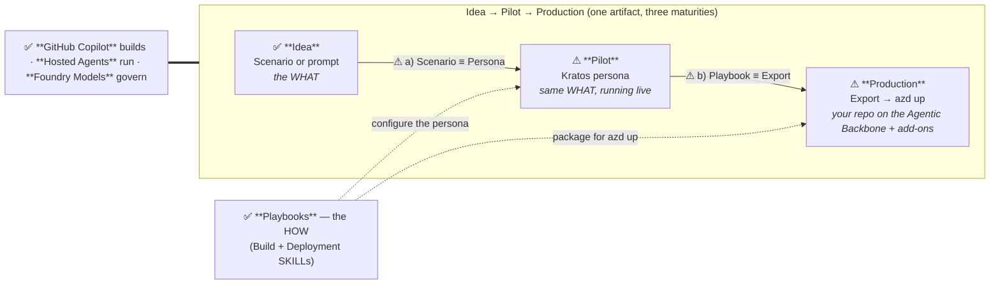

# Agentic Loop Portal — Workshop Flow

> The end-to-end flow to walk on screen using **only the Agentic Loop web portal**.
> ⚠ markers flag the steps that still depend on an **outstanding alignment/decision**.

## How to read this

This guide is **only the flow** to walk on screen, end to end. Status markers:

- ✅ **Stable** — ready to demo as-is.
- ⚠ **Needs refinement** — depends on an open alignment/decision (listed in *Outstanding alignment* at the end). Demo with a caveat or skip live.

## The flow

The single diagram to hold on screen for the whole session. It frames the **problem**, the **constant stack**, and the **standardized Idea → Pilot → Production path**.

### 1 · Frame the problem

> Pilots are cheap. Ungoverned production is expensive.
> The cure is **one standardized path that never changes shape** — from a first idea to a governed, observable, evaluated production agent.

### 2 · How we tackle it — the constant stack

Three things stay the same at **every** stage. They are the answer to "how", before any tool is opened:

| Layer | Role | Stays constant because… |
| --- | --- | --- |
| **GitHub Copilot** (SDK + SKILLs) | **Builds & orchestrates** the agent | The same SKILLs author code at every maturity. |
| **Foundry Hosted Agents** | **Run** the agentic loop in a governed runtime | The pilot and production agent share one runtime shape. |
| **Foundry Models** | **Govern** — models, evals, safety | Evals and policy follow the artifact from pilot to prod. |

### 3 · The standardized path — one artifact, three stages



> ⚠ The two dashed handoffs (**a** and **b**) are the parts of the flow that are **not yet aligned**. They work conceptually but are not wired in the portal — see *Outstanding alignment*.

**The one line the flow should deliver:**

> Pick a **Scenario** *(Idea)* → experience it as its **Kratos persona** *(Pilot)* → **export that persona** through the deployment playbooks to **`azd up`** *(Production)* — with **Copilot building, Hosted Agents running, Foundry Models governing** the whole way.

### 4 · Outstanding alignment — what each ⚠ in the flow is blocked on

These are the decisions that must close before the flow can be shown end-to-end without caveats.

| Flow point | ⚠ Open decision | Status | What it blocks |
| --- | --- | --- | --- |
| **Idea → Pilot** | **a) Scenario ≡ Persona** — do scenarios map 1:1 to Kratos personas (shared id, skills derived from tags → playbooks)? | Open | "Try live" and "Build" being the *same* artifact. Today personas are a separate catalog. |
| **Pilot → Production** | **b) Playbook ≡ Export** — is the Kratos/Agentic Backbone architecture the advisor's canonical run target, with Deployment SKILLs as its export checklist? | Open | One deploy story ending in `azd up`. Today export and advisor `azd up` are two paths. |
| **Pilot node** | **Kratos: live or mock?** — must Kratos be genuinely live for the audience, or is the current mock acceptable? | Open | Whether the Pilot stage can be demoed for real vs. narrated. |
| **Whole frame** | **Audience altitude** — GTM/exec (high-level) vs. field/technical (hands-on). | Open | How deep to go at each node; possibly two cuts of the flow. |
| **Production + beyond** | **Scope cut** — is Run/Scale in scope for this cut, or stop at first `azd up`? | Open | Whether the flow ends at Production or continues into the loop. |
| **All nodes** | **Narrative ratification** — is this Problem → Stack → Idea/Pilot/Production the one agreed spine? | Open | Everyone telling the same story; locks this diagram as canonical. |

### Fallback ASCII (if Mermaid won't render)

```
              ┌──────────────── constant stack ────────────────┐
              │ GHCP builds · Hosted Agents run · Foundry govern │
              └──────────────────────┬──────────────────────────┘
                                     │
   IDEA ───────────────►  PILOT ───────────────►  PRODUCTION
   Scenario / prompt      Kratos persona ⚠        Export → azd up ⚠
   (the WHAT) ✅          (same WHAT, live)        (Agentic Backbone + add-ons)
        ▲                      ▲                        ▲
        └── ⚠ a) same id ──────┘                        │
                               └── ⚠ b) playbooks = export checklist ──┘
                          Playbooks ✅ = the HOW (Build + Deploy SKILLs)
```
