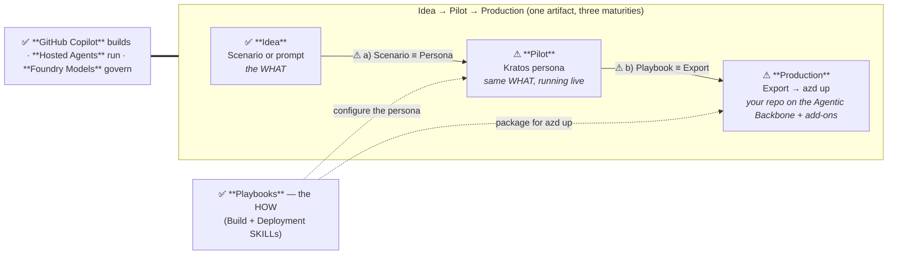

# Agentic Loop Portal — Workshop Flow

## Current customer-workshop flow

Use **Start a technical workshop** (`/workshop`) for a customer build conversation and **Show an industry demo** (`/scenarios`) for showcase. The workshop reuses Launchpad and the existing build hand-off.

1. Edit or replace the sample customer brief. Each fresh portal session randomly starts with one of three examples: HR policy answers, maintenance-system troubleshooting, or shared-room scheduling. The sample stays unchanged during navigation unless you edit it; clearing it leaves an empty field. Industry examples stay on the separate showcase route; a scenario's workshop link keeps its own editable context. Keep approved sample data ready. Technical requirements are three checkbox columns: capabilities, building blocks and candidate patterns, with relevant defaults selected for samples and industry scenarios. **Frontier Models is always selected and cannot be removed**, including for custom briefs and guide links. Adjust the other selections as needed; describe custom requirements in the brief instead of separate technical inputs.
2. Prepare the workshop. **Proposed workshop approach** explains why each guide fits, what implementation material it provides, what needs adapting, and its prerequisites and exclusions, all visible without expandable panels. Including a guide adds a link to its implementation instructions and recommended build skills to the Copilot prompt; it does not deploy an app or automatically implement a capability. Reusable matches need no AI call. Partial/no-match cases preserve covered guidance and optionally use the local Copilot SDK for gaps only. Add other guides through **Add another guide (optional)**; manual selection still needs customer validation.
3. Use the compact **Review workshop** section: confirm who will use the pilot, define testable success criteria, and add scope notes or decisions. The brief supplies the pilot scope; approved sample data, authorized access, verification evidence and production exclusions remain baseline requirements. Scope notes are optional for fully covered pilots but required to explicitly resolve gaps and open questions. Do not treat missing catalog coverage as infeasibility. The build workflow is a visible selector, not an expandable panel.
4. Select **Confirm scope & get prompt**. This single action confirms the current scope and opens **Your build prompt**, ready to copy. The button explains any missing users, success criteria or gap decisions. It does not run Copilot or deploy resources. Any edit invalidates confirmation and requires confirming again; unchanged scope can be reopened with **Open build prompt**. There is no expandable JSON specification in the workshop review; the full structured specification is retained internally and included unchanged in the prompt. Drafts survive navigation in memory, not refresh.
5. Copy the complete prompt into Copilot in your project. Setup, project creation, confirmed-spec review and optional run-skill guidance remain available in the prompt dialog; the prompt itself is shown first. Return to **Your build prompt** after choosing run skills to copy the updated version. Run the existing workflow manually with Specify/Plan review and permission checkpoints.
6. Verify MVP behavior, access boundaries, safe data handling and failure paths. Capture evidence and remaining production work. Optional development deployment does not certify production readiness.

The portal cannot verify local CLI/Azure readiness and does not provision or execute commands. Prepare subscription scopes, resource/RBAC rights, model availability and approved data before a live customer session. Public static hosting has no AI runtime; use explicit manual review or the [local SDK companion](workshop-runtime.md).

## Historical framing (not the implemented hand-off)

The following earlier discussion records unresolved persona/export concepts. It is not a requirement to make Kratos the workshop execution target or a claim that its proposed production hand-offs are implemented.

> The end-to-end flow to walk on screen using **only the Agentic Loop web portal**.
> ⚠ markers flag the steps that still depend on an **outstanding alignment/decision**.

## How to read this

This guide is **only the flow** to walk on screen, end to end. Status markers:

- ✅ **Stable** — ready to demo as-is.
- ⚠ **Needs refinement** — depends on an open alignment/decision (listed in *Outstanding alignment* at the end). Demo with a caveat or skip live.

## The flow

The single diagram to hold on screen for the whole session. It frames the **problem**, the **constant stack**, and the **standardized Idea → Pilot → Production path**.

### 1 · Frame the problem

> Pilots are cheap. Ungoverned production is expensive.
> The cure is **one standardized path that never changes shape** — from a first idea to a governed, observable, evaluated production agent.

### 2 · How we tackle it — the constant stack

Three things stay the same at **every** stage. They are the answer to "how", before any tool is opened:

| Layer | Role | Stays constant because… |
| --- | --- | --- |
| **GitHub Copilot** (SDK + SKILLs) | **Builds & orchestrates** the agent | The same SKILLs author code at every maturity. |
| **Foundry Hosted Agents** | **Run** the agentic loop in a governed runtime | The pilot and production agent share one runtime shape. |
| **Foundry Models** | **Govern** — models, evals, safety | Evals and policy follow the artifact from pilot to prod. |

### 3 · The standardized path — one artifact, three stages


```mermaid
flowchart LR
  subgraph PATH["Idea → Pilot → Production  (one artifact, three maturities)"]
    direction LR
    Idea["✅ **Idea**<br/>Scenario or prompt<br/><i>the WHAT</i>"]
    Pilot["⚠ **Pilot**<br/>Kratos persona<br/><i>same WHAT, running live</i>"]
    Prod["⚠ **Production**<br/>Export → azd up<br/><i>your repo on the Agentic Backbone + add-ons</i>"]
    Idea -->|"⚠ a) Scenario ≡ Persona"| Pilot
    Pilot -->|"⚠ b) Playbook ≡ Export"| Prod
  end
  Play["✅ **Playbooks** — the HOW<br/>(Build + Deployment SKILLs)"]
  Play -. "configure the persona" .-> Pilot
  Play -. "package for azd up" .-> Prod
  Stack["✅ **GitHub Copilot** builds · **Hosted Agents** run · **Foundry Models** govern"]
  Stack === PATH
```

> ⚠ The two dashed handoffs (**a** and **b**) are the parts of the flow that are **not yet aligned**. They work conceptually but are not wired in the portal — see *Outstanding alignment*.

**The one line the flow should deliver:**

> Pick a **Scenario** *(Idea)* → experience it as its **Kratos persona** *(Pilot)* → **export that persona** through the deployment playbooks to **`azd up`** *(Production)* — with **Copilot building, Hosted Agents running, Foundry Models governing** the whole way.

### 4 · Outstanding alignment — what each ⚠ in the flow is blocked on

These are the decisions that must close before the flow can be shown end-to-end without caveats.

| Flow point | ⚠ Open decision | Status | What it blocks |
| --- | --- | --- | --- |
| **Idea → Pilot** | **a) Scenario ≡ Persona** — do scenarios map 1:1 to Kratos personas (shared id, skills derived from tags → playbooks)? | Open | "Try live" and "Build" being the *same* artifact. Today personas are a separate catalog. |
| **Pilot → Production** | **b) Playbook ≡ Export** — is the Kratos/Agentic Backbone architecture the advisor's canonical run target, with Deployment SKILLs as its export checklist? | Open | One deploy story ending in `azd up`. Today export and advisor `azd up` are two paths. |
| **Pilot node** | **Kratos: live or mock?** — must Kratos be genuinely live for the audience, or is the current mock acceptable? | Open | Whether the Pilot stage can be demoed for real vs. narrated. |
| **Whole frame** | **Audience altitude** — GTM/exec (high-level) vs. field/technical (hands-on). | Open | How deep to go at each node; possibly two cuts of the flow. |
| **Production + beyond** | **Scope cut** — is Run/Scale in scope for this cut, or stop at first `azd up`? | Open | Whether the flow ends at Production or continues into the loop. |
| **All nodes** | **Narrative ratification** — is this Problem → Stack → Idea/Pilot/Production the one agreed spine? | Open | Everyone telling the same story; locks this diagram as canonical. |

### Fallback ASCII (if Mermaid won't render)

```
              ┌──────────────── constant stack ────────────────┐
              │ GHCP builds · Hosted Agents run · Foundry govern │
              └──────────────────────┬──────────────────────────┘
                                     │
   IDEA ───────────────►  PILOT ───────────────►  PRODUCTION
   Scenario / prompt      Kratos persona ⚠        Export → azd up ⚠
   (the WHAT) ✅          (same WHAT, live)        (Agentic Backbone + add-ons)
        ▲                      ▲                        ▲
        └── ⚠ a) same id ──────┘                        │
                               └── ⚠ b) playbooks = export checklist ──┘
                          Playbooks ✅ = the HOW (Build + Deploy SKILLs)
```
