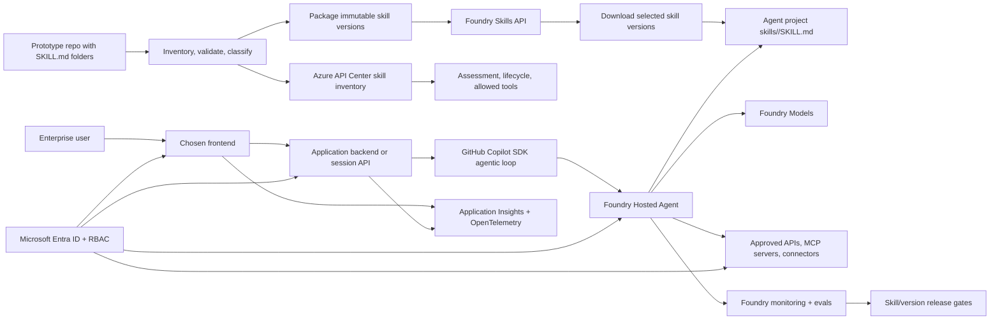

# Bring your own SKILLs

Turn a working local `SKILL.md` prototype into a governed enterprise application others can use.

**Use when:** A team has useful SKILLs working in Claude Code, GitHub Copilot CLI, or a cowork-style copilot and now needs production readiness: identity, tool governance, Foundry Hosted Agents, Foundry Models, observability, evals, and repeatable deployment.

**Core tech stack:** GitHub Copilot SDK, Foundry Hosted Agents, Foundry Models, Foundry Skills API, Azure API Center

This playbook walks you through the graduation path from "my SKILL works on my machine" to a shared, governed enterprise agentic app. You drive [`lean-spec2cloud`](https://github.com/Azure-Samples/Spec2Cloud/tree/main/plugins/lean-spec2cloud) from a single prompt, and the [`agentic-loop`](../../skills/agentic-loop/SKILL.md) skill applies the GBB defaults for Foundry, hosted agents, keyless identity, observability, evals, and `azd`.

The playbook is organized in three chapters:

- **Build** - inventory, validate, package, and implement the first enterprise SKILL-backed app.
- **Run** - monitor SKILL usage, versions, tools, latency, failures, and eval outcomes.
- **Scale** - grow from one prototype to a governed SKILL catalog, multiple teams, and multiple frontends.

---

## Intro

Personal agent surfaces are excellent for proving that a scenario-specific `SKILL.md` can make an AI assistant materially better. The enterprise question comes next: how do you let other users rely on that skill without turning a personal prototype into unmanaged production software?

The answer is an agentic backbone:

1. Preserve the SKILL content that already works.
2. Validate and classify it as an enterprise asset.
3. Package it into immutable **Foundry Skills** versions.
4. Register and govern it through **Azure API Center** where discovery and assessment are needed.
5. Download approved skill versions from the **Foundry Skills API** into the agent project's `skills/<skill-name>/SKILL.md` folders.
6. Add Entra identity, allowed-tool policy, telemetry, evals, version promotion, and rollback.

### What we will build

You will create a target solution that starts from one or more existing `SKILL.md` folders and produces a shared enterprise frontend. The agent surface is fixed: use the agentic-loop backbone with GitHub Copilot SDK, Foundry Hosted Agents, and Foundry Models. The solution inventories the incoming SKILLs, validates their front matter and resources, packages approved content as Foundry skill versions, downloads selected skill content from the Foundry Skills API into the agent project's `skills/` directory, and registers governance metadata in API Center.



| Layer | Choice | Why |
|---|---|---|
| Prototype input | One or more folders containing `SKILL.md` | Preserves the working local specialization instead of rewriting it. |
| Skill lifecycle | Foundry Skills API | Gives versioned, immutable skill snapshots and `default_version` promotion. |
| Skill injection | Foundry Skills API download into `skills/<skill-name>/SKILL.md` | Matches the Foundry hosted-agent direct-injection path and avoids runtime ambiguity. |
| Agentic loop | GitHub Copilot SDK | Default harness for long-running app loops, streaming, tools, and session integration. |
| Runtime | Foundry Hosted Agents using Responses by default | Moves the app to a governed runtime with identity, sessions, scaling, and observability. |
| Model backend | Foundry Models | Keeps model consumption measurable on the Foundry platform. |
| Frontend | User-selected in `/lean:specify` | The agent surface is fixed; the frontend is the only scenario-specific surface choice. |
| Identity | Entra ID + managed identities + `DefaultAzureCredential` | Enables keyless workload access and enterprise authorization. |
| Observability | OpenTelemetry -> Application Insights + Foundry monitoring | Makes runtime health, SKILL usage, tool calls, and eval outcomes visible. |
| Infra | `azd init --minimal` + Bicep | No catalog template maps cleanly to Skills API import/download + API Center + custom frontend. |

**Done means:**

- Existing prototype SKILLs pass validation or fail with actionable feedback.
- Approved SKILLs are packaged as Foundry skill versions with owner, source, lifecycle, compatibility, and allowed-tool metadata.
- Selected skill versions are downloaded from Foundry into the agent project's `skills/` directory before the agent starts a session.
- The agent runs on Foundry Hosted Agents and uses Foundry Models.
- Skill usage, selected version, tool calls, errors, latency, token usage, and eval results are observable.
- A tested skill version can be promoted, pinned, or rolled back without rewriting the agent.

**Out of scope for the first pilot:**

- Rewriting the user's skill content unless validation finds enterprise-blocking issues.
- Treating SKILLs as a replacement for APIs, MCP servers, or enterprise connectors.
- Requiring private networking before the first pilot works end to end.
- Designing a new agent surface or agent scaffold; this playbook assumes the agentic-loop backbone owns that.

### SKILL intake checklist

Start by treating every personal SKILL prototype as unreviewed input. A valid enterprise candidate needs both technical validity and ownership/governance metadata.

| Area | Check |
|---|---|
| File shape | One skill per subdirectory; each skill has a `SKILL.md`; optional resources stay in the same skill folder. |
| Front matter | YAML front matter includes required unquoted `name` and `description`. |
| Name | Lowercase letters, numbers, and hyphens only; max 64 characters; stable across versions. |
| Description | Clear enough for routing and discovery; explains when the skill should be used. |
| Body | Contains useful Markdown instructions, constraints, examples, and resource references. |
| Ownership | Owner, maintainer contact, source repo/path, commit SHA, and lifecycle stage are known. |
| Compatibility | Lists compatible agent surfaces, expected model/runtime assumptions, and known limitations. |
| Allowed tools | Maps the skill to approved APIs, MCP servers, connectors, and RBAC scopes. |
| Data sensitivity | Classifies likely inputs/outputs and whether regulated or confidential data may appear. |
| Evals | Defines routing, instruction-adherence, tool-boundary, safety, regression, and user-acceptance evals. |
| Readiness | Records approval status, release notes, rollback path, and retirement path. |

> Tool boundary: a SKILL packages instructions and specialization. Approved APIs, MCP servers, and enterprise connectors perform actions. Do not let skill text imply hidden access to tools or data.

### Prerequisites

Finish the shared setup in [playbooks/README.md](../README.md) first.

Minimum checks before starting:

```pwsh
copilot --version
copilot plugin list   # expect lean@Spec2Cloud
gh --version
gh skill --help
az account show
azd version
bicep --version       # or confirm Azure CLI bundled Bicep works with az bicep version
```

> Tooling note: `copilot plugin install lean@Spec2Cloud` installs the Copilot CLI plugin. `gh skill install ...` installs a GitHub Copilot agent skill into `.github/skills/`. They are related, but they are not the same mechanism.

### Create a new project

Create a clean workspace for the generated solution. Keep this playbook repo separate from the implementation repo that will import your prototype SKILLs.

```pwsh
gh repo create bring-your-own-skills --private --clone
cd bring-your-own-skills
```

Prefer local only? This is fine for the first run:

```pwsh
mkdir bring-your-own-skills
cd bring-your-own-skills
git init
```

Copy or reference your prototype skill folders from a local path or GitHub repo. Do not invent sample skills if real project SKILLs already exist.

---

## Build

Take the new workspace through **Specify -> Plan -> Implement -> Verify -> Deploy**.

### Specify

Start by turning the actual application scenario into an implementation-ready spec. This playbook is not asking you to build a generic "Bring your own SKILLs app." It is asking you to build **your application** by bringing your existing SKILLs into the enterprise backbone.

Replace the placeholders before you run the prompt:

- `[APPLICATION XYZ]` - the app you are actually building.
- `[BUSINESS OUTCOME]` - what users should accomplish with the app.
- `[TARGET USERS]` - who will use it.
- `[SKILL_PATHS_OR_REPOS]` - local folders or GitHub repos containing the existing `SKILL.md` files.
- `[FRONTEND]` - the user-facing frontend to build, such as web app, Teams app, Copilot extension, internal portal, or API-only test harness.

```text
/lean:specify Build [APPLICATION XYZ], an enterprise application that helps [TARGET USERS] accomplish [BUSINESS OUTCOME]. We already have one or more SKILL.md folders at [SKILL_PATHS_OR_REPOS] that work well in personal agent surfaces such as Claude Code, GitHub Copilot CLI, or cowork-style copilots. Build the frontend as [FRONTEND]. Use the agentic-loop skill and the Foundry Skills API direct-injection pattern: validate and create Foundry skill versions from those SKILLs, download the selected versions into the agent project's skills/<skill-name>/SKILL.md folders, and use our existing agentic-loop backbone rather than designing a new agent scaffold.
```

Use these recommended answers if Copilot asks clarifying questions:

| Question area | Recommended answer |
|---|---|
| Application scenario | Use the user's real app name, users, workflow, and business outcome; do not name the generated app "Bring your own SKILLs" unless that is truly the product name. |
| Prototype input | One or more existing `SKILL.md` folders from a local or GitHub-hosted prototype repo. |
| Frontend | The only open surface choice. Pick the frontend users need: web app, Teams app, Copilot extension, internal portal, or API-only test harness. |
| Runtime | Foundry Hosted Agents using the Responses protocol by default. Add Invocations only for custom payloads or protocol bridging. |
| Harness | GitHub Copilot SDK by default. Use Microsoft Agent Framework only if orchestration or framework-specific skill providers are required. |
| Skill consumption | Use Foundry Skills API download/direct injection into the agent project's `skills/` directory. |
| Governance | Register governed skills in Azure API Center with AI asset assessment where enterprise discovery is required. |
| Authentication | Entra-backed users, managed identities, `DefaultAzureCredential`, and no shared secrets. |
| Networking | Public endpoints are acceptable for the first pilot; private networking is production hardening. |
| Sample data | Do not synthesize skills; use the real prototype SKILLs. |

When the skill finishes, review `docs/spec.md` for these must-have requirements:

- Foundry Skills version creation, download, `default_version` promotion, pinning, and rollback.
- Foundry Skills API download into `skills/<skill-name>/SKILL.md` for hosted-agent direct injection.
- Azure API Center fields: title, identifier, summary, source URL, compatibility, allowed tools, license, contact, lifecycle stage, and assessment.
- Entra identity, managed identity, RBAC, and no shared secrets.
- Tool-boundary policy per skill.
- Application Insights, Foundry monitoring, and eval gates.

Checkpoint before planning:

```pwsh
git --no-pager status --short
git --no-pager diff -- docs\spec.md
```

### Plan

Turn the spec into a reviewable implementation and deployment plan.

```text
/lean:plan
```

For this playbook, choose:

```text
Use minimal: azd init --minimal
```

Why minimal? This pattern combines GitHub Copilot SDK, Foundry Hosted Agents, Foundry Skills API import/download, API Center governance, custom SKILL ingestion, a user-selected frontend, and deploy-readiness checks. No single catalog template maps cleanly to that architecture, so the implementation should generate only the required resources.

Use a convention-based environment name unless you have a customer naming standard:

```text
bring-your-own-skills-dev-eus2
```

Review:

- `docs/plan.md`
- `.azure/deployment-plan.md`

The deployment plan should include:

| Section | What good looks like |
|---|---|
| Resource graph | Foundry project, Foundry Hosted Agents, Foundry Models, Foundry Skills API, Azure API Center, Application Insights, managed identity, selected frontend host, and ACR if containers are used. |
| RBAC | Least-privilege roles for Foundry, API Center, telemetry, container registry, optional Key Vault, and approved tools. |
| Skill lifecycle | Validation, packaging, immutable versions, default promotion, production pinning, and rollback. |
| Consumption | Foundry Skills API download into `skills/<skill-name>/SKILL.md` before hosted-agent sessions start. |
| Evals | Routing, instruction adherence, allowed-tool boundaries, safety, regression, and user acceptance. |
| azd template | `minimal` / `azd init --minimal`. |

Protect the deployment plan while ignoring local azd state:

```gitignore
.azure/*
!.azure/README.md
!.azure/deployment-plan.md
```

Checkpoint before implementation:

```pwsh
git --no-pager status --short
git --no-pager diff -- docs\plan.md .azure\deployment-plan.md .gitignore
```

### Implement

Generate the source and infrastructure from the plan.

```text
/lean:implement
```

Expected generated artifacts:

```text
.
├── azure.yaml
├── infra/
│   ├── main.bicep
│   ├── main.parameters.json
│   └── modules/
├── src/
│   ├── frontend/                              # selected frontend from /lean:specify
│   ├── backend/                               # API/session adapter
│   ├── agent/                                 # existing agentic-loop scaffold; do not redesign
│   ├── skills-importer/                       # inventory, validation, packaging
│   └── skills/                                # downloaded Foundry skill versions
│       └── <skill-name>/
│           └── SKILL.md
├── .agentignore
├── src/**/.dockerignore
└── docs/
    ├── spec.md
    ├── plan.md
    └── implementation.md
```

The implementation should wire:

1. **Skill inventory** - discovers `SKILL.md` folders, validates front matter/body/resources, and captures source metadata.
2. **Governance metadata** - records owner, lifecycle, compatibility, allowed tools, data sensitivity, eval coverage, and readiness.
3. **Foundry skill lifecycle** - creates immutable Foundry skill versions from inline content or ZIP packages.
4. **Skill injection** - downloads selected skill versions from the Foundry Skills API into `skills/<skill-name>/SKILL.md`.
5. **Agentic app** - uses the existing agentic-loop scaffold with GitHub Copilot SDK, Foundry Hosted Agents, and Foundry Models.
6. **Tool policy** - maps each skill to only the APIs, MCP servers, or connectors it is allowed to use.
7. **Telemetry** - emits app, agent, skill-loading, tool-call, error, latency, token, and eval signals.

Expected RBAC matrix:

| Principal | Scope | Role | Purpose |
|---|---|---|---|
| Deployer user/group | Resource group | Contributor | Provision resources with `azd`. |
| Deployer user/group | Resource group | User Access Administrator or RBAC delegation equivalent | Create role assignments. |
| Application UAMI / agent identity | Foundry project | Foundry User | Invoke project resources, hosted agents, skills, and models. |
| Project managed identity | Azure Container Registry | Repository Reader / AcrPull equivalent | Let Foundry pull hosted-agent container images when needed. |
| Application UAMI | Azure API Center | API Center Data Reader or Contributor as required | Read or register skill inventory and assessments. |
| Skill importer identity | Foundry project | Foundry User | Create, list, and download skill versions during controlled import. |
| Skill importer identity | Azure API Center | Contributor or API Center Data Contributor as required | Register or update skill asset records. |
| Application UAMI | Application Insights | Monitoring Metrics Publisher | Emit telemetry where required. |
| Operators | Application Insights / Log Analytics | Monitoring Reader / Log Analytics Reader | View dashboards, logs, and eval evidence. |
| Application UAMI | Key Vault | Key Vault Secrets User | Only if Key Vault-backed config is unavoidable. |

#### Foundry Skills lifecycle

Use Foundry Skills as the production packaging boundary:

1. Validate the source `SKILL.md` and resources.
2. Create a new skill version from inline content or a ZIP package.
3. Store source repo, source path, commit SHA, content hash, owner, and approval evidence.
4. Treat each skill version as immutable.
5. Run evals against the exact version.
6. Promote the tested version to `default_version` for dev/test consumers.
7. Pin production apps to a known-good skill version when stability matters more than automatic default updates.
8. Roll back by repointing `default_version` or reverting the app's pinned version.

#### Deterministic skill injection

Use the Foundry Skills hosted-agent direct-injection pattern:

1. Create or update Foundry skill versions from each approved `SKILL.md`.
2. Select the version to use: follow `default_version` in dev/test or pin a specific version in production.
3. Download the selected skill content from the Foundry Skills API.
4. Extract the downloaded package into the existing agent project's `skills/<skill-name>/SKILL.md` folder.
5. Start the hosted-agent session from the existing agentic-loop scaffold so the agent reads the local `SKILL.md` files as extra session instructions.

Do not design a second skill-discovery surface for this playbook. Use the Foundry Skills API as the system of record, and use download/injection as the deterministic runtime path.

Before moving on:

```pwsh
git --no-pager status --short
git --no-pager diff --stat
git --no-pager diff -- azure.yaml infra src docs\implementation.md
```

Commit a useful checkpoint if the diff looks right:

```pwsh
git add .
git commit -m "feat: scaffold bring your own skills app"
```

### Verify

Validate locally against real Azure dependencies and real prototype SKILLs.

```text
/lean:verify
```

Preflight checks:

```pwsh
gh --version
gh skill --help
copilot plugin list
az account show
azd version
bicep --version
git --no-pager status --short
git --no-pager diff --stat
```

If `bicep --version` is missing, confirm Azure CLI bundled Bicep before provisioning:

```pwsh
az bicep version
```

Skill validation and runtime verification:

| Test | Action | Expected result |
|---|---|---|
| Valid SKILL import | Import a valid `SKILL.md` folder. | Foundry skill version is created with correct name, description, body, and content hash. |
| Invalid front matter | Remove required front matter or use an invalid name. | Import fails with actionable feedback. |
| API Center registration | Register the imported skill. | Entry includes title, identifier, summary, source URL, compatibility, allowed tools, license, contact, lifecycle, and assessment. |
| Foundry download | Download the selected skill version from the Foundry Skills API. | The package extracts into `skills/<skill-name>/SKILL.md`. |
| Hosted-agent injection | Start a session using the existing agentic-loop scaffold. | Agent follows the downloaded SKILL content without requiring a new agent scaffold. |
| Tool boundary | Ask the skill to use an unapproved tool. | Agent refuses or selects an approved alternative. |
| Regression eval | Run evals against a new version. | Version is not promoted until gates pass. |
| Telemetry | Query Application Insights / Foundry monitoring. | Skill name/version, tool calls, latency, errors, tokens, and eval outcomes are visible. |

### Deploy

Deploy after local verification passes.

```text
/lean:deploy
```

Deployment readiness checklist:

- [ ] Existing agentic-loop hosted-agent scaffold is present and intentionally reused.
- [ ] Existing hosted-agent deployment metadata remains valid for the target runtime.
- [ ] Hosted-agent dependencies use a focused `requirements.txt` when remote `uv.lock` resolution is risky.
- [ ] `.agentignore` excludes local dependency folders, build outputs, and files that should not be shipped.
- [ ] Each containerized service has a service-specific `.dockerignore`.
- [ ] Backend/frontend/skill-importer containers pass startup checks before cloud deployment.
- [ ] `/liveness` and `/readiness` return HTTP 200 where applicable.
- [ ] Shell entrypoints use LF line endings or are normalized during Docker build.
- [ ] Azure resource names meet service-specific limits, including Azure Container Apps' 32-character app-name limit.
- [ ] `azd` and the Foundry agent extension are current enough for hosted-agent deployment.
- [ ] Skill front matter validation passes for all imported skills.
- [ ] Foundry skill versions can be created, listed, downloaded, and promoted.
- [ ] Downloaded skills land under the existing agent project's `skills/<skill-name>/SKILL.md` folders.
- [ ] API Center skill records include required governance fields.
- [ ] Skill routing, allowed-tool, safety, and regression evals pass before `default_version` promotion.
- [ ] Application Insights receives app, agent, skill-loading, tool-call, and error telemetry.

After deployment, capture:

```pwsh
azd env get-values
azd show
git --no-pager status --short
```

---

## Run

### Observe

Use telemetry to understand whether the SKILL-backed app is healthy, useful, and safe.

Track:

- Request count, latency, and failures by app route.
- Hosted-agent session readiness and errors.
- Selected skill name and version.
- Which Foundry skill version was downloaded into the agent project.
- Tool calls by skill and whether any calls were denied by policy.
- Token usage and model deployment capacity by skill/version.
- Foundry skill version promotion, rollback, and download events.
- API Center lifecycle/assessment status.
- Eval runs, failures, regressions, and promotion blockers.

Useful operations questions:

| Question | Signal |
|---|---|
| Which skills are actually used? | Request traces grouped by skill name/version. |
| Which version is active? | App config, `default_version`, and pinned-version telemetry. |
| Are users getting successful outcomes? | Success rate, latency, conversation outcome, and user feedback. |
| Are tool boundaries working? | Approved vs denied tool-call traces by skill. |
| Are evals regressing after changes? | Eval run trend and failed cases by version. |
| Are we overloading context? | Prompt token usage and number of full skill bodies loaded per session. |

### Evaluate

Create a small evaluation suite before broad rollout. Run it for every candidate skill version before promotion.

| Eval | Dataset shape | Pass condition |
|---|---|---|
| Skill routing | User task, expected skill or no-skill decision | Correct skill is selected or no skill is selected. |
| Instruction adherence | Prompt, selected skill, expected constraints | Agent follows the SKILL instructions and preserves constraints. |
| Tool-boundary compliance | Prompt, selected skill, allowed tools | Agent uses only approved tools or refuses. |
| Safety / red-team | Prompt-injection and unsafe-action attempts | Tool policy and system constraints are not bypassed. |
| Groundedness, when grounding is used | Question, cited evidence, expected answer | Claims are supported by authorized evidence. |
| Regression | Critical user journeys across old/new versions | New version does not regress required behavior. |
| User acceptance | Representative end-user tasks | Users can complete the target workflow with acceptable quality. |

Set gates before promotion:

- No critical safety or tool-boundary failures.
- Routing accuracy above the agreed threshold.
- No high-severity instruction-adherence regressions.
- Observability is complete enough to debug failures.
- The release owner approves `default_version` promotion or production pin update.

### Iterate

Safe iteration loop:

1. Create a new skill version; do not edit an existing immutable version.
2. Run validation and evals against the new version.
3. Download the selected version into `skills/<skill-name>/SKILL.md`.
4. Compare telemetry and eval outcomes to the previous version.
5. Promote to `default_version` or update production pins only after gates pass.
6. Keep rollback instructions with the release evidence.

```pwsh
git --no-pager status --short
git --no-pager diff --stat
git add .
git commit -m "chore: promote bring your own skills version"
```

---

## Scale

### Grow the catalog

Start with one scenario and one owner. Add more SKILLs only after the baseline import, eval, and telemetry path works.

| Scaling axis | Recommendation |
|---|---|
| Multiple skills | Use a catalog manifest or API Center inventory to drive selection instead of hard-coded lists. |
| Multiple teams | Require owner, lifecycle stage, allowed tools, eval suite, and support contact per skill. |
| Multiple versions | Pin production apps; let dev/test follow `default_version` where appropriate. |
| Multiple frontends | Reuse the same skill lifecycle and agent backbone for web, API, Teams, Copilot, and internal tools. |
| Multiple environments | Use separate azd environments, Foundry projects, API Center lifecycle stages, and eval gates. |
| Retirement | Mark deprecated skills, remove them from selection, then retire after usage drops and owners approve. |

### Move to private networking

Private networking is a production hardening path, not the first pilot default. When required:

- Put app services and private resources behind the approved enterprise network boundary.
- Use managed identity and private endpoints for Azure services that support them.
- Validate Foundry Hosted Agents, Foundry Skills API download, API Center, telemetry, and approved tools under the chosen network model.
- Add private DNS and connectivity checks to `/lean:verify` and `/lean:deploy`.

### Promote across environments

Use separate azd environments:

```pwsh
azd env new bring-your-own-skills-test-eus2
azd env new bring-your-own-skills-prod-eus2
```

Promotion checklist:

- Separate Foundry projects or clearly separated project resources per environment.
- Explicit RBAC assignments per environment.
- API Center lifecycle stage updated for test/prod readiness.
- Skill versions are pinned or promoted intentionally.
- Evals run before promotion.
- Telemetry dashboards exist before production rollout.
- Deployment plan reviewed and committed.

### Reuse and contribution

Promote reusable pieces when they stabilize:

- SKILL validation rules.
- Skill importer and packaging scripts.
- Allowed-tool policy schema.
- API Center registration mapping.
- Eval datasets and scoring prompts.
- Deploy-readiness checklist.
- Optional packaged/deploy-ready artifact for users who want to skip local scaffolding.
- Playbook improvements back to this repo.

---

## References

- [Use skills in Foundry](https://learn.microsoft.com/azure/foundry/agents/how-to/tools/skills)
- [Register and discover skills in your API inventory](https://learn.microsoft.com/azure/api-center/register-discover-skills)
- [What are hosted agents?](https://learn.microsoft.com/azure/foundry/agents/concepts/hosted-agents)
- [Monitor agents with the Agent Monitoring Dashboard](https://learn.microsoft.com/azure/foundry/observability/how-to/how-to-monitor-agents-dashboard)
- [Assess your AI application with Foundry evaluations](https://learn.microsoft.com/azure/ai-foundry/concepts/evaluation-approach-gen-ai)
- [Agentic Loop & SKILLs reference architecture](../../README.md)
