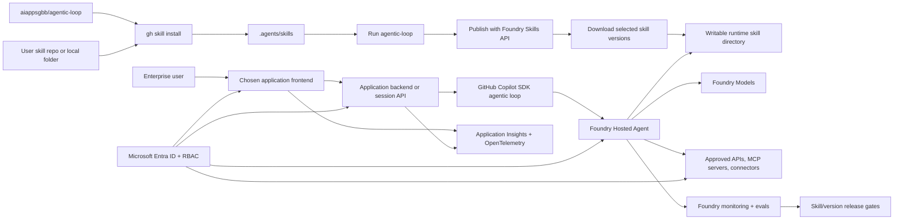

# Bring Your Own Skills

## Intro

### Graduate an existing skill into a governed agent.

Start with the skills that already work for your team. Install the `agentic-loop` build skill and your own skills into the project with the same `gh skill install` command, then let Agentic Loop build and deploy the skill-backed application.

**Use when:** A proven local or GitHub-hosted `SKILL.md` needs enterprise identity, governance, runtime distribution, observability, evals, and repeatable deployment.

**Core tech stack:** GitHub Skills CLI, `agentic-loop`, GitHub Copilot SDK, Foundry Hosted Agents, Foundry Models, Foundry Skills API

The [`agentic-loop`](../../skills/agentic-loop/SKILL.md) skill is the required build-time orchestrator. The other project skills are runtime domain instructions. GitHub CLI installs both kinds into `.agents/skills`; Agentic Loop then publishes the selected runtime skills through the Foundry Skills API and configures the deployed agent to consume them.

The playbook is organized in three chapters:

- **Build** - install the build and runtime skills, then implement the first enterprise skill-backed app.
- **Run** - monitor SKILL usage, versions, tools, latency, failures, and eval outcomes.
- **Scale** - grow from one prototype to a governed SKILL catalog, multiple teams, and multiple frontends.

---

Personal agent surfaces are excellent for proving that a skill makes an assistant materially better. The enterprise question is how to let other users rely on that skill without turning a personal prototype into unmanaged production software.

The answer is an agentic backbone:

1. Preserve the SKILL content that already works.
2. Install it into the project with `gh skill install`.
3. Use `agentic-loop` to build the application and publish immutable **Foundry Skills** versions.
4. Download approved versions into writable runtime storage.
5. Add Entra identity, tool policy, telemetry, evals, promotion, and rollback.

### What we will build

You will create an application around the skills installed in `.agents/skills/`. The `agentic-loop` skill supplies the production backbone. The selected user skills are published as immutable Foundry skill versions, promoted after evaluation, and downloaded into writable runtime storage for Copilot SDK sessions.


```mermaid
flowchart LR
  BuildRepo[aiappsgbb/agentic-loop] --> CLI[gh skill install]
  UserRepo[User skill repo or local folder] --> CLI
  CLI --> Project[.agents/skills]
  Project --> Loop[Run agentic-loop]
  Loop --> Skills[Publish with Foundry Skills API]
  Skills --> Download[Download selected skill versions]
  Download --> SkillDir[Writable runtime skill directory]
  User[Enterprise user] --> Frontend[Chosen application frontend]
  Frontend --> App[Application backend or session API]
  App --> SDK[GitHub Copilot SDK agentic loop]
  SDK --> Agent[Foundry Hosted Agent]
  Agent --> Models[Foundry Models]
  Agent --> SkillDir
  Agent --> Tools[Approved APIs, MCP servers, connectors]
  Entra[Microsoft Entra ID + RBAC] --> Frontend
  Entra --> App
  Entra --> Agent
  Entra --> Tools
  Frontend --> Insights[Application Insights + OpenTelemetry]
  App --> Insights[Application Insights + OpenTelemetry]
  Agent --> Monitor[Foundry monitoring + evals]
  Monitor --> Gates[Skill/version release gates]
```

| Layer | Choice | Why |
|---|---|---|
| Project skills | `gh skill install` into `.agents/skills` | Uses the same simple installation path for `agentic-loop` and user skills. |
| Skill lifecycle | Foundry Skills API | Gives versioned, immutable skill snapshots and `default_version` promotion. |
| Skill injection | Foundry Skills API download into writable runtime storage | Lets Copilot SDK load the governed copy through `skill_directories`. |
| Agentic loop | GitHub Copilot SDK | Default harness for long-running app loops, streaming, tools, and session integration. |
| Runtime | Foundry Hosted Agents using Responses by default | Moves the app to a governed runtime with identity, sessions, scaling, and observability. |
| Model backend | Foundry Models | Keeps model consumption measurable on the Foundry platform. |
| Frontend | Selected during `/spec2cloud` | Matches the application and users the supplied skills support. |
| Identity | Entra ID + managed identities + `DefaultAzureCredential` | Enables keyless workload access and enterprise authorization. |
| Observability | OpenTelemetry -> Application Insights + Foundry monitoring | Makes runtime health, SKILL usage, tool calls, and eval outcomes visible. |
| Infra | `azd init --minimal` + Bicep | Generates only the resources required by the selected application. |

**Done means:**

- `agentic-loop` and the selected user skills are installed with `gh skill install`.
- Approved user skills are published as immutable Foundry skill versions.
- Selected skill versions are downloaded from Foundry into writable runtime storage before the agent starts a session.
- The agent runs on Foundry Hosted Agents and uses Foundry Models.
- The deployed agent follows the selected user-provided skill instructions and tool boundaries.
- Skill usage, selected version, tool calls, errors, latency, token usage, and eval results are observable.
- A tested skill version can be promoted, pinned, or rolled back without rewriting the agent.

**Out of scope for the first pilot:**

- Rewriting the user's skill content unless validation finds enterprise-blocking issues.
- Treating SKILLs as a replacement for APIs, MCP servers, or enterprise connectors.
- Requiring private networking before the first pilot works end to end.
- Designing a new agent surface or agent scaffold; this playbook assumes the agentic-loop backbone owns that.

### Skill preflight checklist

Start by treating every personal SKILL prototype as unreviewed input. A valid enterprise candidate needs both technical validity and ownership/governance metadata.

| Area | Check |
|---|---|
| File shape | One skill per subdirectory; each skill has a `SKILL.md`; optional resources stay in the same skill folder. |
| Front matter | YAML front matter includes required unquoted `name` and `description`. |
| Name | Lowercase letters, numbers, and hyphens only; max 64 characters; stable across versions. |
| Description | Clear enough for routing and discovery; explains when the skill should be used. |
| Body | Contains useful Markdown instructions, constraints, examples, and resource references. |
| Ownership | Owner, maintainer contact, source repo/path, commit SHA, and lifecycle stage are known. |
| Compatibility | Lists compatible agent surfaces, expected model/runtime assumptions, and known limitations. |
| Allowed tools | Maps the skill to approved APIs, MCP servers, connectors, and RBAC scopes. |
| Data sensitivity | Classifies likely inputs/outputs and whether regulated or confidential data may appear. |
| Evals | Defines routing, instruction-adherence, tool-boundary, safety, regression, and user-acceptance evals. |
| Readiness | Records approval status, release notes, rollback path, and retirement path. |

> Tool boundary: a SKILL packages instructions and specialization. Approved APIs, MCP servers, and enterprise connectors perform actions. Do not let skill text imply hidden access to tools or data.

### Setup

You will need:

- An Azure subscription with Contributor permissions and permission to create role assignments.
- A GitHub Copilot plan, with GitHub Copilot installed and signed in through the [Copilot App](http://gh.io/app) (recommended), [Copilot CLI](https://github.com/features/copilot/cli/), or [Visual Studio Code](https://code.visualstudio.com/download).
- [GitHub CLI (`gh`)](https://cli.github.com/) installed and authenticated with access to the repositories that contain your skills.
- A GitHub CLI version that includes the preview `gh skill` commands.
- Access to the [`aiappsgbb/agentic-loop`](https://github.com/aiappsgbb/agentic-loop) repository and to the repository or local directory containing your own skills.
- [Azure CLI (`az`)](https://learn.microsoft.com/en-us/cli/azure/install-azure-cli) and [Azure Developer CLI (`azd`)](https://learn.microsoft.com/en-us/azure/developer/azure-developer-cli/install-azd) installed and authenticated.
- Bicep available through Azure CLI or the standalone [Bicep CLI](https://learn.microsoft.com/en-us/azure/azure-resource-manager/bicep/install).
- The `lean-spec2cloud` Copilot plugin installed and updated. Install it from the CLI with:

```pwsh
copilot plugin marketplace add Azure-Samples/Spec2Cloud
copilot plugin install lean@Spec2Cloud
```

Sanity check before you go further:

```pwsh
copilot --version
copilot plugin list   # expect lean@Spec2Cloud
gh --version
gh skill --help
gh repo view aiappsgbb/agentic-loop --json nameWithOwner
az account show
azd auth login --check-status
azd version
az bicep version
```

> Tooling note: `copilot plugin install lean@Spec2Cloud` installs the Spec2Cloud plugin. `gh skill install ... --scope project` installs both Agentic Loop and your own skills into the project's `.agents/skills` directory.

> **Heads up on cost.** This playbook provisions billable Azure resources, including Container Apps, Foundry/AI Services, Application Insights, and optionally Container Registry. See [Clean up](#clean-up) to remove everything when you are done.

## Build

### Create a new project

Create a clean workspace and initialize a GitHub repository.

```pwsh
gh repo create my-skill-backed-agent --private --clone
cd my-skill-backed-agent
```

Prefer local only? This is fine for the first run:

```pwsh
mkdir my-skill-backed-agent
cd my-skill-backed-agent
git init
```

### Install Agentic Loop and your skills

Use the same command for the required build skill and your runtime domain skills.

Install Agentic Loop:

```pwsh
gh skill install aiappsgbb/agentic-loop agentic-loop --agent github-copilot --scope project
```

Install your skill from GitHub:

```pwsh
gh skill install OWNER/REPO SKILL_NAME --agent github-copilot --scope project
```

Pin it when reproducibility matters:

```pwsh
gh skill install OWNER/REPO SKILL_NAME --pin v1.2.0 --agent github-copilot --scope project
```

If the skill only exists locally:

```pwsh
gh skill install C:\path\to\skills-repo --from-local --agent github-copilot --scope project
```

`gh skill install` is in preview. Review the [GitHub CLI command](https://cli.github.com/manual/gh_skill_install) and [GitHub agent-skills guidance](https://docs.github.com/en/copilot/concepts/agents/about-agent-skills) for current behavior.

Before continuing, confirm both the build skill and your runtime skills are installed:

```pwsh
gh skill list
Get-ChildItem .agents\skills -Recurse -Filter SKILL.md
git add .agents\skills
git commit -m "chore: add agent skills"
```

---

### Open GitHub Copilot

This playbook uses the **GitHub Copilot App**, but the same prompt works in Copilot CLI and VS Code.

> **Using the CLI instead?** Run `copilot --allow-all` only in a sandbox workspace, or omit the flag to approve each action.

**1. Open the Spec2Cloud canvas.** In the review panel, click **+**, then choose **Spec2Cloud Cockpit**. If it is not installed, import:

```text
https://github.com/Azure-Samples/Spec2Cloud/tree/main/.github/extensions/spec2cloud
```

**2. Add your project.** Choose **+ -> Add project from -> Local folder or repository**, then select `my-skill-backed-agent`.

**3. Choose a model and mode.**

| Mode | Behavior |
|---|---|
| Interactive | Step-by-step collaboration; you confirm each stage |
| Plan | Plans first, executes once you approve |
| Autopilot *(recommended)* | Runs the full loop end to end |

---

### Run the build loop

Take the new workspace through **Specify -> Plan -> Implement -> Verify -> Deploy** with one prompt.

> **Required build skill:** Run the installed `agentic-loop` skill before specification or implementation. It creates the production backbone; the other installed project skills are the runtime domain skills deployed through the Foundry Skills API.

```text
/spec2cloud Build [describe the application, target users, and business outcome]. Use the user-provided project skills installed under .agents/skills as the application's runtime domain instructions. Ask me to confirm which installed skills the deployed agent should use, the frontend, and any required APIs or MCP tools before finalizing the specification.

Before planning or implementation, run the installed agentic-loop skill (`aiappsgbb/agentic-loop`, skill `agentic-loop`) to enhance the spec with its app, agent runtime, Azure infrastructure, identity, and telemetry defaults.

Publish the selected installed user skills directly through the Foundry Skills API; do not build a separate skill-importer service. Create immutable versions, run routing, instruction-adherence, tool-boundary, safety, and scenario-specific evaluations against those exact versions, then promote passing versions to default_version. Before each Copilot SDK session, download the governed versions into writable runtime storage and configure skill_directories to those folders.

Build the confirmed frontend and a Foundry Hosted Agent using the GitHub Copilot SDK and Foundry Models. Use managed identity and DefaultAzureCredential. Trace skill name/version, routing, tool calls, instruction adherence, latency, errors, and evaluation lineage. Support pinning and rollback without rebuilding the agent image.
```

> `/spec2cloud` runs the same five-stage loop as Getting Started. The prompt explicitly invokes `agentic-loop`; the remaining requirements define skill installation, Foundry publication, runtime injection, evaluation, and promotion.

> Prefer to run one stage at a time? Use the same prompt with `/specify` first, then advance through each stage:
>
> | Command | Produces | Review in |
> |---|---|---|
> | `/specify <prompt>` | Specification | `docs/spec.md` |
> | `/plan` | Implementation and Azure plan | `docs/plan.md`, `.azure/deployment-plan.md` |
> | `/implement` | App, infrastructure, and skill publication step | `src/`, `infra/`, `azure.yaml` |
> | `/verify` | Publication, injection, policy, and regression tests | `docs/verify.md` |
> | `/deploy` | Deployed skill-backed solution | `docs/deploy.md` |

Use these recommended answers if Copilot asks clarifying questions:

| Question area | Recommended answer |
|---|---|
| Application scenario | Use the user's app name, target users, workflow, and business outcome. |
| Skill input | One or more project skills installed with `gh skill install`. |
| Frontend | Select the surface the users need: web app, Teams app, Copilot extension, internal portal, or API. |
| Runtime | Foundry Hosted Agents using the Responses protocol by default. Add Invocations only for custom payloads or protocol bridging. |
| Harness | GitHub Copilot SDK by default. Use Microsoft Agent Framework only if orchestration or framework-specific skill providers are required. |
| Skill consumption | Use Foundry Skills API download/direct injection into the agent project's `skills/` directory. |
| Publication | Publish selected user skills directly through the Foundry Skills API; no custom importer service. |
| Authentication | Entra-backed users, managed identities, `DefaultAzureCredential`, and no shared secrets. |
| Networking | Public endpoints are acceptable for the first pilot; private networking is production hardening. |
| Sample data | Use real non-sensitive project inputs where available; otherwise create only the minimum fixtures needed for evals. |

When the skill finishes, review `docs/spec.md` for these must-have requirements:

- Foundry Skills version creation, download, `default_version` promotion, pinning, and rollback.
- Foundry Skills API download into writable runtime storage and Copilot SDK `skill_directories` configuration.
- Installed skill selection and source/version lineage.
- Entra identity, managed identity, RBAC, and no shared secrets.
- Tool-boundary policy per skill.
- Application Insights, Foundry monitoring, and eval gates.
- Skill name/version, routing, instruction-adherence, and tool-boundary telemetry.

Checkpoint before planning:

```pwsh
git --no-pager status --short
git --no-pager diff -- docs\spec.md
```

### Review the generated plan

Turn the spec into a reviewable implementation and deployment plan.

```text
/plan
```

For this playbook, choose:

```text
Use minimal: azd init --minimal
```

Why minimal? This pattern combines GitHub Copilot SDK, Foundry Hosted Agents, Foundry Skills API publication/download, a user-selected frontend, and deploy-readiness checks. No separate ingestion service is required.

Use a convention-based environment name unless you have a customer naming standard:

```text
bring-your-own-skills-dev-eus2
```

Review:

- `docs/plan.md`
- `.azure/deployment-plan.md`

The deployment plan should include:

| Section | What good looks like |
|---|---|
| Resource graph | Foundry project, hosted agent, Foundry Models, Foundry Skills API, Application Insights, managed identity, selected frontend, and ACR if needed. |
| RBAC | Least-privilege roles for Foundry, telemetry, container registry, optional Key Vault, and approved tools. |
| Skill lifecycle | Validation, packaging, immutable versions, default promotion, production pinning, and rollback. |
| Consumption | Foundry Skills API download into writable runtime storage before Copilot SDK sessions start. |
| Evals | Routing, instruction adherence, allowed-tool boundaries, safety, regression, and user acceptance. |
| azd template | `minimal` / `azd init --minimal`. |

Protect the deployment plan while ignoring local azd state:

```gitignore
.azure/*
!.azure/README.md
!.azure/deployment-plan.md
```

Checkpoint before implementation:

```pwsh
git --no-pager status --short
git --no-pager diff -- docs\plan.md .azure\deployment-plan.md .gitignore
```

### Review the implementation

Generate the source and infrastructure from the plan.

```text
/implement
```

Expected generated artifacts:

```text
.
├── azure.yaml
├── infra/
│   ├── main.bicep
│   ├── main.parameters.json
│   └── modules/
├── src/
│   ├── frontend/                              # selected application frontend
│   ├── backend/                               # API/session adapter
│   ├── agent/                                 # existing agentic-loop scaffold; do not redesign
│   └── skills/                                # runtime download/bootstrap code
│       └── <skill-name>/
│           └── SKILL.md
├── .agents/
│   └── skills/                                # gh skill install output
│       └── <skill-name>/
│           └── SKILL.md
├── .agentignore
├── src/**/.dockerignore
└── docs/
    ├── spec.md
    ├── plan.md
    └── implementation.md
```

The implementation should wire:

1. **Project skills** - uses the skills already installed by `gh skill install`; do not add another ingestion layer.
2. **Foundry publication** - publishes selected user skills as immutable Foundry skill versions.
3. **Skill injection** - downloads selected versions to writable runtime storage and configures Copilot SDK `skill_directories`.
4. **Agentic app** - uses the existing agentic-loop scaffold with GitHub Copilot SDK, Foundry Hosted Agents, and Foundry Models.
5. **Tool policy** - maps each skill to only the APIs, MCP servers, or connectors it may use.
6. **Telemetry and evals** - records skill/version, routing, tool calls, errors, latency, tokens, and evaluation results.

Expected RBAC matrix:

| Principal | Scope | Role | Purpose |
|---|---|---|---|
| Deployer user/group | Resource group | Contributor | Provision resources with `azd`. |
| Deployer user/group | Resource group | User Access Administrator or RBAC delegation equivalent | Create role assignments. |
| Application UAMI / agent identity | Foundry project | Foundry User | Invoke project resources, hosted agents, skills, and models. |
| Project managed identity | Azure Container Registry | Repository Reader / AcrPull equivalent | Let Foundry pull hosted-agent container images when needed. |
| Deployment identity | Foundry project | Foundry User | Create, list, promote, and download skill versions during deployment. |
| Application UAMI | Application Insights | Monitoring Metrics Publisher | Emit telemetry where required. |
| Operators | Application Insights / Log Analytics | Monitoring Reader / Log Analytics Reader | View dashboards, logs, and eval evidence. |
| Application UAMI | Key Vault | Key Vault Secrets User | Only if Key Vault-backed config is unavoidable. |

#### Foundry Skills lifecycle

Use Foundry Skills as the production packaging boundary:

1. Validate the source `SKILL.md` and resources.
2. Create a new skill version from inline content or a ZIP package.
3. Store source repo, source path, commit SHA, content hash, owner, and approval evidence.
4. Treat each skill version as immutable.
5. Run evals against the exact version.
6. Promote the tested version to `default_version` for dev/test consumers.
7. Attach the promoted skill reference to the versioned agent toolbox.
8. Pin production apps to a known-good skill version when stability matters more than automatic default updates.
9. Roll back by repointing `default_version` or reverting the app's pinned version.

Foundry Skills are in preview. Opt in explicitly with `allow_preview=True`, and fail deployment rather than silently bypassing skill publication or download.

#### Deterministic skill injection

Use the Foundry Skills hosted-agent direct-injection pattern:

1. Create or update Foundry skill versions from each approved `SKILL.md`.
2. Select the version to use: follow `default_version` in dev/test or pin a specific version in production.
3. Download the selected skill content from the Foundry Skills API.
4. Extract it into a writable temporary runtime directory such as `<temp>/skills/<skill-name>/`; do not assume the hosted-agent image is writable.
5. Start the Copilot SDK session with that directory in `skill_directories`.
6. Emit the selected skill name, version, and content hash on the session trace.

Do not design a second skill-discovery surface for this playbook. Use the Foundry Skills API as the system of record, and use download/injection as the deterministic runtime path.

Before moving on:

```pwsh
git --no-pager status --short
git --no-pager diff --stat
git --no-pager diff -- azure.yaml infra src docs\implementation.md
```

Commit a useful checkpoint if the diff looks right:

```pwsh
git add .
git commit -m "feat: scaffold bring your own skills app"
```

### Verify locally

Validate locally against real Azure dependencies and the user-provided skills.

```text
/verify
```

Preflight checks:

```pwsh
gh --version
gh skill --help
gh skill list
copilot plugin list
az account show
azd version
bicep --version
git --no-pager status --short
git --no-pager diff --stat
```

If `bicep --version` is missing, confirm Azure CLI bundled Bicep before provisioning:

```pwsh
az bicep version
```

Skill validation and runtime verification:

| Test | Action | Expected result |
|---|---|---|
| CLI installation | Run `gh skill list`. | Agentic Loop and the selected user skills are present. |
| Foundry publication | Publish an installed user skill. | Foundry skill version has the expected name, body, source version, and content hash. |
| Invalid front matter | Remove required front matter or use an invalid name. | Import fails with actionable feedback. |
| Foundry download | Download the selected skill version from the Foundry Skills API. | The package extracts into a writable temporary skill directory. |
| Hosted-agent injection | Start a Copilot SDK session with `skill_directories`. | Agent follows the downloaded skill without requiring a new scaffold. |
| Instruction adherence | Run a representative scenario from the selected skill. | Agent follows the skill's constraints and response procedure. |
| Source lineage | Inspect the created Foundry version. | Metadata identifies the repository, commit, path, and content hash. |
| Tool boundary | Ask the skill to use an unapproved tool. | Agent refuses or selects an approved alternative. |
| Regression eval | Run evals against a new version. | Version is not promoted until gates pass. |
| Telemetry | Query Application Insights / Foundry monitoring. | Skill name/version, tool calls, latency, errors, tokens, and eval outcomes are visible. |

### Deploy

Deploy after local verification passes.

```text
/deploy
```

Deployment readiness checklist:

- [ ] Existing agentic-loop hosted-agent scaffold is present and intentionally reused.
- [ ] Existing hosted-agent deployment metadata remains valid for the target runtime.
- [ ] Hosted-agent dependencies use a focused `requirements.txt` when remote `uv.lock` resolution is risky.
- [ ] `.agentignore` excludes local dependency folders, build outputs, and files that should not be shipped.
- [ ] Each containerized service has a service-specific `.dockerignore`.
- [ ] Backend and frontend containers pass startup checks before cloud deployment.
- [ ] `/liveness` and `/readiness` return HTTP 200 where applicable.
- [ ] Shell entrypoints use LF line endings or are normalized during Docker build.
- [ ] Azure resource names meet service-specific limits, including Azure Container Apps' 32-character app-name limit.
- [ ] `azd` and the Foundry agent extension are current enough for hosted-agent deployment.
- [ ] Skill front matter validation passes for all imported skills.
- [ ] Foundry skill versions can be created, listed, downloaded, and promoted.
- [ ] Runtime downloads the governed skill to writable temporary storage and configures `skill_directories`.
- [ ] Every selected skill has a promoted `default_version`, toolbox reference where appropriate, and rollback target.
- [ ] Skill routing, allowed-tool, safety, and regression evals pass before `default_version` promotion.
- [ ] Application Insights receives app, agent, skill-loading, tool-call, and error telemetry.

After deployment, capture:

```pwsh
azd env get-values
azd show
git --no-pager status --short
```

---

### Troubleshooting

| Symptom | Likely cause | Fix |
|---|---|---|
| Skill import fails | Front matter or folder shape is invalid | Validate one `SKILL.md` per folder with a stable lowercase name and clear description. |
| Agent ignores the skill | The governed version was not downloaded before session start | Resolve the selected version and populate the configured skill directory first. |
| Skill can call an unapproved tool | Tool policy is not bound to the skill | Map each skill version to an explicit allowlist and default deny. |
| A new version regresses behavior | Promotion happened before evals | Keep versions immutable and promote only after routing, safety, and regression gates pass. |

---

## Run

### Run the skill-backed app

Open the deployed application and exercise representative tasks that should and should not select each imported skill. Confirm that the expected governed versions load, only approved tools run, and the agent follows each skill's instructions and constraints.

---

### Observe

Use telemetry to understand whether the SKILL-backed app is healthy, useful, and safe.

Track:

- Request count, latency, and failures by app route.
- Hosted-agent session readiness and errors.
- Selected skill name and version.
- Which Foundry skill version was downloaded into the agent project.
- Tool calls by skill and whether any calls were denied by policy.
- Token usage and model deployment capacity by skill/version.
- Foundry skill version promotion, rollback, and download events.
- Eval runs, failures, regressions, and promotion blockers.

Useful operations questions:

| Question | Signal |
|---|---|
| Which skills are actually used? | Request traces grouped by skill name/version. |
| Which version is active? | App config, `default_version`, and pinned-version telemetry. |
| Are users getting successful outcomes? | Success rate, latency, conversation outcome, and user feedback. |
| Are tool boundaries working? | Approved vs denied tool-call traces by skill. |
| Are evals regressing after changes? | Eval run trend and failed cases by version. |
| Are we overloading context? | Prompt token usage and number of full skill bodies loaded per session. |

### Evaluate

Create a small evaluation suite before broad rollout. Run it for every candidate skill version before promotion.

| Eval | Dataset shape | Pass condition |
|---|---|---|
| Skill routing | User task, expected skill or no-skill decision | Correct skill is selected, or no skill is selected. |
| Instruction adherence | Prompt, selected skill, expected constraints | Agent follows the SKILL instructions and preserves constraints. |
| Tool-boundary compliance | Prompt, selected skill, allowed tools | Agent uses only approved tools or refuses. |
| Safety / red-team | Prompt-injection and unsafe-action attempts | Tool policy and system constraints are not bypassed. |
| Groundedness, when required | Question, authorized evidence, expected answer | Claims are supported by the skill's approved evidence. |
| Safety boundary | Unsafe or unsupported task | Agent stops or escalates according to the skill. |
| Regression | Critical user journeys across old/new versions | New version does not regress required behavior. |
| User acceptance | Representative end-user tasks | Users can complete the target workflow with acceptable quality. |

Set gates before promotion:

- No critical safety or tool-boundary failures.
- Routing accuracy above the agreed threshold.
- No high-severity instruction-adherence regressions.
- Observability is complete enough to debug failures.
- The release owner approves `default_version` promotion or production pin update.

### Iterate

Safe iteration loop:

1. Create a new skill version; do not edit an existing immutable version.
2. Run validation and evals against the new version.
3. Download the selected version into writable runtime storage and configure `skill_directories`.
4. Compare telemetry and eval outcomes to the previous version.
5. Promote to `default_version` or update production pins only after gates pass.
6. Keep rollback instructions with the release evidence.

```pwsh
git --no-pager status --short
git --no-pager diff --stat
git add .
git commit -m "chore: promote bring your own skills version"
```

---

## Scale

### Grow the catalog

Start with one scenario and one owner. Add more SKILLs only after the baseline import, eval, and telemetry path works.

| Scaling axis | Recommendation |
|---|---|
| Multiple skills | Install additional skills with `gh skill install`; keep selection explicit and evaluation-backed. |
| Multiple teams | Require owner, lifecycle stage, allowed tools, eval suite, and support contact per skill. |
| Multiple versions | Pin production apps; let dev/test follow `default_version` where appropriate. |
| Multiple frontends | Reuse the same skill lifecycle and agent backbone for web, API, Teams, Copilot, and internal tools. |
| Multiple environments | Use separate azd environments, Foundry projects, pinned skill versions, and eval gates. |
| Retirement | Mark deprecated skills, remove them from selection, then retire after usage drops and owners approve. |

### Move to private networking

Private networking is a production hardening path, not the first pilot default. When required:

- Put app services and private resources behind the approved enterprise network boundary.
- Use managed identity and private endpoints for Azure services that support them.
- Validate Foundry Hosted Agents, Foundry Skills API download, telemetry, and approved tools under the chosen network model.
- Add private DNS and connectivity checks to `/verify` and `/deploy`.

### Promote across environments

Use separate azd environments:

```pwsh
azd env new skill-backed-agent-test-eus2
azd env new skill-backed-agent-prod-eus2
```

Promotion checklist:

- Separate Foundry projects or clearly separated project resources per environment.
- Explicit RBAC assignments per environment.
- Skill versions are pinned or promoted intentionally.
- Evals run before promotion.
- Telemetry dashboards exist before production rollout.
- Deployment plan reviewed and committed.

### Reuse and contribution

Promote reusable pieces when they stabilize:

- SKILL validation rules.
- Foundry skill publication and runtime-download helpers.
- Allowed-tool policy schema.
- Eval datasets and scoring prompts.
- Deploy-readiness checklist.
- Optional packaged/deploy-ready artifact for users who want to skip local scaffolding.
- Playbook improvements back to this repo.

---

### Clean up

When you are done experimenting, delete every Azure resource the loop created. Run this from the project root, where `azure.yaml` lives:

```bash
azd down --purge --force
```

`--purge` also removes soft-deleted resources so their names are immediately reusable.

---

### References

- [Use skills in Foundry](https://learn.microsoft.com/azure/foundry/agents/how-to/tools/skills)
- [What are hosted agents?](https://learn.microsoft.com/azure/foundry/agents/concepts/hosted-agents)
- [Monitor agents with the Agent Monitoring Dashboard](https://learn.microsoft.com/azure/foundry/observability/how-to/how-to-monitor-agents-dashboard)
- [Assess your AI application with Foundry evaluations](https://learn.microsoft.com/azure/ai-foundry/concepts/evaluation-approach-gen-ai)
- [Agentic Loop & SKILLs reference architecture](../../README.md)
