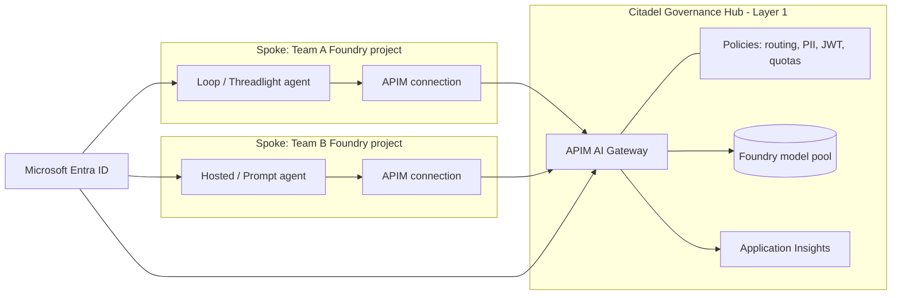

# Citadel Governance Hub

## Why govern

### Every use case must earn its way to production

The [Agentic Loop](../getting-started/README.md) is brilliant at getting you to a working agent. You drive [`lean-spec2cloud`](https://github.com/Azure-Samples/Spec2Cloud/tree/main/plugins/lean-spec2cloud) from a single prompt, the [`agentic-loop`](../../skills/agentic-loop/SKILL.md) skill applies the GBB defaults, and minutes later a Foundry hosted agent is answering questions in your tenant.

Then the review board shows up. **A demo is not a production system.** Before that agent can serve real users it has to answer questions the loop alone doesn't:

- **Who is it acting as?** A managed identity, not a key pasted into an env var.
- **What is it allowed to spend?** A quota and a cost line, not an open tap on shared capacity.
- **Which model, which region, which policy?** Enforced centrally, not trusted per team.
- **Who else is on this endpoint, and can I prove it?** Attribution and audit, not a shared master key.

This playbook is about that graduation. **Citadel** is the production landing zone every loop-built agent plugs into: a governed **AI Gateway** in front of Microsoft Foundry that turns "it works on my subscription" into "it's governed, attributed, and safe to share."

> Tip: Build with the loop, govern with Citadel. The two are complementary — the loop is how the agent gets *made*; Citadel is how it gets *shipped* without handing every team a raw key to shared model capacity.

### Platform governance is not agent governance

The single most useful idea to hold in your head: **there are two governance jobs, and they belong to two different owners.**

| | Platform governance | Agent governance |
|---|---|---|
| **Owner** | Platform / landing-zone team | The team that built the agent |
| **Secures** | The hub, the shared AI gateway, network, policy, quotas | The agent's behaviour — evals, red‑team, responsible AI, HITL |
| **Answers** | "Is the *place* it runs safe and attributable?" | "Is the *agent* itself correct and non‑harmful?" |
| **Delivered by** | **Citadel** (this playbook) | The agent's own build (e.g. the [Threadlight](../threadlight-pipeline/README.md) `production-ready` scorecard) |

Citadel owns the **left column**. It secures the landing zone — the hub, the shared gateway, the network, the policy — so that *any* agent that runs behind it inherits identity, quotas, routing, and audit for free. The agent's own build owns the right column: proving the model reasons correctly and refuses the jailbreak.

You need both, and they compose. A perfectly evaluated agent calling models with a long‑lived key on an un‑attributed endpoint is not production‑ready. Neither is a beautifully governed gateway fronting an agent nobody tested. Defense in depth means the gateway catches what the agent misses, and vice‑versa.

### The AI Gateway pattern

Citadel's Layer‑1 answer to platform governance is one **APIM AI Gateway** in front of a shared Foundry model pool. Instead of every team holding its own keys and calling models directly, every call goes through one governed door:



One governed door buys you the whole left column at once:

- **One endpoint, many models** — swap or retire a model centrally; spokes never change code.
- **Keyless identity** — spokes authenticate with a project managed identity; no long‑lived secrets.
- **Quotas & cost attribution** — one Product per team means one throttle and one billing line per team.
- **Policy at the edge** — PII redaction, JWT enforcement, and a **deprecated‑model block** applied to every call before it reaches a model.
- **Telemetry for free** — every call lands in Application Insights, so cost and health are observable from day one.

> Note: This is exactly what the [Threadlight case study](https://aiappsgbb.github.io/threadlight-skills/case-study.html) exercises: every model call in that live run was routed through a Citadel gateway, a banned `gpt-4`‑class model was refused with **403 at the door**, and the approved model returned **200**. The policy, not the agent, enforced the model allow‑list.

### The four-layer Citadel platform

The gateway is **Layer 1** of a wider, layered platform. You don't need all four to start — but knowing the shape tells you where today's work sits and what comes next.

| Layer | Concern | Covered here |
|---|---|---|
| **L1** Governance Hub (infra) | Gateway, APIs, policies, telemetry | ✅ `citadel-hub-deploy` |
| **L1** Governance Hub (wiring) | Per‑team access contracts, JWT, KV secrets | ✅ `citadel-spoke-onboarding` |
| **L1.5** In‑process governance | Deterministic safety inside the agent runtime | Pair with `foundry-agt` |
| **L2–L4** Control plane / Agent identity / Security fabric | Foundry lifecycle, Entra Agent ID, Defender + Purview | Platform roadmap |

This playbook stands up **L1** end‑to‑end (infra + wiring) and points at **L1.5** for defense in depth. L2–L4 are the platform roadmap you grow into.

> Important: **Done means** — the hub is deployed and returns the model list through APIM; a chat completion round‑trips through the gateway; one spoke calls a model **keyless** via a Foundry connection; and gateway traffic, quotas, and cost are visible in Application Insights.

### When to reach for a hub

A shared, always‑on gateway is a real cost and a real commitment. Reach for it deliberately.

> Warning: The hub is an always‑on cost (~$200–$2,500/mo depending on profile). Do **not** deploy one when a single team just needs model access — point them at a Foundry project directly. Reach for Citadel when **many** teams must share capacity under one governed, attributable endpoint.

Skip or defer the hub if you have one consuming team, no cost‑attribution or multi‑tenant policy requirement, or you're still in throwaway‑PoC mode. Threadlight pilots run **standalone** and adopt a spoke later — graduation, not prerequisite.

---

## Build the hub

### Preflight

Deploy into a deliberately‑chosen tenant and subscription — the hub is too expensive to land in the wrong place. Confirm where you are before you provision anything.

```pwsh
az account show --query "{sub:name, id:id, tenant:tenantId}" -o table
az version ; azd version ; bicep --version
```

> Important: Use per‑tenant isolation before `azd up`. Set `AZURE_CONFIG_DIR` + `AZD_CONFIG_DIR` per tenant and assert the active subscription — the `azure-tenant-isolation` pattern. Required roles: `Owner` or `Contributor` + `User Access Administrator` on the target subscription (the deploy creates role assignments), plus permission to register the APIM, Cognitive Services, and Insights resource providers.

### Pick a deployment profile

This chapter wraps [`citadel-hub-deploy`](https://github.com/aiappsgbb/awesome-gbb/tree/main/skills/citadel-hub-deploy) — a GBB skill built on the `Azure-Samples/ai-hub-gateway-solution-accelerator` (`citadel-v1` branch). It ships three paved `azd` profiles. Pick one before you deploy.

| Profile | Use it for | Networking | Rough cost/mo |
|---|---|---|---|
| **pilot‑quickstart** | First hub, demos, a shared pilot | Public endpoints | ~$200–$400 |
| **enterprise‑baseline** | A durable shared hub for several teams | Public + hardening knobs | ~$600–$1,200 |
| **vnet‑isolated‑spoke‑aware** | Regulated / private‑network customers | BYO VNet, private endpoints, spoke peering | ~$1,500–$2,500 |

> Tip: Start with **pilot‑quickstart** even if you know you'll need VNet isolation. Prove the gateway works publicly first, then redeploy the isolated profile once the topology is understood. The profiles differ in parameters, not in the app you deploy.

### Deploy the hub

Deploying the hub is itself an **`azd` flow you can drive from Copilot** — the same muscle memory as any loop build, pointed at an accelerator instead of a generated app. Bring up the accelerator on the `citadel-v1` branch and deploy with your chosen profile.

```bash
# 1. Scaffold the accelerator (citadel-v1 branch)
azd init --template Azure-Samples/ai-hub-gateway-solution-accelerator -e citadel-hub --branch citadel-v1
cd <env-folder>

# 2. Select region + profile parameters (see the skill for the full env-var map)
azd env set AZURE_LOCATION swedencentral

# 3. Deploy the hub (APIM, Foundry pool, policies, App Insights)
azd up
```

`azd up` provisions APIM, the Foundry model pool, the policy fragments, and the Application Insights components. Expect **30–45 minutes** — APIM creation dominates.

> Note: MCAPS pilot tagging (`SecurityControl: Ignore`) is already in the upstream `bicepparam`. Layer your own `AZURE_TAGS` for cost allocation per the `azd-patterns` skill.

### Verify the gateway

Prove the gateway routes before you onboard anyone. No Jupyter required — a curl round‑trip is enough.

```bash
GW=$(az apim show -g <rg> -n <apim> --query gatewayUrl -o tsv)

# Master key — DEMO ONLY (create a per-team Access Contract for real spokes)
KEY=$(az rest --method post \
  --url "https://management.azure.com/subscriptions/$(az account show --query id -o tsv)/resourceGroups/<rg>/providers/Microsoft.ApiManagement/service/<apim>/subscriptions/master/listSecrets?api-version=2022-08-01" \
  --query primaryKey -o tsv)

# Discover models (note: api-key header, NOT Ocp-Apim-Subscription-Key)
curl -s "$GW/models/models" -H "api-key: $KEY" | jq '.value[].name'

# One chat completion through the gateway
curl -s -X POST "$GW/openai/deployments/gpt-5.4-mini/chat/completions?api-version=2024-12-01-preview" \
  -H "api-key: $KEY" -H "Content-Type: application/json" \
  -d '{"messages":[{"role":"user","content":"ping"}],"max_completion_tokens":10}'
```

Expected warm latency from the skill's live audit (Sweden Central, gpt‑5.4‑mini): **~1s end‑to‑end** through APIM; `/models` discovery **~250ms**. The upstream ships eight validation notebooks under `validation/` — run the four baseline ones (LLM backend onboarding, universal‑LLM all‑models, access contracts, agent frameworks) on every new hub.

---

## Onboard a spoke

### A loop-built agent becomes a governed spoke

This is where the two worlds meet. You built an agent with the [Agentic Loop](../getting-started/README.md) — or ran a [Threadlight](../threadlight-pipeline/README.md) pilot — and it currently calls models directly. **Onboarding turns it into a governed spoke:** the agent keeps its code and its identity, but its model calls now flow through the hub, keyless, under a quota and a policy.

This chapter wraps [`citadel-spoke-onboarding`](https://github.com/aiappsgbb/awesome-gbb/tree/main/skills/citadel-spoke-onboarding) — the per‑team wiring that grants a project an **Access Contract**.

### Create an Access Contract

An **Access Contract** is an APIM Product + a scoped Subscription, optionally Key Vault secrets and a Foundry connection. Scaffold a contract folder from the accelerator.

```powershell
# From the accelerator repo (citadel-v1)
cd bicep/infra/citadel-access-contracts
mkdir -p contracts/myteam-myagent/dev
cd contracts/myteam-myagent/dev
cp ../../../main.bicepparam main.bicepparam
cp ../../../policies/default-ai-product-policy.xml ai-product-policy.xml
```

Naming follows `{serviceCode}-{businessUnit}-{useCase}-{environment}` — e.g. `LLM-Healthcare-PatientAssistant-DEV`. One Product per spoke, one Subscription per Product — that's what makes cost attribution a single billing line per team.

Edit `main.bicepparam` with the hub coordinates and your use case. For a **keyless** Foundry spoke, point it at the target project and let the contract create the connection:

```bicep
using '../../../main.bicep'

param apim = { subscriptionId: '<HUB-SUB>'  resourceGroupName: '<HUB-APIM-RG>'  name: '<HUB-APIM>' }
param useCase = { businessUnit: 'MyTeam'  useCaseName: 'MyAgent'  environment: 'DEV' }

// Order matters: first API is the one your SDK expects
param apiNameMapping = { LLM: ['azure-openai-api', 'universal-llm-api', 'unified-ai-api'] }

// Keyless posture: skip KV, create a Foundry connection instead
param useTargetAzureKeyVault = false
param useTargetFoundry = true
param foundry = {
  subscriptionId: '<FOUNDRY-SUB>'  resourceGroupName: '<FOUNDRY-RG>'
  accountName: '<FOUNDRY-ACCOUNT>'  projectName: '<FOUNDRY-PROJECT>'
}
```

### Deploy the contract

Preview with what‑if, then deploy at subscription scope.

```powershell
# Preview
az deployment sub what-if --location <REGION> `
  --template-file ../../../main.bicep --parameters main.bicepparam

# Deploy
az deployment sub create --name myteam-myagent-dev --location <REGION> `
  --template-file ../../../main.bicep --parameters main.bicepparam
```

### Consume the gateway — keyless (Option B)

> Important: A loop‑built or Threadlight agent should use the **Foundry Connection** path (Option B), not Key Vault. With Option B the APIM subscription key is held by a **Foundry connection**, and the agent references that connection *by name* while authenticating to Foundry with its own **managed identity** — so no long‑lived secret ever lives in the agent runtime. That's what "keyless" means here. Pulling the key from Key Vault instead puts a long‑lived secret in the agent — avoid it.

Set the model to `connectionName/modelName` — the connection name comes from the contract output (e.g. `Hub-MyTeam-MyAgent-DEV-LLM`).

```yaml
# agent.yaml (hosted agent)
environment_variables:
  - name: MODEL_DEPLOYMENT_NAME
    value: Hub-MyTeam-MyAgent-DEV-LLM/gpt-5.4
```

```python
# The FoundryChatClient resolves the connection automatically
client = FoundryChatClient(
    project_endpoint=os.environ["FOUNDRY_PROJECT_ENDPOINT"],
    model=os.environ["MODEL_DEPLOYMENT_NAME"],   # "connectionName/gpt-5.4"
    credential=DefaultAzureCredential(),
)
```

> Warning: `connectionName/model` routing works only through `FoundryChatClient` (hosted agents) or `PromptAgentDefinition` (prompt agents). A raw `oai.chat.completions.create(model="connName/gpt-5.4")` returns `404 DeploymentNotFound`. Bind the connection at the agent level, not the raw client.

### Add JWT (optional hardening)

When the hub is deployed with `entraAuth=true`, require a JWT on top of the API key. Set the flag in the product policy:

```xml
<inbound>
    <base />
    <set-variable name="jwtRequired" value="true" />
</inbound>
```

| Request | Headers | Result |
|---|---|---|
| API key only (JWT off) | `api-key` | ✅ |
| API key + JWT (JWT on) | `api-key` + `Authorization: Bearer …` | ✅ |
| API key only (JWT on) | `api-key` | ❌ 401 |
| JWT only | `Authorization: Bearer …` | ❌ 401 |

The spoke acquires the token for the gateway app (`api://<GATEWAY-APP-ID>/.default`) using its **own** managed identity — recommended over a client secret on Azure.

> Note: The `api-key` in the table above is the contract's APIM **subscription key** — in Option B it's delivered through the Foundry connection, so the agent still never handles it directly. JWT is an **additional** Entra layer on top of that credential, not a replacement for it. Keyless (agent holds no secret) and JWT (extra Entra enforcement) are complementary, not alternatives.

---

## Scale & compose

### Add more spokes and go private

Every new team repeats **Onboard a spoke** with its own contract — the hub does not change. When a customer needs private networking, redeploy the hub with the **vnet‑isolated‑spoke‑aware** profile and peer each spoke VNet to the hub. Pair with [`foundry-vnet-deploy`](https://github.com/aiappsgbb/awesome-gbb/tree/main/skills/foundry-vnet-deploy) for spoke‑side VNet bring‑up; `apim-dns-zone-link.bicep` links `privatelink.azure-api.net` into the spoke.

### Defense in depth

> Tip: Gateway governance (L1) and in‑process governance (L1.5) catch different attacks. Layer [`foundry-agt`](https://github.com/aiappsgbb/awesome-gbb/tree/main/skills/foundry-agt) inside each agent runtime — the skill's red‑team data shows deterministic in‑process checks driving attack success from 26.67% (prompt‑only) to 0.00%. Use both, not either. This is the platform half of the same defense‑in‑depth story the agent completes with its own evals and red‑team.

### Observe cost and health

The hub deploys Application Insights components. For spoke agent traces to land in the hub's central story, follow `foundry-observability`'s three‑layer pattern (Bicep + account‑level connection + `configure_azure_monitor()`). Use APIM's per‑subscription metrics for **cost attribution** — one Product per spoke means one billing line per team. When something breaks, drive the [`incident-postmortem`](../../skills/agentic-loop/references/run-skills-catalog.md) run skill off the gateway + App Insights telemetry.

### How Citadel composes with the loop and Threadlight

Bring the whole picture together. Three motions, one governed destination:

- **The [Agentic Loop](../getting-started/README.md)** builds the agent from a prompt. Onboard it as a spoke and its model calls become governed and keyless.
- **[Threadlight](../threadlight-pipeline/README.md)** is the advanced, opinionated pipeline. Its `production-ready` scorecard proves the *agent* (the right column); Citadel proves the *platform* (the left). Its case study routes every model call through a Citadel gateway — the two ship together.
- **`foundry-*` building blocks** are the primitives — hosted agents, IQ, evals, observability, in‑process AGT — that both the loop and Threadlight compose, and that a spoke inherits.

That's the point of a landing zone: whatever built the agent, it grows up in the same governed place.

### Clean up

Tear down a hub environment when the pilot ends. This deletes APIM, the Foundry pool, and telemetry — irreversible.

```bash
azd down --purge
```

> Note: `--purge` also purges soft‑deleted APIM and Cognitive Services so the names are immediately reusable. Drop it if you want the soft‑delete retention window.

### Go deeper

- [`citadel-hub-deploy`](https://github.com/aiappsgbb/awesome-gbb/tree/main/skills/citadel-hub-deploy) — full profile + validation‑notebook reference.
- [`citadel-spoke-onboarding`](https://github.com/aiappsgbb/awesome-gbb/tree/main/skills/citadel-spoke-onboarding) — access‑contract parameters, policy XML, connection fetch.
- [Threadlight case study](https://aiappsgbb.github.io/threadlight-skills/case-study.html) — a live run where every model call flowed through a Citadel gateway.
- [Citadel Platform overview](https://aka.ms/foundry-citadel) — the full four‑layer model.
