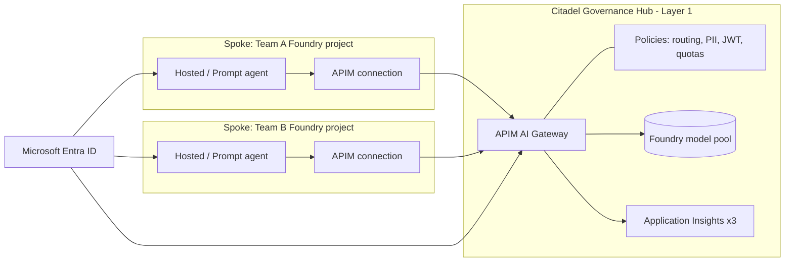

# Citadel Governance Hub

## Intro

### Deploy a governed AI Gateway hub, then onboard your agents as spokes.

Citadel is the production landing zone for enterprise AI: a central **APIM AI Gateway** in front of Microsoft Foundry that gives every team one governed endpoint with identity, quotas, cost attribution, and policy. This playbook takes field and platform teams from nothing to a **running Layer‑1 Governance Hub**, then wires a Foundry project in as a **keyless spoke** that calls models through the gateway.

**Use when:** Multiple teams need to share Foundry capacity behind one governed, observable, cost‑attributed endpoint — not a pile of direct keys.

**Core tech stack:** APIM AI Gateway, Microsoft Foundry, Entra ID, Application Insights, `azd` + Bicep

This playbook wraps two GBB skills — [`citadel-hub-deploy`](https://github.com/aiappsgbb/awesome-gbb/tree/main/skills/citadel-hub-deploy) (the infra) and [`citadel-spoke-onboarding`](https://github.com/aiappsgbb/awesome-gbb/tree/main/skills/citadel-spoke-onboarding) (the per‑team wiring) — both built on the `Azure-Samples/ai-hub-gateway-solution-accelerator` (`citadel-v1` branch).

The playbook is organized in three chapters:

- **Build the hub** — deploy the Layer‑1 gateway from a paved `azd` profile and prove it works.
- **Onboard a spoke** — grant a team a governed, keyless path to models via an Access Contract.
- **Scale** — add spokes, private networking, defense‑in‑depth, and cost telemetry.

---

### What we will build

You will deploy a **hub‑and‑spoke** topology. The **hub** is a shared APIM instance that fronts a Foundry model pool and enforces routing, PII policy, JWT, quotas, and telemetry. Each **spoke** is a team's Foundry project that receives an **Access Contract** (an APIM Product + Subscription, optionally a Foundry connection) so its agents call models through the gateway with a project managed identity — no long‑lived keys.



The hub is **Layer 1** of the wider four‑layer Citadel platform:

| Layer | Concern | Covered here |
|---|---|---|
| **L1** Governance Hub (infra) | Gateway, APIs, policies, telemetry | ✅ `citadel-hub-deploy` |
| **L1** Governance Hub (wiring) | Per‑team access contracts, JWT, KV secrets | ✅ `citadel-spoke-onboarding` |
| **L1.5** In‑process governance | Deterministic safety inside the agent runtime | Pair with `foundry-agt` |
| **L2–L4** Control plane / Agent identity / Security fabric | Foundry lifecycle, Entra Agent ID, Defender + Purview | Platform roadmap |

**Done means:**

- The hub is deployed and `GET /models` returns the configured model list through APIM.
- A chat completion round‑trips through the gateway (api‑key header, ~1s warm).
- One spoke project holds an Access Contract and calls a model **keyless** via a Foundry connection.
- Gateway traffic, quotas, and cost are visible in Application Insights.

**Out of scope for the first deployment:**

- Provisioning access contracts at install time — the hub ships **zero** contracts; spokes are added after.
- Handing spokes the APIM `master` subscription key (demo‑only; use per‑team contracts).
- Mandating BYO‑VNet on the first run — start public, harden later with the VNet‑isolated profile.

### When NOT to deploy a hub

> Warning: The hub is a real, always‑on cost (~$200–$2,500/mo depending on profile). Do not deploy one when a single team just needs model access — point them at a Foundry project directly. Reach for Citadel when **many** teams must share capacity under one governed, attributable endpoint.

Skip or defer the hub if: you have one consuming team, no cost‑attribution or multi‑tenant policy requirement, or you are still in throwaway‑PoC mode. Threadlight pilots (see the companion playbook) can run **standalone** and adopt a spoke later.

### Prerequisites

Deploy into a deliberately‑chosen tenant and subscription. The hub is too expensive to land in the wrong place.

```pwsh
az account show --query "{sub:name, id:id, tenant:tenantId}" -o table
az version
azd version
bicep --version
```

> Important: Use per‑tenant isolation before `azd up`. Set `AZURE_CONFIG_DIR` + `AZD_CONFIG_DIR` per tenant and assert the active subscription — this is the `azure-tenant-isolation` pattern. A hub deployed to the wrong subscription is an expensive mistake to unwind.

Required roles: `Owner` or `Contributor` + `User Access Administrator` on the target subscription (the deploy creates role assignments), and permission to register the resource providers APIM, Cognitive Services, and Insights use.

---

## Build the hub

### Pick a deployment profile

`citadel-hub-deploy` ships three paved `azd` profiles. Pick one before you deploy.

| Profile | Use it for | Networking | Rough cost/mo |
|---|---|---|---|
| **pilot‑quickstart** | First hub, demos, a shared pilot | Public endpoints | ~$200–$400 |
| **enterprise‑baseline** | A durable shared hub for several teams | Public + hardening knobs | ~$600–$1,200 |
| **vnet‑isolated‑spoke‑aware** | Regulated / private‑network customers | BYO VNet, private endpoints, spoke peering | ~$1,500–$2,500 |

> Tip: Start with **pilot‑quickstart** even if you know you'll need VNet isolation. Prove the gateway works publicly first, then redeploy the isolated profile once the topology is understood. The profiles differ in parameters, not in the app you deploy.

### Initialize and deploy

Bring up the accelerator on the `citadel-v1` branch and deploy with your chosen profile.

```bash
# 1. Scaffold the accelerator (citadel-v1 branch)
azd init --template Azure-Samples/ai-hub-gateway-solution-accelerator -e citadel-hub --branch citadel-v1
cd <env-folder>

# 2. Select region + profile parameters (see the skill for the full env-var map)
azd env set AZURE_LOCATION swedencentral

# 3. Deploy the hub (APIM, Foundry pool, policies, 3x App Insights)
azd up
```

`azd up` provisions APIM, the Foundry model pool, the policy fragments, and three Application Insights components (apim, foundry, func). Expect **30–45 minutes** — APIM creation dominates.

> Note: MCAPS pilot tagging (`SecurityControl: Ignore`) is already in the upstream `bicepparam`. Layer your own `AZURE_TAGS` for cost allocation per the `azd-patterns` skill.

### Verify the gateway

Prove the gateway routes before you onboard anyone. No Jupyter required — a curl round‑trip is enough.

```bash
# Gateway URL
GW=$(az apim show -g <rg> -n <apim> --query gatewayUrl -o tsv)

# Master key — DEMO ONLY (create a per-team Access Contract for real spokes)
KEY=$(az rest --method post \
  --url "https://management.azure.com/subscriptions/$(az account show --query id -o tsv)/resourceGroups/<rg>/providers/Microsoft.ApiManagement/service/<apim>/subscriptions/master/listSecrets?api-version=2022-08-01" \
  --query primaryKey -o tsv)

# Discover models (note: api-key header, NOT Ocp-Apim-Subscription-Key)
curl -s "$GW/models/models" -H "api-key: $KEY" | jq '.value[].name'

# One chat completion through the gateway
curl -s -X POST "$GW/openai/deployments/gpt-5.4-mini/chat/completions?api-version=2024-12-01-preview" \
  -H "api-key: $KEY" -H "Content-Type: application/json" \
  -d '{"messages":[{"role":"user","content":"ping"}],"max_completion_tokens":10}'
```

Expected warm latency from the skill's live audit (Sweden Central, gpt‑5.4‑mini): **~1s end‑to‑end** through APIM; `/models` discovery **~250ms**. For deeper coverage, the upstream ships eight validation notebooks under `validation/` — run the four baseline ones (LLM backend onboarding, universal‑LLM all‑models, access contracts, agent frameworks) on every new hub.

---

## Onboard a spoke

### Create an Access Contract

A spoke is granted access via an **Access Contract**: an APIM Product + a scoped Subscription, optionally Key Vault secrets and a Foundry connection. Scaffold a contract folder from the accelerator.

```powershell
# From the accelerator repo (citadel-v1)
cd bicep/infra/citadel-access-contracts
mkdir -p contracts/myteam-myagent/dev
cd contracts/myteam-myagent/dev
cp ../../../main.bicepparam main.bicepparam
cp ../../../policies/default-ai-product-policy.xml ai-product-policy.xml
```

Naming follows `{serviceCode}-{businessUnit}-{useCase}-{environment}` — e.g. `LLM-Healthcare-PatientAssistant-DEV`. One Product per spoke, one Subscription per Product.

Edit `main.bicepparam` with the hub coordinates and your use case. For a **keyless** Foundry spoke, point it at the target project and let the contract create the connection:

```bicep
using '../../../main.bicep'

param apim = { subscriptionId: '<HUB-SUB>'  resourceGroupName: '<HUB-APIM-RG>'  name: '<HUB-APIM>' }
param useCase = { businessUnit: 'MyTeam'  useCaseName: 'MyAgent'  environment: 'DEV' }

// Order matters: first API is the one your SDK expects
param apiNameMapping = { LLM: ['azure-openai-api', 'universal-llm-api', 'unified-ai-api'] }

// Keyless posture: skip KV, create a Foundry connection instead
param useTargetAzureKeyVault = false
param useTargetFoundry = true
param foundry = {
  subscriptionId: '<FOUNDRY-SUB>'  resourceGroupName: '<FOUNDRY-RG>'
  accountName: '<FOUNDRY-ACCOUNT>'  projectName: '<FOUNDRY-PROJECT>'
}
```

### Deploy the contract

Preview with what‑if, then deploy at subscription scope.

```powershell
# Preview
az deployment sub what-if --location <REGION> `
  --template-file ../../../main.bicep --parameters main.bicepparam

# Deploy
az deployment sub create --name myteam-myagent-dev --location <REGION> `
  --template-file ../../../main.bicep --parameters main.bicepparam
```

### Consume the gateway — keyless (Option B)

> Important: Threadlight pilots and any Foundry agent MUST use the keyless **Foundry Connection** path, not Key Vault. Pulling an APIM subscription key from KV means the agent holds a long‑lived secret at runtime, which violates the keyless‑by‑mandate posture. With Option B, APIM authorizes via the project managed‑identity token and the agent never sees a key.

Set the model to `connectionName/modelName` — the connection name comes from the contract output (e.g. `Hub-MyTeam-MyAgent-DEV-LLM`).

```yaml
# agent.yaml (hosted agent)
environment_variables:
  - name: MODEL_DEPLOYMENT_NAME
    value: Hub-MyTeam-MyAgent-DEV-LLM/gpt-5.4
```

```python
# The FoundryChatClient resolves the connection automatically
client = FoundryChatClient(
    project_endpoint=os.environ["FOUNDRY_PROJECT_ENDPOINT"],
    model=os.environ["MODEL_DEPLOYMENT_NAME"],   # "connectionName/gpt-5.4"
    credential=DefaultAzureCredential(),
)
```

> Warning: `connectionName/model` routing works only through `FoundryChatClient` (hosted agents) or `PromptAgentDefinition` (prompt agents). A raw `oai.chat.completions.create(model="connName/gpt-5.4")` returns `404 DeploymentNotFound`. Bind the connection at the agent level, not the raw client.

### Add JWT (optional hardening)

When the hub is deployed with `entraAuth=true`, require a JWT on top of the API key. Set the flag in the product policy:

```xml
<inbound>
    <base />
    <set-variable name="jwtRequired" value="true" />
</inbound>
```

| Request | Headers | Result |
|---|---|---|
| API key only (JWT off) | `api-key` | ✅ |
| API key + JWT (JWT on) | `api-key` + `Authorization: Bearer …` | ✅ |
| API key only (JWT on) | `api-key` | ❌ 401 |
| JWT only | `Authorization: Bearer …` | ❌ 401 |

The spoke acquires the token for the gateway app (`api://<GATEWAY-APP-ID>/.default`) using its **own** managed identity — recommended over a client secret on Azure.

---

## Scale

### Add more spokes and go private

Every new team repeats **Onboard a spoke** with its own contract — the hub does not change. When a customer needs private networking, redeploy the hub with the **vnet‑isolated‑spoke‑aware** profile and peer each spoke VNet to the hub. Pair with [`foundry-vnet-deploy`](https://github.com/aiappsgbb/awesome-gbb) for spoke‑side VNet bring‑up; `apim-dns-zone-link.bicep` links `privatelink.azure-api.net` into the spoke.

### Defense in depth

> Tip: Gateway governance (L1) and in‑process governance (L1.5) catch different attacks. Layer [`foundry-agt`](https://github.com/aiappsgbb/awesome-gbb) inside each agent runtime — the skill's red‑team data shows deterministic in‑process checks driving attack success from 26.67% (prompt‑only) to 0.00%. Use both, not either.

### Observe cost and health

The hub deploys three Application Insights components. For spoke agent traces to land in the hub's central story, follow `foundry-observability`'s three‑layer pattern (Bicep + account‑level connection + `configure_azure_monitor()`). Use APIM's per‑subscription metrics for **cost attribution** — one Product per spoke means one billing line per team. When something breaks, drive the [`incident-postmortem`](../../../skills/agentic-loop/references/run-skills-catalog.md) run skill off the gateway + App Insights telemetry.

### Clean up

Tear down a hub environment when the pilot ends. This deletes APIM, the Foundry pool, and telemetry — irreversible.

```bash
azd down --purge
```

> Note: `--purge` also purges soft‑deleted APIM and Cognitive Services so the names are immediately reusable. Drop it if you want the soft‑delete retention window.

### Go deeper

- [`citadel-hub-deploy`](https://github.com/aiappsgbb/awesome-gbb/tree/main/skills/citadel-hub-deploy) — full profile + validation‑notebook reference.
- [`citadel-spoke-onboarding`](https://github.com/aiappsgbb/awesome-gbb/tree/main/skills/citadel-spoke-onboarding) — access‑contract parameters, policy XML, connection fetch.
- [Citadel Platform overview](https://aka.ms/foundry-citadel) — the full four‑layer model.
