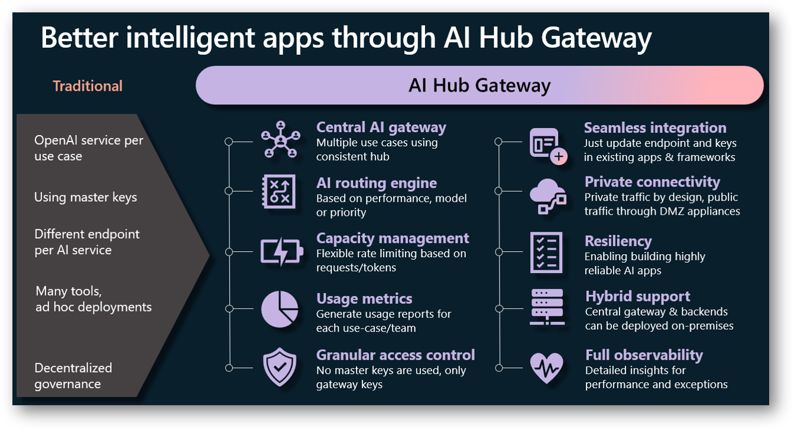
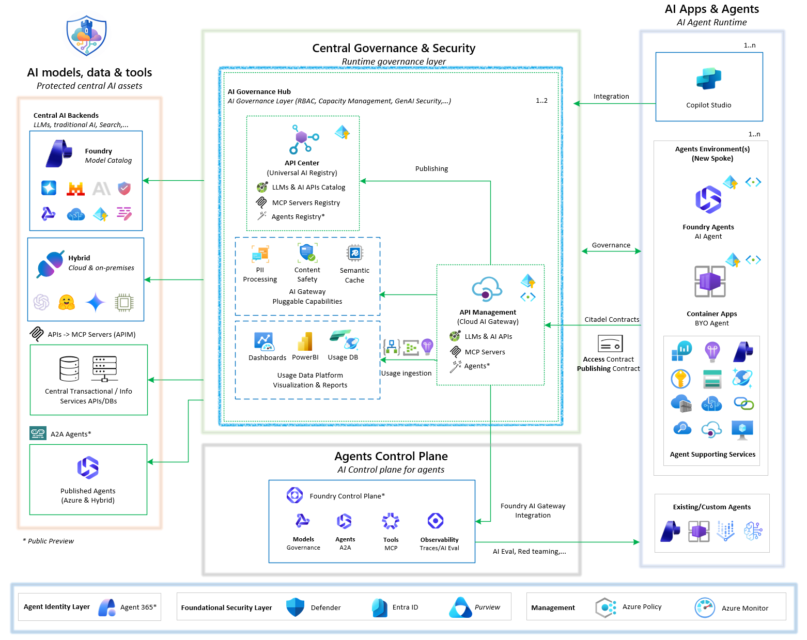
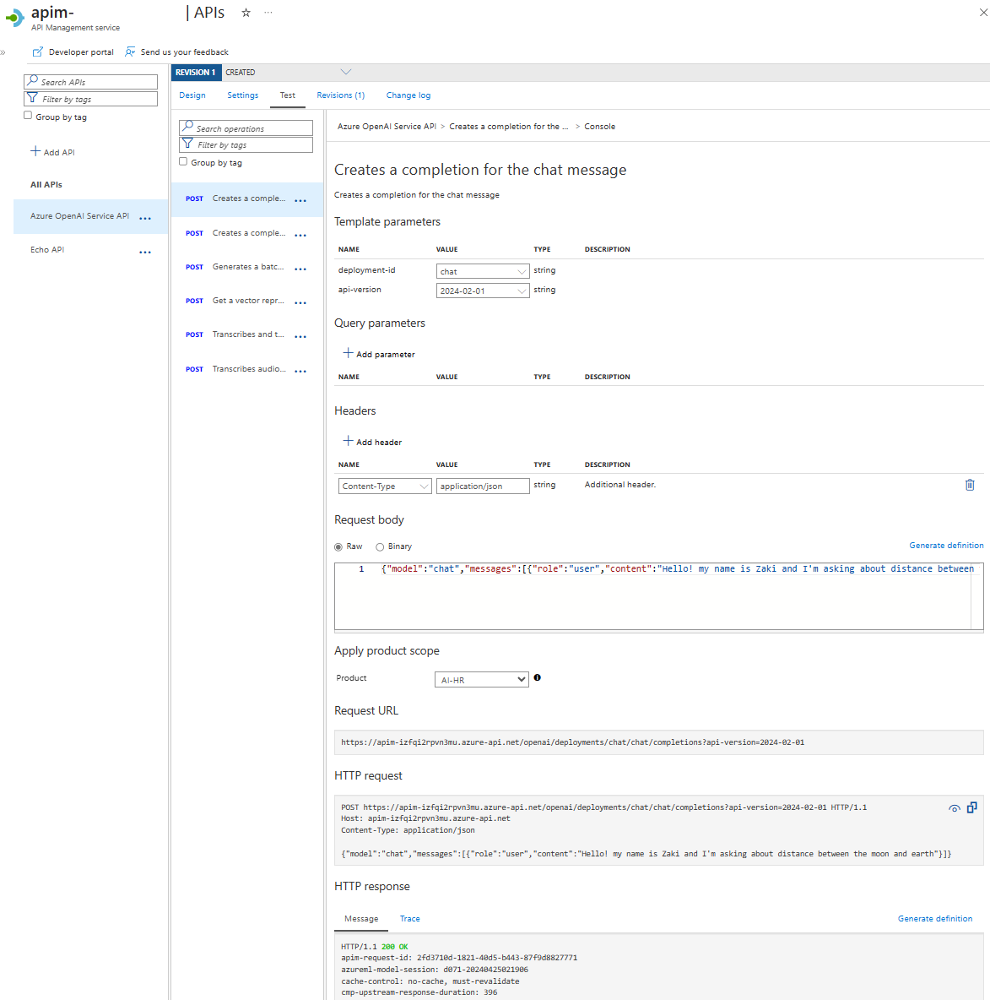
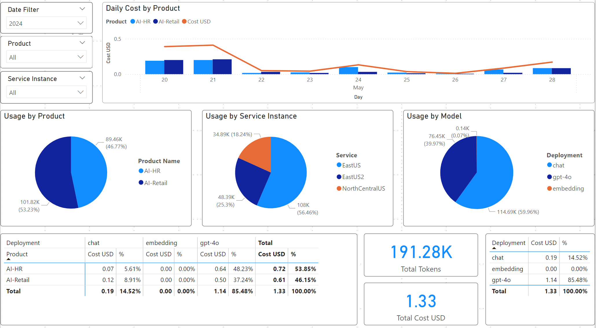
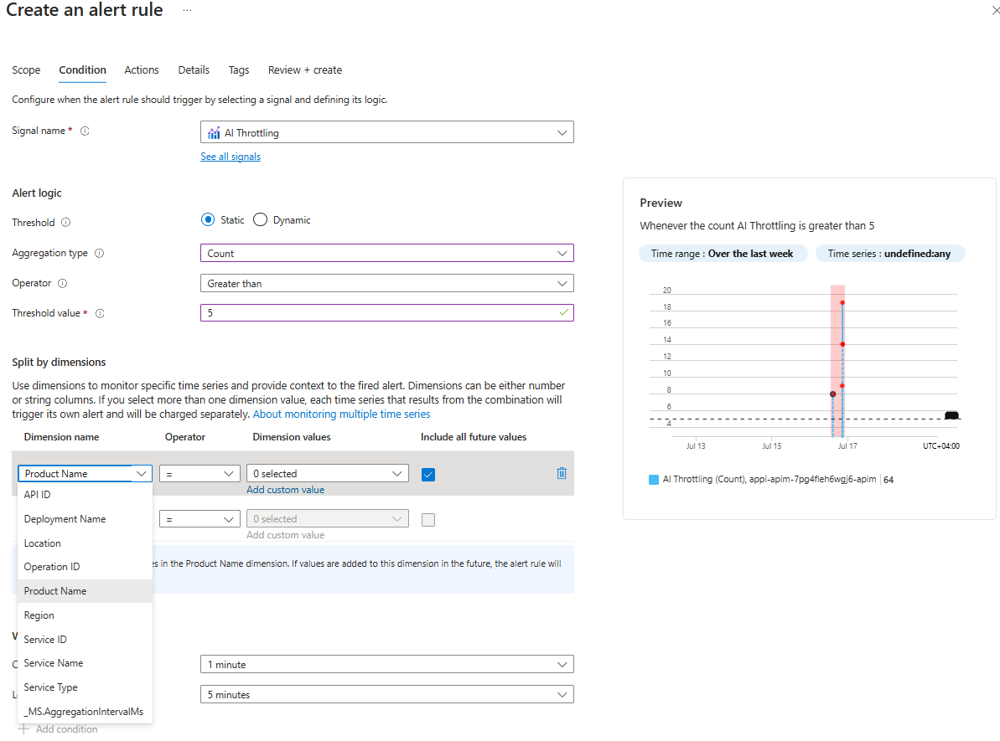
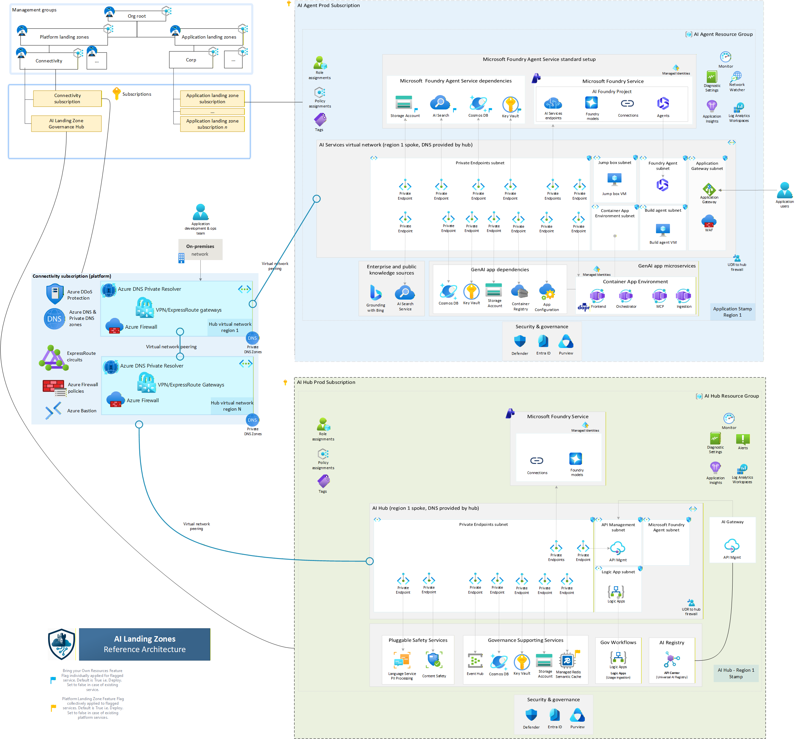

# Citadel Governance Hub

## Why govern

### A demo is not a production system

The [Agentic Loop](../getting-started/README.md) is brilliant at getting you to a working agent. You drive [`lean-spec2cloud`](https://github.com/Azure-Samples/Spec2Cloud/tree/main/plugins/lean-spec2cloud) from a single prompt, the [`agentic-loop`](../../skills/agentic-loop/SKILL.md) skill applies the GBB defaults, and minutes later a Foundry hosted agent is answering questions in your tenant.

Then the review board shows up. Before that agent can serve real users it has to answer four questions the loop alone doesn't — and every one of them is a **governance** question:

- **Who is it acting as?** A managed identity, not a key pasted into an env var.
- **What is it allowed to spend?** A quota and a cost line, not an open tap on shared capacity.
- **Which model, which region, which policy?** Enforced centrally, not trusted per team.
- **Who else is on this endpoint, and can I prove it?** Attribution and audit, not a shared master key.

Governance is not paperwork you attach later. It is the set of runtime controls that decide whether an agent is *allowed* to run the way it runs. **Citadel** makes those controls real: it is the production landing zone every loop-built agent plugs into — a governed **AI Gateway** in front of Microsoft Foundry that turns "it works on my subscription" into "it's governed, attributed, and safe to share."

> Tip: Build with the loop, govern with Citadel. The loop is how the agent gets *made*; Citadel is how it gets *shipped* without handing every team a raw key to shared model capacity.

### The governance imperative — and what it looks like without a hub

Governance is no longer a nice-to-have. Whether you're aligning to the **EU AI Act**, meeting internal risk and safety standards, or just keeping a lid on spend, you have to govern AI responsibly *at speed*. The failure mode is well known: an OpenAI resource per use case, master keys copied into a dozen apps, a different endpoint per service, and no single place to see cost, enforce a policy, or retire a model. That is ungoverned AI, and it does not pass a review board.

Citadel's answer is one governed door. The contrast is the whole pitch:



Route every call through one **APIM AI Gateway** and you buy the entire left-hand column of governance at once — central routing, capacity management, usage metrics, granular keyless access, private connectivity, resiliency, and full observability — without any team rewriting their app.

### Platform governance is not agent governance

The single most useful idea to hold in your head: **there are two governance jobs, and they belong to two different owners.**

| | Platform governance | Agent governance |
|---|---|---|
| **Owner** | Platform / landing-zone team | The team that built the agent |
| **Secures** | The hub, the shared AI gateway, network, policy, quotas | The agent's behaviour — evals, red‑team, responsible AI, HITL |
| **Answers** | "Is the *place* it runs safe and attributable?" | "Is the *agent* itself correct and non‑harmful?" |
| **Delivered by** | **Citadel** (this playbook) | The agent's own build (e.g. the [Threadlight](../threadlight-pipeline/README.md) `production-ready` scorecard) |

Citadel owns the **left column**. It secures the landing zone so that *any* agent that runs behind it inherits identity, quotas, routing, and audit for free. You need both, and they compose: a perfectly evaluated agent calling models with a long‑lived key on an un‑attributed endpoint is not production‑ready, and neither is a beautifully governed gateway fronting an agent nobody tested.

### What Citadel actually is

Citadel Governance Hub is an **enterprise AI landing zone**: a central runtime control plane that every AI workload routes through. The gateway (APIM) is the enforcement point; around it sit an AI registry, pluggable safety services, a usage data platform, and the Foundry control plane.



Read it left to right: **protected central AI assets** (models, data, tools) on the left; the **Central Governance & Security** layer in the middle (the AI Gateway with its pluggable capabilities, the API Center registry, and the usage data platform); the **Agents Control Plane** and **AI apps & agents** on the right. Copilot Studio, Foundry agents, and BYO container agents all reach models through the same governed door, under **Access Contracts**.

That door buys you the whole left column at once:

- **One endpoint, many models** — swap or retire a model centrally; spokes never change code.
- **Keyless identity** — spokes authenticate with a project managed identity; no long‑lived secrets.
- **Quotas & cost attribution** — one Product per team means one throttle and one billing line per team.
- **Policy at the edge** — PII redaction, content safety, JWT enforcement, and a **deprecated‑model block** applied to every call before it reaches a model.
- **Telemetry for free** — every call lands in Application Insights and a usage database, so cost and health are observable from day one.

> Note: This is exactly what the [Threadlight case study](https://aiappsgbb.github.io/threadlight-skills/case-study.html) exercises. Every model call in that live run was routed through a Citadel gateway; a banned `gpt-4`‑class model was refused with **403 at the door**, and the approved model returned **200**. The policy, not the agent, enforced the model allow‑list.

### The four-layer Citadel blueprint

This accelerator is the reference implementation of **Layer 1** of the wider [AI Citadel Blueprint](https://aka.ms/foundry-citadel). You don't need all four layers to start — but the shape tells you where today's work sits and what comes next.

| Layer | Concern | Where it lives |
|---|---|---|
| **L1 · Governance Hub** | Runtime enforcement — gateway, policy‑as‑code, identity, token limits, content filtering, cost attribution | ✅ **This playbook** (`citadel-hub-deploy` + `citadel-spoke-onboarding`) |
| **L1.5 · In‑process governance** | Deterministic safety inside the agent runtime | Pair with [`foundry-agt`](https://github.com/aiappsgbb/awesome-gbb/tree/main/skills/foundry-agt) |
| **L2 · Agent Operations** | Agent runtime, traces, evals, fleet ops | [Microsoft Foundry control plane](https://learn.microsoft.com/azure/ai-foundry/control-plane/overview) |
| **L3 · Agent Identity** | Unique governable agent identities, shadow‑agent detection | [Agent 365](https://learn.microsoft.com/microsoft-agent-365/) |
| **L4 · Security Fabric** | Unified protection — Defender, Purview, Entra | Microsoft Defender · Purview · Entra |

> Important: **Done means** — the hub is deployed and returns the model list through APIM; a chat completion round‑trips through the gateway; one spoke calls a model **keyless** via a Foundry connection; and gateway traffic, quotas, and cost are visible in Application Insights and the usage dashboard.

### When to reach for a hub

A shared, always‑on gateway is a real cost and a real commitment. Reach for it deliberately.

> Warning: The hub is an always‑on cost (~$200–$2,500/mo depending on profile, **excluding** model inference). Do **not** deploy one when a single team just needs model access — point them at a Foundry project directly. Reach for Citadel when **many** teams must share capacity under one governed, attributable endpoint.

Skip or defer the hub if you have one consuming team, no cost‑attribution or multi‑tenant policy requirement, or you're still in throwaway‑PoC mode. Threadlight pilots run **standalone** and adopt a spoke later — graduation, not prerequisite.

---

## Build the hub

### Drive it with a skill, not a runbook

Standing up Citadel is the *same motion* as any loop build: you point GitHub Copilot at a skill and review what it does — you don't hand‑run a pile of shell scripts. This chapter is driven by [`citadel-hub-deploy`](https://github.com/aiappsgbb/awesome-gbb/tree/main/skills/citadel-hub-deploy), a GBB skill that wraps the `Azure-Samples/ai-hub-gateway-solution-accelerator` (`citadel-v1` branch) and knows the profiles, the parameter map, and the validation notebooks.

The commands below are what the skill *runs for you* and what you use to verify — not a manual checklist. In Copilot, the whole chapter is one prompt:

```text
Use the citadel-hub-deploy skill to stand up a Citadel Governance Hub in
subscription <SUB> / region swedencentral with the pilot-quickstart profile.
Confirm the tenant first, deploy, then run the baseline validation notebooks.
```

> Important: The hub is too expensive to land in the wrong place. The skill uses the `azure-tenant-isolation` pattern (per‑tenant `AZURE_CONFIG_DIR` + `AZD_CONFIG_DIR`, asserted subscription) before it provisions anything. Required roles: `Owner` **or** `Contributor` + `User Access Administrator` on the target subscription, plus rights to register the APIM, Cognitive Services, and Insights resource providers.

### Pick a deployment profile

The skill ships three paved `azd` profiles. Pick one first — they differ in parameters, not in the app you deploy.

| Profile | Use it for | Networking | Rough cost/mo |
|---|---|---|---|
| **pilot‑quickstart** | First hub, demos, a shared pilot | Public endpoints | ~$200–$400 |
| **enterprise‑baseline** | A durable shared hub for several teams | Public + hardening knobs | ~$600–$1,200 |
| **vnet‑isolated‑spoke‑aware** | Regulated / private‑network customers | BYO VNet, private endpoints, spoke peering | ~$1,500–$2,500 |

> Tip: Start with **pilot‑quickstart** even if you know you'll need VNet isolation. Prove the gateway works publicly first, then redeploy the isolated profile once the topology is understood.

### What the skill provisions

`azd up` provisions the whole control plane — APIM (the gateway), Microsoft Foundry with a model pool, the policy fragments, Cosmos DB and Event Hub for usage, Logic Apps for ingestion, API Center as the registry, and Log Analytics + Application Insights. Expect **30–45 minutes**; APIM creation dominates.

```bash
# What citadel-hub-deploy runs under the hood — review, don't memorise
azd init --template Azure-Samples/ai-hub-gateway-solution-accelerator -e citadel-hub --branch citadel-v1
azd env set AZURE_LOCATION swedencentral   # + profile params from the skill's env-var map
azd up
```

> Note: MCAPS pilot tagging (`SecurityControl: Ignore`) is already in the upstream `bicepparam`. Layer your own `AZURE_TAGS` for cost allocation per the `azd-patterns` skill.

### Settings & customization

The hub is **configuration‑first**: what it serves and how it behaves is declared in [`main.bicepparam`](https://github.com/Azure-Samples/ai-hub-gateway-solution-accelerator/blob/citadel-v1/bicep/infra/main.bicepparam), not clicked together in the portal. This is the surface you tune per customer — ask the skill to set any of these, or edit the param file before `azd up`:

| Knob | What it controls |
|---|---|
| **APIM SKU** | `Developer` (dev, no SLA) → `StandardV2` (~200 PTU/unit, recommended) → `PremiumV2` (multi‑region, ~1,000–1,500 PTU, zone‑redundant) — see the [Sizing](https://github.com/Azure-Samples/ai-hub-gateway-solution-accelerator/blob/citadel-v1/guides/citadel-sizing-guide.md) and [PTU](https://github.com/Azure-Samples/ai-hub-gateway-solution-accelerator/blob/citadel-v1/guides/put-estimation-guide.md) guides |
| **Networking** | Public endpoints, or BYO‑VNet with private endpoints; deploy into a peered spoke VNet or the enterprise hub VNet (see [Network Approach](https://github.com/Azure-Samples/ai-hub-gateway-solution-accelerator/blob/citadel-v1/guides/network-approach.md)) |
| **Safety services** | Azure AI **Content Safety** (prompt shields, harmful‑content detection) and **Language Service PII** detection/anonymization — served from the primary Foundry/AI Services account |
| **Semantic cache** | Optional **Azure Managed Redis** caching layer for high‑throughput workloads |
| **Entra auth** | `entraAuth=true` turns on JWT validation on top of the subscription key |
| **Usage stack** | Cosmos DB RU/s (400 default → 1,000+ prod), Event Hub capacity units, Logic Apps SKU |
| **AI Services** | Optionally deploy Foundry models with the hub so the gateway ships LLM‑ready |

> Tip: You rarely change policy *code* to customise a hub. You change **parameters** and **contracts** — the gateway behaviour follows. That is what makes the hub repeatable across customers.

### Verify the gateway

Prove the gateway routes before you onboard anyone. The skill runs the baseline **validation notebooks** (`validation/`) — LLM‑backend onboarding, universal‑LLM all‑models, access contracts, and agent frameworks — but a single test call through the APIM console (or `curl`) is enough to see governance working end to end:



A request scoped to a **Product** (here, `AI‑HR`), routed by the gateway to a backend model, returns `200 OK` — with the `apim-request-id` and model‑session headers that make the call attributable. Warm latency from the skill's live audit (Sweden Central, `gpt‑5.4‑mini`): **~1s** end‑to‑end through APIM; `/models` discovery **~250ms**.

---

## What you get

A hub is not a black box you deploy and forget. The moment it's live you have an **operational surface** — the concrete outputs that make "governed" verifiable, not aspirational.

### An AI registry and a governed endpoint

Every team now has **one endpoint** to point at, and **API Center** becomes the universal AI registry — a discoverable catalog of the LLMs, tools (via MCP), and agents the hub governs. New teams don't hunt for keys; they find capacity in the registry and request it with a contract.

### Cost attribution and usage analytics

Because every call carries a Product (team) and a model, the usage data platform turns raw traffic into a **Power BI cost‑and‑usage dashboard** — the single most persuasive artifact for a FinOps or platform review:



Daily cost by product, tokens by team, by region, and by model, with a per‑deployment cost breakdown — chargeback stops being a spreadsheet guess. (Update `model-pricing.json` with your negotiated rates and the dashboard recomputes cost automatically.)

### Reliability and throttling alerts

The gateway raises a custom **`AI Throttling`** metric on every `429`, split by product, deployment, region, and app. Wire an Azure Monitor alert against it and the platform team hears about capacity pressure *before* a team does:



Pair that with the gateway's automatic **failover** (route around a throttled backend to a healthy one) and throttling becomes a managed event, not an outage.

### Governance controls, in practice

This is the payoff. Each control is a concrete, observable behaviour — not a promise on a slide:

| Governance question | How Citadel answers it, in practice |
|---|---|
| Which models are allowed? | A deprecated/banned model is **refused at the gateway with 403**; approved models return 200. |
| Who is calling? | Keyless **managed identity** per spoke; optional **JWT** (Entra) on top. No master keys in apps. |
| What can each team spend? | One **Product + Subscription** per team → per‑team **token quotas and rate limits**, one billing line. |
| Is sensitive data leaking? | **PII detection/anonymization** and **Content Safety** (prompt shields, harmful‑content) run inline. |
| Can I prove all of it? | Every call lands in **App Insights + Cosmos**, surfaced in the usage dashboard and audit logs. |

---

## Onboard a spoke

### A loop-built agent becomes a governed spoke

This is where the two worlds meet. You built an agent with the [Agentic Loop](../getting-started/README.md) — or ran a [Threadlight](../threadlight-pipeline/README.md) pilot — and it currently calls models directly. **Onboarding turns it into a governed spoke:** the agent keeps its code and its identity, but its model calls now flow through the hub, keyless, under a quota and a policy.

Again, this is a **skill**, not a runbook — [`citadel-spoke-onboarding`](https://github.com/aiappsgbb/awesome-gbb/tree/main/skills/citadel-spoke-onboarding) does the per‑team wiring:

```text
Use the citadel-spoke-onboarding skill to grant an Access Contract for the
MyTeam / MyAgent / DEV use case against hub <HUB-APIM>, keyless via a Foundry
connection to project <FOUNDRY-PROJECT>. Then verify gpt-5 → 200, gpt-4.1 → 403.
```

### The Access Contract — the demand side

Governance has two sides, and both are **contracts** (version‑controlled `.bicepparam`, never portal clicks):

- **Backend contracts** govern the **supply** — which LLM backends and models the gateway may route to.
- **Access contracts** govern the **demand** — which use case may consume which models, under which policy.

An **Access Contract** creates an APIM **Product** + a scoped **Subscription**, optionally Key Vault secrets and a Foundry connection. One Product per spoke, one Subscription per Product — that's what makes cost attribution a single billing line per team. Naming follows `{serviceCode}-{businessUnit}-{useCase}-{environment}` — e.g. `LLM-Healthcare-PatientAssistant-DEV`.

The contract's parameter file is the whole customization surface for a spoke:

```bicep
using '../../../main.bicep'

param apim = { subscriptionId: '<HUB-SUB>'  resourceGroupName: '<HUB-APIM-RG>'  name: '<HUB-APIM>' }
param useCase = { businessUnit: 'MyTeam'  useCaseName: 'MyAgent'  environment: 'DEV' }

// Order matters: first API is the one your SDK expects
param apiNameMapping = { LLM: ['azure-openai-api', 'universal-llm-api', 'unified-ai-api'] }

// Keyless posture: skip Key Vault, create a Foundry connection instead
param useTargetAzureKeyVault = false
param useTargetFoundry = true
param foundry = {
  subscriptionId: '<FOUNDRY-SUB>'  resourceGroupName: '<FOUNDRY-RG>'
  accountName: '<FOUNDRY-ACCOUNT>'  projectName: '<FOUNDRY-PROJECT>'
}
```

The skill previews with `what-if` and deploys at subscription scope — you review the plan, it applies it.

### Consume the gateway — keyless (Option B)

> Important: A loop‑built or Threadlight agent should use the **Foundry Connection** path, not Key Vault. The APIM subscription key is held by a **Foundry connection**; the agent references that connection *by name* while authenticating to Foundry with its own **managed identity** — so no long‑lived secret ever lives in the agent runtime. That is what "keyless" means here.

Set the model to `connectionName/modelName` — the connection name comes from the contract output (e.g. `Hub-MyTeam-MyAgent-DEV-LLM`):

```yaml
# agent.yaml (hosted agent)
environment_variables:
  - name: MODEL_DEPLOYMENT_NAME
    value: Hub-MyTeam-MyAgent-DEV-LLM/gpt-5.4
```

```python
# The FoundryChatClient resolves the connection automatically
client = FoundryChatClient(
    project_endpoint=os.environ["FOUNDRY_PROJECT_ENDPOINT"],
    model=os.environ["MODEL_DEPLOYMENT_NAME"],   # "connectionName/gpt-5.4"
    credential=DefaultAzureCredential(),
)
```

> Warning: `connectionName/model` routing works only through `FoundryChatClient` (hosted agents) or `PromptAgentDefinition` (prompt agents). A raw `oai.chat.completions.create(model="connName/gpt-5.4")` returns `404 DeploymentNotFound`. Bind the connection at the agent level, not the raw client. Add JWT (`Authorization: Bearer …`, acquired with the spoke's own managed identity against `api://<GATEWAY-APP-ID>/.default`) when the hub is deployed with `entraAuth=true` — keyless and JWT are complementary, not alternatives.

### Curate the supply — backend contracts

The other half of governance is what the gateway is *allowed to route to*. A **backend contract** ([`llm-backend-onboarding`](https://github.com/Azure-Samples/ai-hub-gateway-solution-accelerator/tree/citadel-v1/bicep/infra/llm-backend-onboarding)) declares the governed capacity — and it is genuinely multi‑cloud:

- **Multi‑provider backends** — Microsoft Foundry, Azure OpenAI, **Amazon Bedrock**, and external/OpenAI‑compatible providers under one endpoint.
- **Load balancing & failover** — several backends can serve the same model; the gateway spreads load and routes around failures.
- **Model aliases** — a client‑facing name (e.g. `chat`) maps to one or more underlying models with priority/weighted routing, so you retire a model centrally without touching a single spoke.
- **Dynamic discovery** — `GET /deployments` lets clients and Foundry enumerate what's available.

Platform teams curate backends once; business units onboard against that curated capacity without ever touching gateway internals. That separation of concerns *is* the governance model.

---

## Scale & compose

### Go private

Every new team repeats **Onboard a spoke** with its own contract — the hub does not change. When a customer needs private networking, redeploy the hub with the **vnet‑isolated‑spoke‑aware** profile and peer each spoke VNet to the hub. This is the enterprise‑grade topology the accelerator is built for:



The AI Hub subscription holds the gateway, registry, and usage stack behind private endpoints; each business unit gets its own **agent spoke** subscription, peered through the platform's connectivity hub and firewall. Pair with [`foundry-vnet-deploy`](https://github.com/aiappsgbb/awesome-gbb/tree/main/skills/foundry-vnet-deploy) for spoke‑side VNet bring‑up; `apim-dns-zone-link.bicep` links `privatelink.azure-api.net` into the spoke.

> Tip: Half‑resolved private DNS is the classic failure — it looks like an auth error at deploy time. Before deploying a private profile, confirm private DNS resolves to private IPs, `443` reaches every private endpoint, and control‑plane egress is allowed.

### Resiliency

A shared gateway is a shared dependency, so it's built to stay up. The [resiliency guide](https://github.com/Azure-Samples/ai-hub-gateway-solution-accelerator/blob/citadel-v1/guides/resiliency-guide.md) covers the knobs: **circuit breakers** trip a failing backend out of rotation, **session affinity** keeps a conversation on one backend, **automated failover** re‑routes on `429`/`5xx`, and the optional **semantic cache** (Managed Redis) absorbs repeat traffic. None of it requires an app change — it's gateway policy.

### Defense in depth

> Tip: Gateway governance (L1) and in‑process governance (L1.5) catch different attacks. Layer [`foundry-agt`](https://github.com/aiappsgbb/awesome-gbb/tree/main/skills/foundry-agt) inside each agent runtime — the skill's red‑team data shows deterministic in‑process checks driving attack success from **26.67%** (prompt‑only) to **0.00%**. Use both, not either. This is the platform half of the same defense‑in‑depth story the agent completes with its own evals and red‑team.

### How Citadel composes with the loop and Threadlight

Three motions, one governed destination:

- **The [Agentic Loop](../getting-started/README.md)** builds the agent from a prompt. Onboard it as a spoke and its model calls become governed and keyless.
- **[Threadlight](../threadlight-pipeline/README.md)** is the advanced, opinionated pipeline. Its `production-ready` scorecard proves the *agent* (the right column); Citadel proves the *platform* (the left). Its case study routes every model call through a Citadel gateway — the two ship together.
- **`foundry-*` building blocks** are the primitives — hosted agents, IQ, evals, observability, in‑process AGT — that both the loop and Threadlight compose, and that a spoke inherits.

That's the point of a landing zone: whatever built the agent, it grows up in the same governed place.

### Clean up

Tear down a hub environment when the pilot ends — this deletes APIM, the Foundry pool, and telemetry, and is irreversible.

```bash
azd down --purge   # also purges soft-deleted APIM + Cognitive Services so names are reusable
```

### Go deeper

- [`citadel-hub-deploy`](https://github.com/aiappsgbb/awesome-gbb/tree/main/skills/citadel-hub-deploy) — profiles, parameter map, validation notebooks.
- [`citadel-spoke-onboarding`](https://github.com/aiappsgbb/awesome-gbb/tree/main/skills/citadel-spoke-onboarding) — access‑contract parameters, policy XML, connection fetch.
- [Governance Hub Benefits](https://github.com/Azure-Samples/ai-hub-gateway-solution-accelerator/blob/citadel-v1/guides/governance-hub-benefits.md) · [Access Contracts](https://github.com/Azure-Samples/ai-hub-gateway-solution-accelerator/tree/citadel-v1/bicep/infra/citadel-access-contracts) · [Backend Onboarding](https://github.com/Azure-Samples/ai-hub-gateway-solution-accelerator/blob/citadel-v1/guides/LLM-Backend-Onboarding-Guide.md) · [Power BI Dashboard](https://github.com/Azure-Samples/ai-hub-gateway-solution-accelerator/blob/citadel-v1/guides/power-bi-dashboard.md) · [Resiliency](https://github.com/Azure-Samples/ai-hub-gateway-solution-accelerator/blob/citadel-v1/guides/resiliency-guide.md)
- [Threadlight case study](https://aiappsgbb.github.io/threadlight-skills/case-study.html) — a live run where every model call flowed through a Citadel gateway.
- [Citadel Platform overview](https://aka.ms/foundry-citadel) — the full four‑layer model.
