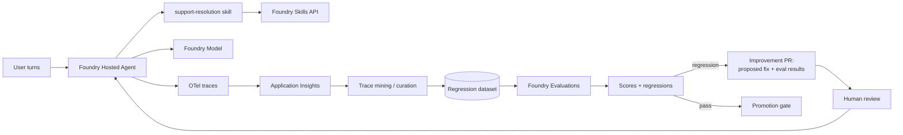

# Continuous Evaluation Loop: Retail Support Agent

## Intro

### Improve a fictional retail support agent from production evidence.

This playbook builds **ResolveRight**, a fictional customer-support agent for Contoso Outfitters. It answers questions about mock orders, returns, warranties, and damaged shipments, then turns representative production traces into regression cases and evidence-backed improvement pull requests.

**Use when:** You need to catch regressions in production and close the improvement loop automatically.

**Core tech stack:** Copilot SDK, Foundry Hosted Agents, Foundry Skills API, Foundry Evaluations, Application Insights

The agent consumes a `support-resolution` skill containing issue classification, evidence requirements, response structure, escalation rules, and tool boundaries. Every evaluation result is tied to an immutable Foundry skill version so the team can promote, compare, or roll back the behavior that produced each score.

The playbook is organized in three chapters:

- **Build** — go from a prompt to an agent with offline scoring and eval gates.
- **Run** — capture production traces, build regression sets, and score continuously.
- **Scale** — automate improvement PRs and expand coverage through the loop.

---

### What we will build

A retail support chat backed by synthetic orders, return policies, warranty rules, and resolved tickets. The Copilot SDK agent downloads the promoted `support-resolution` skill at runtime and emits OpenTelemetry traces containing its version. Traces are curated into a regression dataset, scored with Foundry Evaluations, and regressions open a human-reviewed PR with the proposed skill or agent change and before/after results.



| Layer | Choice (from `agentic-loop` defaults) | Why |
|---|---|---|
| Frontend | React + Vite on Azure Container Apps | Surface to generate real turns and traces. |
| Backend API | Python + FastAPI on Azure Container Apps | Hosts the agent session and trace export. |
| Agent | Copilot SDK hosted in Microsoft Foundry | Governed runtime with per-turn tracing. |
| Runtime skill | Foundry Skills API | Versions and distributes `support-resolution`; provides evaluation lineage. |
| Model | Foundry Models | Keeps model usage and capacity on the Foundry platform. |
| Evaluation | Foundry Evaluations (offline + scheduled) | Scores groundedness, quality, safety, and regressions. |
| Trace store | OpenTelemetry → Application Insights | Source of truth for production behavior and regression mining. |
| Improvement loop | Copilot-authored PRs | Proposes fixes with evidence, gated by human review. |
| Infra | `azd` + Bicep (Azure Verified Modules) | Reproducible provisioning with keyless identity. |

**Done means:**

- Offline evals score the agent on a curated dataset before deploy.
- Production turns emit traces that land in Application Insights.
- Traces are curated into a regression dataset.
- Scheduled scoring catches regressions against a baseline.
- Every score and trace identifies the effective `support-resolution` version.
- A regression opens an improvement PR with proposed changes and eval results.

**Out of scope for the first build:**

- Fully autonomous merge — improvement PRs stay human-reviewed at first.
- Every possible metric — start with a focused scorecard and expand.
- Private networking — a production hardening step.

---

### Setup

You will need:

- Azure subscription with Contributor permissions, plus a GitHub Copilot plan.
- GitHub Copilot installed and logged in — use the [Copilot App](http://gh.io/app) (recommended), the [Copilot CLI](https://github.com/features/copilot/cli/), or [Visual Studio Code](https://code.visualstudio.com/download).
- [GitHub CLI (`gh`)](https://cli.github.com/) installed and logged in.
- [Azure CLI (`az`)](https://learn.microsoft.com/en-us/cli/azure/install-azure-cli) and [Azure Developer CLI (`azd`)](https://learn.microsoft.com/en-us/azure/developer/azure-developer-cli/install-azd) installed and authenticated.
- The `lean-spec2cloud` Copilot plugin installed and updated. Click [here](https://github.com/copilot/app/launch?open=ghapp%3A%2F%2Fplugins%2Fmarketplace%2Fadd%3Fsource%3DAzure-Samples%2FSpec2Cloud) to add the marketplace and [here](https://github.com/copilot/app/launch?open=ghapp%3A%2F%2Fplugins%2Finstall%3Fsource%3Dlean%2540Spec2Cloud) to install the plugin. Or install in the CLI with:

  ```bash
  copilot plugin marketplace add Azure-Samples/Spec2Cloud && copilot plugin install lean@Spec2Cloud
  ```

Sanity check before you go further:

```bash
az account show                 # confirm the correct tenant and subscription
azd auth login --check-status   # confirm you are signed in to azd
copilot plugin list             # expect to see lean@Spec2Cloud
```

> **Heads up on cost.** This playbook provisions billable Azure resources (Container Apps, a Foundry/AI Services account, and Application Insights). Leaving them running incurs charges — see [Clean up](#clean-up) to remove everything when you are done.

## Build

### Create a new project

Take an empty workspace through the **Specify → Plan → Implement → Verify → Deploy** loop and produce an agent with offline scoring and eval gates.

```bash
mkdir continuous-evaluation-loop
cd continuous-evaluation-loop
```

> Want version control from minute one? Create a private GitHub repo instead:
> ```bash
> gh repo create continuous-evaluation-loop --private --clone
> ```
> A repo is recommended for this playbook so the improvement loop can open PRs.

---

### Open GitHub Copilot

This playbook uses the **GitHub Copilot App**, but the same prompt works in Copilot CLI and VS Code.

> **Using the CLI instead?** Run `copilot --allow-all` only in a sandbox workspace, or omit the flag to approve each action.

**1. Open the Spec2Cloud canvas.** In the review panel, click **+**, then choose **Spec2Cloud Cockpit**. If it is not installed, import:

```text
https://github.com/Azure-Samples/Spec2Cloud/tree/main/.github/extensions/spec2cloud
```

**2. Add your project.** Choose **+ -> Add project from -> Local folder or repository**, then select `continuous-evaluation-loop`.

**3. Choose a model and mode.**

| Mode | Behavior |
|---|---|
| Interactive | Step-by-step collaboration; you confirm each stage |
| Plan | Plans first, executes once you approve |
| Autopilot *(recommended)* | Runs the full loop end to end |

---

### Run the build loop

Paste this starter prompt:

```text
/spec2cloud Build ResolveRight, a customer-support resolution agent for the fictional retailer Contoso Outfitters. Customers ask about synthetic orders, returns, warranties, and damaged shipments. The agent must classify the issue, gather the evidence required by mock policy, give the allowed next step, and escalate exceptions rather than inventing resolutions.

Before planning or implementation, install and run the agentic-loop skill (`aiappsgbb/agentic-loop`, skill `agentic-loop`) to enhance the spec with its app, agent runtime, Azure infrastructure, identity, and telemetry defaults.

Create a realistic mock corpus under data/contoso-support with order records, return and warranty policies, product facts, resolved-ticket examples, edge cases, and a labeled offline evaluation set. Author skills/support-resolution/SKILL.md with issue taxonomy, evidence checklist, response format, escalation rules, and tool boundaries.

Create an immutable support-resolution version through the Foundry Skills API, evaluate that exact version, promote it to default_version only when gates pass, attach it to the versioned agent toolbox, and download it into a writable runtime directory before each Copilot SDK session. Configure skill_directories to the downloaded folder. Record skill name/version in traces, evaluation datasets, baselines, and improvement PRs so regressions can be attributed and rolled back.

Emit OpenTelemetry traces to Application Insights. Include offline Foundry Evaluations that gate deploys, mine approved traces into a regression dataset, score it on a schedule against a committed baseline, and open a human-reviewed improvement PR when a regression is detected. The PR must contain affected cases, current and candidate skill versions, proposed changes, and fresh before/after results.
```

> Foundry Skills are a preview capability. Opt in explicitly (for example, `allow_preview=True`) and fail visibly if publication, promotion, or runtime download does not succeed.

> `/spec2cloud` runs the same five-stage loop as Getting Started. The prompt explicitly invokes `agentic-loop`; the remaining requirements define this playbook's datasets, scorecards, trace mining, regression gates, and improvement PRs.

> Prefer to run one stage at a time? Use the same prompt with `/specify` first, then advance through each stage:
>
> | Command | Produces | Review in |
> |---|---|---|
> | `/specify <prompt>` | Specification | `docs/spec.md` |
> | `/plan` | Implementation and Azure plan | `docs/plan.md`, `.azure/deployment-plan.md` |
> | `/implement` | Source, infrastructure, evals, and baselines | `src/`, `infra/`, `evals/` |
> | `/verify` | Eval results and regression smoke tests | `docs/verify.md` |
> | `/deploy` | Deployed solution and scheduled scoring | `docs/deploy.md` |

Use these recommended answers if Copilot asks clarifying questions:

| Question area | Recommended answer |
|---|---|
| Metrics | Start with groundedness, relevance/quality, and safety. |
| Offline gate | Evals must pass before deploy. |
| Regression source | Mine production traces from Application Insights. |
| Scoring cadence | Scheduled scoring against a committed baseline. |
| Improvement action | Open a human-reviewed PR with the proposed fix and eval results. |
| Runtime skill | `support-resolution`, with score and trace lineage by Foundry skill version. |
| Identity | Managed identity, keyless RBAC. |

When the skill finishes, review `docs/spec.md` for these must-have requirements: mock retail support corpus, offline eval gate, Foundry skill versioning/promotion/download, runtime skill consumption, skill-version trace lineage, regression curation, scheduled scoring, baseline comparison, and automated improvement PRs.

---

### Review the generated plan

Turn the spec into a reviewable implementation and deployment plan.

```text
/plan
```

The deployment plan should include:

| Section | What good looks like |
|---|---|
| Resource graph | Foundry project, hosted agent, model deployment, versioned toolbox, governed skill, Application Insights, managed identity, ACA apps, scheduled runner. |
| RBAC | Least-privilege roles for Foundry, Application Insights read, and telemetry. |
| Eval scorecard | Metrics, datasets, and pass thresholds for offline and scheduled runs. |
| Regression pipeline | Trace query, curation, dataset storage, and baseline comparison. |
| Improvement loop | PR creation trigger, contents, and human-review gate. |
| Skill lifecycle | Author, create, evaluate, promote, attach, download, consume, trace, and roll back `support-resolution`. |
| azd template | `minimal` / `azd init --minimal`. |

Review `docs/plan.md` and `.azure/deployment-plan.md` before continuing.

---

### Review the implementation

Generate the source and infrastructure from the plan.

```text
/implement
```

Expected generated artifacts:

```text
.
├── azure.yaml
├── infra/
├── src/
│   ├── frontend/                 # chat UI
│   ├── backend/                  # agent session + trace export
│   └── agents/
│       └── evaluated-agent/      # hosted-agent definition
├── skills/
│   └── support-resolution/
│       └── SKILL.md
├── data/
│   └── contoso-support/          # mock orders, policies, tickets, labels
├── evals/
│   ├── offline/                  # curated pre-deploy dataset + scorecard
│   ├── regression/               # mined production dataset + baseline
│   └── scorers/                  # metric definitions
└── docs/
```

The implementation should wire:

1. **Governed skill** — create and promote `support-resolution`, then download it into the Copilot SDK runtime skill directory.
2. **Tracing** — every turn emits OTel spans with the effective skill version.
3. **Offline evals** — score the exact agent and skill versions and gate deploy.
4. **Trace mining** — curate approved support traces into a regression dataset.
5. **Improvement PRs** — a regression opens a PR with the fix, skill lineage, and before/after results.

Commit a checkpoint once the diff looks right:

```bash
git add .
git commit -m "feat: scaffold continuous evaluation loop"
```

---

### Verify locally

Validate locally against real Azure dependencies.

```text
/verify
```

| Test | Action | Expected result |
|---|---|---|
| Trace emission | Send a few turns. | Spans land in Application Insights. |
| Offline gate | Run offline evals. | Scores compute and the gate passes/fails correctly. |
| Skill adherence | Run order, return, warranty, and escalation cases. | Responses follow the governed resolution flow. |
| Version lineage | Compare two skill versions. | Traces and eval results identify the exact version used. |
| Trace mining | Curate recent traces. | A regression dataset is produced. |
| Baseline compare | Score against the baseline. | Regressions are detected relative to baseline. |
| Improvement PR | Introduce a deliberate regression. | The loop opens a PR with the fix and eval results. |

---

### Deploy

Deploy after local verification passes.

```text
/deploy
```

Deployment readiness checklist:

- [ ] Hosted agent has a valid `agent.yaml` and, where used, `code_configuration`.
- [ ] Application Insights read access uses managed identity, not keys.
- [ ] Offline eval gate is enforced before deploy.
- [ ] `support-resolution` has an immutable version, promoted `default_version`, and rollback target.
- [ ] Runtime downloads the governed skill to writable storage and configures `skill_directories`.
- [ ] Regression baseline is committed to the repo.
- [ ] Scheduled scoring job is provisioned.
- [ ] Improvement PRs require human review before merge.
- [ ] Application Insights receives per-turn telemetry.

When the loop finishes, Copilot returns the deployed frontend URL and the Spec2Cloud canvas auto-previews it. Click the **Foundry** icon to review the agent, model, and evaluation wiring.

---

### Troubleshooting

| Symptom | Likely cause | Fix |
|---|---|---|
| Eval scores cannot be reproduced | Dataset or scorer versions drifted | Commit datasets, scorer configuration, and baseline versions together. |
| Regression set is noisy | Raw traces are used without curation | Redact, deduplicate, label, and approve traces before adding them. |
| Improvement PRs lack evidence | Eval output is not attached | Include changed cases, before/after scores, and the proposed fix in every PR. |
| Production traces are absent | Telemetry is incomplete | Verify the backend and hosted agent export to the same Application Insights resource. |

## Run

### Run the evaluation loop

Open ResolveRight and exercise mock order, return, warranty, damaged-shipment, and escalation cases. Confirm that traces record the promoted `support-resolution` version, become curated regression cases, compare against the committed baseline, and produce an evidence-backed improvement PR after a deliberate skill regression.

---

### Observe

Use telemetry to keep the regression set representative and the scorecard trustworthy.

Track:

- Eval scores over time by metric, with the baseline overlaid.
- Regression detections and the turns that triggered them.
- Coverage: share of production turn types represented in the regression set.
- Improvement-PR count, merge rate, and time-to-merge.

Useful Application Insights questions:

| Question | Signal |
|---|---|
| Are scores drifting? | Metric trend vs. committed baseline. |
| Is the regression set representative? | Distribution of mined turns vs. live traffic. |
| Are regressions caught early? | Time from regression to detection to PR. |
| Are fixes landing? | Improvement-PR merge rate and score recovery. |

### Evaluate

Maintain both an offline scorecard and a scheduled regression scorecard.

| Eval | Dataset shape | Pass condition |
|---|---|---|
| Groundedness | Question, answer, sources | Claims are supported. |
| Relevance/quality | Question, reference answer | Answer matches reference intent. |
| Safety | Adversarial prompts | Unsafe content is blocked. |
| Regression | Mined turns + baseline scores | No score drops below the baseline threshold. |
| Skill adherence | Support case, expected classification and evidence | Agent follows the promoted resolution procedure. |
| Latency | Representative turns | p95 latency stays within target. |

Set gates before promoting: offline evals pass, no regression below baseline, and the scorecard covers the top production turn types.

### Iterate

Safe iteration loop:

1. Review the latest scheduled scores and any improvement PRs.
2. Merge or refine fixes, or add missing cases to the regression set.
3. Re-baseline intentionally when the agent legitimately changes behavior.
4. Commit a checkpoint before changing scorers or baselines.

```bash
git add .
git commit -m "chore: refresh regression baseline and scorers"
```

## Scale

### Automate more of the loop

Start with human-reviewed improvement PRs. As trust grows, auto-merge low-risk fixes that pass all evals, and expand the scorecard with domain-specific metrics.

---

### Expand coverage

Mine more turn types into the regression set, add per-segment scorecards (by user cohort, topic, or locale), and track score trends per segment.

---

### Promote across environments

Use separate azd environments per stage:

```bash
azd env new continuous-evaluation-loop-test-eus2
azd env new continuous-evaluation-loop-prod-eus2
```

Promotion checklist: explicit RBAC per environment, offline and regression evals run before promotion, baselines committed per environment, and score dashboards in place before production rollout.

---

### Take it further

- **Customize the scorecard** — add metrics or judges tailored to your domain, then push the change through the loop.
- **Explore the other playbooks** — combine continuous evaluation with grounding, orchestration, or governance.

> Tip: run the loop fully unattended for larger changes:
> ```bash
> copilot -p "/spec2cloud <your next big idea>" --no-ask-user --yolo -- autopilot
> ```

---

### Clean up

When you are done experimenting, delete every Azure resource the loop created. Run this from the project root, where `azure.yaml` lives:

```bash
azd down --purge --force
```

`--purge` also removes soft-deleted resources (such as the Foundry/AI Services account and Key Vault) so their names are immediately reusable.

---

### References

- [Evaluation of generative AI applications](https://learn.microsoft.com/azure/ai-foundry/concepts/evaluation-approach-gen-ai)
- [Evaluate your AI application locally with the Azure AI Evaluation SDK](https://learn.microsoft.com/azure/ai-foundry/how-to/develop/evaluate-sdk)
- [Continuously monitor and evaluate agents](https://learn.microsoft.com/azure/ai-foundry/how-to/continuous-evaluation-agents)
- [Trace and observe generative AI applications](https://learn.microsoft.com/azure/ai-foundry/concepts/observability)
- [About GitHub Copilot coding agent](https://docs.github.com/en/copilot/using-github-copilot/coding-agent/about-copilot-coding-agent)
