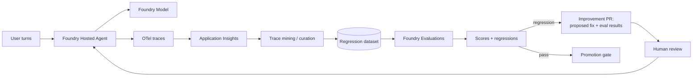

# Continuous Evaluation Loop

## Intro

### Move from offline scoring to production traces, regression sets, and automated improvement PRs.

Most teams start with a one-off eval spreadsheet and never close the loop. This playbook gives you a repeatable path for turning production traces into regression sets, scoring them automatically, catching regressions before users do, and letting the agent open **improvement pull requests** — all driven from a single prompt and the `agentic-loop` defaults.

**Use when:** You need to catch regressions in production and close the improvement loop automatically.

**Core tech stack:** Copilot SDK, Foundry Hosted Agents, Foundry Models, Foundry Evaluations, Application Insights

This playbook walks you through building a continuous-evaluation loop end-to-end with the Agentic Loop. You drive the build loop from a single prompt, and the [`agentic-loop`](../../skills/agentic-loop/SKILL.md) skill applies the proven recipe — Foundry hosted agents, Copilot SDK, keyless identity, observability, and `azd` — on top.

The playbook is organized in three chapters:

- **Build** — go from a prompt to an agent with offline scoring and eval gates.
- **Run** — capture production traces, build regression sets, and score continuously.
- **Scale** — automate improvement PRs and expand coverage through the loop.

---

### What we will build

A chat-style app whose agent is continuously evaluated. The agent runs as a **Foundry Hosted Agent** backed by **Foundry Models**, uses the **GitHub Copilot SDK** as the harness, and emits **OpenTelemetry traces** to Application Insights. Traces are mined into a **regression dataset**, scored with **Foundry Evaluations** on a schedule, and when a regression or low score is detected, the loop opens an **improvement PR** with a proposed fix and fresh eval results.



| Layer | Choice (from `agentic-loop` defaults) | Why |
|---|---|---|
| Frontend | React + Vite on Azure Container Apps | Surface to generate real turns and traces. |
| Backend API | Python + FastAPI on Azure Container Apps | Hosts the agent session and trace export. |
| Agent | Copilot SDK hosted in Microsoft Foundry | Governed runtime with per-turn tracing. |
| Model | Foundry Models | Keeps model usage and capacity on the Foundry platform. |
| Evaluation | Foundry Evaluations (offline + scheduled) | Scores groundedness, quality, safety, and regressions. |
| Trace store | OpenTelemetry → Application Insights | Source of truth for production behavior and regression mining. |
| Improvement loop | Copilot-authored PRs | Proposes fixes with evidence, gated by human review. |
| Infra | `azd` + Bicep (Azure Verified Modules) | Reproducible provisioning with keyless identity. |

**Done means:**

- Offline evals score the agent on a curated dataset before deploy.
- Production turns emit traces that land in Application Insights.
- Traces are curated into a regression dataset.
- Scheduled scoring catches regressions against a baseline.
- A regression opens an improvement PR with proposed changes and eval results.

**Out of scope for the first build:**

- Fully autonomous merge — improvement PRs stay human-reviewed at first.
- Every possible metric — start with a focused scorecard and expand.
- Private networking — a production hardening step.

---

### Setup

You will need:

- Azure subscription with Contributor permissions, plus a GitHub Copilot plan.
- GitHub Copilot installed and logged in — use the [Copilot App](http://gh.io/app) (recommended), the [Copilot CLI](https://github.com/features/copilot/cli/), or [Visual Studio Code](https://code.visualstudio.com/download).
- [GitHub CLI (`gh`)](https://cli.github.com/) installed and logged in.
- [Azure CLI (`az`)](https://learn.microsoft.com/en-us/cli/azure/install-azure-cli) and [Azure Developer CLI (`azd`)](https://learn.microsoft.com/en-us/azure/developer/azure-developer-cli/install-azd) installed and authenticated.
- The `lean-spec2cloud` Copilot plugin installed and updated. Click [here](https://github.com/copilot/app/launch?open=ghapp%3A%2F%2Fplugins%2Fmarketplace%2Fadd%3Fsource%3DAzure-Samples%2FSpec2Cloud) to add the marketplace and [here](https://github.com/copilot/app/launch?open=ghapp%3A%2F%2Fplugins%2Finstall%3Fsource%3Dlean%2540Spec2Cloud) to install the plugin. Or install in the CLI with:

  ```bash
  copilot plugin marketplace add Azure-Samples/Spec2Cloud && copilot plugin install lean@Spec2Cloud
  ```

Sanity check before you go further:

```bash
az account show                 # confirm the correct tenant and subscription
azd auth login --check-status   # confirm you are signed in to azd
copilot plugin list             # expect to see lean@Spec2Cloud
```

> **Heads up on cost.** This playbook provisions billable Azure resources (Container Apps, a Foundry/AI Services account, and Application Insights). Leaving them running incurs charges — see [Clean up](#clean-up) to remove everything when you are done.

## Build

### Create a new project

Take an empty workspace through the **Specify → Plan → Implement → Verify → Deploy** loop and produce an agent with offline scoring and eval gates.

```bash
mkdir continuous-evaluation-loop
cd continuous-evaluation-loop
```

> Want version control from minute one? Create a private GitHub repo instead:
> ```bash
> gh repo create continuous-evaluation-loop --private --clone
> ```
> A repo is recommended for this playbook so the improvement loop can open PRs.

---

### Open GitHub Copilot

Use the **GitHub Copilot App** (recommended), Copilot CLI, or VS Code. In the app, add the project folder, open the **Spec2Cloud Cockpit** canvas, and choose **Autopilot** to run end to end or **Plan** to review the plan before execution.

> **Using the CLI instead?** Run `copilot --allow-all` only in a sandbox workspace, or omit the flag to approve each action.

---

### Run the build loop

Paste this starter prompt:

```text
/spec2cloud Build an agent app with a continuous evaluation loop. The agent answers user questions in a chat interface and emits OpenTelemetry traces to Application Insights. Include an offline evaluation set scored with Foundry Evaluations that gates deploys. In production, mine traces into a regression dataset, score it on a schedule against a baseline, and when a regression or low score is detected, open an improvement pull request that proposes a fix and includes the fresh eval results for human review. Use randomly generated data where a real backing service is not required.
```

> `/spec2cloud` runs the whole loop with the opinionated `agentic-loop` defaults baked in — Foundry hosted agents, Copilot SDK, Container Apps, keyless identity, and telemetry — so the prompt never has to name them.

> Prefer to run one stage at a time? Use the same prompt with `/specify` first, then advance through `/plan`, `/implement`, `/verify`, and `/deploy`, reviewing each artifact before moving on. The remaining Build slides explain what to review at each stage; do not rerun them after a successful `/spec2cloud` execution.

Use these recommended answers if Copilot asks clarifying questions:

| Question area | Recommended answer |
|---|---|
| Metrics | Start with groundedness, relevance/quality, and safety. |
| Offline gate | Evals must pass before deploy. |
| Regression source | Mine production traces from Application Insights. |
| Scoring cadence | Scheduled scoring against a committed baseline. |
| Improvement action | Open a human-reviewed PR with the proposed fix and eval results. |
| Identity | Managed identity, keyless RBAC. |

When the skill finishes, review `docs/spec.md` for these must-have requirements: offline eval gate, trace emission, regression dataset curation, scheduled scoring, baseline comparison, and automated improvement PRs.

---

### Review the plan

Turn the spec into a reviewable implementation and deployment plan.

```text
/plan
```

The deployment plan should include:

| Section | What good looks like |
|---|---|
| Resource graph | Foundry project, hosted agent, model deployment, Application Insights, managed identity, ACA apps, scheduled job/runner. |
| RBAC | Least-privilege roles for Foundry, Application Insights read, and telemetry. |
| Eval scorecard | Metrics, datasets, and pass thresholds for offline and scheduled runs. |
| Regression pipeline | Trace query, curation, dataset storage, and baseline comparison. |
| Improvement loop | PR creation trigger, contents, and human-review gate. |
| azd template | `minimal` / `azd init --minimal`. |

Review `docs/plan.md` and `.azure/deployment-plan.md` before continuing.

---

### Review the implementation

Generate the source and infrastructure from the plan.

```text
/implement
```

Expected generated artifacts:

```text
.
├── azure.yaml
├── infra/
├── src/
│   ├── frontend/                 # chat UI
│   ├── backend/                  # agent session + trace export
│   └── agents/
│       └── evaluated-agent/      # hosted-agent definition
├── evals/
│   ├── offline/                  # curated pre-deploy dataset + scorecard
│   ├── regression/               # mined production dataset + baseline
│   └── scorers/                  # metric definitions
└── docs/
```

The implementation should wire:

1. **Tracing** — every turn emits OTel spans to Application Insights.
2. **Offline evals** — a curated dataset is scored and gates deploy.
3. **Trace mining** — production traces are curated into a regression dataset.
4. **Scheduled scoring** — the regression set is scored against a committed baseline.
5. **Improvement PRs** — a detected regression opens a PR with the fix and eval results.

Commit a checkpoint once the diff looks right:

```bash
git add .
git commit -m "feat: scaffold continuous evaluation loop"
```

---

### Review verification

Validate locally against real Azure dependencies.

```text
/verify
```

| Test | Action | Expected result |
|---|---|---|
| Trace emission | Send a few turns. | Spans land in Application Insights. |
| Offline gate | Run offline evals. | Scores compute and the gate passes/fails correctly. |
| Trace mining | Curate recent traces. | A regression dataset is produced. |
| Baseline compare | Score against the baseline. | Regressions are detected relative to baseline. |
| Improvement PR | Introduce a deliberate regression. | The loop opens a PR with the fix and eval results. |

---

### Review deployment

Deploy after local verification passes.

```text
/deploy
```

Deployment readiness checklist:

- [ ] Hosted agent has a valid `agent.yaml` and, where used, `code_configuration`.
- [ ] Application Insights read access uses managed identity, not keys.
- [ ] Offline eval gate is enforced before deploy.
- [ ] Regression baseline is committed to the repo.
- [ ] Scheduled scoring job is provisioned.
- [ ] Improvement PRs require human review before merge.
- [ ] Application Insights receives per-turn telemetry.

When the loop finishes, Copilot returns the deployed frontend URL and the Spec2Cloud canvas auto-previews it. Click the **Foundry** icon to review the agent, model, and evaluation wiring.

---

### Troubleshooting

| Symptom | Likely cause | Fix |
|---|---|---|
| Eval scores cannot be reproduced | Dataset or scorer versions drifted | Commit datasets, scorer configuration, and baseline versions together. |
| Regression set is noisy | Raw traces are used without curation | Redact, deduplicate, label, and approve traces before adding them. |
| Improvement PRs lack evidence | Eval output is not attached | Include changed cases, before/after scores, and the proposed fix in every PR. |
| Production traces are absent | Telemetry is incomplete | Verify the backend and hosted agent export to the same Application Insights resource. |

## Run

### Observe

Use telemetry to keep the regression set representative and the scorecard trustworthy.

Track:

- Eval scores over time by metric, with the baseline overlaid.
- Regression detections and the turns that triggered them.
- Coverage: share of production turn types represented in the regression set.
- Improvement-PR count, merge rate, and time-to-merge.

Useful Application Insights questions:

| Question | Signal |
|---|---|
| Are scores drifting? | Metric trend vs. committed baseline. |
| Is the regression set representative? | Distribution of mined turns vs. live traffic. |
| Are regressions caught early? | Time from regression to detection to PR. |
| Are fixes landing? | Improvement-PR merge rate and score recovery. |

### Evaluate

Maintain both an offline scorecard and a scheduled regression scorecard.

| Eval | Dataset shape | Pass condition |
|---|---|---|
| Groundedness | Question, answer, sources | Claims are supported. |
| Relevance/quality | Question, reference answer | Answer matches reference intent. |
| Safety | Adversarial prompts | Unsafe content is blocked. |
| Regression | Mined turns + baseline scores | No score drops below the baseline threshold. |
| Latency | Representative turns | p95 latency stays within target. |

Set gates before promoting: offline evals pass, no regression below baseline, and the scorecard covers the top production turn types.

### Iterate

Safe iteration loop:

1. Review the latest scheduled scores and any improvement PRs.
2. Merge or refine fixes, or add missing cases to the regression set.
3. Re-baseline intentionally when the agent legitimately changes behavior.
4. Commit a checkpoint before changing scorers or baselines.

```bash
git add .
git commit -m "chore: refresh regression baseline and scorers"
```

## Scale

### Automate more of the loop

Start with human-reviewed improvement PRs. As trust grows, auto-merge low-risk fixes that pass all evals, and expand the scorecard with domain-specific metrics.

---

### Expand coverage

Mine more turn types into the regression set, add per-segment scorecards (by user cohort, topic, or locale), and track score trends per segment.

---

### Promote across environments

Use separate azd environments per stage:

```bash
azd env new continuous-evaluation-loop-test-eus2
azd env new continuous-evaluation-loop-prod-eus2
```

Promotion checklist: explicit RBAC per environment, offline and regression evals run before promotion, baselines committed per environment, and score dashboards in place before production rollout.

---

### Take it further

- **Customize the scorecard** — add metrics or judges tailored to your domain, then push the change through the loop.
- **Explore the other playbooks** — combine continuous evaluation with grounding, orchestration, or governance.

> Tip: run the loop fully unattended for larger changes:
> ```bash
> copilot -p "/spec2cloud <your next big idea>" --no-ask-user --yolo -- autopilot
> ```

---

### Clean up

When you are done experimenting, delete every Azure resource the loop created. Run this from the project root, where `azure.yaml` lives:

```bash
azd down --purge --force
```

`--purge` also removes soft-deleted resources (such as the Foundry/AI Services account and Key Vault) so their names are immediately reusable.

---

### References

- [Evaluation of generative AI applications](https://learn.microsoft.com/azure/ai-foundry/concepts/evaluation-approach-gen-ai)
- [Evaluate your AI application locally with the Azure AI Evaluation SDK](https://learn.microsoft.com/azure/ai-foundry/how-to/develop/evaluate-sdk)
- [Continuously monitor and evaluate agents](https://learn.microsoft.com/azure/ai-foundry/how-to/continuous-evaluation-agents)
- [Trace and observe generative AI applications](https://learn.microsoft.com/azure/ai-foundry/concepts/observability)
- [About GitHub Copilot coding agent](https://docs.github.com/en/copilot/using-github-copilot/coding-agent/about-copilot-coding-agent)
