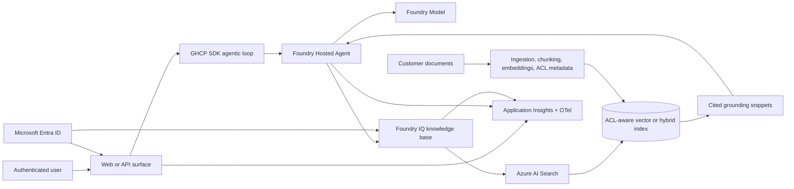

# Enterprise Knowledge Grounding

## Intro

### Bring your data into Foundry with agentic retrieval, ACL-aware indexing, and citations.

Enterprise knowledge agents are only useful when they answer from the right sources, cite those sources, and respect the same access boundaries as the source systems. This playbook gives field and customer teams a repeatable path for bringing proprietary documents into Microsoft Foundry through Foundry IQ and Azure AI Search, then exposing that knowledge through a governed Foundry hosted agent.

**Use when:** Answers must be grounded in your own documents with citations and access control.

**Core tech stack:** GHCP SDK, Hosted Agents, Foundry Models, Foundry IQ (Azure AI Search)

This playbook walks you through building a governed enterprise knowledge-grounding pilot with the Agentic Loop. You drive [`lean-spec2cloud`](https://github.com/Azure-Samples/Spec2Cloud/tree/main/plugins/lean-spec2cloud) from a single prompt, and the [`agentic-loop`](../../../skills/agentic-loop/SKILL.md) skill applies the GBB defaults for Foundry, hosted agents, keyless identity, observability, and `azd`.

The playbook is organized in three chapters:

- **Build** — go from a blank repo to a deployable knowledge-grounding solution.
- **Run** — operate retrieval quality, telemetry, ACL behavior, and evals after deployment.
- **Scale** — extend the pilot to more sources, environments, private networking, and reusable artifacts.

---

### What we will build

You will create a chat-style application where an authenticated user asks questions against an enterprise document corpus. The agent uses the **GitHub Copilot SDK** as the agentic execution harness and runs as a **Foundry Hosted Agent** backed by **Foundry Models**. Retrieval flows through a **Foundry IQ knowledge base** backed by **Azure AI Search**, where indexed chunks include citation metadata and ACL fields. The app uses **Microsoft Entra ID** and managed identities so query-time retrieval can filter results to content the caller is allowed to read.



| Layer | Choice | Why |
|---|---|---|
| User surface | React + Vite frontend or API test harness | Gives business users a simple way to validate answers and citations. |
| Agentic loop | GitHub Copilot SDK | Preferred for long retrieval/tool loops and streaming interactions. |
| Agent runtime | Foundry Hosted Agents | Moves the pilot onto a governed runtime with identity, audit, telemetry, and evals. |
| Model | Foundry Models | Keeps model usage and capacity on the Foundry platform. |
| Private grounding | Foundry IQ backed by Azure AI Search | Provides knowledge bases, knowledge sources, agentic retrieval, and cited evidence. |
| Data source | User-provided documents in Blob Storage or equivalent customer-controlled source | Keeps the first pilot deployable without fabricating data. |
| Identity | Entra ID + managed identity + RBAC | Required for keyless workload access and ACL-aware retrieval. |
| Observability | OpenTelemetry -> Application Insights + Foundry diagnostics | Makes retrieval quality and runtime health visible from day one. |
| Infra | `azd init --minimal` + Bicep | Lets the implementation generate only the resources this pattern needs. |

**Done means:**

- The agent answers known questions from user-provided documents.
- Every grounded answer includes citations that resolve to the expected source document, section, page, or chunk.
- Authorized users can retrieve allowed content.
- Unauthorized users cannot retrieve restricted content.
- The app refuses or says it cannot answer when no authorized source supports the answer.
- App, agent, and retrieval telemetry are visible in Application Insights or Foundry diagnostics.

**Out of scope for the first pilot:**

- Fabricating a sample corpus when real project or customer documents are available.
- Mandating private endpoints for the first run.
- Deep implementation of every enterprise content source.
- Replacing enterprise records-management, Purview, or source-system authorization policies.

### Prerequisites

Finish the shared setup in [playbooks/README.md](../README.md) first.

Minimum checks before starting:

```pwsh
copilot --version
copilot plugin list   # expect lean@Spec2Cloud
gh --version
gh skill --help
az account show
azd version
bicep --version       # or confirm Azure CLI bundled Bicep works with az bicep version
```

> Tooling note: `copilot plugin install lean@Spec2Cloud` installs the Copilot CLI plugin. `gh skill install ...` installs a GitHub Copilot agent skill into `.github/skills/`. They are related, but they are not the same mechanism.

### Create a new project

Create a clean workspace for the generated solution. Keep this playbook repo separate from the customer implementation repo.

```pwsh
gh repo create enterprise-knowledge-grounding --private --clone
cd enterprise-knowledge-grounding
```

Prefer local only? This is fine for the first run:

```pwsh
mkdir enterprise-knowledge-grounding
cd enterprise-knowledge-grounding
git init
```

---

## Build

### Specify

Take the new workspace through **Specify -> Plan -> Implement -> Verify -> Deploy**.

Start by turning the scenario into an implementation-ready spec.

```text
/lean:specify Build an Enterprise Knowledge Grounding app. Users ask questions in a chat interface and answers must be grounded in our own documents with citations and access control. Use GitHub Copilot SDK as the agentic execution harness, Foundry Hosted Agents as the governed runtime, Foundry Models for generation, and Foundry IQ backed by Azure AI Search for agentic retrieval. Ingest user-provided documents from Blob Storage or an equivalent customer-controlled source, create an ACL-aware vector or hybrid index with citation metadata, propagate the caller's Microsoft Entra identity or authorization token at query time, and refuse to answer when no authorized source supports the response. Use managed identity, keyless RBAC, OpenTelemetry to Application Insights, azd with Bicep, and include evals for groundedness, citation correctness, ACL boundaries, and no-answer behavior.
```

Use these recommended answers if Copilot asks clarifying questions:

| Question area | Recommended answer |
|---|---|
| Primary corpus | User-provided documents in Azure Blob Storage or equivalent customer-controlled source. |
| Sample data | Do not synthesize documents; use real pilot documents. |
| User identity | In scope. ACL-aware retrieval requires Entra-backed caller context. |
| First network posture | Public endpoints are acceptable for the pilot; private networking is production hardening. |
| Agent harness | GitHub Copilot SDK by default; use Microsoft Agent Framework only for orchestration or true multi-agent sequencing. |
| Retrieval | Foundry IQ knowledge base backed by Azure AI Search with vector or hybrid retrieval. |
| Citations | Require citations for every document-grounded answer. |
| Refusal behavior | Refuse or say "I cannot answer from authorized sources" when no authorized evidence exists. |

When the skill finishes, review `docs/spec.md` for these must-have requirements:

- Foundry Hosted Agent + Foundry Models.
- Foundry IQ / Azure AI Search grounding.
- ACL metadata and query-time permission enforcement.
- Citation validation.
- Managed identity and keyless RBAC.
- Application Insights and eval gates.

Checkpoint before planning:

```pwsh
git --no-pager status --short
git --no-pager diff -- docs\spec.md
```

### Plan

Turn the spec into a reviewable implementation and deployment plan.

```text
/lean:plan
```

For this playbook, choose:

```text
Use minimal: azd init --minimal
```

Why minimal? This pattern combines GitHub Copilot SDK, Foundry Hosted Agents, Foundry IQ, Azure AI Search, ACL-aware indexing, optional app surfaces, and deployment-readiness checks. No single catalog template maps cleanly to that architecture, so the implementation should generate only the required resources.

Use a convention-based environment name unless you have a customer naming standard:

```text
enterprise-knowledge-grounding-dev-eus2
```

Review:

- `docs/plan.md`
- `.azure/deployment-plan.md`

The deployment plan should include:

| Section | What good looks like |
|---|---|
| Resource graph | Foundry project, hosted agent, model deployment, Azure AI Search, document storage, managed identity, Application Insights, optional ACA apps. |
| RBAC | Least-privilege roles for Foundry, Search data-plane, Storage, telemetry, and optional Key Vault. |
| Identity | Managed identity for workloads and Entra-backed user identity for ACL-aware retrieval. |
| Search design | Index fields for content, embeddings, citation metadata, source URI, classification, and ACL principals/groups. |
| Evals | Groundedness, citation correctness, ACL allow/deny, no-answer, freshness, and latency. |
| azd template | `minimal` / `azd init --minimal`. |

Protect the deployment plan while ignoring local azd state:

```gitignore
.azure/*
!.azure/README.md
!.azure/deployment-plan.md
```

Checkpoint before implementation:

```pwsh
git --no-pager status --short
git --no-pager diff -- docs\plan.md .azure\deployment-plan.md .gitignore
```

### Implement

Generate the source and infrastructure from the plan.

```text
/lean:implement
```

Expected generated artifacts:

```text
.
├── azure.yaml
├── infra/
│   ├── main.bicep
│   ├── main.parameters.json
│   └── modules/
├── src/
│   ├── frontend/                         # optional React + Vite chat UI
│   ├── backend/                          # optional API/session adapter
│   ├── agents/
│   │   └── enterprise-knowledge-agent/   # hosted-agent definition/code
│   └── ingestion/                        # document ingestion and indexing
├── .agentignore
└── docs/
    ├── spec.md
    ├── plan.md
    └── implementation.md
```

The implementation should wire:

1. **Ingestion** — reads user-provided documents, chunks them, extracts metadata, maps source ACLs, generates embeddings, and updates Azure AI Search.
2. **Retrieval** — uses Foundry IQ / Azure AI Search for vector or hybrid retrieval and returns cited evidence.
3. **Identity** — uses managed identity for workload access and caller identity for ACL-aware filtering.
4. **Agent** — runs as a Foundry hosted agent and only answers document-grounded questions when authorized evidence exists.
5. **Telemetry** — emits app, agent, retrieval, and error traces to Application Insights.

Expected RBAC matrix:

| Principal | Scope | Role | Purpose |
|---|---|---|---|
| Deployer user/group | Resource group | Contributor | Provision resources with `azd`. |
| Deployer user/group | Resource group | User Access Administrator or RBAC delegation equivalent | Create role assignments. |
| Application UAMI | Foundry project | Azure AI User | Invoke hosted agent and project resources. |
| Application UAMI | Azure AI Search | Search Index Data Reader | Query indexed knowledge. |
| Ingestion UAMI or app UAMI | Azure AI Search | Search Index Data Contributor | Create/update indexed documents. |
| Ingestion UAMI or app UAMI | Blob container | Storage Blob Data Reader | Read source documents. |
| Application UAMI | Application Insights | Monitoring Metrics Publisher | Emit telemetry where required. |
| Application UAMI | Key Vault | Key Vault Secrets User | Only if Key Vault-backed config is unavoidable. |

Before moving on:

```pwsh
git --no-pager status --short
git --no-pager diff --stat
git --no-pager diff -- azure.yaml infra src docs\implementation.md
```

Commit a useful checkpoint if the diff looks right:

```pwsh
git add .
git commit -m "feat: scaffold enterprise knowledge grounding"
```

### Verify

Validate locally against real Azure dependencies.

```text
/lean:verify
```

Preflight checks:

```pwsh
gh --version
gh skill --help
copilot plugin list
az account show
azd version
bicep --version
git --no-pager status --short
git --no-pager diff --stat
```

If `bicep --version` is missing, confirm Azure CLI bundled Bicep before provisioning:

```pwsh
az bicep version
```

Retrieval verification:

| Test | Prompt / Action | Expected result |
|---|---|---|
| Known-answer | Ask a question answered by one known document. | Answer cites the expected document/chunk. |
| Citation match | Open the cited source URI and compare the quoted span or section. | Citation points to the supporting source content. |
| ACL allow | Ask as a user who has access to a restricted document. | Allowed content can appear with citation. |
| ACL deny | Ask as a user who lacks access to the same restricted document. | Restricted content and snippets are absent. |
| No authorized source | Ask for a fact that is only in unauthorized or missing sources. | Agent refuses or says it cannot answer from authorized sources. |
| Freshness | Update or add a document, run refresh, and ask about the new fact. | Answer reflects refreshed content and cites the updated source. |
| Telemetry | Query Application Insights for request/retrieval traces. | App, agent, retrieval, and error traces are visible. |

### Deploy

Deploy after local verification passes.

```text
/lean:deploy
```

Deployment readiness checklist:

- [ ] `agent.yaml` includes `template.kind: hosted` or another valid hosted-agent kind.
- [ ] Hosted-agent deployment includes `code_configuration` when code deploy is used.
- [ ] Hosted-agent dependencies use a focused `requirements.txt` when remote `uv.lock` resolution is risky.
- [ ] `.agentignore` excludes local dependency folders, build outputs, and files that should not be shipped.
- [ ] Each containerized service has a service-specific `.dockerignore`.
- [ ] Backend/frontend/ingestion containers pass startup checks before cloud deployment.
- [ ] `/liveness` and `/readiness` return HTTP 200 where applicable.
- [ ] Shell entrypoints use LF line endings or are normalized during Docker build.
- [ ] Azure resource names meet service-specific limits, including Azure Container Apps' 32-character app-name limit.
- [ ] `azd` and the Foundry agent extension are current enough for hosted-agent deployment.
- [ ] Known-answer, citation, ACL-deny, and no-authorized-source tests pass.
- [ ] Application Insights receives telemetry from the app and agent path.

After deployment, capture:

```pwsh
azd env get-values
azd show
git --no-pager status --short
```

---

## Run

### Observe

Use telemetry to understand whether the agent is healthy and grounded.

Track:

- Request count, latency, and failures by route.
- Hosted-agent session readiness and errors.
- Foundry IQ / Azure AI Search retrieval diagnostics.
- Search queries, result counts, and no-result cases.
- Citation count and citation validation failures.
- ACL-deny events and no-authorized-source responses.
- Token usage and model deployment capacity.

Useful Application Insights questions:

| Question | Signal |
|---|---|
| Are users getting answers? | Request success rate and chat latency. |
| Are answers grounded? | Retrieval trace IDs, citation count, groundedness eval score. |
| Are permissions working? | ACL allow/deny test traces and absence of restricted snippets. |
| Are we over-querying? | Search request count, query fan-out, reasoning effort, model usage. |
| What changed after refresh? | Indexer/ingestion logs and freshness evals. |

### Evaluate

Create a small evaluation set before broad rollout.

| Eval | Dataset shape | Pass condition |
|---|---|---|
| Groundedness | Question, answer, cited chunks | Claims are supported by cited content. |
| Citation correctness | Question, expected source URI/chunk | Citation resolves to the expected source. |
| ACL allow | User, question, allowed source | Allowed user gets cited answer. |
| ACL deny | User, question, restricted source | Unauthorized user does not receive restricted evidence. |
| No-answer | Question with no authorized source | Agent refuses or states it cannot answer from authorized sources. |
| Freshness | Updated document, expected new answer | Answer reflects refreshed index after ingestion/indexer run. |
| Latency | Representative questions | p95 latency stays within the pilot target for the selected retrieval reasoning effort. |

Set gates before promoting:

- No critical ACL-deny failures.
- Citation correctness above the agreed threshold.
- No uncited factual claims for document-grounded answers.
- Telemetry is complete enough to debug failures.

### Iterate

Safe iteration loop:

1. Add or update documents in the source container.
2. Run ingestion or wait for the scheduled refresh.
3. Re-run known-answer, citation, and ACL tests.
4. Review traces and eval scores.
5. Change prompts, retrieval settings, or index fields only with a checkpoint commit.

```pwsh
git --no-pager status --short
git --no-pager diff --stat
git add .
git commit -m "chore: tune enterprise knowledge grounding retrieval"
```

---

## Scale

### Add more knowledge sources

Start with one controlled corpus. Add sources only after the baseline tests pass.

| Source type | Recommended path | Notes |
|---|---|---|
| Blob Storage / files | Indexed Foundry IQ knowledge source backed by Azure AI Search | Best first pilot path. Include ACL metadata during ingestion. |
| SharePoint indexed content | Indexed source with synchronized permissions where supported | Validate ACL sync and query-time filtering before rollout. |
| Remote SharePoint / Microsoft 365 | Remote permission-enforced source where available | Source system enforces permissions at query time; document licensing and tenant constraints. |
| OneLake / Fabric data | Treat as separate knowledge source | Align with data owner and retention policy. |
| Web data | Only if explicitly needed | Keep public web grounding separate from enterprise document grounding. |

### Move to private networking

Private networking is a production hardening path, not the first pilot default. When required:

- Use a Foundry agent setup that supports private Azure AI Search access.
- Use Microsoft Entra project managed identity for the Azure AI Search connection.
- Do not use key-based search authentication for private networking.
- Add private DNS, private endpoints, and network validation to the deployment plan.

### Promote across environments

Use separate azd environments:

```pwsh
azd env new enterprise-knowledge-grounding-test-eus2
azd env new enterprise-knowledge-grounding-prod-eus2
```

Promotion checklist:

- Separate document sources or containers per environment.
- Separate indexes and knowledge bases per environment.
- Explicit RBAC assignments per environment.
- Evals run before promotion.
- Deployment plan reviewed and committed.
- Telemetry dashboards exist before production rollout.

### Reuse and contribution

Promote reusable pieces when they stabilize:

- Ingestion and ACL mapping scripts.
- Eval datasets and scoring prompts.
- Deploy-readiness checklist.
- Foundry IQ / Azure AI Search index conventions.
- Playbook improvements back to this repo.
- Optional packaged/deploy-ready artifact for users who want to skip local scaffolding.

---

### References

- [What is Foundry IQ?](https://learn.microsoft.com/azure/foundry/agents/concepts/what-is-foundry-iq)
- [Foundry IQ frequently asked questions](https://learn.microsoft.com/azure/foundry/agents/concepts/foundry-iq-faq)
- [Connect a Foundry IQ knowledge base to Foundry Agent Service](https://learn.microsoft.com/azure/foundry/agents/how-to/foundry-iq-connect)
- [Connect an Azure AI Search index to Foundry agents](https://learn.microsoft.com/azure/foundry/agents/how-to/tools/ai-search)
- [Document-level access control in Azure AI Search](https://learn.microsoft.com/azure/search/search-document-level-access-overview)
- [Query-time ACL and RBAC enforcement in Azure AI Search](https://learn.microsoft.com/azure/search/search-query-access-control-rbac-enforcement)
- [Transparency note: Azure AI Search](https://learn.microsoft.com/azure/foundry/responsible-ai/search/transparency-note)
