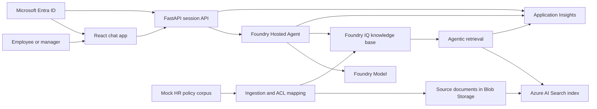

# Enterprise Knowledge Grounding: HR Onboarding Concierge

## Intro

### Enterprise knowledge grounding playbook

This playbook walks you through building an **HR Onboarding Concierge** with the Agentic Loop. New hires and managers ask questions about company policies, benefits, equipment, security training, and first-week tasks. The agent answers only from an enterprise HR corpus, cites the supporting policy snippets, and refuses when the answer is not supported by authorized sources.

The playbook follows the same loop as Getting Started:

- **Build** - go from a single prompt to a working HR knowledge-grounded prototype.
- **Run** - test the deployed agent, citations, access boundaries, and traces.
- **Scale** - extend the mock corpus into real enterprise sources and production controls.

---

### What we will build

A chat-style web app where an employee talks to a Foundry **hosted agent**. The agent uses **Foundry IQ agentic retrieval** over an HR onboarding knowledge base backed by Azure AI Search. Copilot creates a useful mock HR corpus, uploads it to the app's source storage, injects it into the Foundry IQ knowledge base, and wires the agent to retrieve from that knowledge base with citations and ACL-aware filtering.


```mermaid
flowchart LR
  User[Employee or manager] --> App[React chat app]
  App --> API[FastAPI session API]
  API --> Agent[Foundry Hosted Agent]
  Agent --> Model[Foundry Model]
  Agent --> IQ[Foundry IQ knowledge base]
  IQ --> Retrieval[Agentic retrieval]
  Retrieval --> Search[Azure AI Search index]
  Mock[Mock HR policy corpus] --> Ingest[Ingestion and ACL mapping]
  Ingest --> Blob[Source documents in Blob Storage]
  Ingest --> IQ
  Blob --> Search
  Entra[Microsoft Entra ID] --> App
  Entra --> API
  API --> Insights[Application Insights]
  Agent --> Insights
  Retrieval --> Insights
```

| Layer | Choice (from `agentic-loop` defaults) |
|-------|----------------------------------------|
| Frontend | React + Vite on Azure Container Apps |
| Backend API | Python + FastAPI on Azure Container Apps |
| Agent | Hosted agent in Microsoft Foundry |
| Grounding | Foundry IQ knowledge base using agentic retrieval |
| Search | Azure AI Search as the Foundry IQ backing index |
| Corpus | Mock HR onboarding documents generated by Copilot |
| Identity | Microsoft Entra ID + managed identity + ACL metadata |
| Observability | OpenTelemetry -> Application Insights |
| Infra | `azd` + Bicep |

Artifacts produced in your workspace mirror the five build stages:

| Stage | Artifact |
|-------|----------|
| Specify | `./docs/spec.md`, `.github/copilot-instructions.md` |
| Plan | `./docs/plan.md`, `./.azure/deployment-plan.md` |
| Implement | `./src/`, `./infra/`, mock HR corpus, ingestion scripts |
| Verify | `./docs/verify.md`, provisioned Foundry IQ knowledge base |
| Deploy | Deployed Azure endpoint, `./docs/deploy.md` |

---

### Setup

You will need:

- Azure subscription with Contributor permissions, plus permission to create role assignments.
- GitHub Copilot installed and logged in - use the [Copilot App](http://gh.io/app) (recommended), the [Copilot CLI](https://github.com/features/copilot/cli/), or [Visual Studio Code](https://code.visualstudio.com/download).
- [GitHub CLI (`gh`)](https://cli.github.com/) installed and logged in.
- [Azure CLI (`az`)](https://learn.microsoft.com/en-us/cli/azure/install-azure-cli) and [Azure Developer CLI (`azd`)](https://learn.microsoft.com/en-us/azure/developer/azure-developer-cli/install-azd) installed and authenticated.
- The `lean-spec2cloud` Copilot plugin installed and updated:

```bash
copilot plugin marketplace add Azure-Samples/Spec2Cloud && copilot plugin install lean@Spec2Cloud
```

Sanity check before you go further:

```bash
az account show                 # confirm the correct tenant and subscription
azd auth login --check-status   # confirm you are signed in to azd
copilot plugin list             # expect to see lean@Spec2Cloud
```

> **Heads up on cost.** This playbook provisions billable Azure resources: Container Apps, Foundry/AI Services, Azure AI Search, Storage, and Application Insights. See [Clean up](#clean-up) to remove everything when you are done.

## Build

### Create a new project

Take an empty workspace through the **Specify -> Plan -> Implement -> Verify -> Deploy** loop and produce a running HR onboarding assistant.

```bash
mkdir hr-onboarding-concierge
```

> Want version control from minute one? Create a private GitHub repo instead:
>
> ```bash
> gh repo create hr-onboarding-concierge --private --clone
> ```

---

### Open GitHub Copilot

This playbook uses the **GitHub Copilot App**, but the same prompt works in the Copilot CLI and in VS Code.

> **Using the CLI instead?** Run:
>
> ```bash
> copilot --allow-all
> ```
>
> Use `--allow-all` only on a sandbox workspace because it pre-approves file, command, and URL access.

**1. Open the Spec2Cloud canvas** to watch the build loop execute. In the review panel on the right, click **+**, then pick **Spec2Cloud Cockpit** from the installed extensions. If it is not listed, choose **Discover more -> Import canvas from gist/URL -> User scope**, then paste:

```text
https://github.com/Azure-Samples/Spec2Cloud/tree/main/.github/extensions/spec2cloud
```

The **Spec2Cloud** tab should appear in the review panel. If it does not appear automatically, click **+** again and select **Spec2Cloud Cockpit** from the installed extensions.

**2. Add your project.** On the left, click **+ -> Add project from -> Local folder or repository**, then select the `hr-onboarding-concierge` folder.

**3. Choose a model and mode.** In the prompt box, pick a strong reasoning model and a run mode:

| Mode | Behavior |
|------|----------|
| Interactive | Step-by-step collaboration; you confirm each stage |
| Plan | Plans first, executes once you approve |
| Autopilot *(recommended)* | Runs the full loop end-to-end without interruption |

---

### Run the build loop

Paste this starter prompt:

```text
/spec2cloud Build an HR Onboarding Concierge for a fictional company called Zava. Employees and managers should ask onboarding questions about HR policies, benefits, PTO, equipment requests, security training, travel, remote work, and manager first-week checklists. Use the agentic-loop defaults for the app, agent runtime, Azure infrastructure, identity, and telemetry.

Ground all enterprise answers through Foundry IQ agentic retrieval. Do not let the app bypass Foundry IQ with direct ad hoc search calls. Create a realistic mock HR corpus in data/hr-onboarding-corpus with at least eight Markdown documents, including handbook, benefits, PTO and leave, remote work, equipment and access, security training, travel expenses, and manager onboarding guidance. Include metadata for title, owner, effective date, classification, source URI, allowed Entra groups or personas, and citation anchors.

Implement a repeatable ingestion flow that uploads the mock corpus, injects it into the Foundry IQ knowledge base, maps ACL metadata, and verifies cited evidence comes back from Foundry IQ. The agent must apply caller-aware ACL filtering, include citations for grounded answers, and refuse with "I cannot answer from authorized HR sources" when no authorized source supports the response. Create seed evals in data/evals for known answers, citation correctness, ACL allow, ACL deny, freshness, no-authorized-source behavior, and retrieval telemetry.
```

> `/spec2cloud` runs the same five-stage loop as the Getting Started playbook. Keep the prompt lean: `agentic-loop` already supplies the Foundry hosted-agent runtime, model, Azure deployment, identity, and telemetry defaults. The starter prompt only adds what is unique to this playbook: **Foundry IQ agentic retrieval**, mock HR data injection, ACL-aware citations, refusal behavior, and eval coverage.

> Tip: Prefer to run the loop one stage at a time? Use the same prompt with `/specify` first, then advance through each stage:
>
> | Command | Produces | Review in |
> |---------|----------|-----------|
> | `/specify <prompt>` | Specification | `docs/spec.md` |
> | `/plan` | Implementation + Azure deployment plan | `docs/plan.md`, `.azure/deployment-plan.md` |
> | `/implement` | azd template + source code + mock corpus | `src/`, `infra/`, `data/` |
> | `/verify` | Provisioned Foundry IQ dependencies and smoke tests | `docs/verify.md` |
> | `/deploy` | Full solution deployed to Azure | `docs/deploy.md` |

End-to-end execution time varies, but this scenario usually takes longer than Getting Started because it provisions search, creates a knowledge base, injects sample data, and runs retrieval evals.

---

### Review the generated plan

Before implementation, confirm the generated plan keeps Foundry IQ as the grounding control plane.

| Area | What good looks like |
|------|----------------------|
| Mock corpus | HR policy documents are generated in `data/hr-onboarding-corpus` with realistic content and metadata. |
| Ingestion | Pipeline uploads documents, creates or updates Foundry IQ, injects the documents, and records source/citation metadata. |
| Retrieval | Hosted agent uses Foundry IQ agentic retrieval; the app does not bypass Foundry IQ with direct search calls. |
| ACLs | Documents carry allowed personas or Entra group metadata, and query-time retrieval filters by caller context. |
| Citations | Answers include source document, section, and anchor or chunk identifiers. |
| Evals | Known-answer, citation, ACL allow/deny, no-answer, freshness, and telemetry checks are generated. |
| Observability | App, agent, ingestion, and Foundry IQ retrieval traces flow to Application Insights. |

Use the Spec2Cloud canvas to inspect the generated **Specify**, **Plan**, **Implement**, **Verify**, and **Deploy** stages. Open the **Azure** and **Foundry** shortcuts from the canvas to verify that the Foundry project contains the hosted agent and Foundry IQ knowledge base.

---

### Verify locally

After `/verify`, run the checks the loop generated. The important smoke tests should prove:

| Test | Prompt / action | Expected result |
|------|-----------------|-----------------|
| Known answer | "How many days before my start date should equipment be requested?" | Answer cites `equipment-and-access.md`. |
| Benefits | "When do health benefits start for full-time employees?" | Answer cites `benefits-guide.md`. |
| PTO | "How do I request PTO during my first 90 days?" | Answer cites `pto-and-leave-policy.md`. |
| ACL allow | Ask a manager-only checklist question as a manager persona. | Manager-only source can be used with citation. |
| ACL deny | Ask the same manager-only question as an employee persona. | Restricted source is not disclosed. |
| No source | Ask for a personal legal or payroll fact not in the corpus. | Agent refuses with the configured no-authorized-source message. |
| Freshness | Update one policy, re-run ingestion, ask about the changed rule. | Answer reflects the refreshed Foundry IQ content. |

Checkpoint before deployment:

```bash
git --no-pager status --short
git --no-pager diff --stat
```

---

### Deploy

Deploy after local verification passes:

```text
/deploy
```

Deployment readiness checklist:

- [ ] Foundry hosted agent is deployed and connected to the Foundry IQ knowledge base.
- [ ] Foundry IQ uses agentic retrieval over the injected HR corpus.
- [ ] Azure AI Search is treated as the backing index, not as an app-level bypass.
- [ ] Mock corpus upload and Foundry IQ ingestion are repeatable from a script or command.
- [ ] Managed identities and RBAC are used instead of committed secrets.
- [ ] Citation, ACL-deny, no-authorized-source, and freshness tests pass.
- [ ] Application Insights receives traces for app turns, ingestion, retrieval, and agent runs.

When the loop finishes, Copilot returns the deployed frontend URL and the Spec2Cloud canvas can preview it. Open the Foundry portal from the canvas to review the hosted agent, Foundry IQ knowledge base, retrieval configuration, and traces.

## Run

### Run the HR concierge

Open the deployed frontend and test the assistant with practical onboarding questions:

- "What should I complete before my first day?"
- "Can I work remotely during onboarding?"
- "What equipment can I request?"
- "What should a manager do during a new hire's first week?"

Good answers should be concise, grounded, and cited. They should not invent policy details beyond the mock corpus.

---

### Observe traces

Use the Spec2Cloud canvas to open the Foundry project, then inspect agent runs and Application Insights traces.

Track:

| Question | Signal |
|----------|--------|
| Did the agent retrieve evidence from Foundry IQ? | Foundry IQ retrieval span or hosted-agent trace step. |
| Was retrieval agentic? | Retrieval plan/subquery activity and cited evidence returned by the Foundry IQ knowledge base. |
| Were citations correct? | Source document, section, anchor, or chunk ID matches the answer. |
| Did ACL filtering work? | Restricted chunks are absent for unauthorized personas. |
| Did no-answer behavior work? | Unsupported questions produce the configured refusal. |

---

### Evaluate

Use the generated `data/evals` set as a regression suite. Keep these gates before promoting:

| Eval | Pass condition |
|------|----------------|
| Groundedness | Claims are supported by cited HR policy snippets. |
| Citation correctness | Citations resolve to the expected source document and section. |
| ACL allow | Authorized personas can retrieve allowed policy content. |
| ACL deny | Unauthorized personas do not receive restricted evidence or summaries. |
| No-answer | Unsupported or unauthorized questions are refused. |
| Freshness | Updated mock documents are reflected after re-ingestion. |
| Latency | p95 chat latency stays within the pilot target. |

## Scale

### Replace mock data with real sources

The mock HR corpus is intentionally useful, but it is still demo data. Once the retrieval behavior is proven, replace it source by source.

| Source | Recommended path |
|--------|------------------|
| HR policy PDFs or Markdown | Upload to the same source container and re-run ingestion. |
| SharePoint HR site | Add a governed knowledge source where permission sync is supported. |
| Benefits provider docs | Keep as a separate knowledge source with owner-approved freshness rules. |
| Manager-only guidance | Preserve restricted group metadata and ACL-deny evals. |

Do not remove the mock corpus immediately. Keep a small sanitized sample as a stable smoke-test set for CI and demos.

---

### Production hardening

Before production rollout:

- Move from demo personas to real Entra users and groups.
- Use separate Foundry IQ knowledge bases and search indexes per environment.
- Add private networking where required by the enterprise network posture.
- Add Purview, retention, and data-owner review where the source content requires it.
- Promote reusable ingestion, ACL mapping, and eval utilities back into the implementation template.

---

### Clean up

When you are done experimenting, delete every Azure resource the loop created:

```bash
azd down --purge --force
```

`--purge` also removes soft-deleted resources such as Foundry/AI Services and Key Vault resources so their names can be reused.

---

### References

- [What is Foundry IQ?](https://learn.microsoft.com/azure/foundry/agents/concepts/what-is-foundry-iq)
- [Connect a Foundry IQ knowledge base to Foundry Agent Service](https://learn.microsoft.com/azure/foundry/agents/how-to/foundry-iq-connect)
- [Connect an Azure AI Search index to Foundry agents](https://learn.microsoft.com/azure/foundry/agents/how-to/tools/ai-search)
- [Agentic retrieval in Azure AI Search](https://learn.microsoft.com/azure/search/search-agentic-retrieval-concept)
- [Document-level access control in Azure AI Search](https://learn.microsoft.com/azure/search/search-document-level-access-overview)
- [Query-time ACL and RBAC enforcement in Azure AI Search](https://learn.microsoft.com/azure/search/search-query-access-control-rbac-enforcement)
