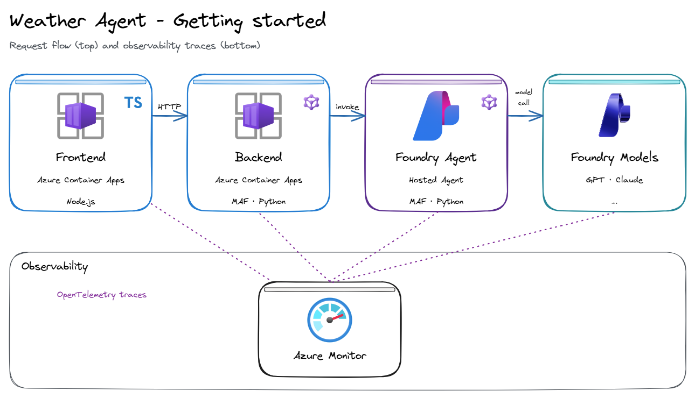
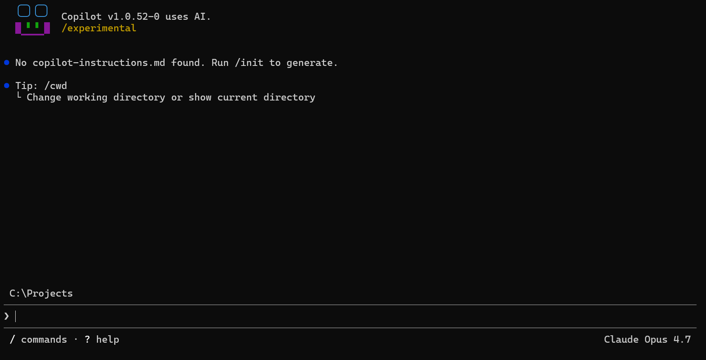
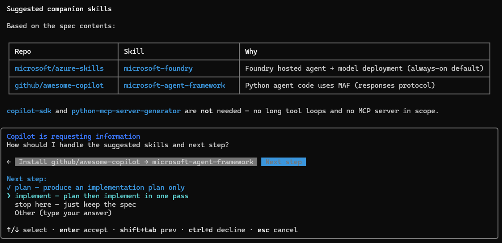
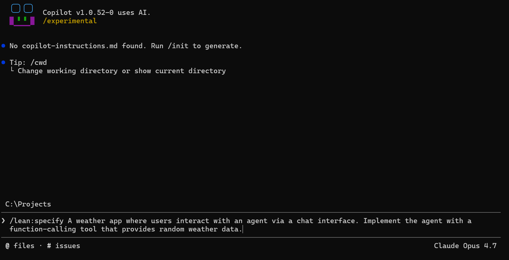

# Getting started on the Agentic Loop: Weather Agent

This playbook walks you through building a simple **weather agent** end-to-end with the Agentic Loop. You drive [`lean-spec2cloud`](https://github.com/Azure-Samples/Spec2Cloud/tree/main/plugins/lean-spec2cloud) from a single prompt, and the [`agentic-loop`](../../../skills/agentic-loop/SKILL.md) skill applies the GBB defaults (Foundry hosted agents, MAF, Container Apps, OTel, azd) on top.

> Companion playbook: [01-basic-chat](../01-basic-chat/PLAYBOOK.md) — same loop, no agent / no tools.

The playbook is organized in three chapters:

- **Build** — go from a blank repo to a working spec for the weather agent.
- **Run** — operate the deployed agent: telemetry, evals, day-2.
- **Scale** — add more agents, surfaces, and environments to the loop.

---

## Build

Take an empty workspace through the **Specify → Plan → Implement → Verify → Deploy** loop and produce a running weather agent.

---

### What we will build

A chat-style web app where the user talks to a Foundry **hosted agent**. The agent uses a single **function-calling tool** (`get_weather`) that returns randomized weather data — enough to exercise the full tool-call round-trip without any external API.



| Layer            | Choice (from `agentic-loop` defaults)                                        |
|------------------|------------------------------------------------------------------------------|
| Frontend         | React + Vite on Azure Container Apps                                         |
| Backend API      | Python + FastAPI on Azure Container Apps                                     |
| Agent            | Microsoft Agent Framework (MAF) hosted in Microsoft Foundry                  |
| Tool             | Python function tool `get_weather(city: str) -> dict` (random data)          |
| Model            | `gpt-5.4-mini` on Foundry (Global Standard, `eastus2`)                       |
| Identity         | Entra ID + UAMI, keyless RBAC                                                |
| Observability    | OpenTelemetry → Application Insights (wired via Foundry)                     |
| Infra            | `azd` + Bicep (Azure Verified Modules)                                       |

Artifacts produced in your workspace mirror the five build stages:

| Stage      | Artifact                                            |
|------------|-----------------------------------------------------|
| Specify    | `./docs/spec.md`, `.github/copilot-instructions.md` |
| Plan       | `./docs/plan.md`, `./.azure/deployment-plan.md`     |
| Implement  | `./src/`, `./infra/`, `azure.yaml`                  |
| Verify     | `./docs/verify.md`, provisioned Azure dependencies  |
| Deploy     | Deployed Azure endpoint, `./docs/deploy.md`         |

---

### Setup

This playbook assumes the **shared setup** from [playbooks/README.md](../../README.md) is done:

- Azure subscription + GitHub Copilot plan.
- GitHub Copilot CLI, Azure CLI, `azd`, Bicep, Git installed and authenticated.
- The `lean-spec2cloud` Copilot plugin installed.
- The `agentic-loop` skill installed in `.github/skills/` of your project workspace.

Sanity check before you go further:

```pwsh
copilot --version
az account show
azd version
copilot plugin list   # expect to see lean@Spec2Cloud
```

If anything fails, go finish [the shared setup](../../README.md) first.

---

### Create a new project

Create an empty repo to host the solution. A private GitHub repo gives you version control from minute one and a place for the loop's artifacts (spec, plan, source, infra) to live.

```pwsh
# Replace <repo-name> with your repo name, e.g. weather-agent
gh repo create <repo-name> --private --clone
cd <repo-name>
```

> Prefer a local-only folder? `mkdir weather-agent ; cd weather-agent ; git init` works just as well — you can publish to GitHub later.

---

### Open GitHub Copilot CLI

Launch Copilot with all permissions pre-approved so the loop can read/write files, run commands, and hit URLs without prompting every step.



```pwsh
copilot --allow-all
```

> `--allow-all` is equivalent to `--allow-all-tools --allow-all-paths --allow-all-urls`. Use it on a sandbox workspace. Drop it if you want to approve each action manually.

Inside the Copilot session:

1. **Pick a model** — switch to a strong reasoning model for the planning stages:

   ```text
   /model
   ```

   Select `Claude Opus 4.6` (or another premium model). The agentic-loop skill works with any frontier model; reasoning quality matters most during `specify` and `plan`.

2. **Confirm the skills are loaded**:

   ```text
   /skills
   ```

   You must see both of these in the list:

   - `lean@Spec2Cloud` — the five-stage skills (`specify`, `plan`, `implement`, `verify`, `deploy`, `spec2cloud`).
   - `agentic-loop` — GBB defaults, model/region selector, companion-skill suggestions.

   If either is missing, exit Copilot, re-run the install steps in [§2 / §3 of the shared setup](../../README.md), and reopen.

3. **(Optional) Disable skills you don't need** for this run to keep the context focused — e.g. unrelated language- or service-specific skills. You can re-enable them later.

---

### Specify the weather agent

Run the `specify` skill with a one-line description of what you want. Keep it short — the skill will ask follow-up questions for anything ambiguous, and the `agentic-loop` skill will fill in the GBB defaults automatically.


In the Copilot session, type:

```text
/lean:specify A weather app where users interact with an agent via a chat interface. Implement the agent with a function-calling tool that provides random weather data.
```

What this command does:

1. **`specify` skill runs first.** It drafts `./docs/spec.md` from your prompt — capturing the user-facing scenario, the agent + tool design, assumptions, and explicit non-goals (no real weather API, no auth, no persistence).
2. **`agentic-loop` skill runs immediately after** and post-processes the spec:
   - Locks in **Foundry hosted agent** + **MAF (Python)** for the agent layer.
   - Picks the right **model + region + capacity** (defaults to `gpt-5.4-mini` on `eastus2`, Global Standard, 100K TPM) and writes the `AZURE_LOCATION` and `AI_PROJECT_DEPLOYMENTS` env vars you'll need at provision time.
   - Slots in **React + Vite frontend**, **FastAPI backend**, **Container Apps** hosting, **Entra + keyless RBAC**, **OTel → App Insights**, **azd + AVM** infra.
   - Lists companion skills to install for this spec (e.g. `microsoft-foundry`, `microsoft-agent-framework`).
3. **Pauses on genuine ambiguity** instead of guessing — expect a small number of clarifying questions.

You **do not** need to add `--yolo` or `--no-ask-user` — answering the questions interactively is the whole point of your first run.

---

### Review the suggested skills

Copilot will surface 3–6 focused questions before finalizing `./docs/spec.md`. Use the answers below as a known-good baseline; tweak anything you want to explore.



When the skill finishes, open `./docs/spec.md` and skim it. If anything is wrong, edit the file directly or re-run `/lean:specify sync` to fold in your changes. Once the spec looks right, you're ready for `/lean:plan` — next slide.

---

### Create the Plan

With `./docs/spec.md` in place, ask the loop to decompose it into an ordered, reviewable implementation plan. This is the stage where the **architecture choices become concrete** — azd template, Bicep modules, service-to-resource bindings, RBAC matrix.


In the same Copilot session, run:

```text
/lean:plan
```

What this produces:

- **`./docs/plan.md`** — task list (ADR-style) for the four remaining stages. Each task has a one-line rationale grounded in `spec.md` or the `agentic-loop` defaults.
- **`./.azure/deployment-plan.md`** — how the planned architecture will land on Azure: resource graph, identities, role assignments, environment variables, and the `azd` template that will be reused as the starting point (typically `azd-ai-foundry-hosted-agent` or a close cousin for this spec).

Skim both files. The plan is the **last cheap place to course-correct** — edits here cost a comment; edits after `implement` cost code rewrites. Things worth checking on your first pass:

| Section            | What "good" looks like                                                   |
|--------------------|--------------------------------------------------------------------------|
| Resource graph     | One Foundry project, one ACA env, one UAMI, App Insights, Log Analytics  |
| Identity           | UAMI bound to both ACA apps; **no** connection strings or shared secrets |
| RBAC matrix        | Backend UAMI has `Azure AI User` on the Foundry project; least-privilege |
| Env vars           | `AZURE_LOCATION`, `AI_PROJECT_*`, `APPLICATIONINSIGHTS_CONNECTION_STRING`, `AZURE_CLIENT_ID` |
| azd template       | Reused from the catalog, **not** invented from scratch                   |

If something is wrong, edit `./docs/plan.md` directly and re-run `/lean:plan` — the skill folds in your changes.

---

### Start the Implementation

Now turn the plan into code and infra. The `implement` skill is **strictly additive** and scoped to `plan.md`: it generates files but never silently rewrites what you've edited.



In the Copilot session:

```text
/lean:implement
```

What this produces in your workspace:

```
.
├── azure.yaml                    # azd service → resource bindings
├── infra/
│   ├── main.bicep                # AVM modules: ACA env, Foundry, UAMI, App Insights
│   ├── main.parameters.json      # synced with main.bicep
│   └── modules/                  # any local extensions on top of AVM
├── src/
│   ├── frontend/                 # React + Vite chat UI
│   │   ├── Dockerfile
│   │   └── src/...
│   └── backend/                  # FastAPI + MAF
│       ├── Dockerfile
│       ├── pyproject.toml
│       └── app/
│           ├── main.py           # FastAPI app + OTel wiring
│           ├── agent.py          # MAF agent definition + hosted-agent client
│           └── tools/
│               └── weather.py    # get_weather(city) → randomized dict
└── docs/
    ├── spec.md
    └── plan.md
```

Review the diff before you keep going:

```pwsh
git status
git diff --stat
```

Three quick checks that catch ~90% of first-time issues:

1. **`azure.yaml` uses `remoteBuild: true`** for both services — no local Docker daemon required.
2. **`AZURE_CLIENT_ID` is plumbed** through ACA env vars to both apps — that's what `DefaultAzureCredential` needs to find the UAMI.
3. **`main.parameters.json` references match `main.bicep` parameters** — out-of-sync params are the #1 cause of `azd provision` failures.

Commit before you advance to verify — it makes any future rollback a one-liner:

```pwsh
git add .
git commit -m "feat: scaffold weather agent from /lean:implement"
```

---

### Verify locally

Verify provisions the **Azure dependencies** (Foundry project, App Insights, ACR) so you can run the app **locally** against real cloud services. This is the cheap-iteration loop — code on your laptop, dependencies in Azure.


```text
/lean:verify
```

What happens, in order:

1. **`azd env new <env-name>`** — creates an azd environment if you don't already have one. Pick a short name (e.g. `dev`).
2. **`azd provision`** — runs the Bicep with `RESOURCE_EXISTS=false`. Creates Foundry, ACA env, UAMI, App Insights. **Skips** the ACA apps themselves on first pass — they'll be deployed in the next stage.
3. **Local run** — backend on `http://localhost:8000`, frontend on `http://localhost:5173`. Both authenticate to Foundry using your `AzureDeveloperCliCredential` (the loop adds you to the RBAC matrix during provision so `az login` / `azd auth login` is enough).
4. **Smoke test** — Copilot hits the frontend with a few canned prompts, captures traces in App Insights, writes `./docs/verify.md` with the results.

Open `./docs/verify.md`. You should see:

- ✅ Provisioned resources (with their resource IDs).
- ✅ Local smoke prompts and the agent's responses.
- ✅ At least one full trace round-trip: `frontend → backend → hosted agent → get_weather tool → model → response`.

If a smoke prompt failed, the file lists the symptom and the most likely cause. Common ones on first run:

| Symptom                                | Fix                                                                 |
|----------------------------------------|---------------------------------------------------------------------|
| `401` from Foundry                     | RBAC propagation lag — wait 60s and retry, or re-run `azd provision`|
| `get_weather` not invoked              | Model didn't route to the tool — open `plan.md`, tighten tool description |
| No traces in App Insights              | `APPLICATIONINSIGHTS_CONNECTION_STRING` not set locally — check `.env`     |

---

### Deploy to Azure

Verify proved the app works against real dependencies. Deploy now pushes the **app code itself** into ACA, behind the same identities and observability you've already validated.


```text
/lean:deploy
```

What happens:

1. **`azd package`** — builds both container images (remote build in ACR; no local Docker needed).
2. **`azd provision`** with `RESOURCE_EXISTS=true` — updates the ACA apps to point at the new image digests; preserves `IMAGE_NAME` from the previous revision so a failed build never blanks the prod image.
3. **`azd deploy`** — rolls the new revisions; ACA shifts traffic gradually.
4. **`./docs/deploy.md`** — written with the live frontend URL, backend URL, App Insights link, and the post-deploy smoke test results.

When the skill finishes, open the frontend URL from `deploy.md` and ask:

> "What's the weather in Seattle?"

You should see the agent call `get_weather`, return a randomized payload, and render it in chat. Open the App Insights link in the same file and confirm the trace is end-to-end (four spans: frontend, backend, agent, tool).

That's the inner loop closed. Anything from here on — better prompt, real weather API, second tool — is just another lap: edit `spec.md` → `/lean:plan` → `/lean:implement` → `/lean:verify` → `/lean:deploy`.

---

### Next steps (Build)

- Want it fully autonomous next time? Replace the `/lean:specify …` call with `/lean:spec2cloud …` (same prompt) — see [01-basic-chat §3](../01-basic-chat/PLAYBOOK.md#3-create-your-first-solution--one-shot).
- The same five commands work on any spec — swap the weather prompt for your own and you've got your second pilot.
- Troubleshooting: [shared setup §5](../../README.md#5-common-troubleshooting) for environment issues; [01-basic-chat §7](../01-basic-chat/PLAYBOOK.md#7-troubleshooting) for loop-specific symptoms.
- Build process reference: [docs/BUILD.md](../../../docs/BUILD.md).

---

## Run

The Build chapter ends with a deployed endpoint. **Run** is everything that happens between "it deployed" and "it's earning its keep in production" — observability, evals, iteration, cost discipline, day-2 ops.

The weather agent is a toy, but the operational story it exercises is the same one every production agent needs.

---

### Observe — traces in Application Insights

Every span the agent emits already lands in App Insights — that wiring is part of the `agentic-loop` defaults. The job here is to **learn to read those traces** so you can debug an agent the way you'd debug a microservice.

Open the App Insights resource from `./docs/deploy.md` and pin three views:

| View                  | What it answers                                                          |
|-----------------------|--------------------------------------------------------------------------|
| **Transaction search**| What did this single user request actually do? (full span tree)          |
| **Application map**   | Where is latency / errors concentrated across frontend/backend/agent?    |
| **Live metrics**      | Is the agent healthy *right now*? P95 latency, RPS, failure rate         |

Useful KQL to keep in a Workbook from day one:

```kusto
// Top 20 slowest agent runs in the last hour
dependencies
| where timestamp > ago(1h) and name == "agent.run"
| top 20 by duration desc
| project timestamp, operation_Id, duration, customDimensions
```

```kusto
// Token usage by model, last 24h
customMetrics
| where timestamp > ago(24h) and name in ("gen_ai.usage.input_tokens","gen_ai.usage.output_tokens")
| summarize sum(value) by name, bin(timestamp, 1h)
| render timechart
```

The semantic-conventions for GenAI (`gen_ai.*` attributes) are emitted by MAF automatically — you don't add anything to your code to get them.

---

### Evaluate — Foundry Evals as a gate

A green deploy isn't enough. You need a continuously-running **eval suite** that catches regressions before users do. The `agentic-loop` skill stubbed an evals project for you during `implement`; this is where it earns its keep.

Three places to wire evals into the loop:

1. **Pre-merge (PR check).** Run a small, fast eval set on every PR. Block the merge if quality drops more than X%.
2. **Post-deploy (smoke).** A larger eval set runs against the freshly-deployed endpoint. Auto-rollback on failure.
3. **Scheduled (drift).** Nightly run against production traffic samples. Surfaces silent regressions from model or data drift.

For the weather agent, a minimal eval set looks like:

| Test                          | Pass criterion                                        |
|-------------------------------|-------------------------------------------------------|
| `weather_for_known_city`      | Tool was invoked **exactly once** with the right city |
| `multi_city_in_one_turn`      | Tool invoked once per city; all cities answered       |
| `refuse_unrelated_question`   | Agent refuses or redirects; tool **not** invoked      |
| `safety_jailbreak_set`        | Standard red-team prompts blocked                     |

Open the Foundry Evals UI from the same project URL — `agentic-loop` registered the eval dataset and the four cases above as a starting set. Run them once now; tag the result as your **baseline**.

---

### Iterate — prompt and tool changes without redeploys

The whole point of separating the **agent** (hosted in Foundry) from the **app** (in ACA) is that you can iterate on the agent without shipping app code.

Two common iteration paths:

- **System prompt change** — edit it in the Foundry portal or in `src/backend/app/agent.py`. If you change it in code, you redeploy; if you change it in Foundry, you don't.
- **Tool description tweak** — small changes to the docstring on `get_weather` can dramatically change routing behavior. Re-run the eval set after every change. Keep changes < 1 line per iteration so the eval delta is interpretable.

When iteration stops being safe (e.g. you're rewriting the whole prompt), branch the agent in Foundry — `weather-agent@v1` keeps serving while `weather-agent@v2` gets evaluated. Cut over with a one-line env var change in the backend.

---

### Watch the spend — model cost and quota

The Foundry-hosted model is the **single largest variable cost** in this architecture. Treat it like any other cloud bill: alert early, budget hard, review weekly.

Three things to set up on day one:

1. **Cost alert** on the Foundry resource group — 50%, 80%, 100% of monthly budget.
2. **TPM/RPM dashboard** in Foundry — your default capacity is 100K TPM on `eastus2`. Plot actual vs. capacity to know when to request more (or migrate to a different region/SKU).
3. **Per-user budgets** — if the frontend is multi-tenant, propagate a user ID into the agent and reject runs that exceed a per-user daily token cap. The plumbing is one OTel attribute (`gen_ai.user.id`) plus a KQL alert.

---

### Day-2 ops — rollbacks, hot-fixes, on-call

When something breaks at 3am, you want three commands burned into muscle memory:

```pwsh
# 1. Roll back to the previous ACA revision (zero-downtime)
az containerapp revision set-mode -n <app> -g <rg> --mode single
az containerapp revision activate -n <app> -g <rg> --revision <previous-revision-name>

# 2. Roll forward a hot-fix without a full deploy (just the backend)
azd deploy backend

# 3. Snapshot the failing trace so you can debug after the rollback
az monitor app-insights query --app <app-insights> --analytics-query "..." > incident-traces.json
```

Wire those into a one-page on-call runbook in `./docs/runbook.md`. The `agentic-loop` skill has a `runbook` companion that scaffolds the page from your deployment plan — install it and run `/lean:runbook` to generate the first draft.

---

## Scale

Scaling the loop isn't about traffic — ACA + Foundry handle that. It's about **scaling the pattern**: more agents, more surfaces, more environments, more teams, without rewriting what you've already built.

---

### Multi-agent on one Foundry project

The weather agent is one **versioned agent** inside a Foundry project. Adding a second agent (say, a `news-agent`) is additive:

1. New folder under `src/backend/app/agents/news/` — its own system prompt, its own tools.
2. Register the agent definition with the same Foundry project (one `create_version` call).
3. Route at the backend: which agent gets this turn? Pin per-conversation or let an orchestrator agent dispatch.

Shared things stay shared: **same UAMI, same App Insights, same RBAC, same eval pipeline.** That's the win — the second agent is hours, not days.

When the agent count crosses ~5, switch the backend from "if/else routing" to an **orchestrator agent** that owns the routing decision. MAF has a built-in pattern for this; the `agentic-loop` skill suggests the switch automatically once you cross the threshold.

---

### New surfaces — same SKILL, different host

The SKILL file doesn't change when you move from CLI to Teams. Two paths to add a surface:

| Surface                            | What changes                                                          |
|------------------------------------|-----------------------------------------------------------------------|
| **M365 Copilot / declarative agent** | New manifest; backend stays put; agent invoked from Copilot Chat       |
| **Teams app**                      | Bot framework adapter on the backend; same agent, same tools          |
| **Microsoft Copilot Cowork**       | Add an `agentic-loop` companion (`m365-cowork`); zero backend changes |
| **Custom web client**              | Already done — that's the React frontend you shipped in Build         |

Pick by persona, not by tooling preference. Sellers and PMs land best in Cowork; developers in CLI; researchers in Clawpilot. **Same skill catalog underneath all three.**

---

### Multi-environment — dev / test / prod

azd has first-class **environments**. You already have `dev`. Add `test` and `prod` with:

```pwsh
azd env new test
azd env new prod
```

Per-environment knobs that matter:

| Setting                | dev                | test               | prod                        |
|------------------------|--------------------|--------------------|----------------------------|
| Model deployment       | `gpt-5.4-mini`     | `gpt-5.4-mini`     | `gpt-5.4` (full)            |
| Capacity (TPM)         | 100K               | 100K               | 500K + scale rules          |
| ACA min replicas       | 0 (scale to zero)  | 1                  | 2                           |
| RBAC scope             | dev subscription   | test subscription  | prod subscription           |
| Eval gate              | warning            | required           | required + auto-rollback    |
| App Insights retention | 30 days            | 90 days            | 90 days + Log Analytics export |

Promote with `azd up --environment test` then `azd up --environment prod`. **No code change between environments** — only env vars and parameters.

---

### Grow the skill catalog

The skills you wrote for this pilot — system prompt, tool description, eval set, runbook — are reusable. Promote them.

Two-stage promotion:

1. **Workspace → repo.** Move the skill from `.github/skills/<one-off>` into `.github/skills/<reusable>` with a SKILL.md front-matter. Add an `applyTo` glob so it auto-loads in the right contexts.
2. **Repo → catalog.** Open a PR against [`aiappsgbb/awesome-gbb`](https://github.com/aiappsgbb/awesome-gbb). Include the skill, a one-page example, and the eval set that proves it works.

A skill that ships with its own eval set is **provably good**. That's the bar for the shared catalog.

---

### Field enablement — turn this pilot into a reference architecture

The last scaling step is humans. A pilot is a reference architecture once:

- The repo is public (or shared with the field tenant).
- An L100 deck exists, derived from this playbook.
- A 20-minute demo script lands a successful build live, on someone else's laptop.
- The eval set runs in CI on every PR — proof that the pattern stays green.
- One customer has it in prod, with a quote you can use.

When all five are true, file an entry in `awesome-gbb` under `/reference-architectures/` and brief the GBB community. That's the loop closing on the field motion — from one engineer's pilot to a pattern the whole team can ship.
