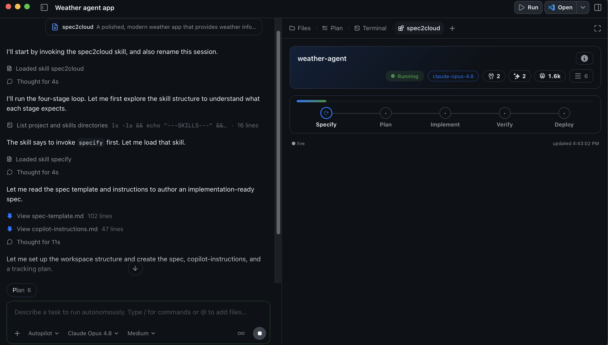
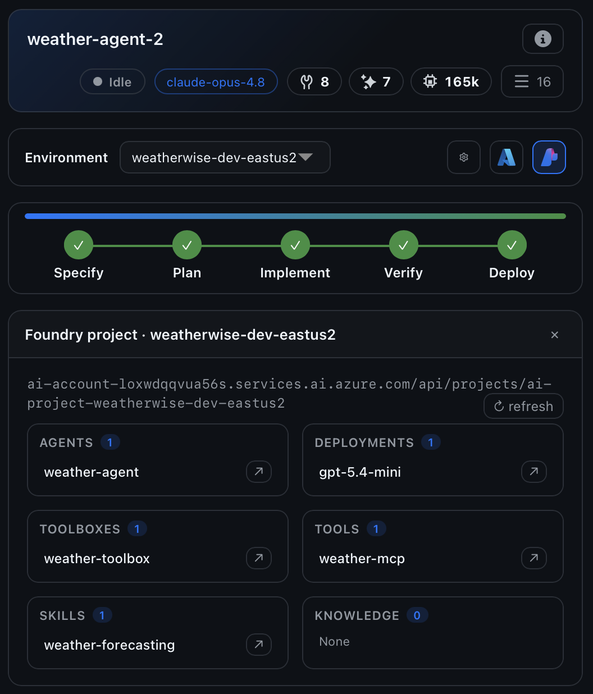
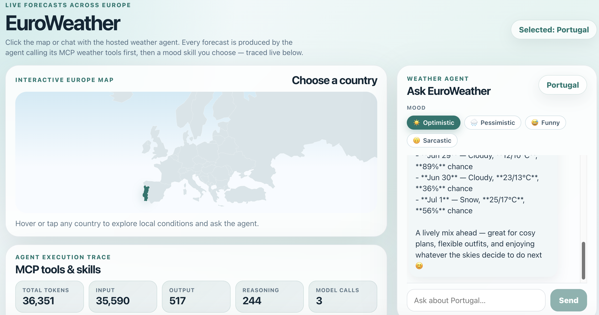
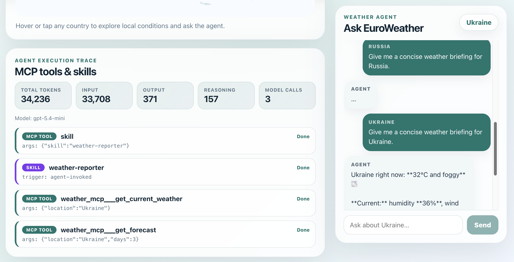
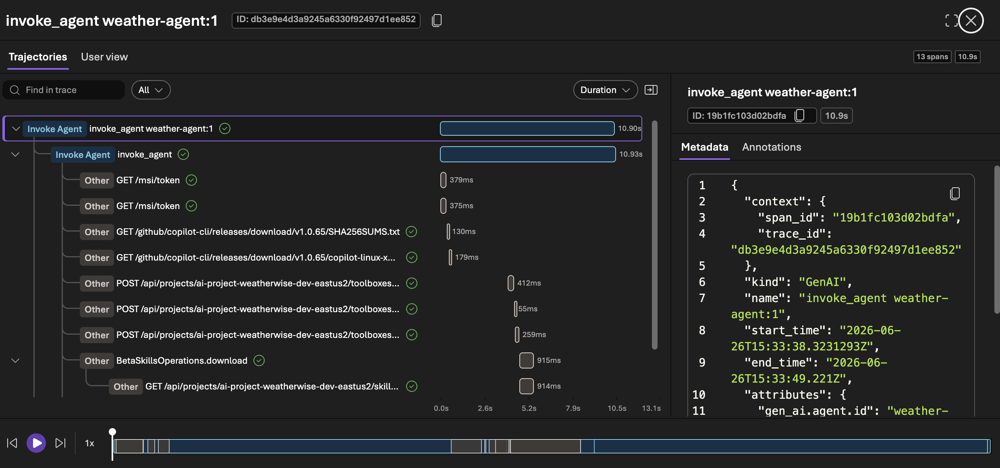

# Getting started on the Agentic Loop: Weather Agent

## Intro

### Getting started playbook

This playbook walks you through building a simple **weather agent** end-to-end with the Agentic Loop. You drive the build loop from a single prompt, and the **agentic-loop** skill applies the proven recipe on top.

The playbook is organized in three chapters:

- **Build** — go from a basic prompt to a working prototype for the weather agent.
- **Run** — operate the deployed agent and full-stack app with telemetry enabled.
- **Scale** — evolve the running solution and push changes through the loop, optionally unattended.

---

### What we will build

A chat-style web app where the user talks to a Foundry **hosted agent**. The agent uses an MCP server that returns randomized weather data — enough to exercise the full tool-call round-trip without any external API — plus an agent skill managed through a Foundry toolbox.


| Layer            | Choice (from `agentic-loop` defaults)                                        |
|------------------|------------------------------------------------------------------------------|
| Frontend         | React + Vite on Azure Container Apps                                         |
| Backend API      | Python + FastAPI on Azure Container Apps                                     |
| Agent            | Copilot SDK hosted in Microsoft Foundry                  |
| Tool             | Python based MCP server (random data)          |
| Observability    | OpenTelemetry → Application Insights (wired via Foundry)                     |
| Infra            | `azd` + Bicep (Azure Verified Modules)                                       |

Artifacts produced in your workspace mirror the five build stages:

| Stage      | Artifact                                            |
|------------|-----------------------------------------------------|
| Specify    | `./docs/spec.md`, `.github/copilot-instructions.md` |
| Plan       | `./docs/plan.md`, `./.azure/deployment-plan.md`     |
| Implement  | `./docs/implement.md`, `./src/`, etc.               |
| Verify     | `./docs/verify.md`, provisioned Azure dependencies  |
| Deploy     | Deployed Azure endpoint, `./docs/deploy.md`         |

---

### Setup

You will need:

- Azure subscription with Contributor permissions, plus a GitHub Copilot plan.
- GitHub Copilot installed and logged in — use the [Copilot App](http://gh.io/app) (recommended), the [Copilot CLI](https://github.com/features/copilot/cli/), or [Visual Studio Code](https://code.visualstudio.com/download).
- [GitHub CLI (`gh`)](https://cli.github.com/) installed and logged in.
- [Azure CLI (`az`)](https://learn.microsoft.com/en-us/cli/azure/install-azure-cli) and [Azure Developer CLI (`azd`)](https://learn.microsoft.com/en-us/azure/developer/azure-developer-cli/install-azd) installed and authenticated to your Azure subscription.
- The `lean-spec2cloud` Copilot plugin installed and updated. Click [here](https://github.com/copilot/app/launch?open=ghapp%3A%2F%2Fplugins%2Fmarketplace%2Fadd%3Fsource%3DAzure-Samples%2FSpec2Cloud)
to add the marketplace and [here](https://github.com/copilot/app/launch?open=ghapp%3A%2F%2Fplugins%2Finstall%3Fsource%3Dlean%2540Spec2Cloud) to install the plugin. Or install in the CLI with:

   ```bash
   copilot plugin marketplace add Azure-Samples/Spec2Cloud && copilot plugin install lean@Spec2Cloud
   ```

Sanity check before you go further. These commands are identical on Windows, macOS, and Linux:

```bash
az account show       # confirm the correct tenant and subscription
azd auth login --check-status   # confirm you are signed in to azd
copilot plugin list   # expect to see lean@Spec2Cloud
```

> **Heads up on cost.** This playbook provisions billable Azure resources (Container Apps, a Foundry/AI Services account, and Application Insights). Leaving them running incurs charges — see [Clean up](#clean-up) to remove everything when you are done.

## Build

### Create a new project

Take an empty workspace through the **Specify → Plan → Implement → Verify → Deploy** loop and produce a running weather agent powered by a custom MCP server (random data) and agent skills.

Create an empty folder to host the solution. A local folder gives the loop's artifacts (spec, plan, source, infra) a place to live.

```bash
mkdir weather-agent
```

> Want version control from minute one? Create a private GitHub repo
> instead:
> ```bash
> gh repo create weather-agent --private --clone
> ```

---

### Open GitHub Copilot

This playbook uses the **GitHub Copilot App**, but the same prompts work in the Copilot CLI and in VS Code.

> **Using the CLI instead?** Run 
> ```bash
> copilot --allow-all
> ```
> to launch with all permissions pre-approved, so the loop can read/write files, run commands, and fetch URLs without prompting at every step. `--allow-all` is shorthand for `--allow-all-tools --allow-all-paths --allow-all-urls` — use it only on a sandbox workspace, and drop it if you want to approve each action manually.

**1. Open the Spec2Cloud canvas** to watch the build loop execute. In the review panel on the right, click **+**, then pick **Spec2Cloud Cockpit** from the installed extensions. If it isn't listed, choose **Discover more → Import canvas from gist/URL → User scope**, then paste:

```text
https://github.com/Azure-Samples/Spec2Cloud/tree/main/.github/extensions/spec2cloud
```

The **Spec2Cloud** tab should appear now in the review panel. If doesn't appear automatically, click on **+** again and select **Spec2Cloud cockpit** from the Installed extensions.

**2. Add your project.** On the left, click **+ → Add project from → Local folder or repository**, then select the `weather-agent` folder you created.

**3. Choose a model and mode.** In the prompt box, pick a strong reasoning model (e.g. Claude Opus 4.8) and a run mode:

| Mode | Behavior |
|------|----------|
| Interactive | Step-by-step collaboration; you confirm each stage |
| Plan | Plans first, executes once you approve |
| Autopilot *(recommended)* | Runs the full loop end-to-end without interruption |

---

### Run the build loop

Paste the following starter prompt:

```text
/spec2cloud A polished, modern weather app that provides weather information and forecasts through two interfaces: a visual SVG map of Europe or a chat interface. The app retrieves data from a custom MCP server, processes it through an integrated agent skill for specialized forecasting, and offers multiple forecasting styles—optimistic, pessimistic, and others—that users can select based on their preference. All features are fully functional except for the weather data, which is randomly generated for demonstration. The app includes a trace toggle that displays agent event information, such as the tools (input/output) and skills (skill.md content) used during forecasting.
```



> Tip: GitHub Copilot App supports voice dictation using a local modal to make it easier to write your prompts.

> `/spec2cloud` runs the whole loop with the opinionated `agentic-loop` defaults baked in. That's why the prompt never mentions Foundry hosted agents, Copilot SDK, or Container Apps — the skill supplies those automatically.

> Tip: **Prefer to run the loop one stage at a time?** Use the same prompt with `/specify` first, then advance through each stage, reviewing the artifact it produces before moving on:
>
> | Command | Produces | Review in |
> |---------|----------|-----------|
> | `/specify <prompt>` | Specification | `docs/spec.md` |
> | `/plan` | Implementation + Azure deployment plan | `docs/plan.md`, `.azure/deployment-plan.md` |
> | `/implement` | azd template + source code | `src/`, `infra/`, `azure.yaml` |
> | `/verify` | Provisioned Foundry project; local smoke test | `docs/verify.md` |
> | `/deploy` | Full solution deployed to Azure | `docs/deploy.md` |

End-to-end execution time varies, but typically completes in under an hour.

When the loop finishes, Copilot returns the deployed frontend URL and the Spec2Cloud canvas auto-previews it. Clicking the **Deploy** stage opens the frontend URL (or `docs/deploy.md`).

On the canvas, click the **Azure** icon to see the deployed resources, and the **Foundry** icon to see the agents, models, and toolbox. Open the Foundry portal to review the models, agents, tools, and skills that were deployed.



---

### Troubleshooting

| Symptom | Likely cause | Fix |
|---------|--------------|-----|
| `copilot plugin list` doesn't show `lean@Spec2Cloud` | Plugin not installed | Re-run the marketplace install command in [Setup](#build-setup) |
| The **Spec2Cloud** tab never appears | Canvas extension not imported | Re-import via **Discover more → Import canvas from gist/URL → User scope** with the URL above |
| `azd` fails with an auth or subscription error | Wrong tenant or subscription selected | Run `azd auth login`, then `az account set --subscription <id>` |
| Deploy fails on quota or region | Model capacity unavailable in the chosen region | Pick a region with capacity (or lower the requested capacity) and re-run `/deploy` |
| The agent replies but no traces appear | Looking too early | Spans take a few seconds to land in Application Insights — refresh the **Traces** view |

---

## Run

### Run the Agentic Loop

Open the weather frontend and send a few prompts (e.g. *"What's the weather in Madrid?"*). Each turn is part of a conversation with the hosted agent running on Foundry.



> The picture above illustrates a previous run using the same prompt. Most likely you will get different results. To match a specific look and feel, paste a screenshot of an existing web site and ask Copilot to match it.

---

### Check the trace information

Copilot SDK emits events on which tools and skills it has used.



---

### Observe traces

Every span the agent emits already lands in Application Insights — that wiring is part of the `agentic-loop` defaults. The goal here is to **learn to read those traces** so you can debug an agent the way you'd debug a microservice.

Use the canvas to open the hosted agent in the Foundry project, then click **Traces**. Inspect a trace to see exactly what the agent did on each turn — the model call, the `get_weather` tool invocation, and the response — end to end.



---

## Scale

### Take it further

You built, ran, and scaled a full-stack agent without hand-writing the spec, infrastructure, or glue code. From here:

- **Customize the agent** — change its instructions, add tools, or swap the model, then push the change through the loop.
- **Explore the other playbooks** — apply the same loop to richer, production-grade scenarios.

> Tip: To run the loop fully unattended and scale to many more use cases, you can use the following command:
> ```bash
> copilot -p "/spec2cloud <your next big idea>" --no-ask-user --yolo -- autopilot
> ```

---

### Clean up

When you are done experimenting, delete every Azure resource the loop created so you stop incurring charges. Run this from the project root, where `azure.yaml` lives:

```bash
azd down --purge --force
```

`--purge` also removes soft-deleted resources (such as the Foundry/AI Services account and Key Vault) so their names are immediately reusable.


