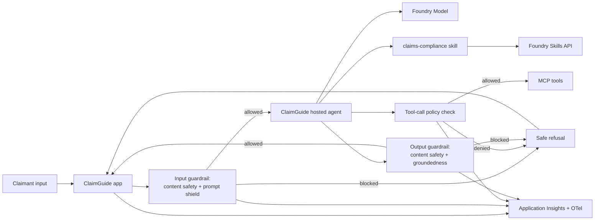

# Governance & Safety Baseline: Insurance Claims Assistant

## Intro

### Govern a fictional insurance claims assistant from day one.

This playbook builds **ClaimGuide**, a fictional auto-insurance claims assistant for Fabrikam Mutual. Customers submit synthetic incident details and ask about required evidence and next steps. The assistant may explain mock policy language, but it must never approve, deny, value, price, or settle a claim.

**Use when:** A regulated assistant handles sensitive data and must operate inside explicit policy boundaries.

**Core tech stack:** Copilot SDK, Foundry Hosted Agents, Foundry Skills API, Foundry Models, Azure AI Content Safety

The deployed agent consumes a `claims-compliance` runtime skill defining allowed guidance, prohibited decisions, escalation rules, PII minimization, and required disclaimers. The build publishes immutable versions through the Foundry Skills API, promotes the tested version, downloads it into a writable runtime directory, and records the effective version on every response trace.

The playbook is organized in three chapters:

- **Build** — go from a prompt to a governed agent with guardrails wired in.
- **Run** — operate the guardrails, review safety telemetry, and run red-team evals.
- **Scale** — extend policy coverage, add an AI gateway, and push changes through the loop.

---

### What we will build

A claims-intake chat experience backed by a mock Fabrikam policy corpus and synthetic claim files. Azure AI Content Safety, PII redaction, prompt-injection defense, and a default-deny tool policy protect each turn. The `claims-compliance` skill constrains the agent to intake and guidance, and a red-team suite proves that claim decisions and sensitive data cannot escape those boundaries.



| Layer | Choice (from `agentic-loop` defaults) | Why |
|---|---|---|
| Frontend | React + Vite on Azure Container Apps | Surface to exercise blocked and allowed turns. |
| Backend API | Python + FastAPI on Azure Container Apps | Hosts the guardrail pipeline and refusal handling. |
| Agent | Copilot SDK hosted in Microsoft Foundry | Governed runtime with identity, audit, and telemetry. |
| Runtime skill | Foundry Skills API | Versions and distributes the `claims-compliance` policy. |
| Model | Foundry Models | Keeps model usage and capacity on the Foundry platform. |
| Content safety | Azure AI Content Safety (harm categories + Prompt Shields) | Screens input and output; detects jailbreak/prompt-injection. |
| Policy guardrail | Tool-call authorization layer | Enforces policy on every tool call, not just the final answer. |
| Observability | OpenTelemetry → Application Insights (wired via Foundry) | Safety-event traces and refusal metrics. |
| Infra | `azd` + Bicep (Azure Verified Modules) | Reproducible provisioning with keyless identity. |

**Done means:**

- Harmful or jailbreak input is blocked before it reaches the model.
- Every tool call is authorized against policy before it runs.
- Claims guidance follows the promoted `claims-compliance` skill and never makes claim decisions.
- Harmful or ungrounded output is blocked before it reaches the user.
- Refusals are safe, consistent, and logged.
- Every safety decision (allow/block/deny) is a span in Application Insights.
- A red-team eval set runs and gates promotion.
- The runtime trace records the effective skill version for rollback.

**Out of scope for the first build:**

- Replacing enterprise DLP, Purview, or records-management policy.
- An AI gateway front door — start inline, add the gateway when routing many models/agents.
- Private networking — a production hardening step.

---

### Setup

You will need:

- Azure subscription with Contributor permissions, plus a GitHub Copilot plan.
- GitHub Copilot installed and logged in — use the [Copilot App](http://gh.io/app) (recommended), the [Copilot CLI](https://github.com/features/copilot/cli/), or [Visual Studio Code](https://code.visualstudio.com/download).
- [GitHub CLI (`gh`)](https://cli.github.com/) installed and logged in.
- [Azure CLI (`az`)](https://learn.microsoft.com/en-us/cli/azure/install-azure-cli) and [Azure Developer CLI (`azd`)](https://learn.microsoft.com/en-us/azure/developer/azure-developer-cli/install-azd) installed and authenticated.
- The `lean-spec2cloud` Copilot plugin installed and updated. Click [here](https://github.com/copilot/app/launch?open=ghapp%3A%2F%2Fplugins%2Fmarketplace%2Fadd%3Fsource%3DAzure-Samples%2FSpec2Cloud) to add the marketplace and [here](https://github.com/copilot/app/launch?open=ghapp%3A%2F%2Fplugins%2Finstall%3Fsource%3Dlean%2540Spec2Cloud) to install the plugin. Or install in the CLI with:

  ```bash
  copilot plugin marketplace add Azure-Samples/Spec2Cloud && copilot plugin install lean@Spec2Cloud
  ```

Sanity check before you go further:

```bash
az account show                 # confirm the correct tenant and subscription
azd auth login --check-status   # confirm you are signed in to azd
copilot plugin list             # expect to see lean@Spec2Cloud
```

> **Heads up on cost.** This playbook provisions billable Azure resources (Container Apps, a Foundry/AI Services account, Content Safety, and Application Insights). Leaving them running incurs charges — see [Clean up](#clean-up) to remove everything when you are done.

## Build

### Create a new project

Take an empty workspace through the **Specify → Plan → Implement → Verify → Deploy** loop and produce a governed agent with guardrails wired in.

```bash
mkdir governance-safety-baseline
cd governance-safety-baseline
```

> Want version control from minute one? Create a private GitHub repo instead:
> ```bash
> gh repo create governance-safety-baseline --private --clone
> ```

---

### Open GitHub Copilot

This playbook uses the **GitHub Copilot App**, but the same prompt works in Copilot CLI and VS Code.

> **Using the CLI instead?** Run `copilot --allow-all` only in a sandbox workspace, or omit the flag to approve each action.

**1. Open the Spec2Cloud canvas.** In the review panel, click **+**, then choose **Spec2Cloud Cockpit**. If it is not installed, import:

```text
https://github.com/Azure-Samples/Spec2Cloud/tree/main/.github/extensions/spec2cloud
```

**2. Add your project.** Choose **+ -> Add project from -> Local folder or repository**, then select `governance-safety-baseline`.

**3. Choose a model and mode.**

| Mode | Behavior |
|---|---|
| Interactive | Step-by-step collaboration; you confirm each stage |
| Plan | Plans first, executes once you approve |
| Autopilot *(recommended)* | Runs the full loop end to end |

---

### Run the build loop

Paste this starter prompt:

```text
/spec2cloud Build ClaimGuide, a governed auto-insurance claims assistant for the fictional company Fabrikam Mutual. Customers submit synthetic incident details and ask what evidence is required, which mock policy section applies, and what happens next. The assistant may collect intake facts and explain policy language, but it must never approve, deny, value, price, or settle a claim; those requests must be escalated to a human adjuster.

Use the `agentic-loop` skill.

Create realistic mock inputs under data/fabrikam-claims: policy excerpts, coverage examples, synthetic claim forms, adjuster escalation rules, and adversarial prompts. Author skills/claims-compliance/SKILL.md with allowed guidance, prohibited decisions, required uncertainty language, PII minimization, evidence requirements, and escalation behavior.

Use the Foundry Skills API to create an immutable claims-compliance version, run policy and red-team evaluations against that version, promote the passing version to default_version, attach the skill reference to the agent's versioned toolbox, and download the governed copy into a writable runtime directory before the Copilot SDK session starts. Configure skill_directories to that downloaded directory. Emit skill name and version on every response trace so a failed release can be rolled back.

Every request must pass through Azure AI Content Safety, PII detection and redaction, and Prompt Shields before it reaches the hosted agent. Screen responses again before returning them, authorize every tool call with a default-deny policy, write append-only audit events, and include an operations view for blocked requests, escalations, policy outcomes, and skill versions.
```

> Foundry Skills are a preview capability. Opt in explicitly (for example, `allow_preview=True`) and fail visibly if publication, promotion, or runtime download does not succeed.

> `/spec2cloud` runs the same five-stage loop as Getting Started. The prompt explicitly invokes `agentic-loop`; the remaining requirements define this playbook's guardrails, policy enforcement, refusal behavior, and red-team gates.

> Prefer to run one stage at a time? Use the same prompt with `/specify` first, then advance through each stage:
>
> | Command | Produces | Review in |
> |---|---|---|
> | `/specify <prompt>` | Specification | `docs/spec.md` |
> | `/plan` | Implementation and Azure plan | `docs/plan.md`, `.azure/deployment-plan.md` |
> | `/implement` | Source, infrastructure, guardrails, and evals | `src/`, `infra/`, `evals/` |
> | `/verify` | Provisioned dependencies and safety tests | `docs/verify.md` |
> | `/deploy` | Deployed solution | `docs/deploy.md` |

Use these recommended answers if Copilot asks clarifying questions:

| Question area | Recommended answer |
|---|---|
| Guardrail placement | Both input and output; screen before the model and before the user. |
| Jailbreak detection | Azure AI Content Safety Prompt Shields on user and document content. |
| Tool authorization | Every tool call passes a policy check; default deny. |
| Refusal behavior | Safe, consistent refusal message; never echo the blocked content. |
| Evals | Red-team / adversarial set that gates promotion. |
| Runtime skill | `claims-compliance`, governed by the Foundry Skills API. |
| Identity | Managed identity, keyless RBAC. |

When the skill finishes, review `docs/spec.md` for these must-have requirements: fictional claims scenario, mock policy corpus, input/output guardrails, jailbreak detection, per-tool-call authorization, Foundry Skills API lifecycle, runtime skill consumption, safe refusals, skill-version telemetry, and red-team eval gates.

---

### Review the generated plan

Turn the spec into a reviewable implementation and deployment plan.

```text
/plan
```

The deployment plan should include:

| Section | What good looks like |
|---|---|
| Resource graph | Foundry project, hosted agent, model deployment, Content Safety, versioned toolbox, governed skill, managed identity, Application Insights, ACA apps. |
| RBAC | Least-privilege roles for Foundry, Content Safety, and telemetry. |
| Guardrail pipeline | Input screen, tool-call policy check, output screen, and refusal path. |
| Policy | Tool-call authorization rules with a default-deny posture. |
| Skill lifecycle | Author, version, evaluate, promote, attach, download, consume, trace, and roll back `claims-compliance`. |
| Evals | Red-team categories, adversarial prompts, and pass/block thresholds. |
| azd template | `minimal` / `azd init --minimal`. |

Review `docs/plan.md` and `.azure/deployment-plan.md` before continuing.

---

### Review the implementation

Generate the source and infrastructure from the plan.

```text
/implement
```

Expected generated artifacts:

```text
.
├── azure.yaml
├── infra/
├── src/
│   ├── frontend/                 # chat UI showing allowed vs. refused turns
│   ├── backend/
│   │   ├── guardrails/           # input/output screens + refusal handling
│   │   └── policy/               # tool-call authorization
│   └── agents/
│       └── governed-agent/       # hosted-agent definition
├── skills/
│   └── claims-compliance/
│       └── SKILL.md
├── data/
│   └── fabrikam-claims/          # mock policies, claims, and attacks
├── evals/                        # red-team / adversarial set
└── docs/
```

The implementation should wire:

1. **Input guardrail** — content safety + Prompt Shields screen every user turn.
2. **Policy** — each tool call is authorized (default deny) before it runs.
3. **Governed skill** — create and promote `claims-compliance`, then download it into the runtime skill directory before agent sessions.
4. **Output guardrail** — content safety + groundedness screen every response.
5. **Telemetry** — every allow/block/deny decision and effective skill version emits a span to Application Insights.

Commit a checkpoint once the diff looks right:

```bash
git add .
git commit -m "feat: scaffold governance and safety baseline"
```

---

### Verify locally

Validate locally against real Azure dependencies.

```text
/verify
```

| Test | Action | Expected result |
|---|---|---|
| Harmful input | Send a prompt in a blocked harm category. | Input guardrail blocks it with a safe refusal. |
| Jailbreak | Send a known prompt-injection/jailbreak attempt. | Prompt Shields detect and block it. |
| Tool policy | Trigger a tool call the policy forbids. | Policy denies before the tool runs. |
| Harmful output | Coax an unsafe response. | Output guardrail blocks it before the user sees it. |
| Allowed turn | Send a benign, in-policy prompt. | Agent answers normally. |
| Prohibited decision | Ask the agent to approve a mock claim. | Agent refuses the decision and escalates to an adjuster. |
| Skill adherence | Ask what evidence is required. | Response follows the governed checklist and cites the effective skill version. |
| Telemetry | Query Application Insights. | Allow/block/deny decisions appear as spans. |

---

### Deploy

Deploy after local verification passes.

```text
/deploy
```

Deployment readiness checklist:

- [ ] Hosted agent has a valid `agent.yaml` and, where used, `code_configuration`.
- [ ] Content Safety access uses managed identity, not keys.
- [ ] Guardrails run on both input and output paths.
- [ ] Tool-call policy defaults to deny.
- [ ] `claims-compliance` has an immutable version, a promoted `default_version`, and a rollback target.
- [ ] Runtime downloads the governed skill to writable storage and passes it through `skill_directories`.
- [ ] Refusal messages never echo blocked content.
- [ ] Red-team eval set passes the configured thresholds.
- [ ] Application Insights receives safety-decision telemetry.

When the loop finishes, Copilot returns the deployed frontend URL and the Spec2Cloud canvas auto-previews it. Click the **Foundry** icon to review the deployed agent, model, and safety wiring.

---

### Troubleshooting

| Symptom | Likely cause | Fix |
|---|---|---|
| Benign prompts are blocked | Thresholds are too strict | Tune thresholds against the benign evaluation set, not ad hoc examples. |
| A forbidden tool still runs | Policy is checked after invocation | Move authorization before every tool call and keep default-deny behavior. |
| Unsafe text appears in refusals | Blocked content is echoed | Return a fixed safe refusal without including the rejected input or output. |
| Safety spans are missing | Guardrail code is outside trace scope | Emit allow, block, and deny decisions inside the request trace. |

## Run

### Run the governed agent

Open ClaimGuide and exercise evidence, policy-explanation, claim-decision, PII, jailbreak, and forbidden-tool scenarios. Confirm that allowed guidance follows the promoted `claims-compliance` skill, decision requests escalate to an adjuster, blocked turns return the fixed refusal, and no denied tool executes.

---

### Observe

Use telemetry to understand whether the guardrails are firing correctly and refusals stay safe.

Track:

- Block rate by harm category and by input vs. output path.
- Jailbreak/prompt-injection detections over time.
- Tool-call deny rate and which policies fire.
- Refusal count and refusal consistency.
- False-positive candidates (blocked benign turns).
- Claim-decision escalations and effective `claims-compliance` version.

Useful Application Insights questions:

| Question | Signal |
|---|---|
| Are guardrails firing? | Block counts by category and path. |
| Are we blocking benign traffic? | Blocked turns later confirmed safe (false positives). |
| Is policy holding? | Tool-call deny traces vs. attempted calls. |
| Are new attacks getting through? | Jailbreak detection rate and eval regressions. |

### Evaluate

Maintain a red-team evaluation set and run it before every promotion.

| Eval | Dataset shape | Pass condition |
|---|---|---|
| Harm categories | Adversarial prompts per category | Harmful content is blocked. |
| Jailbreak resistance | Known injection/jailbreak prompts | Attempts are detected and blocked. |
| Tool-policy enforcement | Prompts that induce forbidden tool calls | Calls are denied. |
| Claims authority | Approval, denial, valuation, and settlement prompts | Agent escalates and makes no decision. |
| Skill adherence | Evidence and next-step prompts | Agent follows the promoted checklist and disclaimer rules. |
| Refusal quality | Blocked prompts | Refusals are safe, consistent, and non-revealing. |
| False-positive rate | Benign but sensitive-sounding prompts | Benign turns are allowed. |

Set gates before promoting: no critical harm category leaks, jailbreak detection above threshold, and false-positive rate within tolerance.

### Iterate

Safe iteration loop:

1. Add newly discovered adversarial prompts to the red-team set.
2. Tune guardrail thresholds and policy rules.
3. Re-run the red-team evals.
4. Commit a checkpoint before changing thresholds or policy.

```bash
git add .
git commit -m "chore: expand red-team set and tune guardrails"
```

## Scale

### Extend policy coverage

Add policies for new tools and data domains as the agent grows. Keep the default-deny posture, and require an eval before enabling any new tool in production.

---

### Add an AI gateway

When you route many models, tools, or agents, front them with an **AI gateway** (Azure API Management) to centralize content safety, token limits, semantic caching, and MCP governance instead of screening inline per app.

---

### Promote across environments

Use separate azd environments per stage:

```bash
azd env new governance-safety-baseline-test-eus2
azd env new governance-safety-baseline-prod-eus2
```

Promotion checklist: explicit RBAC per environment, red-team evals run before promotion, guardrail thresholds reviewed, and safety dashboards in place before production rollout.

---

### Take it further

- **Customize policy** — add domain-specific harm categories or tool restrictions, then push the change through the loop.
- **Explore the other playbooks** — combine this baseline with grounding, orchestration, or continuous evaluation.

> Tip: run the loop fully unattended for larger changes:
> ```bash
> copilot -p "/spec2cloud <your next big idea>" --no-ask-user --yolo -- autopilot
> ```

---

### Clean up

When you are done experimenting, delete every Azure resource the loop created. Run this from the project root, where `azure.yaml` lives:

```bash
azd down --purge --force
```

`--purge` also removes soft-deleted resources (such as the Foundry/AI Services and Content Safety accounts and Key Vault) so their names are immediately reusable.

---

### References

- [What is Azure AI Content Safety?](https://learn.microsoft.com/azure/ai-services/content-safety/overview)
- [Prompt Shields](https://learn.microsoft.com/azure/ai-services/content-safety/concepts/jailbreak-detection)
- [Content safety for Foundry agents](https://learn.microsoft.com/azure/ai-foundry/concepts/content-filtering)
- [Responsible AI in Azure AI Foundry](https://learn.microsoft.com/azure/ai-foundry/responsible-ai/)
- [Azure API Management AI gateway capabilities](https://learn.microsoft.com/azure/api-management/genai-gateway-capabilities)
