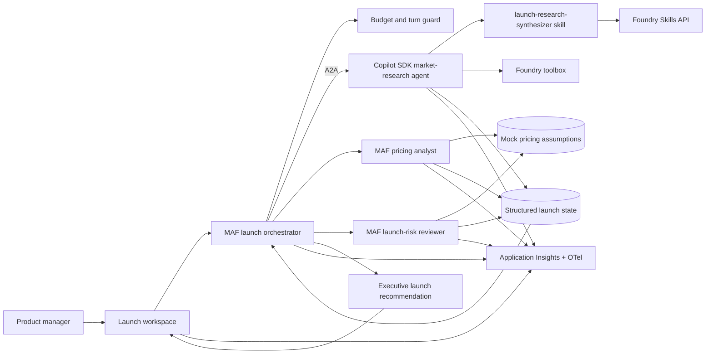

# Multi-Agent Orchestration: Product Launch Command Center

## Intro

### Product launch command center playbook

This playbook builds a **Product Launch Command Center** for a fictional bicycle company, Northstar Bikes. A product manager submits a launch brief for a new e-bike, and a Microsoft Agent Framework workflow coordinates specialist agents that research the market, model pricing, review launch risks, and assemble an executive recommendation.

**Use when:** A business workflow needs specialized agents built with different frameworks to collaborate through governed contracts.

**Core tech stack:** Microsoft Agent Framework, GitHub Copilot SDK, Foundry Hosted Agents, Foundry Skills API, A2A, Foundry Models

The **MAF launch orchestrator** owns the graph and fan-out/fan-in workflow. It calls a **Copilot SDK market-research agent** over Foundry A2A and two MAF specialists: a pricing analyst and a launch-risk reviewer. The Copilot SDK specialist must use the `launch-research-synthesizer` skill, which is authored locally, versioned through the Foundry Skills API, promoted to `default_version`, and downloaded into its runtime skill directory.

The playbook is organized in three chapters:

- **Build** — generate the mock launch packet, heterogeneous agents, orchestration graph, and governed skill.
- **Run** — submit launch decisions and inspect per-agent, A2A, skill, and budget telemetry.
- **Scale** — add specialists, stronger hand-off contracts, and production data sources.

---

### What we will build

A chat-style launch workspace where a product manager submits the Northstar **Aurora e-bike** launch packet. A MAF orchestrator fans out work to three hosted specialists, then combines their structured outputs into a recommendation with positioning, price range, risks, evidence, and unresolved decisions.



| Layer | Choice (from `agentic-loop` defaults) | Why |
|---|---|---|
| Frontend | React + Vite on Azure Container Apps | Simple surface to submit tasks and watch hand-offs. |
| Backend API | Python + FastAPI on Azure Container Apps | Hosts the orchestration entrypoint and session state. |
| Orchestrator | Microsoft Agent Framework workflow | Owns the graph, fan-out/fan-in, budgets, and structured aggregation. |
| Market research | GitHub Copilot SDK hosted agent over A2A | Uses the governed `launch-research-synthesizer` skill for evidence synthesis. |
| Pricing and risk | Microsoft Agent Framework hosted agents | Produce typed pricing and risk outputs from the mock launch packet. |
| Model | Foundry Models | Keeps model usage and capacity on the Foundry platform. |
| Skill lifecycle | Foundry Skills API + toolbox | Versions, promotes, and distributes the research skill without baking it into the image. |
| Agent composition | Foundry A2A | Lets the MAF orchestrator call the Copilot SDK specialist as a governed remote agent. |
| Shared memory | Session/state store passed across hand-offs | Carries context so executors don't re-derive it. |
| Observability | OpenTelemetry → Application Insights (wired via Foundry) | Per-agent traces, token usage, and hand-off spans. |
| Infra | `azd` + Bicep (Azure Verified Modules) | Reproducible provisioning of the whole topology. |

**Done means:**

- A single user request is decomposed by the planner and routed to the right executor(s).
- The MAF orchestrator coordinates at least two MAF specialists and one Copilot SDK specialist.
- Hand-offs pass structured context, not raw chat history dumps.
- Shared memory lets an executor build on another's output.
- Each turn stays within its token and tool-call budget.
- The Copilot SDK specialist downloads and follows the promoted `launch-research-synthesizer` skill version.
- Every agent, hand-off, and tool call is visible as a span in Application Insights.

**Out of scope for the first build:**

- Live market, CRM, or finance data — the first build uses a committed mock launch packet.
- More than three specialists — add roles only after the hand-off contracts are stable.
- Private networking — a production hardening step, not the first run.
- Long-lived durable workflows — add durable orchestration once the topology is stable.

---

### Setup

You will need:

- Azure subscription with Contributor permissions, plus a GitHub Copilot plan.
- GitHub Copilot installed and logged in — use the [Copilot App](http://gh.io/app) (recommended), the [Copilot CLI](https://github.com/features/copilot/cli/), or [Visual Studio Code](https://code.visualstudio.com/download).
- [GitHub CLI (`gh`)](https://cli.github.com/) installed and logged in.
- [Azure CLI (`az`)](https://learn.microsoft.com/en-us/cli/azure/install-azure-cli) and [Azure Developer CLI (`azd`)](https://learn.microsoft.com/en-us/azure/developer/azure-developer-cli/install-azd) installed and authenticated.
- The `lean-spec2cloud` Copilot plugin installed and updated. Click [here](https://github.com/copilot/app/launch?open=ghapp%3A%2F%2Fplugins%2Fmarketplace%2Fadd%3Fsource%3DAzure-Samples%2FSpec2Cloud) to add the marketplace and [here](https://github.com/copilot/app/launch?open=ghapp%3A%2F%2Fplugins%2Finstall%3Fsource%3Dlean%2540Spec2Cloud) to install the plugin. Or install in the CLI with:

  ```bash
  copilot plugin marketplace add Azure-Samples/Spec2Cloud && copilot plugin install lean@Spec2Cloud
  ```

Sanity check before you go further:

```bash
az account show                 # confirm the correct tenant and subscription
azd auth login --check-status   # confirm you are signed in to azd
copilot plugin list             # expect to see lean@Spec2Cloud
```

> **Heads up on cost.** This playbook provisions billable Azure resources (Container Apps, a Foundry/AI Services account, multiple hosted agents, and Application Insights). Leaving them running incurs charges — see [Clean up](#clean-up) to remove everything when you are done.

## Build

### Create a new project

Take an empty workspace through the **Specify → Plan → Implement → Verify → Deploy** loop and produce the Northstar launch command center.

```bash
mkdir multi-agent-orchestration
cd multi-agent-orchestration
```

> Want version control from minute one? Create a private GitHub repo instead:
> ```bash
> gh repo create multi-agent-orchestration --private --clone
> ```

---

### Open GitHub Copilot

This playbook uses the **GitHub Copilot App**, but the same prompt works in Copilot CLI and VS Code.

> **Using the CLI instead?** Run `copilot --allow-all` only in a sandbox workspace, or omit the flag to approve each action.

**1. Open the Spec2Cloud canvas.** In the review panel, click **+**, then choose **Spec2Cloud Cockpit**. If it is not installed, import:

```text
https://github.com/Azure-Samples/Spec2Cloud/tree/main/.github/extensions/spec2cloud
```

**2. Add your project.** Choose **+ -> Add project from -> Local folder or repository**, then select `multi-agent-orchestration`.

**3. Choose a model and mode.**

| Mode | Behavior |
|---|---|
| Interactive | Step-by-step collaboration; you confirm each stage |
| Plan | Plans first, executes once you approve |
| Autopilot *(recommended)* | Runs the full loop end to end |

---

### Run the build loop

Paste this starter prompt:

```text
/spec2cloud Build a Product Launch Command Center for the fictional company Northstar Bikes. A product manager submits the launch packet for the Aurora e-bike and receives an executive recommendation covering target segments, positioning, evidence, price range, launch risks, mitigations, and unresolved decisions.

Before planning or implementation, install and run the agentic-loop skill (`aiappsgbb/agentic-loop`, skill `agentic-loop`) to enhance the spec with its app, agent runtime, Azure infrastructure, identity, and telemetry defaults.

Implement the orchestration as a Microsoft Agent Framework graph with a MAF launch orchestrator that fans out to three hosted specialists and aggregates typed results. The pricing analyst and launch-risk reviewer must also be MAF agents. The market-research specialist must be a separate GitHub Copilot SDK hosted agent exposed to the orchestrator through Foundry A2A. Do not combine MAF and Copilot SDK inside one agent.

Create a realistic mock launch packet under data/northstar-aurora-launch with product specifications, customer interview excerpts, competitor snapshots, pricing assumptions, channel constraints, and a seed risk register. Author skills/launch-research-synthesizer/SKILL.md to instruct the Copilot SDK specialist how to rank evidence, separate facts from assumptions, cite mock source files, and produce the typed research hand-off. Create an immutable version through the Foundry Skills API, promote it to default_version, attach it to the research toolbox, and download the governed copy into the Copilot SDK agent's writable runtime skill directory before each session. Include evals that prove the skill was loaded and followed.

Cap tokens, tool calls, and A2A calls per launch run. Include a trace view for the MAF workflow, every specialist, A2A hand-offs, skill name/version, toolbox calls, and final aggregation.
```

> Foundry Skills and A2A are preview capabilities. Opt in explicitly (for example, `allow_preview=True`) and fail visibly if publication, promotion, download, or A2A registration does not succeed.

> `/spec2cloud` runs the same five-stage loop as Getting Started. The prompt explicitly invokes `agentic-loop`; the remaining requirements define the MAF graph, heterogeneous specialists, governed skill, A2A hand-off, shared state, and budget controls.

> Prefer to run one stage at a time? Use the same prompt with `/specify` first, then advance through each stage:
>
> | Command | Produces | Review in |
> |---|---|---|
> | `/specify <prompt>` | Specification | `docs/spec.md` |
> | `/plan` | Implementation and Azure plan | `docs/plan.md`, `.azure/deployment-plan.md` |
> | `/implement` | Source, infrastructure, agents, and tools | `src/`, `infra/`, `azure.yaml` |
> | `/verify` | Provisioned dependencies and smoke tests | `docs/verify.md` |
> | `/deploy` | Deployed solution | `docs/deploy.md` |

Use these recommended answers if Copilot asks clarifying questions:

| Question area | Recommended answer |
|---|---|
| Topology | Planner-executor with explicit hand-offs. |
| Orchestrator | MAF graph workflow with fan-out/fan-in and typed state. |
| Specialists | Copilot SDK market research; MAF pricing; MAF launch risk. |
| Cross-framework call | Foundry A2A from the MAF orchestrator to the Copilot SDK agent. |
| Runtime skill | `launch-research-synthesizer`, consumed only by the Copilot SDK specialist. |
| Mock data | Committed Northstar Aurora launch packet; no external market API. |
| Shared state | Session-scoped shared memory passed across hand-offs. |
| Budget control | Per-turn token and tool-call caps with a guard that stops runaway loops. |
| Tools | MCP servers published through a Foundry toolbox. |

When the skill finishes, review `docs/spec.md` for these must-have requirements: MAF orchestration graph, two MAF specialists, one Copilot SDK A2A specialist, typed hand-offs, mock launch packet, per-run budget guard, Foundry Skills API lifecycle, runtime skill download, and end-to-end tracing.

---

### Review the generated plan

Turn the spec into a reviewable implementation and deployment plan.

```text
/plan
```

The deployment plan should include:

| Section | What good looks like |
|---|---|
| Resource graph | Foundry project, MAF orchestrator, two MAF specialists, Copilot SDK specialist, A2A endpoint, toolbox, skill version, models, identity, Application Insights, ACA apps. |
| RBAC | Least-privilege roles for Foundry, telemetry, and any state store. |
| Orchestration | MAF fan-out/fan-in graph, A2A call, typed state, hand-off schemas, and aggregation strategy. |
| Budget | Token and tool-call caps per turn, plus the guard's stop behavior. |
| Skill lifecycle | Author, version, evaluate, promote, attach, download, trace, and roll back `launch-research-synthesizer`. |
| azd template | `minimal` / `azd init --minimal`. |

Review `docs/plan.md` and `.azure/deployment-plan.md` before continuing.

---

### Review the implementation

Generate the source and infrastructure from the plan.

```text
/implement
```

Expected generated artifacts:

```text
.
├── azure.yaml
├── infra/
├── src/
│   ├── frontend/                 # chat UI with hand-off trace view
│   ├── backend/                  # orchestration entrypoint + session state
│   └── agents/
│       ├── launch-orchestrator/  # MAF workflow + aggregation
│       ├── market-research/      # Copilot SDK + A2A + governed skill
│       ├── pricing-analyst/      # MAF specialist
│       └── launch-risk/          # MAF specialist
├── skills/
│   └── launch-research-synthesizer/
│       └── SKILL.md
├── data/
│   └── northstar-aurora-launch/  # mock launch packet
└── docs/
```

The implementation should wire:

1. **MAF workflow** — the orchestrator fans out to pricing, risk, and market research, then aggregates typed results.
2. **Heterogeneous agents** — pricing and risk use MAF; market research uses Copilot SDK and is called over A2A.
3. **Governed skill** — create and promote `launch-research-synthesizer` through the Foundry Skills API, attach it to the toolbox, and download it before the Copilot session starts.
4. **Hand-offs and state** — pass typed launch evidence, pricing, and risk objects rather than raw chat history.
5. **Budget and telemetry** — cap tokens/tool/A2A calls and trace every agent, skill version, hand-off, and aggregation.

Commit a checkpoint once the diff looks right:

```bash
git add .
git commit -m "feat: scaffold multi-agent orchestration"
```

---

### Verify locally

Validate locally against real Azure dependencies.

```text
/verify
```

| Test | Action | Expected result |
|---|---|---|
| Decomposition | Submit the Aurora launch packet. | MAF orchestrator fans out to all three specialists. |
| Cross-framework | Inspect the market-research call. | MAF invokes the Copilot SDK agent through A2A. |
| Skill use | Ask for evidence-backed positioning. | Trace shows the promoted `launch-research-synthesizer` version and cited mock files. |
| MAF specialists | Inspect pricing and risk outputs. | Both are typed results from MAF agents. |
| Hand-off | Inspect the payload passed to an executor. | Structured context, not a raw chat dump. |
| Shared memory | Have one executor consume another's output. | Second executor builds on the first without re-deriving it. |
| Budget cap | Submit a task that would loop. | The guard stops the turn at the configured cap. |
| Aggregation | Review the final answer. | One coherent response, not stitched fragments. |
| Telemetry | Query Application Insights. | Per-agent, hand-off, and tool spans are visible. |

---

### Deploy

Deploy after local verification passes.

```text
/deploy
```

Deployment readiness checklist:

- [ ] Each hosted agent has a valid `agent.yaml` and, where used, `code_configuration`.
- [ ] MAF orchestrator calls the Copilot SDK specialist through a verified A2A endpoint.
- [ ] Pricing and risk specialists are MAF agents with typed contracts.
- [ ] `launch-research-synthesizer` has an immutable Foundry skill version, promoted `default_version`, and rollback target.
- [ ] Copilot SDK startup downloads the governed skill into a writable runtime directory and configures `skill_directories`.
- [ ] Budget guard limits are set from configuration, not hardcoded.
- [ ] `.agentignore` and per-service `.dockerignore` exclude local build artifacts.
- [ ] Container app names respect the 32-character Azure Container Apps limit.
- [ ] Decomposition, hand-off, and budget-cap tests pass.
- [ ] Application Insights receives per-agent telemetry.

When the loop finishes, Copilot returns the deployed frontend URL and the Spec2Cloud canvas auto-previews it. Click the **Foundry** icon to see every agent, model, tool, and toolbox that was deployed.

---

### Troubleshooting

| Symptom | Likely cause | Fix |
|---|---|---|
| Planner never delegates | Roles or routing criteria are vague | Make each executor's responsibility and hand-off contract explicit in the spec. |
| Agents repeat work | Shared state is missing or unstructured | Pass typed hand-off fields and persist session-scoped state. |
| A turn exceeds budget | Guard limits are not enforced centrally | Enforce token and tool-call caps before each hand-off and tool call. |
| Traces stop at the planner | Context is not propagated | Carry the trace context through every hosted-agent and MCP invocation. |

## Run

### Run the orchestration

Open the deployed app and submit the Northstar Aurora launch packet. Confirm that the MAF workflow invokes the pricing and risk MAF agents plus the Copilot SDK research agent, the research trace names the governed skill version, and the final launch recommendation stays within budget.

---

### Observe

Use telemetry to understand whether the topology is healthy, on-budget, and coordinating correctly.

Track:

- Per-agent request count, latency, and failures.
- Hand-off count and hand-off failures per turn.
- Token usage and tool-call count against the per-turn budget.
- Planner routing decisions and mis-routes.
- Shared-memory read/write errors.

Useful Application Insights questions:

| Question | Signal |
|---|---|
| Is the planner routing correctly? | Routing decision traces vs. executor invoked. |
| Are we over budget? | Token/tool-call counts against the configured caps. |
| Where is latency spent? | Span durations per agent and per hand-off. |
| Are hand-offs reliable? | Hand-off success rate and retry counts. |

### Evaluate

Create a small evaluation set before broad rollout.

| Eval | Dataset shape | Pass condition |
|---|---|---|
| Routing accuracy | Launch request, expected specialists | MAF orchestrator selects the correct specialists. |
| Framework boundary | Launch request, expected runtime | Research uses Copilot SDK; pricing and risk use MAF. |
| Skill adherence | Research task, mock evidence, expected citations | Copilot specialist follows the governed skill and cites source files. |
| Hand-off fidelity | Task, expected context fields | Executor receives the required structured context. |
| Answer quality | Task, reference answer | Aggregated answer matches the reference intent. |
| Budget adherence | Task designed to loop | Turn stops within the configured cap. |
| Latency | Representative tasks | p95 latency stays within the pilot target. |

### Iterate

Safe iteration loop:

1. Adjust planner routing rules, hand-off contract, or budget caps.
2. Re-run routing and hand-off evals.
3. Review per-agent traces and token usage.
4. Commit a checkpoint before changing prompts or topology.

```bash
git add .
git commit -m "chore: tune planner routing and budget caps"
```

## Scale

### Add more specialists

Add one executor at a time. For each new role: define its hand-off contract, register its tools on the shared toolbox, and add a routing rule to the planner. Re-run routing evals before promoting.

---

### Harden coordination

- Make hand-offs idempotent so retries don't duplicate work.
- Add fallbacks when an executor fails or times out.
- Consider Microsoft Agent Framework graph/workflow orchestration when the topology outgrows simple planner routing.
- Add durable orchestration for long-running, multi-turn tasks.

---

### Promote across environments

Use separate azd environments per stage:

```bash
azd env new multi-agent-orchestration-test-eus2
azd env new multi-agent-orchestration-prod-eus2
```

Promotion checklist: explicit RBAC per environment, evals run before promotion, budget caps reviewed, and telemetry dashboards in place before production rollout.

---

### Take it further

- **Customize the topology** — change routing, add a critic agent, or swap models per role, then push the change through the loop.
- **Explore the other playbooks** — apply the same loop to grounding, governance, and evaluation scenarios.

> Tip: run the loop fully unattended for larger changes:
> ```bash
> copilot -p "/spec2cloud <your next big idea>" --no-ask-user --yolo -- autopilot
> ```

---

### Clean up

When you are done experimenting, delete every Azure resource the loop created. Run this from the project root, where `azure.yaml` lives:

```bash
azd down --purge --force
```

`--purge` also removes soft-deleted resources (such as the Foundry/AI Services account and Key Vault) so their names are immediately reusable.

---

### References

- [Microsoft Agent Framework](https://learn.microsoft.com/agent-framework/)
- [What are Foundry Agents?](https://learn.microsoft.com/azure/ai-foundry/agents/overview)
- [Connect tools to Foundry agents](https://learn.microsoft.com/azure/ai-foundry/agents/how-to/tools/overview)
- [Model Context Protocol (MCP)](https://modelcontextprotocol.io/)
- [Observability for generative AI applications](https://learn.microsoft.com/azure/ai-foundry/concepts/observability)
