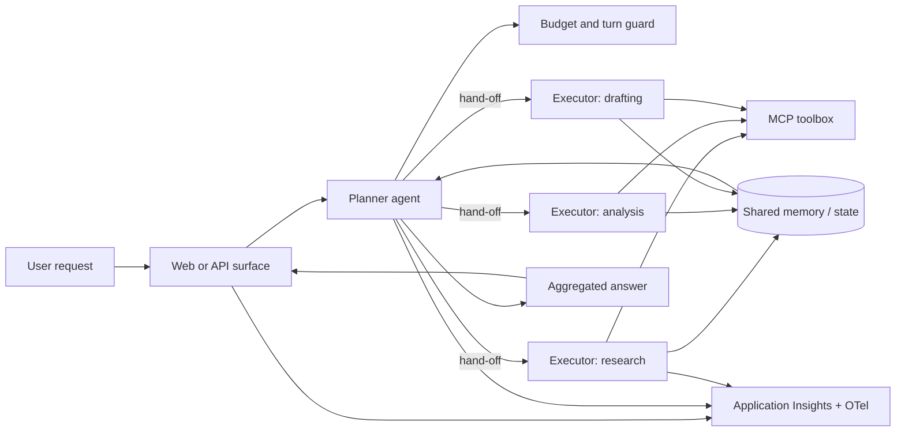

# Multi-Agent Orchestration

## Intro

### Design a planner-executor topology with hand-offs, shared memory, and budget controls.

A single monolithic agent breaks down once a task needs several distinct skills, tools, or reasoning styles. This playbook gives you a repeatable path for composing **specialized agents** that collaborate through explicit hand-offs, share state, and stay inside a cost budget — all driven from a single prompt and the `agentic-loop` defaults.

**Use when:** Your task needs several specialized agents collaborating, not one monolith.

**Core tech stack:** Copilot SDK, Microsoft Agent Framework, Foundry Hosted Agents, Foundry Models, MCP tools

This playbook walks you through building a **planner-executor** multi-agent solution end-to-end with the Agentic Loop. You drive the build loop from a single prompt, and the [`agentic-loop`](../../skills/agentic-loop/SKILL.md) skill applies the proven recipe — Foundry hosted agents, Copilot SDK, keyless identity, observability, and `azd` — on top.

The playbook is organized in three chapters:

- **Build** — go from a prompt to a working planner-executor prototype.
- **Run** — operate the deployed topology with per-agent telemetry and budget controls.
- **Scale** — add specialists, harden hand-offs, and push changes through the loop.

---

### What we will build

A chat-style app where a user's request is decomposed by a **planner** agent, dispatched to one or more **executor** (specialist) agents, and recombined into a single answer. Each agent runs as a **Foundry Hosted Agent** backed by **Foundry Models**, uses the **GitHub Copilot SDK** as the execution harness, and calls **MCP tools** published through a governed Foundry toolbox. Shared memory carries context between hand-offs, and a budget guard caps tokens and tool calls per turn.



| Layer | Choice (from `agentic-loop` defaults) | Why |
|---|---|---|
| Frontend | React + Vite on Azure Container Apps | Simple surface to submit tasks and watch hand-offs. |
| Backend API | Python + FastAPI on Azure Container Apps | Hosts the orchestration entrypoint and session state. |
| Orchestrator | Planner agent (Copilot SDK or Microsoft Agent Framework) | Plans, routes, and aggregates; use MAF when the topology needs graph/workflow sequencing. |
| Executors | Foundry Hosted Agents | Specialists run as governed, independently observable agents. |
| Model | Foundry Models | Keeps model usage and capacity on the Foundry platform. |
| Tools | Python MCP servers via a Foundry toolbox | Versioned, governed tool access shared across agents. |
| Shared memory | Session/state store passed across hand-offs | Carries context so executors don't re-derive it. |
| Observability | OpenTelemetry → Application Insights (wired via Foundry) | Per-agent traces, token usage, and hand-off spans. |
| Infra | `azd` + Bicep (Azure Verified Modules) | Reproducible provisioning of the whole topology. |

**Done means:**

- A single user request is decomposed by the planner and routed to the right executor(s).
- Hand-offs pass structured context, not raw chat history dumps.
- Shared memory lets an executor build on another's output.
- Each turn stays within its token and tool-call budget.
- Every agent, hand-off, and tool call is visible as a span in Application Insights.

**Out of scope for the first build:**

- More than a handful of specialists — start small and add roles later.
- Private networking — a production hardening step, not the first run.
- Long-lived durable workflows — add durable orchestration once the topology is stable.

---

### Setup

You will need:

- Azure subscription with Contributor permissions, plus a GitHub Copilot plan.
- GitHub Copilot installed and logged in — use the [Copilot App](http://gh.io/app) (recommended), the [Copilot CLI](https://github.com/features/copilot/cli/), or [Visual Studio Code](https://code.visualstudio.com/download).
- [GitHub CLI (`gh`)](https://cli.github.com/) installed and logged in.
- [Azure CLI (`az`)](https://learn.microsoft.com/en-us/cli/azure/install-azure-cli) and [Azure Developer CLI (`azd`)](https://learn.microsoft.com/en-us/azure/developer/azure-developer-cli/install-azd) installed and authenticated.
- The `lean-spec2cloud` Copilot plugin installed and updated. Click [here](https://github.com/copilot/app/launch?open=ghapp%3A%2F%2Fplugins%2Fmarketplace%2Fadd%3Fsource%3DAzure-Samples%2FSpec2Cloud) to add the marketplace and [here](https://github.com/copilot/app/launch?open=ghapp%3A%2F%2Fplugins%2Finstall%3Fsource%3Dlean%2540Spec2Cloud) to install the plugin. Or install in the CLI with:

  ```bash
  copilot plugin marketplace add Azure-Samples/Spec2Cloud && copilot plugin install lean@Spec2Cloud
  ```

Sanity check before you go further:

```bash
az account show                 # confirm the correct tenant and subscription
azd auth login --check-status   # confirm you are signed in to azd
copilot plugin list             # expect to see lean@Spec2Cloud
```

> **Heads up on cost.** This playbook provisions billable Azure resources (Container Apps, a Foundry/AI Services account, multiple hosted agents, and Application Insights). Leaving them running incurs charges — see [Clean up](#clean-up) to remove everything when you are done.

## Build

### Create a new project

Take an empty workspace through the **Specify → Plan → Implement → Verify → Deploy** loop and produce a running planner-executor topology.

```bash
mkdir multi-agent-orchestration
cd multi-agent-orchestration
```

> Want version control from minute one? Create a private GitHub repo instead:
> ```bash
> gh repo create multi-agent-orchestration --private --clone
> ```

---

### Open GitHub Copilot

This playbook uses the **GitHub Copilot App**, but the same prompt works in Copilot CLI and VS Code.

> **Using the CLI instead?** Run `copilot --allow-all` only in a sandbox workspace, or omit the flag to approve each action.

**1. Open the Spec2Cloud canvas.** In the review panel, click **+**, then choose **Spec2Cloud Cockpit**. If it is not installed, import:

```text
https://github.com/Azure-Samples/Spec2Cloud/tree/main/.github/extensions/spec2cloud
```

**2. Add your project.** Choose **+ -> Add project from -> Local folder or repository**, then select `multi-agent-orchestration`.

**3. Choose a model and mode.**

| Mode | Behavior |
|---|---|
| Interactive | Step-by-step collaboration; you confirm each stage |
| Plan | Plans first, executes once you approve |
| Autopilot *(recommended)* | Runs the full loop end to end |

---

### Run the build loop

Paste this starter prompt:

```text
/spec2cloud Build a multi-agent orchestration app. A user submits a task in a chat interface. A planner agent decomposes the task, routes sub-tasks to specialized executor agents (research, analysis, drafting), and aggregates their results into one answer. Agents hand off structured context through shared memory, call tools via MCP servers, and each turn is capped by a token and tool-call budget. Include a trace view that shows each agent, hand-off, and tool call. Data can be randomly generated where a real backing service is not required.

Before planning or implementation, install and run the agentic-loop skill (`aiappsgbb/agentic-loop`, skill `agentic-loop`) to enhance the spec with its app, agent runtime, Azure infrastructure, identity, and telemetry defaults.
```

> `/spec2cloud` runs the same five-stage loop as Getting Started. The prompt explicitly invokes `agentic-loop`; the remaining requirements define this playbook's planner-executor topology, hand-offs, shared memory, and budget controls.

> Prefer to run one stage at a time? Use the same prompt with `/specify` first, then advance through each stage:
>
> | Command | Produces | Review in |
> |---|---|---|
> | `/specify <prompt>` | Specification | `docs/spec.md` |
> | `/plan` | Implementation and Azure plan | `docs/plan.md`, `.azure/deployment-plan.md` |
> | `/implement` | Source, infrastructure, agents, and tools | `src/`, `infra/`, `azure.yaml` |
> | `/verify` | Provisioned dependencies and smoke tests | `docs/verify.md` |
> | `/deploy` | Deployed solution | `docs/deploy.md` |

Use these recommended answers if Copilot asks clarifying questions:

| Question area | Recommended answer |
|---|---|
| Topology | Planner-executor with explicit hand-offs. |
| Agent harness | GitHub Copilot SDK by default; Microsoft Agent Framework when the topology needs graph/workflow sequencing. |
| Number of executors | Start with two or three specialists. |
| Shared state | Session-scoped shared memory passed across hand-offs. |
| Budget control | Per-turn token and tool-call caps with a guard that stops runaway loops. |
| Tools | MCP servers published through a Foundry toolbox. |

When the skill finishes, review `docs/spec.md` for these must-have requirements: a planner agent, specialist executors, structured hand-offs, shared memory, per-turn budget guard, MCP toolbox, and Application Insights tracing.

---

### Review the generated plan

Turn the spec into a reviewable implementation and deployment plan.

```text
/plan
```

The deployment plan should include:

| Section | What good looks like |
|---|---|
| Resource graph | Foundry project, one hosted agent per role, model deployment(s), MCP tool endpoints, shared-state store, managed identity, Application Insights, ACA apps. |
| RBAC | Least-privilege roles for Foundry, telemetry, and any state store. |
| Orchestration | Planner routing rules, hand-off contract, and aggregation strategy. |
| Budget | Token and tool-call caps per turn, plus the guard's stop behavior. |
| Toolbox | MCP servers registered as versioned tools on a shared Foundry toolbox. |
| azd template | `minimal` / `azd init --minimal`. |

Review `docs/plan.md` and `.azure/deployment-plan.md` before continuing.

---

### Review the implementation

Generate the source and infrastructure from the plan.

```text
/implement
```

Expected generated artifacts:

```text
.
├── azure.yaml
├── infra/
├── src/
│   ├── frontend/                 # chat UI with hand-off trace view
│   ├── backend/                  # orchestration entrypoint + session state
│   └── agents/
│       ├── planner/              # decomposition + routing + aggregation
│       ├── executor-research/    # specialist hosted agent
│       ├── executor-analysis/    # specialist hosted agent
│       └── executor-drafting/    # specialist hosted agent
└── docs/
```

The implementation should wire:

1. **Planning** — the planner decomposes the request and selects executors.
2. **Hand-off** — structured context (not raw history) is passed to each executor.
3. **Shared memory** — executors read and write a session-scoped state store.
4. **Budget** — a guard caps tokens and tool calls and stops runaway loops.
5. **Telemetry** — each agent, hand-off, and tool call emits a span to Application Insights.

Commit a checkpoint once the diff looks right:

```bash
git add .
git commit -m "feat: scaffold multi-agent orchestration"
```

---

### Verify locally

Validate locally against real Azure dependencies.

```text
/verify
```

| Test | Action | Expected result |
|---|---|---|
| Decomposition | Submit a task that needs two skills. | Planner splits it and routes to the right executors. |
| Hand-off | Inspect the payload passed to an executor. | Structured context, not a raw chat dump. |
| Shared memory | Have one executor consume another's output. | Second executor builds on the first without re-deriving it. |
| Budget cap | Submit a task that would loop. | The guard stops the turn at the configured cap. |
| Aggregation | Review the final answer. | One coherent response, not stitched fragments. |
| Telemetry | Query Application Insights. | Per-agent, hand-off, and tool spans are visible. |

---

### Deploy

Deploy after local verification passes.

```text
/deploy
```

Deployment readiness checklist:

- [ ] Each hosted agent has a valid `agent.yaml` and, where used, `code_configuration`.
- [ ] MCP tools are registered as versioned tools on the shared Foundry toolbox.
- [ ] Budget guard limits are set from configuration, not hardcoded.
- [ ] `.agentignore` and per-service `.dockerignore` exclude local build artifacts.
- [ ] Container app names respect the 32-character Azure Container Apps limit.
- [ ] Decomposition, hand-off, and budget-cap tests pass.
- [ ] Application Insights receives per-agent telemetry.

When the loop finishes, Copilot returns the deployed frontend URL and the Spec2Cloud canvas auto-previews it. Click the **Foundry** icon to see every agent, model, tool, and toolbox that was deployed.

---

### Troubleshooting

| Symptom | Likely cause | Fix |
|---|---|---|
| Planner never delegates | Roles or routing criteria are vague | Make each executor's responsibility and hand-off contract explicit in the spec. |
| Agents repeat work | Shared state is missing or unstructured | Pass typed hand-off fields and persist session-scoped state. |
| A turn exceeds budget | Guard limits are not enforced centrally | Enforce token and tool-call caps before each hand-off and tool call. |
| Traces stop at the planner | Context is not propagated | Carry the trace context through every hosted-agent and MCP invocation. |

## Run

### Run the orchestration

Open the deployed app and submit tasks that require two or more specialists. Confirm that the planner selects the right executors, hand-offs contain structured context, shared state is reused, and the final answer is coherent and stays within budget.

---

### Observe

Use telemetry to understand whether the topology is healthy, on-budget, and coordinating correctly.

Track:

- Per-agent request count, latency, and failures.
- Hand-off count and hand-off failures per turn.
- Token usage and tool-call count against the per-turn budget.
- Planner routing decisions and mis-routes.
- Shared-memory read/write errors.

Useful Application Insights questions:

| Question | Signal |
|---|---|
| Is the planner routing correctly? | Routing decision traces vs. executor invoked. |
| Are we over budget? | Token/tool-call counts against the configured caps. |
| Where is latency spent? | Span durations per agent and per hand-off. |
| Are hand-offs reliable? | Hand-off success rate and retry counts. |

### Evaluate

Create a small evaluation set before broad rollout.

| Eval | Dataset shape | Pass condition |
|---|---|---|
| Routing accuracy | Task, expected executor(s) | Planner selects the correct specialist(s). |
| Hand-off fidelity | Task, expected context fields | Executor receives the required structured context. |
| Answer quality | Task, reference answer | Aggregated answer matches the reference intent. |
| Budget adherence | Task designed to loop | Turn stops within the configured cap. |
| Latency | Representative tasks | p95 latency stays within the pilot target. |

### Iterate

Safe iteration loop:

1. Adjust planner routing rules, hand-off contract, or budget caps.
2. Re-run routing and hand-off evals.
3. Review per-agent traces and token usage.
4. Commit a checkpoint before changing prompts or topology.

```bash
git add .
git commit -m "chore: tune planner routing and budget caps"
```

## Scale

### Add more specialists

Add one executor at a time. For each new role: define its hand-off contract, register its tools on the shared toolbox, and add a routing rule to the planner. Re-run routing evals before promoting.

---

### Harden coordination

- Make hand-offs idempotent so retries don't duplicate work.
- Add fallbacks when an executor fails or times out.
- Consider Microsoft Agent Framework graph/workflow orchestration when the topology outgrows simple planner routing.
- Add durable orchestration for long-running, multi-turn tasks.

---

### Promote across environments

Use separate azd environments per stage:

```bash
azd env new multi-agent-orchestration-test-eus2
azd env new multi-agent-orchestration-prod-eus2
```

Promotion checklist: explicit RBAC per environment, evals run before promotion, budget caps reviewed, and telemetry dashboards in place before production rollout.

---

### Take it further

- **Customize the topology** — change routing, add a critic agent, or swap models per role, then push the change through the loop.
- **Explore the other playbooks** — apply the same loop to grounding, governance, and evaluation scenarios.

> Tip: run the loop fully unattended for larger changes:
> ```bash
> copilot -p "/spec2cloud <your next big idea>" --no-ask-user --yolo -- autopilot
> ```

---

### Clean up

When you are done experimenting, delete every Azure resource the loop created. Run this from the project root, where `azure.yaml` lives:

```bash
azd down --purge --force
```

`--purge` also removes soft-deleted resources (such as the Foundry/AI Services account and Key Vault) so their names are immediately reusable.

---

### References

- [Microsoft Agent Framework](https://learn.microsoft.com/agent-framework/)
- [What are Foundry Agents?](https://learn.microsoft.com/azure/ai-foundry/agents/overview)
- [Connect tools to Foundry agents](https://learn.microsoft.com/azure/ai-foundry/agents/how-to/tools/overview)
- [Model Context Protocol (MCP)](https://modelcontextprotocol.io/)
- [Observability for generative AI applications](https://learn.microsoft.com/azure/ai-foundry/concepts/observability)
