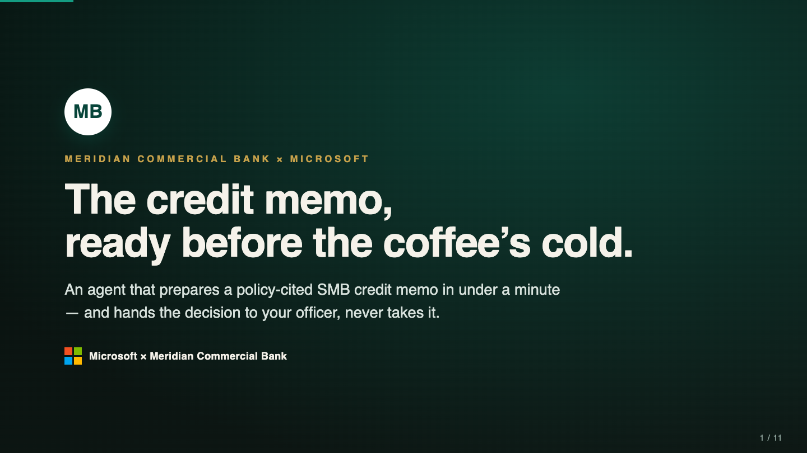
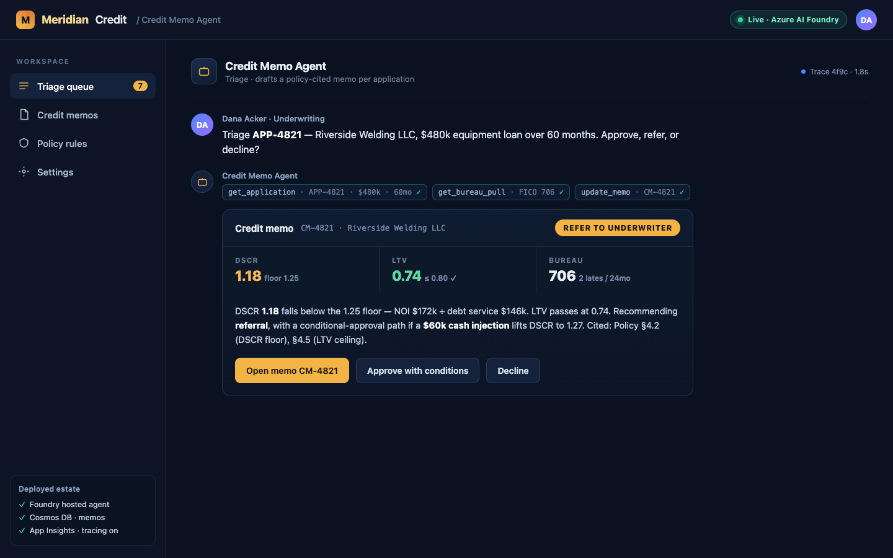

# Threadlight Pipeline

## Idea to production

### The loop gets you a demo. Threadlight gets you production.

The [Agentic Loop](../getting-started/README.md) is brilliant at one thing: getting you to a *working agent*. A paragraph in, a Foundry hosted agent answering questions minutes later. That is a proof of concept — and a PoC is not something a review board signs, an SRE carries a pager for, or a regulator accepts.

**Threadlight is everything past the PoC.** Same "describe it, let the agent build it" motion — carried all the way to a governed, evaluated, red-teamed, cost-modelled agent running in *your* Azure tenant, with the compliance file and the customer hand-off pack already written.

You still start with one paragraph. The paragraph is only the *input*. The point is what comes out the other end:

> **Idea → production, in one continuous run.** Driven from GitHub Copilot; everything past the PoC handled — govern, evals, red-team, scorecard, hand-off.

### Where the loop stops, and Threadlight keeps going

The loop hands you a demo. Every column on the right is what a demo is missing — and what Threadlight adds, in the same run:

| The Agentic Loop gives you | Threadlight adds on top |
| --- | --- |
| A **working agent** from a paragraph | A **governed** one — policy enforced at the container boundary |
| Answers in the playground | **Evals + red-team** gates, streaming to App Insights |
| Something to show | A **defensible cost model** and an **EU AI Act evidence pack** |
| A prototype | A **13-pillar scorecard** and a **customer hand-off** an ARB signs |

It is one opinionated pipeline — each stage produces a checkable artefact, and each stage gates the next:

```mermaid
flowchart LR
  A["Agentic Loop<br/>describe it → working agent"]:::loop --> D["a demo<br/>ungoverned PoC"]:::loop
  D --> S1["spec"]:::tl --> S2["scaffold"]:::tl --> S3["local-test"]:::tl --> S4["deploy"]:::tl --> S5["govern · evals<br/>red-team"]:::tl --> S6["score"]:::tl --> S7["hand-off"]:::tl --> P["production<br/>governed · costed · signed"]:::prod
  classDef loop fill:#e6f0ff,stroke:#4a7fd6,color:#0b2545;
  classDef tl fill:#fff4e6,stroke:#e08a2b,color:#5a3210;
  classDef prod fill:#e8f7ee,stroke:#2fa15a,color:#0d3d22;
```



> Tip: One sentence captures the stack. **Build with the loop. Govern with [Citadel](../citadel-governance-hub/README.md). Productionize with Threadlight.** Threadlight's deploy routes its LLM traffic through Citadel's gateway and onboards the agent as a Citadel spoke — the three are designed to compose.

---

## When to reach for it

### Reach for it — or don't

**Reach for Threadlight when:**

- You have an **idea or a PoC** and you need it to become something an **ARB can sign and an SRE can run** — governed, evaluated, red-teamed, costed — fast.
- You are walking into a customer and need to go from **their brief to a governed pilot** in a single engagement, with receipts, not a demo you have to caveat.
- You want the **paved, opinionated path**: strong GBB defaults for network, identity, evals, responsible AI and reliability, in exchange for speed.

**Don't reach for it when:**

- You only need a **quick proof of concept**. Stop at the [Agentic Loop](../getting-started/README.md) — Threadlight is deliberately heavier.
- You want to **hand-assemble every architectural choice**. Threadlight is opinionated on purpose; that is where the speed comes from.

---

## Get started

### Install two plugins — zero clone

Threadlight is a set of **skills you drive from GitHub Copilot**, not a repo you clone and hand-edit. It is deliberately **thin where the [`awesome-gbb`](https://github.com/aiappsgbb/awesome-gbb) `foundry-*` family is already deep** — so the pipeline is *two* marketplace plugins: `awesome-gbb` underneath, `threadlight-skills` on top.

```bash
# 1 · awesome-gbb — the foundry-* foundation Threadlight builds on
copilot plugin marketplace add aiappsgbb/awesome-gbb
copilot plugin install awesome-gbb@awesome-gbb

# 2 · threadlight-skills — the idea-to-production pipeline itself
copilot plugin marketplace add aiappsgbb/threadlight-skills
copilot plugin install threadlight-skills@threadlight-skills
```

`awesome-gbb` is a **hard dependency, not a nicety** — Threadlight's gate skills call straight into it: `threadlight-govern` drives [`foundry-agt`](https://github.com/aiappsgbb/awesome-gbb/tree/main/skills/foundry-agt), `threadlight-evals` drives [`foundry-evals`](https://github.com/aiappsgbb/awesome-gbb/tree/main/skills/foundry-evals), the deploy leg builds on [`foundry-hosted-agents`](https://github.com/aiappsgbb/awesome-gbb/tree/main/skills/foundry-hosted-agents) + [`azd-patterns`](https://github.com/aiappsgbb/awesome-gbb/tree/main/skills/azd-patterns), and the supply-chain pillar checks [`foundry-skill-catalog`](https://github.com/aiappsgbb/awesome-gbb/tree/main/skills/foundry-skill-catalog). Install both and there is no repository to fork, no skill files to edit.

> Tip: Prefer zero install? [Open the repo in a Codespace](https://codespaces.new/aiappsgbb/threadlight-skills) — the `.devcontainer` pre-wires all sixteen threadlight skills; add `awesome-gbb` with the block above for the full pipeline, then `copilot` and `/login` (device-flow, first launch only).

> Note: You'll want an **Azure subscription** you can deploy into (the deploy stage runs `azd up` for real), **GitHub Copilot CLI**, and — recommended — a **[Citadel](../citadel-governance-hub/README.md) AI gateway** to route production LLM traffic through, so governance and cost attribution are in place from day one.

### The one prompt that starts it

There is no wizard to learn. You hand the first skill, `threadlight-design`, a plain-English brief. This is the **real, verbatim prompt** that opened the reference run — copied from the captured transcript. Read it as the *shape of the input*: a brief, a hard rule, and a note that production routes through Citadel. The pipeline chose the model, the resources and the architecture — the brief named none of them.

```text
Use the threadlight-design skill to design a pilot agent end-to-end from this brief.

BRIEF — A commercial bank's SMB lending team wants to compress credit-memo
preparation. For an incoming loan request, the agent should (1) pull the
borrower's financials and existing exposure, (2) compute standard credit metrics
(DSCR, leverage, liquidity) and score the request against the bank's lending
policy, (3) flag policy exceptions and risk factors, and (4) draft a structured
credit memo that a credit officer reviews and signs off. A human-in-the-loop
approval gate is required before any memo is finalized, and every step must be
auditable.

CONSTRAINTS — MODEL POLICY (HARD RULE): use a current-generation model (gpt-5
family). The production deployment will route LLM calls through an existing
Citadel AI gateway.
```

One paragraph in; a governed agent on your Azure out.

---

## The arc

*Told through the reference run — a fictional customer, [Meridian Commercial Bank](https://aiappsgbb.github.io/threadlight-skills/case-study.html), on a real Azure subscription, real gateway, real spend. Each stage is one prompt, and each leaves a checkable artefact.*

### Stage 1 — From a paragraph to a spec

`threadlight-design` parses the brief into a process, entities, decision branches and hard credit rules — then writes them down. The brief above became a **958-line specification**: twelve numbered business rules, an explicit model policy, and a mandatory human approval gate, with **zero `[NEEDS CLARIFICATION]`** left dangling.

### Stage 2 — Specced *and* scaffolded

The same skill writes the `AGENTS` file, scaffolds the four tools against a real contract, seeds realistic sample data (`threadlight-demo-data-factory`), and adds killer-prompt tests. It even renders the **customer talk-deck** and the **seller prep-guide** — a working project, not slideware.



The tools it scaffolds are real, contract-bound skills — not boilerplate. Here is one it generated, with an operational contract and spec-grounded gates:

```markdown
---
name: fraud-escalation
description: Apply the value ceiling and serial-returner / flagged-account risk
  gates and route cases to a human supervisor. USE FOR deciding whether a case
  must be escalated. DO NOT USE FOR the base eligibility check.
---
# Fraud & Escalation Gate
> Implements BR-003 (escalate high-value or high-risk).

## Procedure
1. Escalate if ANY gate fires:
   - amount > 250 (auto-approve ceiling), OR
   - lifetime_return_rate ≥ 0.40 (serial-returner risk), OR
   - account_status == review_flagged
2. If a gate fires → escalate_to_supervisor; summarize which gate(s) + the risk.
3. If no gate fires → proceed (carry the eligibility verdict forward).
```

### Stage 3 — Validated on your own PC

Before a cent of cloud spend, `threadlight-local-test` boots the agent **on your machine**, discovers the tools from the spec, and runs them live. Drive it with a real application:

```text
Use the threadlight-local-test skill to run the agent on my machine, then triage
APP-4821 — Riverside Welding LLC, $480k equipment loan over 60 months.
Approve, refer, or decline?
```

It wires up locally and shows its work — the tool calls, then the verdict:

```console
threadlight-local-test · discovering tools from SPEC.md
  MAF agent + SkillsProvider · tools wired
  agent ready · running on your machine
▶ triage APP-4821
  → get_application(APP-4821)      Riverside Welding LLC · $480k · 60mo
  → get_bureau_pull(APP-4821)      2 late payments / 24mo · no liens
  → compute_metrics()              DSCR 1.18 · LTV 0.74 · NOI $172k
  → score_against_policy()         DSCR 1.18 < 1.25 floor  ✗
  → draft_memo(CM-4821)            verdict: refer_to_underwriter
```

It doesn't rubber-stamp the deal. It applies the policy, cites the rule that failed, and drafts the human-review memo. **The result it wrote — memo `CM-4821`, no cloud spend:**

**Refer to underwriter.** DSCR **1.18** is below the 1.25 floor — NOI $172k ÷ debt service $146k. LTV **0.74** passes. Bureau shows 2 late payments in 24 months, no liens. Recommends referral, with a conditional-approval path if a **$60k cash injection** lifts DSCR to **1.27**. Every figure traces to a tool call; the officer signs, the agent never does.

> Tip: Local-test also seeds a ranked **killer-prompt suite** — the top prompts are wired into the deployed agent as one-tap starters, and each is copied verbatim from a row in the eval set, so the demo prompt and the graded prompt are the same string.

### Stage 4 — Deployed to your Azure, then the gates

`threadlight-deploy` runs **`azd up`** straight into your subscription — Foundry, a hosted-agent container, Cosmos and App Insights, provisioned and wired. The agent goes live in your tenant, usable in a workspace or in Teams. Nothing is mocked.

```text
Use the threadlight-deploy skill to azd up this agent into my Azure subscription,
routing its model calls through my Citadel gateway. Then run the three gate
skills: threadlight-govern, threadlight-evals, and threadlight-redteam.
```



Then come the runtime gates:

- **`threadlight-govern`** installs the **Agent Governance Toolkit (AGT)** policy as middleware at the container boundary and emits `govern-manifest.json`. A deprecated model is **refused at the door — 403** — before it can answer.
- **`threadlight-evals`** runs 15 offline scenarios plus continuous evaluation, streaming quality signals to App Insights.
- **`threadlight-redteam`** runs an adversarial **PyRIT** scan for jailbreak, prompt-injection, data-exfiltration and harmful content.

### Stage 5 — Scored for production

A deployed MVP isn't the finish line — the scorecard is. `threadlight-production-ready` scores the agent across **thirteen pillars** and writes the customer hand-off package.

```text
Use the threadlight-production-ready skill to score this deployment across the
thirteen pillars and write the ARB hand-off package.
```

For the reference run, the score comes back concrete — the number a board reads:

| Hand-off artefact | Result |
| --- | --- |
| Production-ready score | **92 / 100 — ship with 2 waivers** |
| Pillars verified | **13** — for ARB sign-off & SRE hand-off |
| Cost model (`threadlight-consumption-iq`) | **$326 → $795 → $6,804 / mo** — pilot · scale · production |
| Governance contract | routed through **Citadel**, onboarded as a **Citadel spoke** |
| Walk-in kit | customer talk-deck + seller prep-guide |

That is the polished reel. What makes the score *trustworthy* is that the same skill scores an honest run honestly — which the committed receipts show next.

---

## Read the receipts

*"Don't trust the agent — read the receipts." Threadlight publishes real, sanitized runs in the [`examples/`](https://github.com/aiappsgbb/threadlight-skills/tree/main/examples) directory so you can open what the skills actually generate and govern, file by file.*

### A run committed warts-and-all

The [`returns-triage-governed`](https://github.com/aiappsgbb/threadlight-skills/tree/main/examples/returns-triage-governed) sample is a full end-to-end run captured on **2026-07-07** on a private Citadel hub — spec, network-isolated IaC, generated skills, a committed governance policy, and a readiness scorecard. Credentials were stripped; everything else is exactly what the skills produced. It is the honest counterweight to the polished reel — and it is far more convincing.

### What AGT is — and the policy this run committed

The **Agent Governance Toolkit (AGT)** is a runtime policy engine that runs **in-process, as middleware at the agent's container boundary**. Every model call and tool call is checked against a declarative policy *before* it executes — and the verdict is one of **allow · deny · escalate · audit**. It is **deny-by-default**: anything the policy doesn't explicitly permit is blocked. That is how a deprecated model is refused with a 403 at the door, not logged after the fact.

`threadlight-govern` generated this **spec-grounded** policy — four rules, each traced to a business rule:

```yaml
deny_by_default: true
rules:
  - name: block-dangerous-tools     # deny shell_exec, send_external_email
    action: deny
  - name: refund-above-ceiling-needs-human   # BR-003: amount > 250
    action: escalate
  - name: cap-tool-calls-per-turn   # > 6 tool calls in one turn
    action: block
  - name: audit-all-decisions       # every approve / deny / escalate / request
    action: audit
```

The wiring report is just as honest — it returns a verdict of **PARTIAL** and *refuses to fake* an `agt verify` badge it can't prove:

| Capability | Status |
| --- | --- |
| `policy_artefact_present` · `policy_versioned` · `rai_policy_present` | ✅ pass |
| `asi_reference_present` (OWASP ASI 2026) | ✅ pass |
| `verifier_artefact_present` | 🟠 should-fix — no committed verify evidence |
| `middleware_wired_at_boundary` | ⚪ not-verified — no entry-point to inspect |

### The scorecard a lean PoC actually earns

`threadlight-production-ready` scored that same run **31% — 🔴 NOT READY**, and named the eighteen must-fix gaps. That is the point: a fresh PoC *should* score low until the production work is done, and the scorecard maps every gap to its fix.

| Pillar | Score | | Pillar | Score |
| --- | --- | --- | --- | --- |
| 1. Network posture | 🔴 16% | | 8. HITL & audit | 🔴 32% |
| 2. Agent governance (AGT) | 🟡 71% | | 9. Supply chain | 🔴 26% |
| 3. Identity & access | 🔴 29% | | 10. Cost | 🔴 21% |
| 4. Secrets | 🔴 19% | | 11. Reliability | 🔴 8% |
| 5. Observability | 🔴 23% | | 12. SRE handover | 🔴 5% |
| 6. Continuous evals | 🔴 50% | | 13. Model lifecycle | 🟡 43% |
| 7. Responsible AI | 🔴 60% | | **Overall** | **🔴 31%** |

> Important: The scorecard **never invents coverage**. A `not-verified` finding earns *zero* score credit — a missing probe is an honest blank, not a passing grade — and a `must-fix` finding **cannot** be waived: it exits the gate non-zero and names itself. That honesty is exactly what makes the 92/100 version worth something.

---

## Ship it for real

*How the red scorecard turns green — the production leg, and the evidence a board actually signs.*

### Governance enforced at runtime

Governance is enforced at runtime, not attached afterwards. The AGT policy and middleware sit **in-process at the container boundary**, so model policy, tool allow-lists and safety are checked *before* the agent acts — deny-by-default, every decision audited to `govern-manifest.json`. Responsible-AI controls ride the same boundary: **content filtering, prompt-shield and PII blocking**, aligned to the **OWASP ASI 2026** agentic-security references. A non-compliant or deprecated model never gets to answer — it is refused with a **403** at the edge.

### CI/CD a locked-down tenant will actually accept

This is where most pilots die — a great agent that no enterprise pipeline will deploy. `threadlight-cicd` generates the production deploy pipeline for exactly that environment, and it is **secret-free by construction**:

- **GitHub Actions *or* Azure DevOps** pipelines, your choice, generated to match.
- **OIDC / workload-identity federation** — a user-assigned managed identity with federated credentials, **no long-lived secrets** anywhere in the pipeline.
- **Least-privilege RBAC**, scoped to the **spoke resource group** — not subscription-wide.
- An **onboarding-path gate** that picks the right topology up front: *standalone*, *spoke-onboard* (into an existing Citadel hub), or *hub-deploy-then-spoke*.
- A **`central-platform-boundary.md`** that keeps the pilot pipeline cleanly **separate** from central-platform deployment (`citadel-hub-deploy`) — the field team ships the agent without ever touching the platform team's hub.

> Note: For a fully private customer estate, the deploy-and-validate loop must run from **inside the perimeter** — `threadlight-cicd` ships a **private-VNet runner runbook** whose pre-flight is non-negotiable: private DNS resolves to private IPs, `443` reaches every private endpoint, and control-plane egress is allowed — *only then* deploy. A half-resolved DNS zone fails a deploy looking like an auth error and burns an afternoon; the checklist catches it first.

### The EU AI Act evidence pack

The same committed artefacts that turn the scorecard green map, **article by article**, onto the EU AI Act — so the deploy carries its own compliance file. It is tenant-local, offline, deterministic, and it **never invents coverage**: a missing source is flagged as an honest gap, not green-washed.

| Artefact | Maps to |
| --- | --- |
| `annex-iv-technical-file.md` | Art 11 / Annex IV technical documentation — every gap flagged |
| `ai-act-evidence.json` | the article map + coverage, with a **SHA-256 per source** |
| `fria-scaffold.md` | Art 27 fundamental-rights template, for a human to complete |

### One baseline: quality, cost, safety

The go-live call rests on **one baseline**, not three dashboards. `threadlight-consumption-iq` walks the Bicep and `azd env`, prices every resource against **Azure Retail Prices** (with 2–3 SKU alternatives each), and emits the phased forecast — **$326 → $795 → $6,804/mo** for the reference run. That unit-cost line sits **beside the eval quality signal and the red-team safety signal**, so a regression on *any one* — "cheaper but worse", "safer but 8× the cost" — trips the gate before the next deploy ships.

---

## How it composes

### Build → govern → productionize

Threadlight is one third of a deliberate stack, and it sits on the `awesome-gbb` `foundry-*` foundation. Use each where it is strongest:

- **[Agentic Loop](../getting-started/README.md)** — get to a working agent fast.
- **[Citadel Governance Hub](../citadel-governance-hub/README.md)** — the governed AI gateway and landing zone. Threadlight's production deploy **routes its LLM traffic through Citadel** and onboards the agent as a **Citadel spoke** — that is the "governance contract" line on the receipts.
- **[`awesome-gbb`](https://github.com/aiappsgbb/awesome-gbb)** — the `foundry-*` skill family Threadlight's gates delegate into (`foundry-agt`, `foundry-evals`, `foundry-hosted-agents`, `azd-patterns`). **Installed as a required plugin alongside Threadlight.**
- **Threadlight** — carry the idea the rest of the way: gates, scorecard, compliance file, hand-off.

### Start here

1. **See the whole arc** on the Threadlight [homepage](https://aiappsgbb.github.io/threadlight-skills/index.html) and the dogfooded [case study](https://aiappsgbb.github.io/threadlight-skills/case-study.html).
2. **Install both plugins** — `awesome-gbb` then `threadlight-skills` (marketplace, two lines each), or open a [Codespace](https://codespaces.new/aiappsgbb/threadlight-skills) and add `awesome-gbb` for the full pipeline.
3. **Hand `threadlight-design` a one-paragraph brief** of the agent you want, and let the arc run — design → deploy → gates → score.
4. **Read the scorecard before you ship**, and inspect a real run in [`examples/returns-triage-governed`](https://github.com/aiappsgbb/threadlight-skills/tree/main/examples/returns-triage-governed) — the policy, the verdict, the 13-pillar scorecard.

> Tip: Browse the full skill set in the [threadlight-skills repository](https://github.com/aiappsgbb/threadlight-skills). You don't learn them one by one — the arc invokes them for you, in order.
