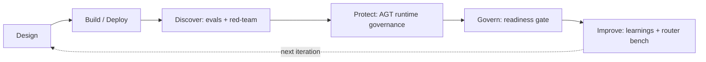
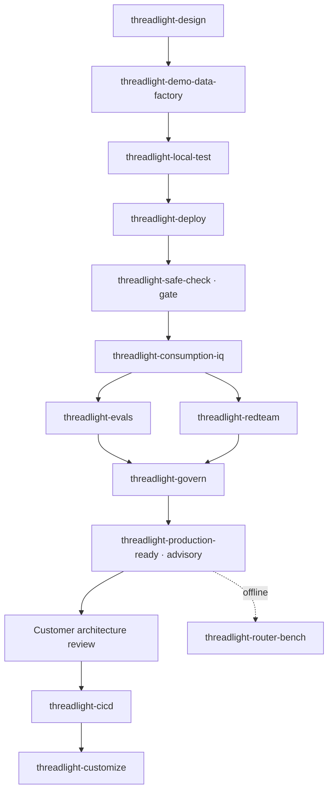

# Threadlight Pipeline

## Intro

### Watch one paragraph become a governed, production‑ready Foundry agent.

Threadlight is an opinionated **idea‑to‑production pipeline**: 17 Markdown skills that GitHub Copilot follows in your repo to drive Microsoft Foundry — not replace it. A one‑paragraph brief becomes a specified, deployed, evaluated, red‑teamed, observable, **production‑ready** hosted agent, running in the customer's own tenant, in a single continuous session — then handed off to the production track instead of dying in a lab.

**Use when:** You want the fast, paved path from a customer conversation to a governed pilot — and you're ready to accept strong defaults (Foundry hosted agents, keyless identity, observability, evals, a safety gate) in exchange for speed.

**Core tech stack:** GitHub Copilot (build), Microsoft Foundry hosted agents (run), Foundry models + evals + red‑team (govern)

This playbook is **orientation, not step‑by‑step**. It frames the arc and points you into the [`threadlight-*` skill family](https://github.com/aiappsgbb/threadlight-skills) and the live [Threadlight site](https://aiappsgbb.github.io/threadlight-skills/), where each skill's `SKILL.md` is the authoritative source. If you want a hand‑built, fully‑explained deployment instead, start with the other playbooks — this one is the express lane.

The playbook is organized in three chapters:

- **The chain** — the canonical flow, where to jump in, and the contracts that hold it together.
- **The 17 skills** — grouped by role, each linked to its source.
- **Go deeper** — how Threadlight relates to the loop, `foundry‑*`, and Citadel, and where to start.

---

### A worked example: credit‑memo triage

The Threadlight site tells the whole arc through one scenario — a **credit‑memo triage agent** for a regional commercial bank. One paragraph describes it: for each SME loan application, pull the credit‑bureau report, compute **DSCR** and **LTV**, then auto‑approve, refer, or decline — drafting a memo that cites the policy rule, with floors **DSCR ≥ 1.25** and **LTV ≤ 0.80**.

From that paragraph, the pipeline produces a spec, seeds realistic demo data, boots the agent locally, deploys it as a Foundry hosted agent replying inside Microsoft Teams, runs evals + a red‑team scan, and scores it. An applicant at DSCR 1.18 / LTV 0.74 lands **below the DSCR floor** → referred, with the memo citing the rule. The site's run ends at a **92/100 production‑readiness score across 13 pillars**, in roughly **50 minutes** end‑to‑end.

> Tip: The point isn't credit memos. Swap the brief and the same six‑stage chain produces a claims‑triage, KYC, or field‑service agent. Threadlight encodes the *shape* of the work, not the domain.

### The operating loop

The chain maps onto the Microsoft Responsible‑AI‑for‑Foundry operating loop. Each phase is a set of skills; the **Discover** and **Protect** legs run *before* the readiness gate so the scorecard can verify each control actually ran — not just that it was declared.

The public demo compresses this into a **six‑stage reel**: `01 Brief → 02 Design → 03 Local agent → 04 Deploy → 05 Govern → 06 Scorecard`. Same chain, seller‑facing framing.

---

## The chain

### The canonical flow

Skills fire in a canonical order. The **spine** is the happy path; several legs are conditional on what the SPEC declares (human‑in‑the‑loop, a UI, event triggers, private‑network CI/CD).

> Note: `foundry-observability` is layered into `threadlight-deploy` by default, and `foundry-evals` runs after every deploy. The pilot ships with telemetry, evals, and a safe‑check gate on day one — or it isn't a Threadlight pilot.

### Where to jump in

You rarely start at the top every time. The entry‑skill picker maps intent to a starting skill:

| You want to… | Start with |
|---|---|
| Turn a brief into a spec (works in Copilot Cowork) | `threadlight-design` |
| Iterate the agent locally before any cloud | `threadlight-local-test` |
| Ship it to the customer tenant | `threadlight-deploy` |
| Verify a deployment before go‑live | `threadlight-safe-check` |
| Walk it to a readiness scorecard | `threadlight-production-ready` |
| Run the **whole arc** from one prompt (demos, first‑timers) | `threadlight-auto` |

> Tip: `threadlight-design` is the only skill that runs cleanly inside **Microsoft Copilot Cowork** — the seller surface. Everything below it needs a real shell, which is where the **solution engineer** picks up the same chain. That seller → SE hand‑off is the persona split the pipeline is built around.

### The contracts that hold it together

Threadlight is opinionated because the skills share **contracts**, not conventions:

- **`specs/SPEC.md`** — numbered business rules (`BR‑XXX`), data models with system‑of‑record tracking, tool contracts, `§ 8` human‑interaction points, `§ 9` eval scenarios, `§ 11c` tech‑stack selectors, `§ 12` load profile.
- **`specs/manifest.json`** — a machine‑readable **kebab‑case selector vocabulary**: the single input contract every downstream skill reads. Invent a new selector without registering it and `threadlight-safe-check` flags it as drift.
- **Skills & tools as governed artifacts** — capabilities are pinned by version, promoted canary‑first, and fetched at deploy (never cloned at runtime). `threadlight-production-ready`'s `supply-chain` pillar enforces this (`SUP‑008` flags force‑publishing; `SUP‑009` flags unpinned use).

---

## The 17 skills

### Build core

The spine that gets a working agent into the tenant.

| Skill | Role |
|---|---|
| [`threadlight-design`](https://github.com/aiappsgbb/threadlight-skills/tree/main/skills/threadlight-design) | Brief → `SPEC.md` + `manifest.json` + agent surface. Full vs Fast‑PoC modes. |
| [`threadlight-demo-data-factory`](https://github.com/aiappsgbb/threadlight-skills/tree/main/skills/threadlight-demo-data-factory) | Industry‑realistic seed data for demos. |
| [`threadlight-local-test`](https://github.com/aiappsgbb/threadlight-skills/tree/main/skills/threadlight-local-test) | Boots the agent locally for rapid inner‑loop iteration. |
| [`threadlight-deploy`](https://github.com/aiappsgbb/threadlight-skills/tree/main/skills/threadlight-deploy) | 7‑phase `azd up` — ACR, Bicep, hooks, Foundry, Citadel. |
| [`threadlight-safe-check`](https://github.com/aiappsgbb/threadlight-skills/tree/main/skills/threadlight-safe-check) | Pre/post‑deploy gate — validates every resource selector before go‑live. |

### Human & surface (conditional)

Fire only when the SPEC declares them.

| Skill | Role |
|---|---|
| [`threadlight-hitl-patterns`](https://github.com/aiappsgbb/threadlight-skills/tree/main/skills/threadlight-hitl-patterns) | Human‑in‑the‑loop gates via Teams Adaptive Cards + audit trail. |
| [`threadlight-workspace-ui`](https://github.com/aiappsgbb/threadlight-skills/tree/main/skills/threadlight-workspace-ui) | Operator dashboard (React workspace) behind Easy Auth. |
| [`threadlight-event-triggers`](https://github.com/aiappsgbb/threadlight-skills/tree/main/skills/threadlight-event-triggers) | ACA Jobs, Event Grid, and cron receivers wired into the deploy lifecycle. |

### Quality & safety gates

The Discover + Protect legs that run before the readiness gate.

| Skill | Role |
|---|---|
| [`threadlight-consumption-iq`](https://github.com/aiappsgbb/threadlight-skills/tree/main/skills/threadlight-consumption-iq) | Post‑deploy cost projection + SKU‑diff recommender from Azure Retail Prices. |
| [`threadlight-evals`](https://github.com/aiappsgbb/threadlight-skills/tree/main/skills/threadlight-evals) | Offline batch evals + Foundry Continuous Evaluation + A/B champion‑challenger gate. |
| [`threadlight-redteam`](https://github.com/aiappsgbb/threadlight-skills/tree/main/skills/threadlight-redteam) | AI Red Teaming Agent (PyRIT) adversarial scan — jailbreak, injection, exfiltration. |
| [`threadlight-govern`](https://github.com/aiappsgbb/threadlight-skills/tree/main/skills/threadlight-govern) | Wraps `foundry-agt` — in‑process runtime governance policy + verifier report. |

### Production & ops

The advisory readiness gate, the production pipeline, and the improve leg.

| Skill | Role |
|---|---|
| [`threadlight-production-ready`](https://github.com/aiappsgbb/threadlight-skills/tree/main/skills/threadlight-production-ready) | Advisory scorecard — 13 pillars, Defender / Policy / quota / restore‑drill checks. |
| [`threadlight-cicd`](https://github.com/aiappsgbb/threadlight-skills/tree/main/skills/threadlight-cicd) | GitHub Actions or Azure DevOps OIDC/WIF pipelines for locked‑down customer envs. |
| [`threadlight-customize`](https://github.com/aiappsgbb/threadlight-skills/tree/main/skills/threadlight-customize) | Fork‑and‑onboard into one customer's environment — landing zones, RBAC, governance. |
| [`threadlight-router-bench`](https://github.com/aiappsgbb/threadlight-skills/tree/main/skills/threadlight-router-bench) | Offline Improve leg — learnings digest from a CI run + model‑router cost/quality bench. |
| [`threadlight-auto`](https://github.com/aiappsgbb/threadlight-skills/tree/main/skills/threadlight-auto) | Orchestrator — drives the chain end‑to‑end from one prompt; resumes + smart‑recovers. |

> Warning: `threadlight-auto` is a **pilot driver**, not a production CI/CD orchestrator. Use it for first runs, demos, and resumption. For real pipelines use `threadlight-cicd` + your CI tool. `threadlight-customize` and `threadlight-router-bench` are manual — `auto` does not drive them.

---

## Go deeper

### How it relates to the loop, foundry‑*, and Citadel

Threadlight is **the wedge** in the broader GBB AI Apps motion: it delivers a working agent in a working session; the families below extend that agent over the following weeks.

| Family | What it adds after the wedge |
|---|---|
| **`foundry-*` building blocks** | The Foundry primitives Threadlight composes — hosted agents, MCP deploy, enterprise RAG, evals, telemetry, versioned skill/tool artifacts (`foundry-hosted-agents`, `foundry-iq`, `foundry-evals`, `foundry-observability`, `foundry-agt`, …). |
| **`citadel-*` governance** | The production landing zone — APIM AI Gateway, Access Contracts, JWT, BYO‑VNet. See the **Citadel Governance Hub** playbook. |
| **`gbb-*` content** | Pitch‑side artefacts — PowerPoint generators, narrative humanisers. |
| **`azd-patterns` / `azure-tenant-isolation`** | Cross‑cutting deployment + multi‑tenant isolation rules the pipeline relies on. |

> Note: Threadlight and Citadel compose directly. `threadlight-deploy` can target a Citadel spoke, and `threadlight-cicd` ships a `central-platform-boundary.md` that keeps the pilot pipeline **separate** from `citadel-hub-deploy`. Pilots start standalone and adopt a governed spoke when they graduate — the keyless Option‑B path in the Citadel playbook is exactly what a Threadlight agent uses.

### Start here

- **Live narrative:** [aiappsgbb.github.io/threadlight-skills](https://aiappsgbb.github.io/threadlight-skills/) — the scrubbable demo, case study, and production‑ready story.
- **Technical briefing:** [`THREADLIGHT.md`](https://github.com/aiappsgbb/threadlight-skills/blob/main/THREADLIGHT.md) — the canonical flow and per‑skill surface map.
- **Run the arc:** install the [`threadlight-skills`](https://github.com/aiappsgbb/threadlight-skills) family, then invoke `threadlight-design` on a one‑paragraph brief — or `threadlight-auto` to drive the whole chain from a single prompt.
