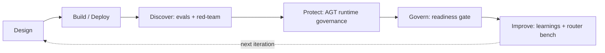
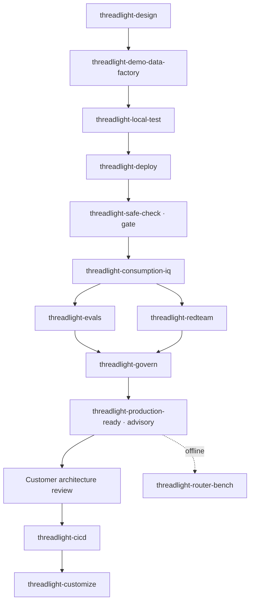

# Threadlight Pipeline

## The pitch

### You describe it. Copilot builds it. Foundry runs and governs it.

Watch one paragraph become a **governed agent** — native on Microsoft Foundry, in your own tenant.

Threadlight is the advanced, opinionated end of the [Agentic Loop](../getting-started/README.md). Where the Getting Started playbook drives [`lean-spec2cloud`](https://github.com/Azure-Samples/Spec2Cloud/tree/main/plugins/lean-spec2cloud) to a working agent with the [`agentic-loop`](../../skills/agentic-loop/SKILL.md) GBB defaults, Threadlight takes the *same* idea‑to‑production motion and hardens it into a paved pipeline: **17 skills that carry a one‑paragraph brief all the way to a red‑teamed, evaluated, production‑scored agent** — in a single continuous run.

The division of labour is the whole idea:

- **You describe it** — one paragraph, in plain English. No backlog, no architecture, no model chosen.
- **Copilot builds it** — a coding agent follows the skills in your repo. No `azd` by hand, no scripts, no manual laptop deploys.
- **Foundry runs & governs it** — hosted agents, keyless identity, evals, red‑team, and a readiness scorecard, on the platform.

> Tip: Reach for the Getting Started playbook to *learn* the loop on a toy agent. Reach for Threadlight when a customer conversation needs to become a **governed pilot they can actually ship** — and you're ready to accept strong defaults in exchange for speed.

### Builds, runs, governs

Threadlight's 17 skills are **Markdown playbooks GitHub Copilot follows in your repo to drive Azure AI Foundry — not replace it.** They split cleanly into three jobs, and four words you'll see repeated through the run:

| Job | Owner | What happens |
|---|---|---|
| **Build** | GitHub Copilot | A brief becomes a spec, tools, seed data, and a locally‑tested agent — a working project, not slideware. |
| **Run** | Microsoft Foundry | `azd up` provisions Foundry, a hosted‑agent container, Cosmos, and App Insights into *your* subscription. Live in a workspace or Microsoft Teams. |
| **Govern** | Foundry models + evals + red‑team | Runtime policy, quality evals, an adversarial scan, and a 13‑pillar readiness score — before anyone signs off. |

A quick glossary so the rest of the deck reads clean:

- **Agent** — the reasoning service Foundry hosts and runs.
- **Skill** — a versioned Markdown playbook Copilot follows (`SKILL.md` is the source of truth).
- **Tool** — a function the agent can call (here, the four credit‑decision tools).
- **Hosted runtime** — the Foundry‑managed container the agent runs in, with identity and telemetry wired in.

### The advanced, opinionated path

Threadlight is opinionated on purpose. That's what separates a paved pipeline from a pile of prompts.

| | Vanilla loop (Getting Started) | Threadlight |
|---|---|---|
| **Goal** | Learn the loop; a working prototype | A governed pilot a customer can ship |
| **Defaults** | GBB defaults, flexible | Strong, deterministic contracts |
| **Governance** | You add it | Evals + red‑team + readiness gate baked in |
| **Output** | A running agent | A running agent **+ a signed scorecard + a customer hand‑off kit** |

You give up some freedom — a Threadlight skill has bounded inputs and one right answer — and in exchange the pipeline is repeatable, auditable, and hard to get wrong. When a customer's environment *does* need to bend the defaults, that happens in an overlay, not by editing skills (see **Fit it to their production**).

---

## The proof

### From a brief to governed production

Threadlight tells its whole story through one scenario, run **for real** — not a write‑up *about* the pipeline, but a captured end‑to‑end run on a live Azure subscription.

A bank's SMB lending team wanted to compress **credit‑memo** preparation. They handed Threadlight one paragraph: for each SME loan application, pull the credit‑bureau report, compute **DSCR** and **LTV**, then approve, refer, or decline — drafting a memo that cites the governing policy rule, with floors **DSCR ≥ 1.25** and **LTV ≤ 0.80**. The brief named no model, no resource, and no architecture. **The pipeline decided all three.**

Fourteen stages later — idea → live MVP → a governed production agent — an applicant (`APP‑4821`) at **DSCR 1.18 / LTV 0.74 / FICO 706** lands below the DSCR floor and is **referred to an underwriter**, with the memo citing the exact rule. Every model call in the run was routed through a **Citadel AI gateway**. Fictional customer (*Meridian Commercial Bank*); real subscription, real gateway, real spend.

> Note: **Dogfooded, not demoed.** An operator typed each stage's prompt by hand; a separate `copilot` on Claude Opus 4.8 executed the real skills against live Azure; every artifact was captured and independently re‑checked before the next stage ran. 2,306 OpenTelemetry records, nothing mocked.

### The receipts

Every number below was observed on live Azure and independently re‑derived from raw artifacts — not asserted by the agent that built it — and captured in the public [case study](https://aiappsgbb.github.io/threadlight-skills/case-study.html).

| Receipt | Result |
|---|---|
| **Stages completed** | 14 / 14 — idea to governed production, the whole arc. |
| **Independent verdicts** | 13 PASS, 1 conditional (the safe‑check gate, expected pre‑onboarding). |
| **Policy citations** | 100% of assessment lines cited their governing clause; 100% of seeded exceptions caught. |
| **Deprecated model** | Banned `gpt‑4`‑class model → **403 at the gateway**. Approved `gpt‑5` model → **200**. |
| **Deploy‑identity RBAC** | Exactly **2** assignments, both scoped to the prod resource group. Nothing wider. |
| **The bill** | The language model was a **rounding error** — the real cost driver was the policy search index. |
| **Readiness** | **92 / 100** across 13 pillars — *ship with two waivers*. |

> Tip: The point isn't credit memos. Swap the brief and the same chain produces a claims‑triage, KYC, or field‑service agent. Threadlight encodes the *shape* of the work, not the domain.

### The six-stage reel

The public demo compresses the run into a **scrubbable six‑stage reel** — the seller‑facing framing of the same chain:

**Brief → Design → Local → Deploy → Govern → Scorecard**

1. **One paragraph in** *(Brief)* — you describe the agent in plain English; `threadlight-design` pulls out the process, entities, decision branches, and hard credit rules.
2. **Specced & scaffolded** *(Design)* — it writes the spec and the AGENTS file, scaffolds the four tools, seeds realistic sample data, adds killer‑prompt tests, and even renders a **customer talk‑deck** and a **seller prep‑guide**. A working project, not slideware.
3. **Validated on your local PC** *(Local)* — `threadlight-local-test` runs the agent on your machine *before any cloud spend*; it calls the tools live and writes a credit memo with its reasoning.
4. **Deployed to your Azure** *(Deploy)* — `threadlight-deploy` runs `azd up` straight into your subscription — Foundry, a hosted‑agent container, Cosmos, App Insights — and the agent goes live, reachable in a workspace or Microsoft Teams.
5. **Governed & gated** *(Govern)* — `threadlight-govern` enforces runtime policy, `threadlight-evals` scores quality, `threadlight-redteam` runs an adversarial PyRIT scan; the deprecated model is refused at the boundary.
6. **Scored for production** *(Scorecard)* — `threadlight-production-ready` scores the agent across thirteen pillars and writes the customer hand‑off package: **92/100, ship with two waivers**.

One paragraph → a governed agent on your Azure, in roughly **50 minutes**, every artefact auditable. Under the hood, the reel maps onto the Microsoft Responsible‑AI‑for‑Foundry operating loop — **Discover** and **Protect** run *before* the readiness gate so the scorecard verifies each control actually ran, not just that it was declared:

---

## The pipeline

### The canonical flow

Skills fire in a canonical order. The **spine** is the happy path; several legs are conditional on what the SPEC declares (human‑in‑the‑loop, a UI, event triggers, private‑network CI/CD).

> Note: `foundry-observability` is layered into `threadlight-deploy` by default, and `foundry-evals` runs after every deploy. The pilot ships with telemetry, evals, and a safe‑check gate on day one — or it isn't a Threadlight pilot.

### The contracts that make it opinionated

Threadlight is repeatable because the skills share **contracts**, not conventions:

- **`specs/SPEC.md`** — numbered business rules (`BR‑XXX`), data models with system‑of‑record tracking, tool contracts, `§ 8` human‑interaction points, `§ 9` eval scenarios, `§ 11c` tech‑stack selectors, `§ 12` load profile.
- **`specs/manifest.json`** — a machine‑readable **kebab‑case selector vocabulary**: the single input contract every downstream skill reads. Invent a selector without registering it and `threadlight-safe-check` flags it as drift.
- **Skills & tools as governed artifacts** — capabilities are pinned by version, promoted canary‑first, and fetched at deploy (never cloned at runtime). `threadlight-production-ready`'s supply‑chain pillar enforces this.

### The full roster, by role

You met the headliners in the reel — `design`, `local-test`, `deploy`, `govern`, `evals`, `redteam`, `production-ready`. Here's the whole cast behind them, so you know what's available when a SPEC calls for it. Each links to its `SKILL.md` source.

| Build core | Role |
|---|---|
| [`threadlight-design`](https://github.com/aiappsgbb/threadlight-skills/tree/main/skills/threadlight-design) | Brief → `SPEC.md` + `manifest.json` + agent surface. Also renders the talk‑deck + prep‑guide. |
| [`threadlight-demo-data-factory`](https://github.com/aiappsgbb/threadlight-skills/tree/main/skills/threadlight-demo-data-factory) | Industry‑realistic seed data for demos. |
| [`threadlight-local-test`](https://github.com/aiappsgbb/threadlight-skills/tree/main/skills/threadlight-local-test) | Boots the agent locally for rapid inner‑loop iteration. |
| [`threadlight-deploy`](https://github.com/aiappsgbb/threadlight-skills/tree/main/skills/threadlight-deploy) | 7‑phase `azd up` — ACR, Bicep, hooks, Foundry, Citadel. |
| [`threadlight-safe-check`](https://github.com/aiappsgbb/threadlight-skills/tree/main/skills/threadlight-safe-check) | Pre/post‑deploy gate — validates every resource selector before go‑live. |

| Human & surface *(conditional)* | Role |
|---|---|
| [`threadlight-hitl-patterns`](https://github.com/aiappsgbb/threadlight-skills/tree/main/skills/threadlight-hitl-patterns) | Human‑in‑the‑loop gates via Teams Adaptive Cards + audit trail. |
| [`threadlight-workspace-ui`](https://github.com/aiappsgbb/threadlight-skills/tree/main/skills/threadlight-workspace-ui) | Operator dashboard (React workspace) behind Easy Auth. |
| [`threadlight-event-triggers`](https://github.com/aiappsgbb/threadlight-skills/tree/main/skills/threadlight-event-triggers) | ACA Jobs, Event Grid, and cron receivers wired into deploy. |

| Quality & safety gates | Role |
|---|---|
| [`threadlight-consumption-iq`](https://github.com/aiappsgbb/threadlight-skills/tree/main/skills/threadlight-consumption-iq) | Post‑deploy phased cost projection from Azure Retail Prices. |
| [`threadlight-evals`](https://github.com/aiappsgbb/threadlight-skills/tree/main/skills/threadlight-evals) | Offline batch evals + Foundry Continuous Evaluation + A/B gate. |
| [`threadlight-redteam`](https://github.com/aiappsgbb/threadlight-skills/tree/main/skills/threadlight-redteam) | AI Red Teaming Agent (PyRIT) scan — jailbreak, injection, exfiltration. |
| [`threadlight-govern`](https://github.com/aiappsgbb/threadlight-skills/tree/main/skills/threadlight-govern) | Wraps `foundry-agt` — in‑process runtime governance + verifier report. |

| Production & ops | Role |
|---|---|
| [`threadlight-production-ready`](https://github.com/aiappsgbb/threadlight-skills/tree/main/skills/threadlight-production-ready) | Advisory scorecard — 13 pillars, Defender / Policy / quota / restore‑drill. |
| [`threadlight-cicd`](https://github.com/aiappsgbb/threadlight-skills/tree/main/skills/threadlight-cicd) | GitHub Actions or Azure DevOps OIDC/WIF pipelines for locked‑down envs. |
| [`threadlight-customize`](https://github.com/aiappsgbb/threadlight-skills/tree/main/skills/threadlight-customize) | Onboard into one customer's environment via a pinned fork + overlay (no skill edits). |
| [`threadlight-router-bench`](https://github.com/aiappsgbb/threadlight-skills/tree/main/skills/threadlight-router-bench) | Offline Improve leg — learnings digest + model‑router cost/quality bench. |
| [`threadlight-auto`](https://github.com/aiappsgbb/threadlight-skills/tree/main/skills/threadlight-auto) | Orchestrator — drives the chain end‑to‑end from one prompt; resumes + recovers. |

> Warning: `threadlight-auto` is a **pilot driver**, not a production CI/CD orchestrator. Use it for first runs, demos, and resumption. For real pipelines use `threadlight-cicd` + your CI tool. `threadlight-customize` and `threadlight-router-bench` are manual — `auto` does not drive them.

### Where to jump in

You rarely start at the top every time. The entry‑skill picker maps intent to a starting skill:

| You want to… | Start with |
|---|---|
| Turn a brief into a spec (works in Copilot Cowork) | `threadlight-design` |
| Iterate the agent locally before any cloud | `threadlight-local-test` |
| Ship it to the customer tenant | `threadlight-deploy` |
| Verify a deployment before go‑live | `threadlight-safe-check` |
| Walk it to a readiness scorecard | `threadlight-production-ready` |
| Run the **whole arc** from one prompt (demos, first‑timers) | `threadlight-auto` |

> Tip: `threadlight-design` is the only skill that runs cleanly inside **Microsoft Copilot Cowork** — the seller surface. Everything below it needs a real shell, where the **solution engineer** picks up the same chain. That seller → SE hand‑off is the persona split the pipeline is built around.

---

## Ship it for real

### Prove it can ship

Your pilot works. Now prove it can *ship*. `threadlight-production-ready` turns a working demo into the **evidence‑backed scorecard a customer's review board signs** — so the pilot ships instead of stalling in the lab.

It scores the agent across **13 production pillars**, grouped four ways, then hands you the exact skill that closes each gap — amber turns green in a prompt, not a four‑week scramble:

| Group | Pillars |
|---|---|
| **Network & identity** | 01 Network posture · 03 Identity & access · 04 Secrets |
| **Governance & HITL** | 02 Agent governance · 07 Responsible AI · 08 HITL & audit |
| **Ops & cost** | 05 Observability · 06 Continuous evals · 10 Cost · 11 Reliability · 12 SRE hand‑over |
| **Lifecycle & supply‑chain** | 09 Supply chain · 13 Model lifecycle |

> Important: **Agent governance, not platform governance.** Citadel and the platform team secure the landing zone — the hub, the shared AI gateway, network and policy. Threadlight proves the *agent* you run in it: these 13 pillars, plus a supply‑chain SBOM, an agent‑identity AI‑BOM, and an EU AI Act evidence pack. The governance deliverable isn't a meeting — it's that record, in the repo, versioned with the code and gating every deploy. See the [Citadel Governance Hub](../citadel-governance-hub/README.md) playbook for the platform half.

### Fit it to their production

A working pilot isn't *their* production. `threadlight-customize` is the engagement runbook that fits a Threadlight pilot to one customer's real environment — their landing zone, identity, network, and governance — **without ever editing a skill file**.

- **Structured intake** — a `customer-profile.md` captures their environment, requirements, and mandated templates, so nothing about production is guessed.
- **Overlay, not fork‑edit** — every customer value lives in `overlay/` beside the untouched skills, so `git merge upstream/main` keeps pulling our fixes.
- **A signed‑off boundary** — a `non-coverage.md` states what Threadlight deliberately *doesn't* automate, and the architecture review approves it.

Four production‑onboarding skills are where the customer's environment bites — expect to override all four: `threadlight-deploy`, `threadlight-cicd`, plus the private‑network and dev‑box constraints. Same skills, same code — only the inputs change. That's the whole point.

### How it composes with the loop and Citadel

Threadlight is **the wedge**: it delivers a governed agent in one working session, and the wider families extend it over the following weeks.

| Family | What it adds |
|---|---|
| **`agentic-loop` / `lean-spec2cloud`** | The base loop Threadlight is the opinionated, production‑grade expression of. |
| **`foundry-*` building blocks** | The Foundry primitives Threadlight composes — hosted agents, IQ, evals, observability, in‑process AGT. |
| **`citadel-*` governance** | The production landing zone — AI Gateway, Access Contracts, keyless spokes. Threadlight proves the agent; **Citadel secures the platform**. |
| **`gbb-*` content** | Pitch‑side artefacts — deck generators, narrative humanisers. |

> Note: Threadlight and Citadel compose directly. `threadlight-deploy` can target a Citadel spoke, and the case‑study run routed every model call through a Citadel gateway. Pilots start standalone and adopt a governed spoke when they graduate — the keyless Option‑B path in the Citadel playbook is exactly what a Threadlight agent uses.

### Start here

- **Live narrative** — [aiappsgbb.github.io/threadlight-skills](https://aiappsgbb.github.io/threadlight-skills/): the scrubbable demo, the [case study](https://aiappsgbb.github.io/threadlight-skills/case-study.html), the [production‑ready](https://aiappsgbb.github.io/threadlight-skills/production.html) and [customize](https://aiappsgbb.github.io/threadlight-skills/customize.html) chapters.
- **Technical briefing** — [`THREADLIGHT.md`](https://github.com/aiappsgbb/threadlight-skills/blob/main/THREADLIGHT.md): the canonical flow and per‑skill surface map.
- **Run the arc** — install the [`threadlight-skills`](https://github.com/aiappsgbb/threadlight-skills) family, then invoke `threadlight-design` on a one‑paragraph brief — or `threadlight-auto` to drive the whole chain from a single prompt.
