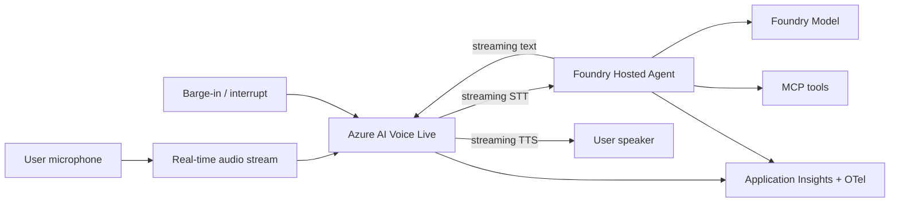

# Voice-First Agent Blueprint

## Intro

### Combine real-time STT, TTS, and frontier reasoning for low-latency conversational experiences.

Text-first patterns fall apart when the experience is spoken: latency budgets shrink to milliseconds, turns overlap, and users expect to barge in. This playbook gives you a repeatable path for a **voice-first agent** that streams speech-to-text in, reasons with a frontier model, and streams text-to-speech back — all driven from a single prompt and the `agentic-loop` defaults.

**Use when:** Your experience is spoken or real-time conversational, not text-first.

**Core tech stack:** Azure AI Voice Live, Copilot SDK, Foundry Hosted Agents, Foundry Models

This playbook walks you through building a low-latency voice agent end-to-end with the Agentic Loop. You drive the build loop from a single prompt, and the [`agentic-loop`](../../skills/agentic-loop/SKILL.md) skill applies the proven recipe — Foundry hosted agents, Copilot SDK, keyless identity, observability, and `azd` — on top.

The playbook is organized in three chapters:

- **Build** — go from a prompt to a working streaming voice prototype.
- **Run** — operate the deployed experience with latency and turn telemetry.
- **Scale** — tune latency, add languages, and push changes through the loop.

---

### What we will build

A browser app where the user speaks and hears the agent reply in real time. Audio streams through **Azure AI Voice Live** for low-latency **speech-to-text** and **text-to-speech**, the agent runs as a **Foundry Hosted Agent** backed by **Foundry Models** using the **GitHub Copilot SDK**, and the pipeline supports **barge-in** (the user can interrupt) and streaming partial results. Every turn is traced with latency spans.



| Layer | Choice (from `agentic-loop` defaults) | Why |
|---|---|---|
| Frontend | React + Vite on Azure Container Apps | Captures mic audio and plays streamed speech. |
| Backend API | Python + FastAPI on Azure Container Apps | Bridges the audio stream and the agent session. |
| Voice | Azure AI Voice Live (streaming STT + TTS) | Low-latency, real-time speech in and out with barge-in. |
| Agent | Copilot SDK hosted in Microsoft Foundry | Governed runtime that streams partial results. |
| Model | Foundry Models | Frontier reasoning on the Foundry platform. |
| Tools | Python MCP servers via a Foundry toolbox | Governed tool access during a spoken turn. |
| Observability | OpenTelemetry → Application Insights (wired via Foundry) | Per-turn latency and interruption spans. |
| Infra | `azd` + Bicep (Azure Verified Modules) | Reproducible provisioning with keyless identity. |

**Done means:**

- A user can speak and hear a spoken reply in real time.
- Speech-to-text and text-to-speech stream, rather than waiting for full turns.
- The user can barge in and interrupt the agent mid-response.
- End-to-end turn latency is measured and visible.
- Every turn emits latency and interruption spans to Application Insights.

**Out of scope for the first build:**

- Telephony/SIP integration — start in the browser, add channels later.
- Many languages/voices — start with one, expand once latency is solid.
- Private networking — a production hardening step.

---

### Setup

You will need:

- Azure subscription with Contributor permissions, plus a GitHub Copilot plan.
- GitHub Copilot installed and logged in — use the [Copilot App](http://gh.io/app) (recommended), the [Copilot CLI](https://github.com/features/copilot/cli/), or [Visual Studio Code](https://code.visualstudio.com/download).
- [GitHub CLI (`gh`)](https://cli.github.com/) installed and logged in.
- [Azure CLI (`az`)](https://learn.microsoft.com/en-us/cli/azure/install-azure-cli) and [Azure Developer CLI (`azd`)](https://learn.microsoft.com/en-us/azure/developer/azure-developer-cli/install-azd) installed and authenticated.
- A microphone and speaker (or headset) to exercise the voice loop.
- The `lean-spec2cloud` Copilot plugin installed and updated. Click [here](https://github.com/copilot/app/launch?open=ghapp%3A%2F%2Fplugins%2Fmarketplace%2Fadd%3Fsource%3DAzure-Samples%2FSpec2Cloud) to add the marketplace and [here](https://github.com/copilot/app/launch?open=ghapp%3A%2F%2Fplugins%2Finstall%3Fsource%3Dlean%2540Spec2Cloud) to install the plugin. Or install in the CLI with:

  ```bash
  copilot plugin marketplace add Azure-Samples/Spec2Cloud && copilot plugin install lean@Spec2Cloud
  ```

Sanity check before you go further:

```bash
az account show                 # confirm the correct tenant and subscription
azd auth login --check-status   # confirm you are signed in to azd
copilot plugin list             # expect to see lean@Spec2Cloud
```

> **Heads up on cost.** This playbook provisions billable Azure resources (Container Apps, a Foundry/AI Services account, Voice Live, and Application Insights). Leaving them running incurs charges — see [Clean up](#clean-up) to remove everything when you are done.

## Build

### Create a new project

Take an empty workspace through the **Specify → Plan → Implement → Verify → Deploy** loop and produce a streaming voice agent.

```bash
mkdir voice-first-agent
cd voice-first-agent
```

> Want version control from minute one? Create a private GitHub repo instead:
> ```bash
> gh repo create voice-first-agent --private --clone
> ```

---

### Open GitHub Copilot

This playbook uses the **GitHub Copilot App**, but the same prompt works in Copilot CLI and VS Code.

> **Using the CLI instead?** Run `copilot --allow-all` only in a sandbox workspace, or omit the flag to approve each action.

**1. Open the Spec2Cloud canvas.** In the review panel, click **+**, then choose **Spec2Cloud Cockpit**. If it is not installed, import:

```text
https://github.com/Azure-Samples/Spec2Cloud/tree/main/.github/extensions/spec2cloud
```

**2. Add your project.** Choose **+ -> Add project from -> Local folder or repository**, then select `voice-first-agent`.

**3. Choose a model and mode.**

| Mode | Behavior |
|---|---|
| Interactive | Step-by-step collaboration; you confirm each stage |
| Plan | Plans first, executes once you approve |
| Autopilot *(recommended)* | Runs the full loop end to end |

---

### Run the build loop

Paste this starter prompt:

```text
/spec2cloud Build a voice-first agent app. In the browser, the user speaks and hears the agent reply in real time. Stream speech-to-text in and text-to-speech out through Azure AI Voice Live for low latency, and support barge-in so the user can interrupt the agent mid-response. The agent uses a frontier model for reasoning and can call tools during a spoken turn. Measure and display end-to-end turn latency, and trace each turn. Use randomly generated data where a real backing service is not required.

Before planning or implementation, install and run the agentic-loop skill (`aiappsgbb/agentic-loop`, skill `agentic-loop`) to enhance the spec with its app, agent runtime, Azure infrastructure, identity, and telemetry defaults.
```

> `/spec2cloud` runs the same five-stage loop as Getting Started. The prompt explicitly invokes `agentic-loop`; the remaining requirements define this playbook's streaming audio, barge-in, voice latency, and spoken-turn telemetry.

> Prefer to run one stage at a time? Use the same prompt with `/specify` first, then advance through each stage:
>
> | Command | Produces | Review in |
> |---|---|---|
> | `/specify <prompt>` | Specification | `docs/spec.md` |
> | `/plan` | Implementation and Azure plan | `docs/plan.md`, `.azure/deployment-plan.md` |
> | `/implement` | Source, infrastructure, and audio pipeline | `src/`, `infra/`, `azure.yaml` |
> | `/verify` | Streaming, barge-in, and latency tests | `docs/verify.md` |
> | `/deploy` | Deployed solution | `docs/deploy.md` |

Use these recommended answers if Copilot asks clarifying questions:

| Question area | Recommended answer |
|---|---|
| Channel | Browser microphone/speaker first; telephony later. |
| Voice service | Azure AI Voice Live for streaming STT and TTS. |
| Interruption | Support barge-in; the agent stops speaking when the user talks. |
| Streaming | Stream partial STT and TTS rather than whole turns. |
| Latency target | Set a per-turn latency budget and display it. |
| Identity | Managed identity, keyless RBAC. |

When the skill finishes, review `docs/spec.md` for these must-have requirements: streaming STT, streaming TTS, barge-in, a frontier reasoning model, per-turn latency measurement, and turn tracing.

---

### Review the generated plan

Turn the spec into a reviewable implementation and deployment plan.

```text
/plan
```

The deployment plan should include:

| Section | What good looks like |
|---|---|
| Resource graph | Foundry project, hosted agent, model deployment, Voice Live/Speech resource, managed identity, Application Insights, ACA apps. |
| RBAC | Least-privilege roles for Foundry, Voice/Speech, and telemetry. |
| Audio pipeline | Streaming transport, STT/TTS wiring, and barge-in handling. |
| Latency | Per-turn budget, measurement points, and displayed metrics. |
| Toolbox | MCP servers registered as versioned tools on a Foundry toolbox. |
| azd template | `minimal` / `azd init --minimal`. |

Review `docs/plan.md` and `.azure/deployment-plan.md` before continuing.

---

### Review the implementation

Generate the source and infrastructure from the plan.

```text
/implement
```

Expected generated artifacts:

```text
.
├── azure.yaml
├── infra/
├── src/
│   ├── frontend/                 # mic capture, audio playback, latency display
│   ├── backend/                  # audio-stream bridge + agent session
│   └── agents/
│       └── voice-agent/          # hosted-agent definition
└── docs/
```

The implementation should wire:

1. **Streaming STT** — mic audio streams to Voice Live and returns partial transcripts.
2. **Reasoning** — the frontier model processes streamed input and streams a reply.
3. **Streaming TTS** — the reply streams back as audio without waiting for full turns.
4. **Barge-in** — user speech interrupts and stops the current TTS playback.
5. **Telemetry** — each turn emits latency and interruption spans to Application Insights.

Commit a checkpoint once the diff looks right:

```bash
git add .
git commit -m "feat: scaffold voice-first agent"
```

---

### Verify locally

Validate locally against real Azure dependencies.

```text
/verify
```

| Test | Action | Expected result |
|---|---|---|
| Speak a turn | Say a short prompt. | Streaming transcript appears and the agent replies in speech. |
| Streaming | Watch partials. | STT and TTS stream rather than waiting for full turns. |
| Barge-in | Interrupt mid-reply. | TTS stops and the new turn is captured. |
| Tool call | Ask something that needs a tool. | The tool runs within the spoken turn. |
| Latency | Read the displayed metric. | End-to-end turn latency is within the target budget. |
| Telemetry | Query Application Insights. | Latency and interruption spans are visible. |

---

### Deploy

Deploy after local verification passes.

```text
/deploy
```

Deployment readiness checklist:

- [ ] Hosted agent has a valid `agent.yaml` and, where used, `code_configuration`.
- [ ] Voice Live/Speech access uses managed identity, not keys.
- [ ] STT and TTS stream; the pipeline does not buffer whole turns.
- [ ] Barge-in stops playback reliably.
- [ ] Container app names respect the 32-character Azure Container Apps limit.
- [ ] Streaming, barge-in, and latency tests pass.
- [ ] Application Insights receives latency telemetry.

When the loop finishes, Copilot returns the deployed frontend URL and the Spec2Cloud canvas auto-previews it. Click the **Foundry** icon to review the agent, model, and voice wiring.

---

### Troubleshooting

| Symptom | Likely cause | Fix |
|---|---|---|
| Replies feel delayed | Audio is buffered by whole turn | Stream partial STT and TTS and measure time-to-first-audio. |
| Barge-in does not stop playback | Cancellation is not propagated | Cancel the active TTS stream when new speech is detected. |
| Browser has no microphone audio | Permission or secure-context issue | Grant microphone permission and use HTTPS outside localhost. |
| Voice spans are disconnected | Trace context is lost in the stream bridge | Propagate context across the audio, agent, and TTS pipeline. |

## Run

### Run the voice agent

Open the deployed app, grant microphone access, and complete several spoken turns. Confirm that partial transcripts and audio stream, barge-in stops active playback, tools can run during a turn, and latency remains visible.

---

### Observe

Use telemetry to understand whether the experience feels responsive and turns flow naturally.

Track:

- End-to-end turn latency (p50/p95) and its breakdown (STT, reasoning, TTS).
- Time-to-first-audio for each reply.
- Barge-in frequency and how cleanly playback stops.
- STT accuracy signals and re-prompts.
- Dropped or reconnected audio streams.

Useful Application Insights questions:

| Question | Signal |
|---|---|
| Does it feel real-time? | p95 turn latency and time-to-first-audio. |
| Where is latency spent? | STT vs. reasoning vs. TTS span durations. |
| Are interruptions clean? | Barge-in count and playback-stop latency. |
| Is audio stable? | Stream drop/reconnect rate. |

### Evaluate

Create a small evaluation set focused on the spoken experience.

| Eval | Dataset shape | Pass condition |
|---|---|---|
| Latency | Representative spoken turns | p95 turn latency within budget. |
| Time-to-first-audio | Representative turns | First audio arrives within target. |
| Barge-in | Interrupt scenarios | Playback stops promptly and the new turn is handled. |
| Transcription | Reference utterances | STT matches intent closely enough to answer. |
| Answer quality | Spoken question, reference answer | Reply matches reference intent. |

Set gates before promoting: latency and time-to-first-audio within budget, barge-in works reliably, and answer quality meets the threshold.

### Iterate

Safe iteration loop:

1. Tune streaming chunk sizes, voice, and reasoning effort for latency.
2. Re-run latency and barge-in evals.
3. Review the latency breakdown in traces.
4. Commit a checkpoint before changing the pipeline.

```bash
git add .
git commit -m "chore: tune voice latency and barge-in"
```

## Scale

### Add languages and voices

Start with one locale and voice. Add more once latency is solid, and re-run latency and transcription evals per locale before promoting.

---

### Add channels

Extend beyond the browser to telephony/SIP or other real-time channels. Keep the streaming and barge-in contract identical so the agent logic does not change per channel.

---

### Promote across environments

Use separate azd environments per stage:

```bash
azd env new voice-first-agent-test-eus2
azd env new voice-first-agent-prod-eus2
```

Promotion checklist: explicit RBAC per environment, latency and barge-in evals run before promotion, latency budgets reviewed, and telemetry dashboards in place before production rollout.

---

### Take it further

- **Customize the voice** — change the persona, voice, or reasoning model, then push the change through the loop.
- **Explore the other playbooks** — combine the voice front end with grounding, orchestration, or governance.

> Tip: run the loop fully unattended for larger changes:
> ```bash
> copilot -p "/spec2cloud <your next big idea>" --no-ask-user --yolo -- autopilot
> ```

---

### Clean up

When you are done experimenting, delete every Azure resource the loop created. Run this from the project root, where `azure.yaml` lives:

```bash
azd down --purge --force
```

`--purge` also removes soft-deleted resources (such as the Foundry/AI Services account and Key Vault) so their names are immediately reusable.

---

### References

- [What is the Voice Live API?](https://learn.microsoft.com/azure/ai-services/speech-service/voice-live)
- [Voice Live API quickstart](https://learn.microsoft.com/azure/ai-services/speech-service/voice-live-quickstart)
- [Speech to text overview](https://learn.microsoft.com/azure/ai-services/speech-service/speech-to-text)
- [Text to speech overview](https://learn.microsoft.com/azure/ai-services/speech-service/text-to-speech)
- [Observability for generative AI applications](https://learn.microsoft.com/azure/ai-foundry/concepts/observability)
